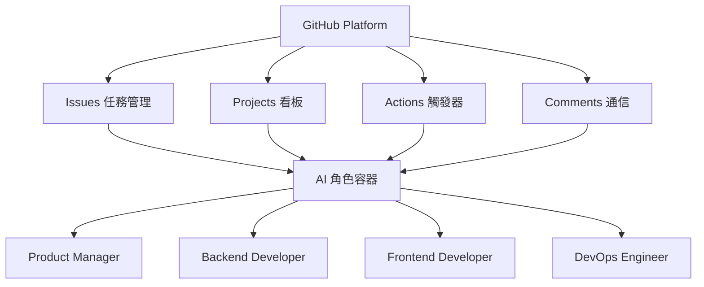
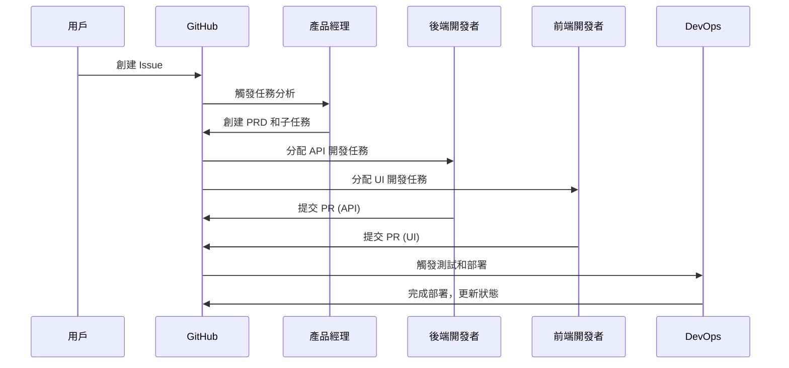

# Bee Swarm：AI 角色協作框架完整指南

> *探索未來 AI 團隊協作的概念設計與模擬工具*

---

## 📚 目錄

### 🌟 前言
- [關於本指南](#關於本指南)
- [項目定位](#項目定位)
- [讀者對象](#讀者對象)
- [使用說明](#使用說明)

### 📖 第一部分：項目概覽

#### 第1章 項目背景
- [1.1 項目上下文與約束](CONTEXT.md)
- [1.2 項目指南索引](PROJECT_INDEX.md)
- [1.3 快速開始體驗](QUICK_START.md)

#### 第2章 系統架構
- [2.1 混合架構設計](docs/02-architecture/hybrid-architecture.md)
- [2.2 AI 角色系統設計](docs/02-architecture/role-design.md)
- [2.3 通信與協調機制](docs/02-architecture/communication-patterns.md)

#### 第3章 工作流程
- [3.1 配置指南](docs/03-implementation/configuration-guide.md)
- [3.2 部署指南](docs/03-implementation/deployment-guide.md)
- [3.3 執行計劃](docs/03-implementation/execution-plan.md)

### 🤖 第二部分：角色與工具

#### 第4章 AI 角色定義
- [4.1 角色系統概覽](roles/README.md)
- [4.2 產品經理 (Product Manager)](roles/product_manager/prompt.md)
- [4.3 後端開發者 (Backend Developer)](roles/backend_developer/prompt.md)
- [4.4 前端開發者 (Frontend Developer)](roles/frontend_developer/prompt.md)
- [4.5 DevOps 工程師 (DevOps Engineer)](roles/devops_engineer/prompt.md)
- [4.6 更多角色](roles/)

#### 第5章 模擬工具
- [5.1 SimPy 協作模擬器](docs/05-simulation/simulator-guide.md)
- [5.2 模擬結果分析方法](docs/05-simulation/analysis-guide.md)

### 🚀 第三部分：實踐指南

#### 第6章 快速開始
- [6.1 快速開始體驗](QUICK_START.md)
- [6.2 環境配置指南](docs/03-implementation/configuration-guide.md)
- [6.3 部署指南](docs/03-implementation/deployment-guide.md)
- [6.4 Gemini CLI 最佳實踐](docs/03-implementation/gemini-cli-best-practices.md)

#### 第7章 部署與運維
- [7.1 入門指南](docs/01-getting-started/)
- [7.2 配置指南](docs/03-implementation/configuration-guide.md)
- [7.3 部署指南](docs/03-implementation/deployment-guide.md)
- [7.4 輔助腳本使用](scripts/README.md)

### 📝 第四部分：應用案例

#### 第8章 實際應用案例
- [8.1 教育遊戲項目開發案例](docs/04-use-cases/education-game-project.md)
- [8.2 完整項目案例](docs/education-game-project/)

### 📚 附錄

#### 第9章 參考資料
- [9.1 GitHub API 使用參考](docs/09-appendix/api-reference.md)
- [9.2 專業名詞解釋](docs/09-appendix/glossary.md)
- [9.3 項目變更歷史](docs/09-appendix/changelog.md)
- [9.4 相關參考資料](docs/09-appendix/references.md)

---

## 🌟 前言

### 關於本指南

Bee Swarm 是一個專注於 **AI 角色協作概念設計與模擬** 的框架。本指南將帶您深入了解如何使用 GitHub 現有功能構建高效的 AI 團隊協作系統。

### 項目定位

🎯 **核心定位**：
- **概念設計工具**：專注於協作模式設計，而非生產系統
- **模擬驗證平台**：通過 SimPy 模擬器驗證協作效果
- **GitHub-Centric**：完全基於 GitHub 平台的協調機制
- **異步協作模式**：AI 角色輪流處理，避免複雜的即時通信

🚀 **核心價值**：
- ✅ **概念先行**：專注於協作模式的設計與驗證
- ✅ **數據驅動**：通過模擬數據指導協作策略
- ✅ **實用導向**：設計可實際應用的 AI 協作工作流
- ✅ **持續演進**：支持協作模式的持續改進

### 讀者對象

👥 **主要讀者**：
- **AI 研究者**：研究 AI 協作模式和效果
- **團隊管理者**：設計和優化 AI 輔助團隊
- **系統架構師**：構建 AI 協作系統
- **產品經理**：規劃 AI 輔助產品開發流程

📚 **預備知識**：
- GitHub 基本操作
- Docker 容器基礎
- 基本的項目管理概念
- 對 AI 協作有興趣

### 使用說明

📖 **閱讀建議**：

1. **初學者路線**：
   - 第1章 → 第6.1節 → 第5.1節 → 第4.1節

2. **架構設計者路線**：
   - 第1-3章 → 第4章 → 第7章

3. **實踐者路線**：
   - 第6章 → 第5章 → 第8章

4. **研究者路線**：
   - 第1-3章 → 第5章 → 第9章

🔧 **實踐步驟**：

```bash
# 1. 快速體驗
./scripts/role-management.sh list-roles
./scripts/role-management.sh build --core-only
./scripts/role-management.sh start --core-only

# 2. 運行模擬
cd docs/education-game-project/09-process-simulation/
python bee-swarm-unified-simulation.py

# 3. 查看容器狀態
./scripts/role-management.sh status
```

---

## 🎯 項目核心概念速覽

### AI 角色協作框架


### GitHub-Centric 協作流程


### 模擬驗證機制
```python
# SimPy 模擬範例
def ai_collaboration_simulation():
    """模擬 AI 角色協作過程"""
    # 創建 Issue
    issue = create_issue("開發用戶登錄功能")
    
    # 產品經理分析
    prd = product_manager.analyze(issue)
    
    # 任務分配
    tasks = product_manager.breakdown_tasks(prd)
    
    # 並行開發
    backend_result = backend_developer.develop(tasks['api'])
    frontend_result = frontend_developer.develop(tasks['ui'])
    
    # 集成測試
    integration = devops_engineer.integrate(backend_result, frontend_result)
    
    return integration.metrics
```

---

## 📊 項目效果指標

### 協作效率指標
- 📈 **任務完成率**：目標 >90%
- ⚡ **響應時間**：平均 <30分鐘
- 🔄 **協作效率**：相比傳統模式提升 >50%
- 📉 **錯誤率**：<5%

### 系統性能指標
- 🚀 **系統可用性**：>99%
- 💾 **資源利用率**：>80%
- 🔧 **部署成功率**：>95%
- 🛠️ **故障恢復時間**：<1小時

---

## 🚀 快速開始

### 一鍵體驗
```bash
# 1. 列出所有角色
./scripts/role-management.sh list-roles

# 2. 編譯核心角色容器
./scripts/role-management.sh build --core-only

# 3. 啟動核心角色
./scripts/role-management.sh start --core-only

# 4. 查看運行狀態
./scripts/role-management.sh status

# 5. 運行協作模擬
cd docs/education-game-project/09-process-simulation/
python bee-swarm-unified-simulation.py
```

### 訪問入口
- **產品經理**：http://localhost:6080 (VNC) / http://localhost:7681 (Terminal)
- **後端開發者**：http://localhost:6081 (VNC) / http://localhost:7682 (Terminal)
- **前端開發者**：http://localhost:6082 (VNC) / http://localhost:7683 (Terminal)
- **DevOps 工程師**：http://localhost:6083 (VNC) / http://localhost:7684 (Terminal)

---

## 🤝 貢獻與支持

### 貢獻方式
1. 🐛 **問題報告**：提交 Issues 報告 bug 或建議
2. 💡 **功能建議**：提出新的協作模式設計
3. 📝 **文檔改進**：完善文檔和使用指南
4. 🔧 **代碼貢獻**：改進模擬工具和腳本

### 支持管道
- 📧 **GitHub Issues**：技術問題和功能請求
- 💬 **GitHub Discussions**：社區討論和經驗分享
- 📖 **Wiki**：詳細文檔和教程

---

## 📄 許可證

本項目採用 [MIT 許可證](LICENSE)，歡迎自由使用和貢獻。

---

*專注於 AI 協作的概念設計與模擬驗證 - 讓異步協作更高效*

**項目狀態**：🌟 活躍開發中 | **最後更新**：2025年7月 | **版本**：v0.4.0+ 