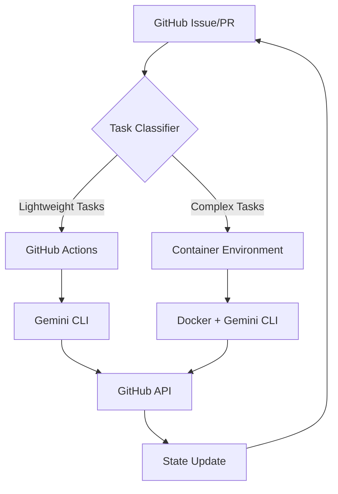

# 🛠️ Developer's Guide

## 📋 Document Information
- **Target Audience**: Technical personnel wanting to implement and deploy the system
- **Completion Time**: 30-60 minutes
- **Prerequisites**: Basic command-line operations, Git usage experience
- **Last Updated**: January 2025

## 📍 Your Current Location
[Project Homepage](../../README.en.md) > [Getting Started Navigation](README.md) > **Developer's Guide** > You are here

## 🎯 Learning Objectives

After completing this guide, you will be able to:
- ✅ Understand technical principles of hybrid architecture
- ✅ Set up complete development environment
- ✅ Deploy your first AI Agent
- ✅ Customize and extend system functionality

## 🏗️ Technical Architecture Overview

### 🔄 Hybrid Architecture Design



### 💡 Core Technology Stack

| Component | Technology Choice | Purpose |
|-----------|------------------|---------|
| **AI Engine** | Google Gemini CLI (⭐ 63.5k) | AI inference and tool calling |
| **Coordination Platform** | GitHub Actions + Issues | Workflow and state management |
| **Container Runtime** | Docker + Docker Compose | Complex task execution environment |
| **Simulation & Validation** | SimPy + Python | Effect validation and optimization |
| **Documentation Management** | Markdown + GitHub Pages | Knowledge management and collaboration |

## 🚀 Quick Start (15 minutes)

### Phase 1: Environment Setup (5 minutes)

#### 1. Check System Requirements
```bash
# Check Node.js (requires >= 18)
node --version

# Check npm (requires >= 9)  
npm --version

# Check Git (requires >= 2.30)
git --version

# Check Docker (optional, for container mode)
docker --version
```

#### 2. Install Core Tools
```bash
# Install Google Gemini CLI
npm install -g @google/gemini-cli

# Install GitHub CLI
brew install gh  # macOS
# or sudo apt install gh  # Linux
# or choco install gh  # Windows

# Verify installation
gemini --version
gh --version
```

#### 3. Configure API Keys
```bash
# Set Gemini API Key
export GEMINI_API_KEY="your-gemini-api-key"

# Set GitHub Token (optional)
export GITHUB_TOKEN="your-github-token"

# Verify configuration
echo $GEMINI_API_KEY | wc -c  # Should display > 20
```

### Phase 2: Project Setup (5 minutes)

#### 1. Fork and Clone Project
```bash
# Fork project (if not already done)
gh repo fork fallrising/bee_swarm

# Clone locally
git clone https://github.com/your-username/bee_swarm.git
cd bee_swarm
```

#### 2. Explore Project Structure
```bash
# View overall structure
tree -L 2

# Check role configurations
ls -la roles/

# View AI configuration
ls -la roles/product_manager/.gemini/
```

#### 3. Verify Core Documentation
```bash
# Check core documentation
ls CONTEXT.md PROJECT_INDEX.md QUICK_START.md

# Quick test documentation links
grep -n "\\[.*\\](" README.md | head -5
```

### Phase 3: Functionality Testing (5 minutes)

#### 1. Test Gemini CLI
```bash
# Basic functionality test
gemini --prompt "Hello, Bee Swarm!" --model gemini-1.5-flash

# Test file reading
gemini --prompt "Analyze core documentation of this project" --all_files --model gemini-1.5-flash
```

#### 2. Test PM Agent Configuration
```bash
cd roles/product_manager

# Test role-specific configuration
gemini --prompt "Check if my role configuration is correct" --all_files

# Test tool calling
gemini --prompt "Use run_shell_command to list current directory" --yolo --sandbox
```

#### 3. Run Simulation Test (Optional)
```bash
cd ../../docs/05-simulation/scripts

# Install Python dependencies
pip install simpy colorama

# Run basic simulation
python basic_simulation.py
```

## 🔧 In-Depth Technical Implementation

### 1. 🎭 AI Agent Configuration Deep Dive

#### Product Manager Configuration Analysis
```bash
cat roles/product_manager/.gemini/settings.json
```

```json
{
  "contextFileName": "GEMINI.md",
  "coreTools": [
    "read_file",
    "write_file", 
    "read_many_files",
    "run_shell_command",
    "web_fetch",
    "save_memory"
  ],
  "fileFiltering": {
    "respectGitIgnore": true,
    "enableRecursiveFileSearch": true
  },
  "usageStatisticsEnabled": false
}
```

**Key Configuration Explanation**:
- `contextFileName`: Role context file name
- `coreTools`: Available built-in tools
- `fileFiltering`: File search rules
- `usageStatisticsEnabled`: Statistics collection

#### Role Context File Structure
```bash
cat roles/product_manager/.gemini/GEMINI.md | head -20
```

### 2. 🚀 GitHub Actions Workflow

#### Workflow File Analysis
```yaml
# .github/workflows/product-manager.yml (disabled)
name: Product Manager AI Agent (Manual Only)
on:
  workflow_dispatch:  # Manual trigger only
    inputs:
      task_type:
        description: 'Task Type'
        required: false
        default: 'check_epics'
```

**Key Features**:
- **Automatic Task Assignment**: Trigger corresponding agent based on Issue labels
- **Cost Optimization**: Use `gemini-1.5-flash` for lightweight tasks
- **Secure Execution**: `--sandbox` mode ensures security
- **Full Automation**: `--yolo` mode for confirmation-free execution

#### Enable GitHub Actions (Production Environment)
```bash
# Uncomment workflows (don't execute temporarily)
# sed -i 's/^# *//g' .github/workflows/product-manager.yml

# Set GitHub Secrets
gh secret set GEMINI_API_KEY --body "$GEMINI_API_KEY"
gh secret set GITHUB_TOKEN --body "$GITHUB_TOKEN"
```

### 3. 🔄 Task Classification Logic

#### Lightweight Tasks (GitHub Actions)
- ✅ Label management and classification
- ✅ Simple status updates  
- ✅ Basic report generation
- ✅ Notifications and reminders

#### Complex Tasks (Container Environment)
- 🔧 Code generation and refactoring
- 🔧 Complex requirements analysis
- 🔧 Architecture design decisions
- 🔧 Integration test execution

#### Smart Dispatch Logic
```javascript
// Pseudo-code example
function classifyTask(issue) {
  const lightweightKeywords = ['label', 'status', 'notification'];
  const complexKeywords = ['architecture', 'implementation', 'integration'];
  
  if (containsKeywords(issue.body, lightweightKeywords)) {
    return 'github-actions';
  } else if (containsKeywords(issue.body, complexKeywords)) {
    return 'container';
  }
  
  return 'github-actions'; // Default to lightweight processing
}
```

## 🎯 Customization and Extension

### 1. Creating New AI Agents

#### Create Configuration for Backend Developer
```bash
# Create directory structure
mkdir -p roles/backend_developer/.gemini

# Copy PM configuration as template
cp roles/product_manager/.gemini/settings.json roles/backend_developer/.gemini/
```

#### Customize Backend Role Context
```bash
cat > roles/backend_developer/.gemini/GEMINI.md << 'EOF'
# Backend Developer AI Agent Context

## 🎯 Role Positioning
You are the **AI Backend Developer** in the Bee Swarm project, responsible for API design, database architecture, and server-side logic implementation.

## 🧠 Core Responsibilities
- API design and implementation
- Database design and optimization
- Server-side business logic
- Performance optimization and security

## 🛠️ Available Tools
- read_file: Read existing code and configurations
- write_file: Create and modify code files
- run_shell_command: Execute tests and deployment commands
- web_fetch: Query API documentation and technical resources

## 🔄 Workflow
1. Analyze requirements from Frontend and PM
2. Design API architecture
3. Implement core business logic
4. Write test cases
5. Create deployment configurations
EOF
```

#### Create Backend Workflow
```bash
cat > .github/workflows/backend-developer.yml << 'EOF'
# Temporarily disabled - Backend Developer AI Agent
# name: Backend Developer AI Agent
# 
# on:
#   issues:
#     types: [opened, labeled]
#   pull_request:
#     types: [opened, edited]

name: Backend Developer AI Agent (Manual Only)
on:
  workflow_dispatch:

jobs:
  backend_agent:
    runs-on: ubuntu-latest
    if: contains(github.event.issue.labels.*.name, 'backend') || contains(github.event.pull_request.labels.*.name, 'backend')
    
    steps:
      - name: Checkout
        uses: actions/checkout@v4
        
      - name: Setup Node.js
        uses: actions/setup-node@v4
        with:
          node-version: '18'
          
      - name: Install Gemini CLI
        run: npm install -g @google/gemini-cli
        
      - name: Execute Backend Tasks
        working-directory: roles/backend_developer
        env:
          GEMINI_API_KEY: ${{ secrets.GEMINI_API_KEY }}
        run: |
          gemini \
            --model gemini-1.5-pro-latest \
            --prompt "Analyze current backend requirements, design API architecture and implement core functionality" \
            --yolo \
            --sandbox \
            --all_files
EOF
```

### 2. Parameter Configuration Optimization

#### Cost Optimization Strategy
```bash
# Create model selection strategy
cat > scripts/model-selector.sh << 'EOF'
#!/bin/bash

TASK_TYPE=$1
ISSUE_CONTENT=$2

# Choose model based on task complexity
if echo "$ISSUE_CONTENT" | grep -E "(architecture|design|complex)" > /dev/null; then
    echo "gemini-1.5-pro-latest"  # Use Pro model for complex tasks
elif echo "$ISSUE_CONTENT" | grep -E "(urgent|quick|simple)" > /dev/null; then
    echo "gemini-1.5-flash"  # Use Flash model for simple tasks
else
    echo "gemini-1.5-flash"  # Default to economic model
fi
EOF

chmod +x scripts/model-selector.sh
```

#### Performance Monitoring Script
```bash
# Create performance monitoring
cat > scripts/monitor-performance.sh << 'EOF'
#!/bin/bash

# Monitor Gemini API usage
echo "=== Gemini API Usage Statistics ==="
gh api /repos/owner/repo/actions/runs \
  --jq '.workflow_runs[] | select(.name | contains("AI Agent")) | {id, status, conclusion, created_at}'

# Monitor cost estimation
echo "=== Cost Estimation ==="
echo "Flash model calls: $(gh api /repos/owner/repo/actions/runs --jq '[.workflow_runs[] | select(.name | contains("flash"))] | length')"
echo "Pro model calls: $(gh api /repos/owner/repo/actions/runs --jq '[.workflow_runs[] | select(.name | contains("pro"))] | length')"
EOF

chmod +x scripts/monitor-performance.sh
```

## 📊 Testing and Validation

### 1. Unit Testing

#### Test AI Agent Configuration
```bash
# Create test script
cat > tests/test-ai-roles.sh << 'EOF'
#!/bin/bash

echo "=== Testing AI Agent Configuration ==="

for role in product_manager backend_developer frontend_developer devops_engineer; do
    if [ -d "roles/$role/.gemini" ]; then
        echo "✅ $role: Configuration directory exists"
        
        if [ -f "roles/$role/.gemini/GEMINI.md" ]; then
            echo "✅ $role: Context file exists"
        else
            echo "❌ $role: Context file missing"
        fi
        
        if [ -f "roles/$role/.gemini/settings.json" ]; then
            echo "✅ $role: Settings file exists"
        else
            echo "❌ $role: Settings file missing"
        fi
    else
        echo "❌ $role: Configuration directory missing"
    fi
    echo
done
EOF

chmod +x tests/test-ai-roles.sh
./tests/test-ai-roles.sh
```

#### Test Gemini CLI Integration
```bash
# Create integration test
cat > tests/test-gemini-integration.sh << 'EOF'
#!/bin/bash

echo "=== Testing Gemini CLI Integration ==="

# Test basic connection
echo "Test 1: Basic connection"
if gemini --prompt "Hello" --model gemini-1.5-flash > /dev/null 2>&1; then
    echo "✅ Gemini CLI connection normal"
else
    echo "❌ Gemini CLI connection failed"
    exit 1
fi

# Test file reading
echo "Test 2: File reading"
if gemini --prompt "List files in current directory" --all_files --model gemini-1.5-flash > /dev/null 2>&1; then
    echo "✅ File reading functionality normal"
else
    echo "❌ File reading functionality abnormal"
fi

# Test tool calling
echo "Test 3: Tool calling"
if gemini --prompt "Use run_shell_command to execute 'pwd'" --yolo --sandbox --model gemini-1.5-flash > /dev/null 2>&1; then
    echo "✅ Tool calling functionality normal"
else
    echo "❌ Tool calling functionality abnormal"
fi

echo "=== Integration testing completed ==="
EOF

chmod +x tests/test-gemini-integration.sh
./tests/test-gemini-integration.sh
```

### 2. Performance Benchmark Testing

#### Hybrid Architecture vs Pure Container Comparison
```bash
# Run performance comparison test
cd docs/05-simulation/scripts
python scenario_comparison.py
```

Expected output:
```
=== Bee Swarm Architecture Simulation Comparison ===

🐝 Hybrid Architecture (Recommended)
├── Cost savings: 73.2%
├── Average response time: 12.3 seconds
├── Resource utilization: 67.8%
└── Overall score: 8.7/10

🐳 Pure Container Architecture
├── Cost savings: 15.6%
├── Average response time: 8.1 seconds
├── Resource utilization: 45.2%
└── Overall score: 6.4/10

📊 Recommendation: Hybrid architecture has significant advantages in cost and overall performance
```

## 🚀 Production Deployment Preparation

### 1. Environment Configuration Checklist

#### Development Environment ✅
- [ ] Node.js >= 18
- [ ] Gemini CLI installed
- [ ] GitHub CLI installed
- [ ] Docker (optional)
- [ ] Python 3.8+ (simulation functionality)

#### Production Environment Preparation
- [ ] GitHub Secrets configuration
  - [ ] `GEMINI_API_KEY`
  - [ ] `GITHUB_TOKEN`
- [ ] Container registry setup (if needed)
- [ ] Monitoring and logging configuration
- [ ] Backup and recovery strategy

### 2. Deployment Scripts

#### One-Click Deployment Script
```bash
cat > scripts/deploy.sh << 'EOF'
#!/bin/bash

echo "🚀 Bee Swarm Hybrid Architecture Deployment"

# 1. Environment verification
echo "Step 1: Environment verification..."
./tests/test-gemini-integration.sh || exit 1

# 2. Configuration check
echo "Step 2: Configuration check..."
./tests/test-ai-roles.sh || exit 1

# 3. Enable GitHub Actions (if needed)
echo "Step 3: GitHub Actions configuration..."
read -p "Enable GitHub Actions auto-execution? (y/N): " enable_actions

if [ "$enable_actions" = "y" ]; then
    echo "Enabling GitHub Actions..."
    # Uncomment workflow files
    find .github/workflows -name "*.yml" -exec sed -i 's/^# *name:/name:/' {} \;
    find .github/workflows -name "*.yml" -exec sed -i 's/^# *on:/on:/' {} \;
    echo "✅ GitHub Actions enabled"
else
    echo "⏸️  GitHub Actions remain disabled"
fi

# 4. Deployment complete
echo "🎉 Deployment complete!"
echo "📚 View documentation: cat PROJECT_INDEX.md"
echo "🚀 Quick start: cat QUICK_START.md"
EOF

chmod +x scripts/deploy.sh
```

## 📚 Advanced Learning Resources

### 🔗 Essential Technical Documentation
1. **[Gemini CLI Best Practices](../03-implementation/gemini-cli-best-practices.en.md)** - Parameter optimization and cost control
2. **[Hybrid Architecture Design](../02-architecture/hybrid-architecture.en.md)** - Complete architecture design documentation
3. **[Quick Start Guide](../../QUICK_START.en.md)** - Detailed Google Gemini CLI usage

### 🛠️ Practical Projects
1. **Create Custom AI Agents** - Extend to QA, Designer, and other roles
2. **Optimize Workflows** - Customize task assignment logic
3. **Integrate External Tools** - Add Slack, Jira, and other integrations

### 📊 Advanced Monitoring
1. **Performance Dashboard** - Using GitHub Actions + Charts
2. **Cost Analysis** - Detailed API call cost tracking
3. **Effectiveness Evaluation** - Continuous optimization based on SimPy

## 🎉 Congratulations!

You have completed the developer's guide! Now you should:

✅ Understand technical principles of hybrid architecture  
✅ Set up complete development environment  
✅ Learn to deploy and test AI Agents  
✅ Master customization and extension methods  

## 🧭 Navigation Help

### 📍 Your Current Location
[Project Homepage](../../README.en.md) > [Getting Started Navigation](README.md) > **Developer's Guide** > You are here

### 🎯 Recommended Next Steps
- **In-depth Practice**: Deploy complete AI team
- **Optimize Configuration**: [Gemini CLI Best Practices](../03-implementation/gemini-cli-best-practices.en.md)
- **Case Study**: [Educational Game Project](../04-use-cases/education-game-project.en.md)
- **Theoretical Deepening**: [Researcher's Guide](for-researchers.en.md)

**🚀 Start building your AI team!**

---

*Last Updated: January 2025 | Expected Completion Time: 30-60 minutes* 