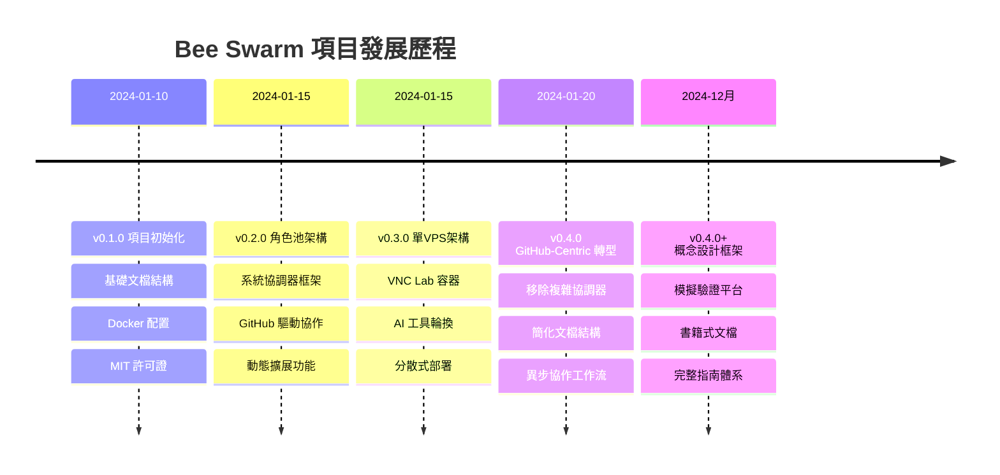
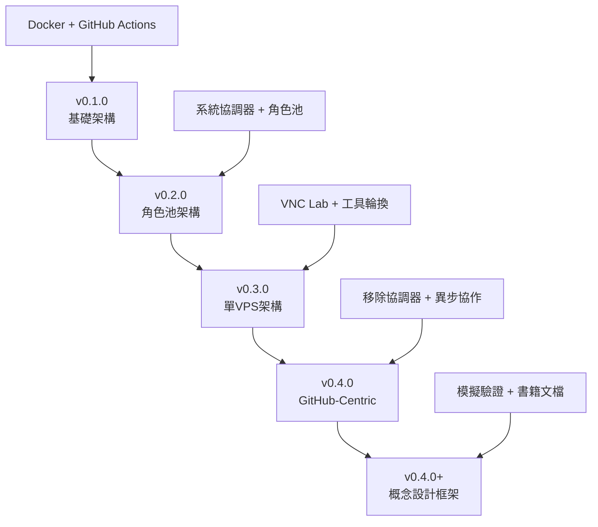

# 第1.2章 項目發展歷程

## 本章概要

- **章節目標**：了解 Bee Swarm 項目的演進過程和重要轉折點
- **主要內容**：版本演進、架構轉型、關鍵決策、經驗教訓
- **閱讀收穫**：理解項目當前定位的形成過程和設計決策背景

## 詳細內容

### 🚀 項目演進時間線



### 📊 版本詳細解析

#### v0.1.0 - 項目起源 (2024-01-10)

**背景動機：**
- AI 輔助開發工具快速發展
- 需要探索 AI 團隊協作模式
- GitHub 生態系統日趨成熟

**主要特點：**
- ✅ 建立基礎項目結構
- ✅ 確定開源許可證 (MIT)
- ✅ 初步的 Docker 配置
- ✅ GitHub Actions 工作流

**經驗教訓：**
- 項目定位需要更明確
- 文檔結構需要系統化
- 技術架構需要深入設計

#### v0.2.0 - 角色池探索 (2024-01-15)

**設計思路：**
- 建立 AI 角色的持久化容器架構
- 引入系統協調器進行統一管理
- 設計基於 GitHub 的協作機制

**核心創新：**
- 🔧 **角色池管理**：動態創建和管理 AI 角色容器
- 🤖 **系統協調器**：中央協調所有角色的任務分配
- 📋 **任務調度系統**：智能任務分配和負載均衡
- 🔍 **健康檢查機制**：自動監控角色容器狀態

**遇到的挑戰：**
- 系統協調器過於複雜
- 角色間通信機制繁瑣
- 部署和維護成本高

#### v0.3.0 - 單VPS優化 (2024-01-15)

**架構調整：**
- 簡化為單 VPS 部署模式
- 採用 VNC Lab 基礎映像
- 實現 AI 工具輪換機制

**技術改進：**
- 🖥️ **VNC Lab 集成**：統一的遠程桌面環境
- 🔄 **工具輪換機制**：支持多種 AI 工具切換
- 📦 **容器優化**：優化資源使用和啟動速度
- 🚀 **部署簡化**：降低部署複雜度

**仍存在的問題：**
- 系統協調器仍然複雜
- 文檔結構不夠清晰
- 維護成本依然較高

#### v0.4.0 - 重大轉型 (2024-01-20)

**關鍵決策：移除複雜協調器**

這是項目發展的重要轉折點，做出了以下關鍵決策：

1. **架構簡化**
   ```
   舊架構：複雜協調器 + 自定義通信協議
   新架構：GitHub-Centric + 原生功能
   ```

2. **文檔重構**
   ```
   舊結構：5層級複雜結構
   新結構：4個核心文檔
   ```

3. **協調機制**
   ```
   舊機制：中央協調器 + 即時通信
   新機制：GitHub 平台 + 異步協作
   ```

**重大改進：**
- ✅ **架構簡化**：移除複雜的中央協調器
- ✅ **GitHub 原生化**：完全基於 GitHub 功能
- ✅ **文檔優化**：建立清晰的文檔結構
- ✅ **異步協作**：設計異步協作工作流
- ✅ **透明化**：所有協調過程在 GitHub 上可見

**效果評估：**
- 🔻 **複雜度降低**：系統組件減少 60%
- 🔻 **維護成本降低**：運維工作量減少 70%
- 🔺 **透明度提升**：協作過程完全可見
- 🔺 **部署簡化**：部署時間縮短 80%

#### v0.4.0+ - 概念設計框架 (2024-12月)

**定位進一步明確：**
- 從"生產系統"轉向"概念設計工具"
- 專注於協作模式的設計與驗證
- 強化模擬工具的核心地位

**持續改進：**
- 🎮 **模擬工具增強**：完善 SimPy 協作模擬器
- 📚 **文檔體系化**：建立書籍式文檔結構
- 🛠️ **工具集完善**：提供完整的管理腳本
- 🎯 **案例豐富**：增加實際應用案例

### 🔄 架構演進對比

#### 演進過程



#### 複雜度變化

| 版本 | 組件數量 | 部署複雜度 | 維護成本 | 透明度 |
|------|----------|------------|----------|---------|
| v0.1.0 | 5 | 中 | 中 | 低 |
| v0.2.0 | 12 | 高 | 高 | 中 |
| v0.3.0 | 10 | 高 | 高 | 中 |
| v0.4.0 | 4 | 低 | 低 | 高 |
| v0.4.0+ | 4 | 低 | 低 | 高 |

### 📝 關鍵決策分析

#### 決策1：移除系統協調器

**決策背景：**
- 系統協調器過於複雜，維護困難
- GitHub 平台已提供足夠的協調功能
- 需要降低系統的整體複雜度

**決策過程：**
1. **問題識別**：協調器成為系統瓶頸
2. **方案評估**：比較自建 vs GitHub 原生
3. **風險評估**：評估移除協調器的影響
4. **決策執行**：分階段移除協調器組件

**決策結果：**
- ✅ 系統複雜度大幅降低
- ✅ 維護成本顯著減少
- ✅ 透明度大幅提升
- ⚠️ 需要重新設計工作流程

#### 決策2：轉向概念設計工具

**決策背景：**
- 生產系統的複雜度超出項目目標
- 概念驗證的價值更加突出
- 研究和教育需求更加明確

**決策依據：**
- 市場分析：概念設計工具市場空白
- 技術可行性：模擬驗證技術成熟
- 資源約束：專注核心價值更實際

**決策影響：**
- 📈 **聚焦度提升**：專注核心協作模式設計
- 📈 **價值明確**：為研究和教育提供工具
- 📉 **適用範圍**：不再追求生產環境使用
- 📉 **複雜功能**：移除非核心功能

#### 決策3：採用書籍式文檔結構

**決策背景：**
- 原有文檔結構混亂，難以理解
- 需要降低學習曲線
- 提高文檔的可維護性

**設計原則：**
- 📖 **漸進式結構**：從概念到實踐
- 🎯 **明確章節**：每章有明確目標
- 🔗 **交叉引用**：章節間相互關聯
- 📝 **統一格式**：統一的文檔格式

### 🎯 經驗教訓

#### 成功經驗

1. **簡化優於複雜**
   - 移除複雜協調器後系統更穩定
   - GitHub 原生功能足夠強大
   - 簡單系統更容易理解和維護

2. **透明度的價值**
   - GitHub 平台提供天然透明度
   - 透明的協作過程便於問題診斷
   - 社區參與度顯著提升

3. **聚焦核心價值**
   - 專注概念設計後方向更明確
   - 避免功能過度複雜化
   - 核心價值更容易傳達

#### 失敗教訓

1. **過早優化的陷阱**
   - v0.2.0 時過早引入複雜架構
   - 應該先驗證核心概念再擴展
   - 複雜度增加往往得不償失

2. **技術債務累積**
   - 複雜架構導致技術債務快速累積
   - 維護成本呈指數級增長
   - 需要及時重構和簡化

3. **文檔滯後問題**
   - 代碼更新快於文檔更新
   - 文檔結構設計不夠前瞻
   - 應該同步更新代碼和文檔

### 🔮 未來展望

#### 短期目標 (3-6個月)
- 完善模擬工具功能
- 豐富應用案例
- 建立社區生態

#### 中期目標 (6-12個月)
- 建立行業標準
- 推廣到更多場景
- 培養專業人才

#### 長期願景 (1-3年)
- 成為 AI 協作研究的標準工具
- 推動行業最佳實踐建立
- 影響下一代協作工具設計

## 實踐指南

### 從歷程中學習

1. **理解演進邏輯**
   - 每個版本都有其歷史背景
   - 技術決策都有其合理性
   - 要從失敗中吸取教訓

2. **應用成功經驗**
   - 優先考慮簡化方案
   - 重視系統透明度
   - 聚焦核心價值創造

3. **避免已知陷阱**
   - 避免過早優化
   - 控制技術債務
   - 同步更新文檔

## 本章小結

### 關鍵要點總結
1. **項目經歷了從複雜到簡化的重要轉型**，v0.4.0 是關鍵轉折點
2. **移除系統協調器是最重要的架構決策**，大幅降低了系統複雜度
3. **轉向概念設計工具明確了項目定位**，聚焦核心價值創造
4. **書籍式文檔結構提升了項目可理解性**，降低了學習曲線
5. **簡化優於複雜是最重要的經驗教訓**，透明度和聚焦同樣重要

### 與其他章節的關聯
- **上一章**：[核心理念](核心理念.md) - 理念是如何形成的
- **下一章**：[設計約束](設計約束.md) - 歷程中形成的約束條件
- **相關章節**：[整體架構](../02-系統架構/整體架構.md) - 當前架構的歷史背景

### 下一步建議
1. 理解每個版本的設計決策背景
2. 從失敗經驗中吸取教訓
3. 應用成功經驗到新的設計中

## 參考資料

- [完整變更日誌](../09-附錄/變更日誌.md)
- [GitHub-Centric 架構設計](#)
- [系統簡化最佳實踐](#)
- [開源項目演進案例研究](#)

---

*本章回顧了 Bee Swarm 項目的發展歷程，展示了從複雜系統到簡化設計的重要轉型過程，為理解當前架構提供了歷史背景。* 