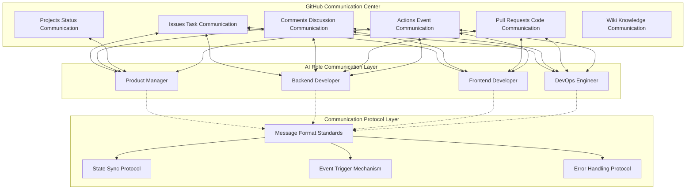
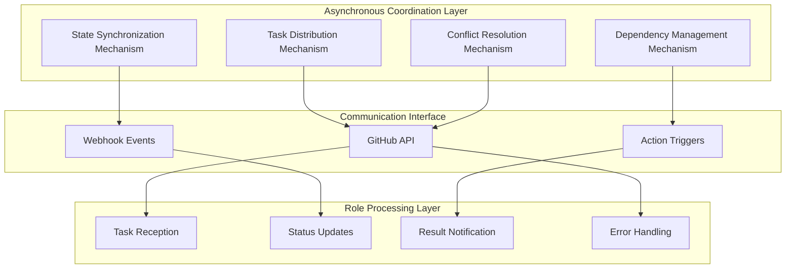
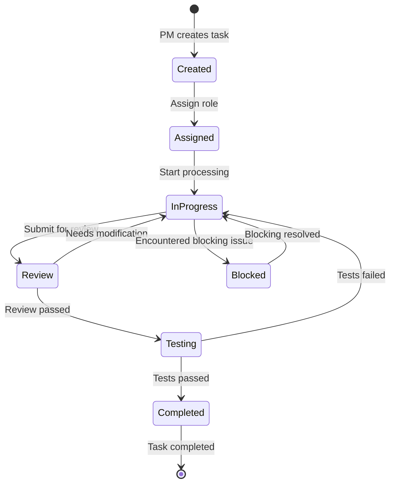

# Communication and Coordination Mechanisms

## Document Information
- **Document Version**: 1.0
- **Created**: 2024-12
- **Last Updated**: 2024-12
- **Document Status**: ✅ Stable Version

This document describes the communication and coordination mechanism design for the Bee Swarm project, including GitHub-Centric communication, asynchronous coordination patterns, state management, and other core components.

## 📡 GitHub-Centric Communication Mechanism

### Communication Architecture Overview



### GitHub Feature Mapping

**Feature Correspondence**
```
Issues:
├── Task creation and assignment → Work item management
├── Requirements discussion and clarification → Business communication
├── Progress tracking and updates → State management
└── Problem reporting and resolution → Exception handling

Comments:
├── Real-time discussion and negotiation → Synchronous communication
├── Decision recording and documentation → Knowledge management
├── Code review feedback → Quality control
└── Technical solution discussion → Architecture design

Pull Requests:
├── Code change proposals → Version control
├── Code review process → Quality assurance
├── Integration test triggers → Automation workflows
└── Deployment readiness checks → Release management

Projects:
├── Workflow visualization → Project management
├── Task status tracking → Progress monitoring
├── Resource allocation management → Load balancing
└── Milestone planning → Time management
```

## 🔄 Asynchronous Coordination Patterns

### Coordination Mechanism Design



### Message Flow Protocol

**1. Task Distribution Process**
```
Creation Phase:
1. PM creates Issue (task description)
2. System automatically tags relevant roles
3. Roles receive task notifications
4. Roles confirm task reception

Processing Phase:
1. Role updates Issue status
2. Role adds processing progress comments
3. System synchronizes status changes
4. Related roles receive status notifications

Completion Phase:
1. Role submits PR (result delivery)
2. Other roles perform code review
3. PM provides final confirmation
4. System closes related Issue
```

**2. State Synchronization Protocol**
```yaml
# State synchronization specifications
task_status:
  pending: "Pending"
  in_progress: "In Progress"
  review: "Under Review"
  testing: "Testing"
  completed: "Completed"
  blocked: "Blocked"

role_status:
  active: "Active"
  busy: "Busy"
  idle: "Idle"
  offline: "Offline"

project_status:
  planning: "Planning"
  development: "Development"
  testing: "Testing"
  deployment: "Deployment"
  completed: "Completed"
```

## 📋 Task Management Protocol

### Task Lifecycle



### Dependency Management Mechanism

**Dependency Types**
```
Sequential Dependency:
├── Backend API completed → Frontend integration begins
├── Database design completed → Backend development begins
└── Infrastructure ready → Application deployment begins

Parallel Dependency:
├── Frontend and backend can develop in parallel
├── Documentation writing parallel with development
└── Test environment parallel with development environment preparation

Conditional Dependency:
├── Performance tests passed → Deployment allowed
├── Security review passed → Release allowed
└── User acceptance passed → Task closure allowed
```

## 🚨 Conflict Resolution Mechanism

### Conflict Types and Handling

**1. Resource Conflicts**
```
Scenario: Multiple roles simultaneously modifying the same file
Handling:
1. GitHub automatically detects conflicts
2. Later committer responsible for resolving conflicts
3. Invite related roles for negotiation
4. PM makes final decision (if needed)
```

**2. Priority Conflicts**
```
Scenario: Task priority disagreements
Handling:
1. PM has final decision authority
2. Consider business value and technical dependencies
3. Record decision rationale and basis
4. Notify all related roles
```

**3. Technical Solution Conflicts**
```
Scenario: Disagreements on technical implementation approaches
Handling:
1. Technical roles propose different solutions
2. Conduct technical discussion in Issues
3. Consider maintainability, performance, cost
4. PM coordinates and makes final decision
```

## 📊 Status Monitoring and Feedback

### Monitoring Metrics

**Efficiency Metrics**
```yaml
task_metrics:
  average_completion_time: "Average completion time"
  task_throughput: "Task throughput"
  blocking_frequency: "Blocking occurrence frequency"
  role_utilization: "Role utilization rate"

quality_metrics:
  code_review_cycles: "Code review cycles"
  bug_detection_rate: "Bug detection rate"
  test_coverage: "Test coverage"
  documentation_completeness: "Documentation completeness"

collaboration_metrics:
  communication_frequency: "Communication frequency"
  response_time: "Response time"
  decision_speed: "Decision speed"
  conflict_resolution_time: "Conflict resolution time"
```

### Feedback Mechanism

**Automated Feedback**
```
GitHub Actions Triggers:
├── Code commit → Automated testing → Result notification
├── PR creation → Code analysis → Quality report
├── Issue status change → Progress update → Related notifications
└── Deployment complete → Monitoring check → Health report
```

**Manual Feedback**
```
Regular Assessment:
├── Daily progress updates (Issue Comments)
├── Weekly summary reports (Project Dashboard)
├── Milestone reviews (Milestone Review)
└── Project retrospectives (Project Retrospective)
```

## 🔧 Implementation Configuration

### GitHub Configuration Requirements

**Required Configuration**
```yaml
# .github/workflows/bee-swarm-coordination.yml
repository_settings:
  issues: enabled
  projects: enabled
  wiki: enabled
  actions: enabled
  webhooks: enabled

permissions:
  issues: write
  pull_requests: write
  projects: write
  actions: write
  contents: write
```

### Integration Tools

**Recommended Tools**
```
Communication Enhancement:
├── GitHub CLI - Command line operations
├── GitHub API - Automation integration
├── Webhooks - Event notifications
└── GitHub Apps - Extended functionality

Monitoring and Analytics:
├── GitHub Insights - Built-in analytics
├── Custom Dashboard - Customized monitoring
├── Action Logs - Execution logs
└── API Analytics - Usage statistics
```

## 📚 Related Documentation
- [AI Role Design](role-design.en.md)
- [System Architecture Overview](hybrid-architecture.en.md)
- [Configuration Guide](../03-implementation/configuration-guide.en.md)
- [Deployment Guide](../03-implementation/deployment-guide.en.md) 