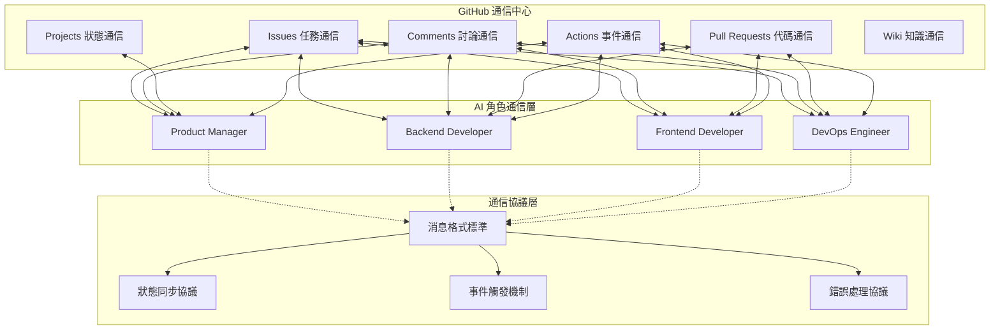
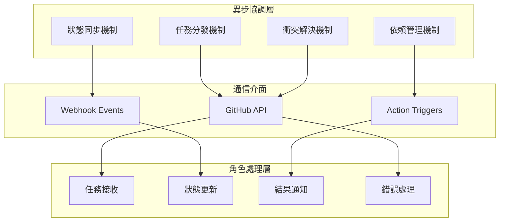
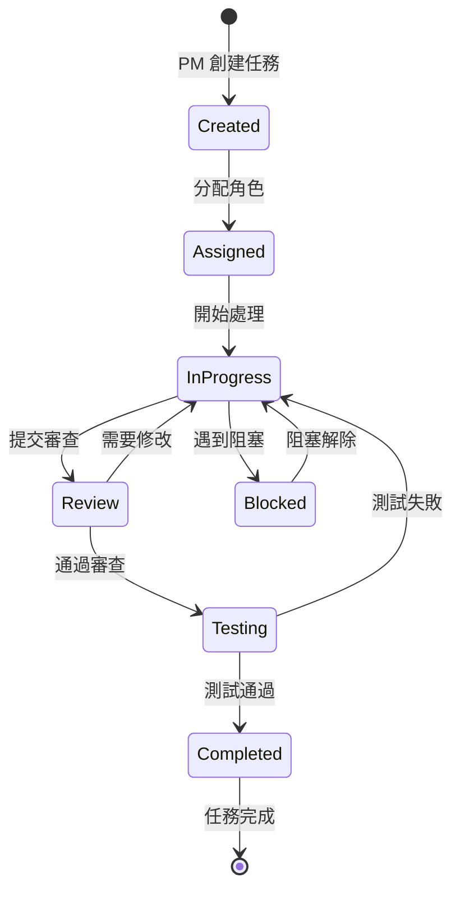

# 通信與協調機制

## 文檔信息
- **文檔版本**: 1.0
- **創建日期**: 2024-12
- **最後更新**: 2024-12
- **文檔狀態**: ✅ 穩定版本

本文檔描述 Bee Swarm 項目的通信協調機制設計，包括 GitHub-Centric 通信、異步協調模式、狀態管理等核心內容。

## 📡 GitHub-Centric 通信機制

### 通信架構概覽



### GitHub 功能映射

**功能對應關係**
```
Issues：
├── 任務創建和分配 → 工作項管理
├── 需求討論和澄清 → 業務溝通
├── 進度跟踪和更新 → 狀態管理
└── 問題報告和解決 → 異常處理

Comments：
├── 實時討論和協商 → 同步通信
├── 決策記錄和說明 → 知識管理
├── 代碼審查意見 → 質量控制
└── 技術方案討論 → 架構設計

Pull Requests：
├── 代碼變更提案 → 版本控制
├── 代碼審查流程 → 質量保證
├── 集成測試觸發 → 自動化流程
└── 部署準備檢查 → 發布管理

Projects：
├── 工作流可視化 → 項目管理
├── 任務狀態追蹤 → 進度監控
├── 資源分配管理 → 負載均衡
└── 里程碑規劃 → 時間管理
```

## 🔄 異步協調模式

### 協調機制設計



### 消息流轉協議

**1. 任務分發流程**
```
創建階段：
1. PM 創建 Issue（任務描述）
2. 系統自動標記相關角色
3. 角色接收任務通知
4. 角色確認任務接收

處理階段：
1. 角色更新 Issue 狀態
2. 角色添加處理進度評論
3. 系統同步狀態變更
4. 相關角色接收狀態通知

完成階段：
1. 角色提交 PR（結果交付）
2. 其他角色進行代碼審查
3. PM 進行最終確認
4. 系統關閉相關 Issue
```

**2. 狀態同步協議**
```yaml
# 狀態同步規範
task_status:
  pending: "待處理"
  in_progress: "處理中"
  review: "等待審查"
  testing: "測試中"
  completed: "已完成"
  blocked: "被阻塞"

role_status:
  active: "活躍"
  busy: "忙碌"
  idle: "空閒"
  offline: "離線"

project_status:
  planning: "規劃中"
  development: "開發中"
  testing: "測試中"
  deployment: "部署中"
  completed: "已完成"
```

## 📋 任務管理協議

### 任務生命週期



### 依賴管理機制

**依賴類型**
```
順序依賴 (Sequential Dependency):
├── 後端 API 完成 → 前端集成開始
├── 數據庫設計完成 → 後端開發開始
└── 基礎設施就緒 → 應用部署開始

並行依賴 (Parallel Dependency):
├── 前端和後端可並行開發
├── 文檔編寫與開發並行
└── 測試環境與開發環境並行準備

條件依賴 (Conditional Dependency):
├── 性能測試通過 → 可進行部署
├── 安全審查通過 → 可發佈上線
└── 用戶驗收通過 → 可關閉任務
```

## 🚨 衝突解決機制

### 衝突類型與處理

**1. 資源衝突**
```
場景：多個角色同時修改同一文件
處理：
1. GitHub 自動檢測衝突
2. 後提交者負責解決衝突
3. 邀請相關角色協商
4. PM 最終決策（如需要）
```

**2. 優先級衝突**
```
場景：任務優先級產生分歧
處理：
1. PM 擁有最終決策權
2. 考慮業務價值和技術依賴
3. 記錄決策理由和依據
4. 通知所有相關角色
```

**3. 技術方案衝突**
```
場景：技術實現方案有分歧
處理：
1. 技術角色提出不同方案
2. 在 Issue 中進行技術討論
3. 考慮可維護性、性能、成本
4. PM 協調並做最終決定
```

## 📊 狀態監控與反饋

### 監控指標

**效率指標**
```yaml
task_metrics:
  average_completion_time: "平均完成時間"
  task_throughput: "任務吞吐量"
  blocking_frequency: "阻塞發生頻率"
  role_utilization: "角色利用率"

quality_metrics:
  code_review_cycles: "代碼審查輪數"
  bug_detection_rate: "缺陷檢出率"
  test_coverage: "測試覆蓋率"
  documentation_completeness: "文檔完整度"

collaboration_metrics:
  communication_frequency: "溝通頻率"
  response_time: "響應時間"
  decision_speed: "決策速度"
  conflict_resolution_time: "衝突解決時間"
```

### 反饋機制

**自動反饋**
```
GitHub Actions 觸發：
├── 代碼提交 → 自動測試 → 結果通知
├── PR 創建 → 代碼分析 → 質量報告
├── Issue 狀態變更 → 進度更新 → 相關通知
└── 部署完成 → 監控檢查 → 健康報告
```

**手動反饋**
```
定期評估：
├── 每日進度更新（Issue Comments）
├── 每週總結報告（Project Dashboard）
├── 里程碑回顧（Milestone Review）
└── 項目後評價（Project Retrospective）
```

## 🔧 實施配置

### GitHub 配置要求

**必需配置**
```yaml
# .github/workflows/bee-swarm-coordination.yml
repository_settings:
  issues: enabled
  projects: enabled
  wiki: enabled
  actions: enabled
  webhooks: enabled

permissions:
  issues: write
  pull_requests: write
  projects: write
  actions: write
  contents: write
```

### 集成工具

**推薦工具**
```
通信增強：
├── GitHub CLI - 命令行操作
├── GitHub API - 自動化集成
├── Webhooks - 事件通知
└── GitHub Apps - 擴展功能

監控分析：
├── GitHub Insights - 內建分析
├── 自定義 Dashboard - 定制監控
├── Action Logs - 執行日誌
└── API Analytics - 使用統計
```

## 📚 相關文檔
- [AI 角色設計](role-design.md)
- [系統架構概覽](hybrid-architecture.md)
- [配置指南](../03-implementation/configuration-guide.md)
- [部署指南](../03-implementation/deployment-guide.md) 