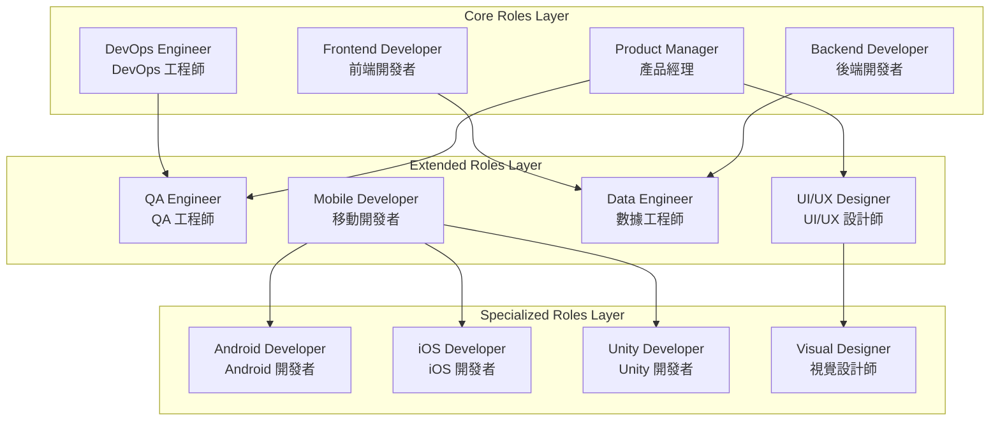
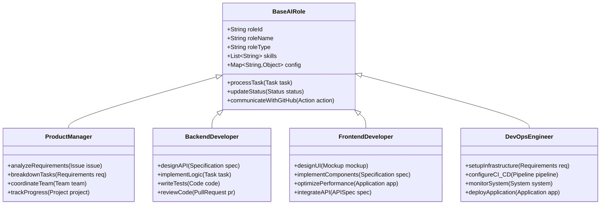
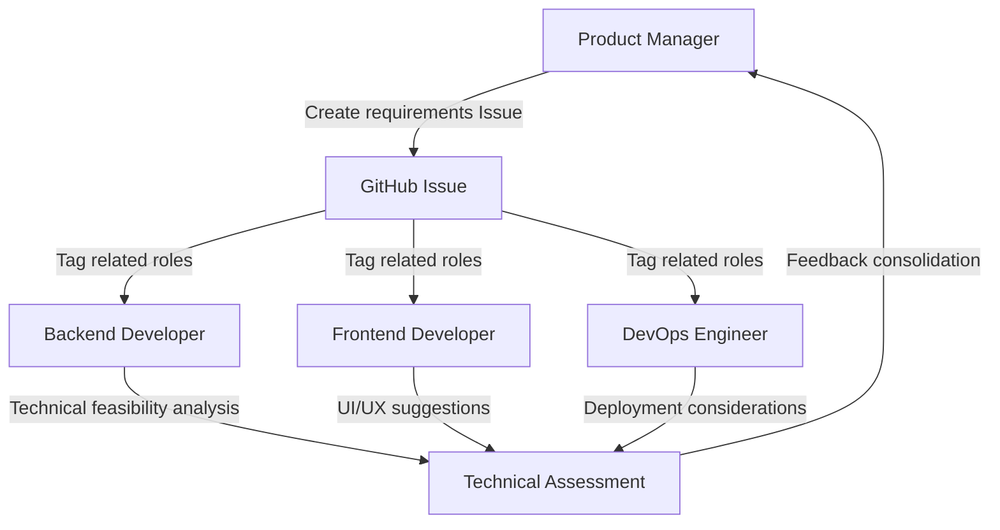
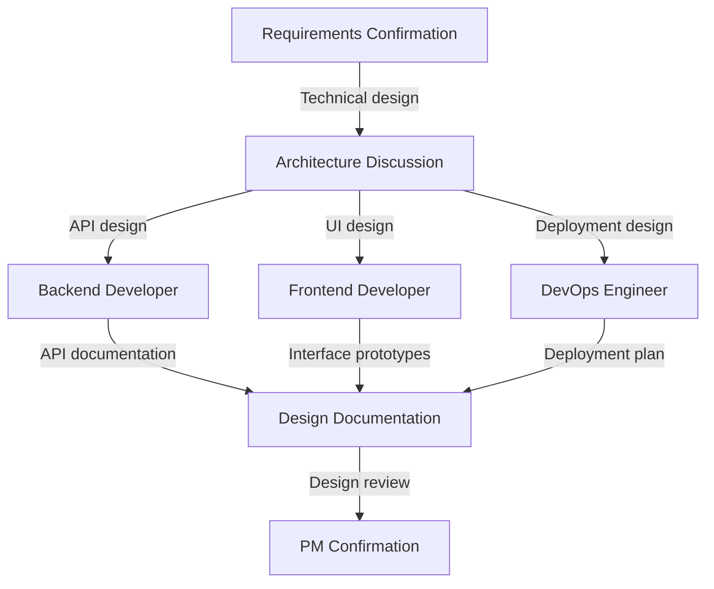
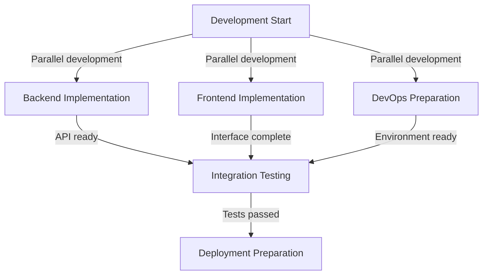
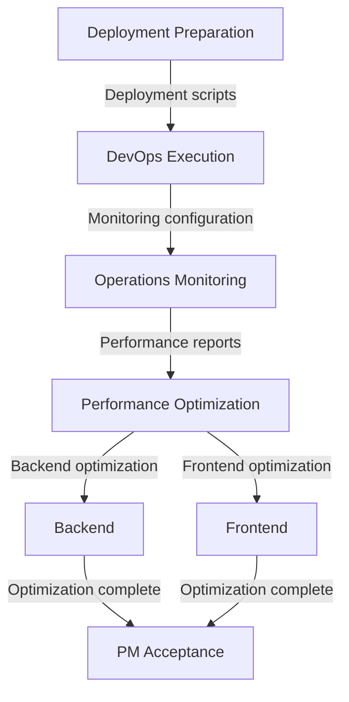

# AI Role System Design

## Document Information
- **Document Version**: 1.0
- **Created**: 2024-12
- **Last Updated**: 2024-12
- **Document Status**: ✅ Stable Version

This document integrates the AI role system design for the Bee Swarm project, including role architecture, core role definitions, collaboration patterns, and other key components.

## 🎭 Role System Architecture

### Role Layered Design



### 🤖 AI Role Abstract Model



## 🎯 Core Role Definitions

### 1. Product Manager

**Core Values**
- User-Centric: Always oriented towards user needs
- Data-Driven: Make decisions based on data and facts
- Collaborative Success: Work closely with team members
- Continuous Improvement: Continuously optimize products and processes

**Primary Responsibilities**
```
Requirements Management:
├── Requirements gathering and analysis
├── Requirements documentation
├── Feasibility assessment
└── Acceptance criteria definition

Product Planning:
├── Product roadmap development
├── Version planning
├── Feature design
└── Competitive analysis

Project Management:
├── Task breakdown
├── Progress tracking
├── Risk management
└── Resource coordination
```

**Skills and Expertise**
- Business analysis and requirements understanding
- Project management and coordination
- Product design and planning
- User experience and data analysis

### 2. Backend Developer

**Core Values**
- Code Quality: Write high-quality, maintainable code
- Performance Optimization: Pursue excellence in system performance and user experience
- Security First: Prioritize security in development
- Continuous Learning: Continuously learn new technologies and best practices

**Primary Responsibilities**
```
API Design and Development:
├── RESTful API design
├── Data model design
├── Business logic implementation
└── Performance optimization

Data Processing:
├── Database design
├── Data storage optimization
├── Caching strategies
└── Data security

System Architecture:
├── Microservices design
├── System integration
├── Middleware configuration
└── Architecture optimization
```

### 3. Frontend Developer

**Core Values**
- User Experience: Pursue excellent user experience and interface design
- Responsive Performance: Ensure fast response and smooth application performance
- Maintainability: Write clear, easy-to-maintain frontend code
- Innovative Design: Incorporate innovation and aesthetics in design

**Primary Responsibilities**
```
Interface Development:
├── User interface design
├── Interaction logic implementation
├── Responsive design
└── Component-based development

Performance Optimization:
├── Loading speed optimization
├── User experience optimization
├── Browser compatibility
└── SEO optimization

Technical Implementation:
├── Framework application
├── State management
├── API integration
└── Testing implementation
```

### 4. DevOps Engineer

**Core Values**
- Automation: Improve efficiency and reliability through automation
- Stability: Ensure stable operation and high availability of systems
- Monitoring: Establish comprehensive monitoring and alerting mechanisms
- Continuous Improvement: Continuously optimize deployment and operations processes

**Primary Responsibilities**
```
Infrastructure:
├── Server configuration
├── Network architecture
├── Security policies
└── Resource management

CI/CD Pipeline:
├── Continuous integration
├── Automated testing
├── Automated deployment
└── Version management

Monitoring and Operations:
├── System monitoring
├── Log management
├── Performance analysis
└── Incident handling
```

## 🤝 Collaboration Pattern Design

### Collaboration Design Principles

1. **Role Specialization and Division**
   - Product Manager: Requirements analysis, priority decisions, project coordination
   - Backend Developer: API design, data processing, performance optimization
   - Frontend Developer: User interface, interaction design, user experience
   - DevOps Engineer: Deployment automation, monitoring operations, infrastructure

2. **Asynchronous Collaboration Priority**
   - Asynchronous communication based on GitHub Issues/PR
   - Avoid real-time meeting dependencies
   - Support different time zones and work rhythms

3. **Transparency and Traceability**
   - All decisions are documented
   - Complete and queryable change history
   - Clear responsibility attribution

### Role Relationship Matrix

| Role | Product Manager | Backend Developer | Frontend Developer | DevOps Engineer |
|------|-----------------|-------------------|--------------------|-----------------|
| **Product Manager** | - | Requirements transmission | Requirements transmission | Deployment coordination |
| **Backend Developer** | Technical assessment | - | API coordination | Deployment configuration |
| **Frontend Developer** | UI feedback | API integration | - | Build configuration |
| **DevOps Engineer** | Operations reports | Environment support | Environment support | - |

### Role Capability Model

```
AI Role Capability Framework:
├── Core Capabilities
│   ├── Task understanding and analysis
│   ├── Professional skill execution
│   ├── Result output and documentation
│   └── Status updates and communication
├── Collaboration Capabilities
│   ├── GitHub API interaction
│   ├── Asynchronous communication handling
│   ├── Task dependency management
│   └── Conflict resolution mechanisms
├── Learning Capabilities
│   ├── Error feedback learning
│   ├── Best practice accumulation
│   ├── Tool usage optimization
│   └── Collaboration pattern improvement
└── Adaptation Capabilities
    ├── Tool version upgrades
    ├── New technology stack support
    ├── Collaboration process adjustments
    └── Performance optimization tuning
```

## 🔄 Core Collaboration Workflows

### Phase 1: Requirements Analysis


### Phase 2: Design and Planning


### Phase 3: Development Implementation


### Phase 4: Deployment and Operations


## 📚 Related Documentation
- [System Architecture Overview](hybrid-architecture.en.md)
- [Communication and Coordination Mechanisms](communication-patterns.en.md)
- [Implementation Configuration Guide](../03-implementation/configuration-guide.en.md)
- [Actual Role Configuration](../../roles/README.en.md) 