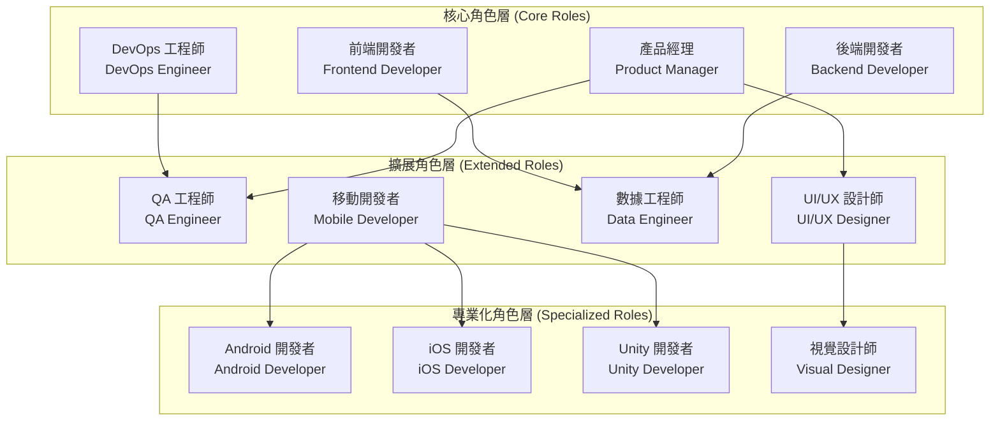
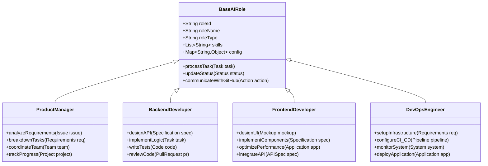
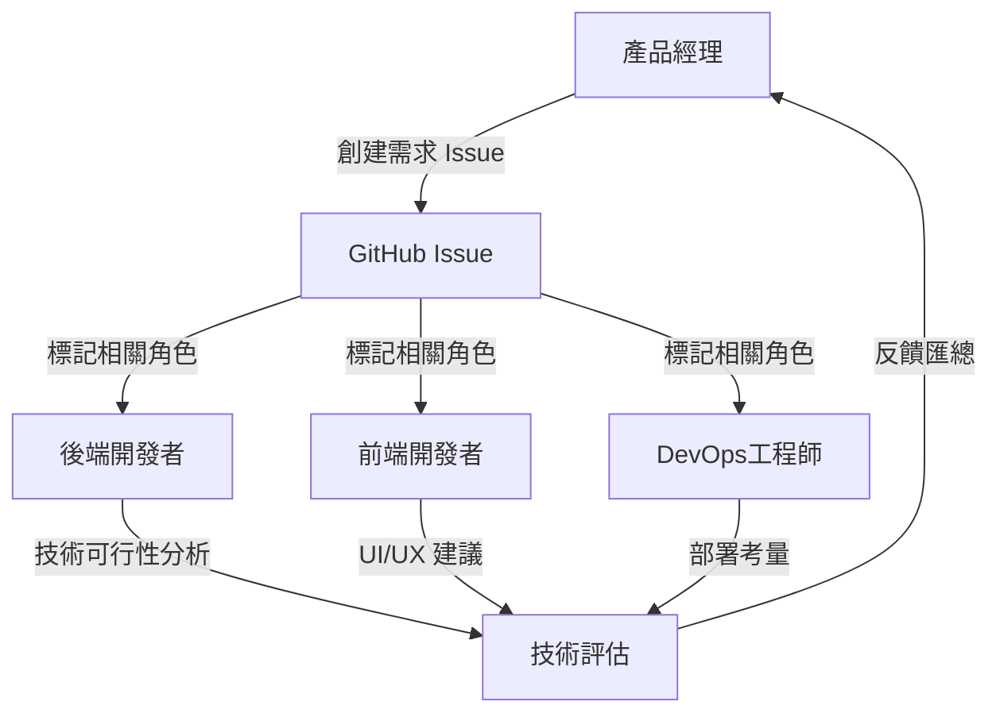
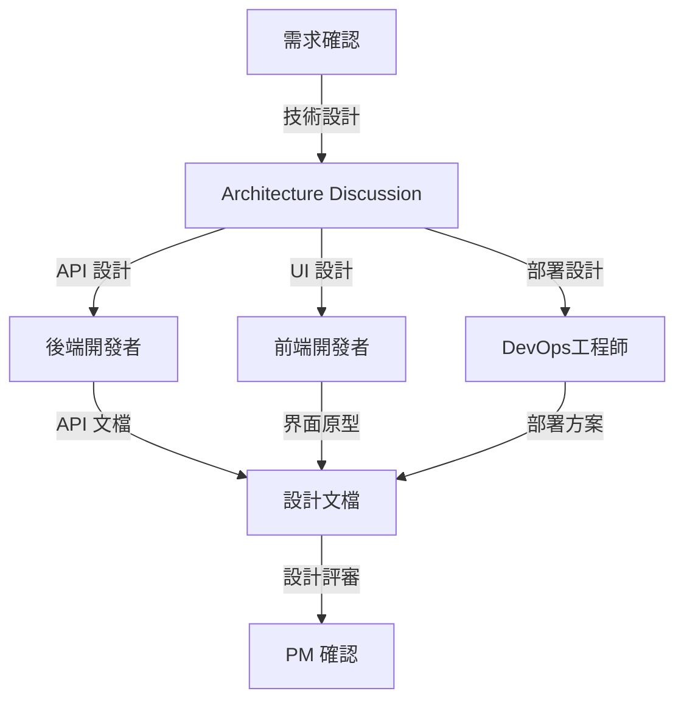
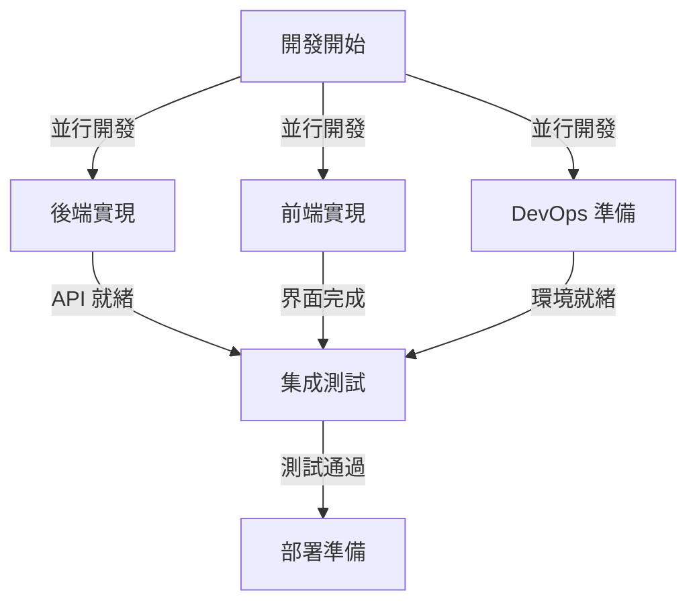
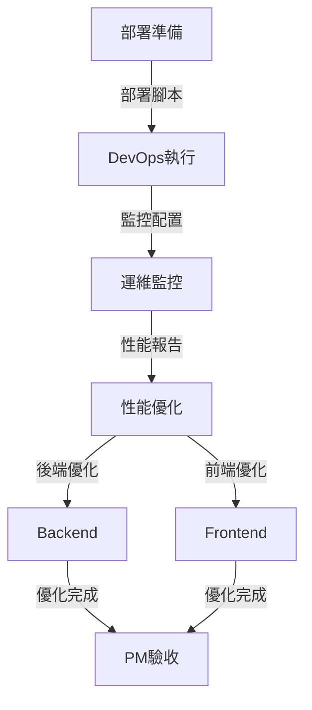

# AI 角色系統設計

## 文檔信息
- **文檔版本**: 1.0
- **創建日期**: 2024-12
- **最後更新**: 2024-12
- **文檔狀態**: ✅ 穩定版本

本文檔整合了 Bee Swarm 項目的 AI 角色系統設計，包括角色架構、核心角色定義、協作模式等關鍵內容。

## 🎭 角色系統架構

### 角色分層設計



### 🤖 AI 角色抽象模型



## 🎯 核心角色定義

### 1. 產品經理 (Product Manager)

**核心價值觀**
- 用戶中心：始終以用戶需求為導向
- 數據驅動：基於數據和事實做決策
- 協作共贏：與團隊成員密切合作
- 持續改進：持續優化產品和流程

**主要職責**
```
需求管理：
├── 需求收集和分析
├── 需求文檔編寫
├── 可行性評估
└── 驗收標準制定

產品規劃：
├── 產品路線圖制定
├── 版本規劃
├── 功能設計
└── 競品分析

項目管理：
├── 任務分解
├── 進度跟踪
├── 風險管理
└── 資源協調
```

**技能特長**
- 業務分析和需求理解
- 項目管理和協調
- 產品設計和規劃
- 用戶體驗和數據分析

### 2. 後端開發者 (Backend Developer)

**核心價值觀**
- 代碼質量：編寫高質量、可維護的代碼
- 性能優化：追求系統性能和用戶體驗的卓越
- 安全第一：在開發中優先考慮安全性
- 持續學習：不斷學習新技術和最佳實踐

**主要職責**
```
API 設計開發：
├── RESTful API 設計
├── 數據模型設計
├── 業務邏輯實現
└── 性能優化

數據處理：
├── 數據庫設計
├── 數據存儲優化
├── 緩存策略
└── 數據安全

系統架構：
├── 微服務設計
├── 系統集成
├── 中間件配置
└── 架構優化
```

### 3. 前端開發者 (Frontend Developer)

**核心價值觀**
- 用戶體驗：追求出色的用戶體驗和界面設計
- 響應性能：確保應用的快速響應和流暢性
- 可維護性：編寫結構清晰、易於維護的前端代碼
- 創新設計：在設計中融入創新和美感

**主要職責**
```
界面開發：
├── 用戶界面設計
├── 交互邏輯實現
├── 響應式設計
└── 組件化開發

性能優化：
├── 加載速度優化
├── 用戶體驗優化
├── 瀏覽器兼容性
└── SEO 優化

技術實現：
├── 框架應用
├── 狀態管理
├── API 集成
└── 測試實現
```

### 4. DevOps 工程師 (DevOps Engineer)

**核心價值觀**
- 自動化：通過自動化提高效率和可靠性
- 穩定性：確保系統的穩定運行和高可用性
- 監控：建立完善的監控和告警機制
- 持續改進：不斷優化部署和運維流程

**主要職責**
```
基礎設施：
├── 服務器配置
├── 網絡架構
├── 安全策略
└── 資源管理

CI/CD 流程：
├── 持續集成
├── 自動化測試
├── 自動化部署
└── 版本管理

監控運維：
├── 系統監控
├── 日誌管理
├── 性能分析
└── 故障處理
```

## 🤝 協作模式設計

### 協作設計原則

1. **角色專業化分工**
   - 產品經理：需求分析、優先級決策、項目協調
   - 後端開發者：API 設計、數據處理、性能優化
   - 前端開發者：用戶界面、交互設計、用戶體驗
   - DevOps 工程師：部署自動化、監控運維、基礎設施

2. **異步協作優先**
   - 基於 GitHub Issues/PR 的異步溝通
   - 避免實時會議依賴
   - 支持不同時區和工作節奏

3. **透明度與可追蹤性**
   - 所有決策都有文檔記錄
   - 變更歷史完整可查
   - 責任歸屬清晰明確

### 角色關係矩陣

| 角色 | 產品經理 | 後端開發者 | 前端開發者 | DevOps 工程師 |
|------|----------|------------|------------|---------------|
| **產品經理** | - | 需求傳達 | 需求傳達 | 部署協調 |
| **後端開發者** | 技術評估 | - | API 協調 | 部署配置 |
| **前端開發者** | UI 反饋 | API 集成 | - | 構建配置 |
| **DevOps 工程師** | 運維報告 | 環境支持 | 環境支持 | - |

### 角色能力模型

```
AI 角色能力框架：
├── 核心能力 (Core Capabilities)
│   ├── 任務理解和分析
│   ├── 專業技能執行
│   ├── 結果產出和文檔
│   └── 狀態更新和通信
├── 協作能力 (Collaboration Capabilities)
│   ├── GitHub API 交互
│   ├── 異步通信處理
│   ├── 任務依賴管理
│   └── 衝突解決機制
├── 學習能力 (Learning Capabilities)
│   ├── 錯誤反饋學習
│   ├── 最佳實踐積累
│   ├── 工具使用優化
│   └── 協作模式改進
└── 適應能力 (Adaptation Capabilities)
    ├── 工具版本升級
    ├── 新技術棧支持
    ├── 協作流程調整
    └── 性能優化調優
```

## 🔄 核心協作流程

### Phase 1: 需求分析階段


### Phase 2: 設計與規劃階段


### Phase 3: 開發實現階段


### Phase 4: 部署與運維階段


## 📚 相關文檔
- [系統架構概覽](hybrid-architecture.md)
- [通信協調機制](communication-patterns.md)
- [實施配置指南](../03-implementation/configuration-guide.md)
- [角色實際配置](../../roles/README.md) 