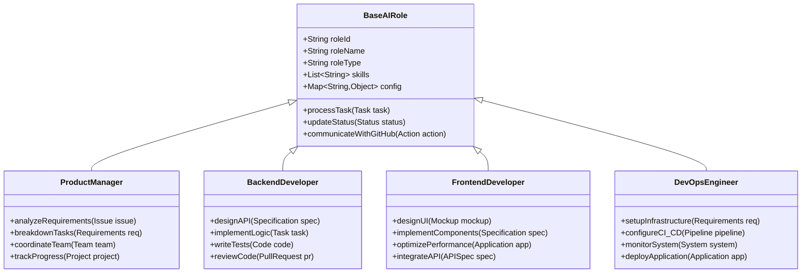
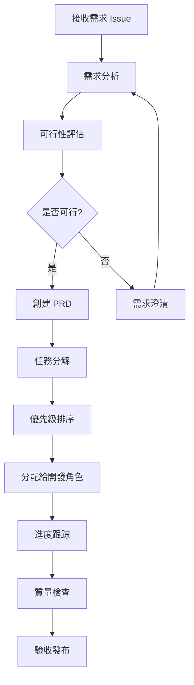
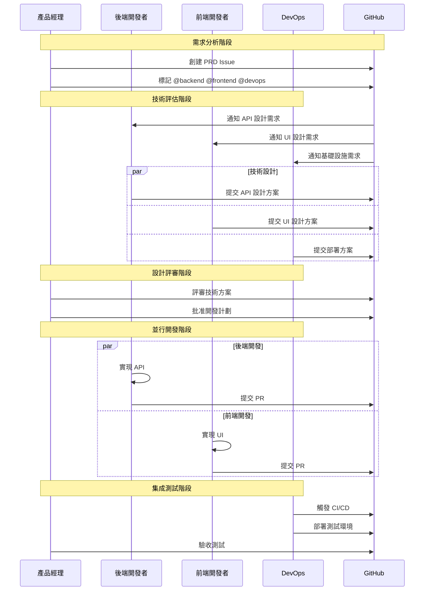
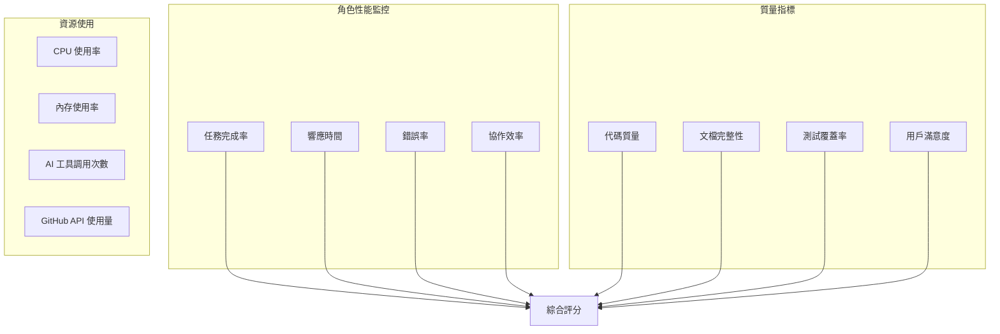

# 第2.2章 AI 角色系統設計

## 本章概要

- **章節目標**：深入理解 Bee Swarm 的 AI 角色系統設計原理
- **主要內容**：角色抽象模型、核心角色設計、角色交互模式、擴展機制
- **閱讀收穫**：掌握 AI 角色的設計思路和實現方法

## 詳細內容

### 🤖 AI 角色抽象模型

#### 角色系統架構



#### 角色能力模型

```
AI 角色能力框架：
├── 核心能力 (Core Capabilities)
│   ├── 任務理解和分析
│   ├── 專業技能執行
│   ├── 結果產出和文檔
│   └── 狀態更新和通信
├── 協作能力 (Collaboration Capabilities)
│   ├── GitHub API 交互
│   ├── 異步通信處理
│   ├── 任務依賴管理
│   └── 衝突解決機制
├── 學習能力 (Learning Capabilities)
│   ├── 錯誤反饋學習
│   ├── 最佳實踐積累
│   ├── 工具使用優化
│   └── 協作模式改進
└── 適應能力 (Adaptation Capabilities)
    ├── 工具版本升級
    ├── 新技術棧支持
    ├── 協作流程調整
    └── 性能優化調優
```

### 👤 核心角色設計

#### 1. 產品經理 (Product Manager)

**角色定位**
```
核心職責：
├── 需求收集和分析
├── 產品規劃和設計
├── 項目協調和管理
└── 質量控制和驗收

技能特長：
├── 業務需求理解
├── 用戶體驗設計
├── 項目管理方法
└── 團隊協調溝通

工具配置：
├── 主要：Claude Code (高級分析能力)
├── 輔助：Gemini CLI (文檔生成)
├── 專業：GitHub Projects, Issues
└── 分析：數據分析工具
```

**工作流程設計**


**專業能力模塊**
```python
class ProductManagerAgent(BaseAIRole):
    def __init__(self):
        super().__init__(
            role_id="pm",
            role_name="Product Manager",
            skills=["requirement_analysis", "project_management", 
                   "user_experience", "quality_assurance"]
        )
    
    def analyze_requirements(self, issue):
        """分析用戶需求"""
        analysis = {
            'business_value': self.assess_business_value(issue),
            'technical_complexity': self.assess_complexity(issue),
            'user_impact': self.assess_user_impact(issue),
            'priority': self.calculate_priority(issue)
        }
        return self.create_prd(analysis)
    
    def breakdown_tasks(self, prd):
        """任務分解"""
        tasks = []
        for feature in prd.features:
            backend_tasks = self.identify_backend_tasks(feature)
            frontend_tasks = self.identify_frontend_tasks(feature)
            devops_tasks = self.identify_devops_tasks(feature)
            tasks.extend([backend_tasks, frontend_tasks, devops_tasks])
        return self.prioritize_tasks(tasks)
```

#### 2. 後端開發者 (Backend Developer)

**角色定位**
```
核心職責：
├── API 設計和實現
├── 數據庫設計和優化
├── 業務邏輯開發
└── 後端架構設計

技能特長：
├── 服務端編程語言
├── 數據庫設計和 SQL
├── API 設計和微服務
└── 性能優化和安全

工具配置：
├── 主要：Gemini CLI (代碼生成)
├── 輔助：Claude Code (架構設計)
├── 開發：IDE, Git, Docker
└── 測試：單元測試框架
```

**技術棧支持**
```
編程語言：
├── Python (FastAPI, Django)
├── Node.js (Express, NestJS)
├── Go (Gin, Echo)
└── Java (Spring Boot)

數據庫：
├── 關係型：PostgreSQL, MySQL
├── NoSQL：MongoDB, Redis
├── 時序：InfluxDB
└── 圖：Neo4j

架構模式：
├── RESTful API 設計
├── GraphQL 實現
├── 微服務架構
└── 事件驅動架構
```

**代碼生成能力**
```python
class BackendDeveloperAgent(BaseAIRole):
    def design_api(self, specification):
        """API 設計"""
        api_design = {
            'endpoints': self.generate_endpoints(specification),
            'data_models': self.design_data_models(specification),
            'authentication': self.design_auth_system(specification),
            'documentation': self.generate_api_docs(specification)
        }
        return api_design
    
    def implement_business_logic(self, task):
        """實現業務邏輯"""
        code = self.generate_code(
            language=task.language,
            framework=task.framework,
            requirements=task.requirements
        )
        tests = self.generate_unit_tests(code)
        return {
            'implementation': code,
            'tests': tests,
            'documentation': self.generate_code_docs(code)
        }
```

#### 3. 前端開發者 (Frontend Developer)

**角色定位**
```
核心職責：
├── 用戶界面開發
├── 用戶體驗實現
├── 前端架構設計
└── 性能優化

技能特長：
├── 現代 JavaScript/TypeScript
├── 主流前端框架
├── CSS 和設計系統
└── 前端工程化

工具配置：
├── 主要：Gemini CLI (組件生成)
├── 輔助：Claude Code (架構設計)
├── 開發：VS Code, Chrome DevTools
└── 設計：Figma API 集成
```

**技術棧支持**
```
前端框架：
├── React (Next.js, Gatsby)
├── Vue.js (Nuxt.js)
├── Angular
└── Svelte/SvelteKit

樣式技術：
├── CSS-in-JS (styled-components)
├── CSS 框架 (Tailwind CSS)
├── 預處理器 (Sass, Less)
└── CSS Modules

構建工具：
├── Webpack, Vite
├── Babel, TypeScript
├── ESLint, Prettier
└── Jest, Cypress
```

#### 4. DevOps 工程師 (DevOps Engineer)

**角色定位**
```
核心職責：
├── 基礎設施管理
├── CI/CD 流水線設計
├── 監控和日誌管理
└── 安全和性能優化

技能特長：
├── 容器化和編排
├── 雲平台服務
├── 自動化腳本
└── 監控和告警

工具配置：
├── 主要：Gemini CLI (腳本生成)
├── 輔助：Claude Code (架構設計)
├── 運維：Docker, Kubernetes
└── 監控：Prometheus, Grafana
```

**基礎設施即代碼**
```python
class DevOpsEngineerAgent(BaseAIRole):
    def setup_infrastructure(self, requirements):
        """基礎設施設置"""
        infrastructure = {
            'containers': self.generate_dockerfiles(requirements),
            'orchestration': self.generate_k8s_manifests(requirements),
            'networking': self.design_network_topology(requirements),
            'storage': self.design_storage_strategy(requirements)
        }
        return infrastructure
    
    def configure_ci_cd(self, project):
        """CI/CD 配置"""
        pipeline = {
            'build': self.generate_build_scripts(project),
            'test': self.generate_test_automation(project),
            'deploy': self.generate_deployment_scripts(project),
            'monitoring': self.setup_monitoring(project)
        }
        return pipeline
```

### 🔄 角色交互模式

#### 協作流程設計



#### 通信協議設計

**GitHub Issue 通信格式**
```markdown
## 角色通信模板

### 任務分配
- **目標角色**: @backend-dev @frontend-dev @devops
- **優先級**: High/Medium/Low  
- **截止時間**: YYYY-MM-DD
- **依賴關係**: #issue-123, #issue-456

### 任務描述
具體的任務要求和期望輸出...

### 驗收標準
- [ ] 標準1
- [ ] 標準2
- [ ] 標準3

### 相關資源
- [設計文檔](link)
- [技術規範](link)
- [參考實現](link)
```

**狀態更新協議**
```json
{
  "event": "task_status_update",
  "role": "backend_developer",
  "task_id": "issue-123",
  "status": "in_progress",
  "progress": 0.6,
  "estimated_completion": "2024-12-25T10:00:00Z",
  "blockers": [
    {
      "type": "dependency",
      "description": "Waiting for API specification",
      "blocking_task": "issue-122"
    }
  ],
  "outputs": [
    {
      "type": "code",
      "path": "src/api/user.py",
      "description": "User management API implementation"
    }
  ]
}
```

### 🔧 角色擴展機制

#### 新角色集成框架

```python
class RoleExtensionFramework:
    def register_new_role(self, role_class):
        """註冊新的 AI 角色"""
        # 驗證角色接口
        if not self.validate_role_interface(role_class):
            raise ValueError("Role must implement BaseAIRole interface")
        
        # 創建角色容器配置
        container_config = self.generate_container_config(role_class)
        
        # 註冊到協作系統
        self.collaboration_system.register_role(role_class, container_config)
        
        # 更新工作流配置
        self.update_workflow_config(role_class)
    
    def validate_role_interface(self, role_class):
        """驗證角色接口完整性"""
        required_methods = [
            'process_task', 'update_status', 
            'communicate_with_github', 'get_capabilities'
        ]
        return all(hasattr(role_class, method) for method in required_methods)
```

#### 角色能力擴展

**技能模塊化設計**
```python
class SkillModule:
    def __init__(self, name, version, dependencies=None):
        self.name = name
        self.version = version
        self.dependencies = dependencies or []
    
    def execute(self, context):
        """執行技能模塊"""
        raise NotImplementedError

class APIDesignSkill(SkillModule):
    def __init__(self):
        super().__init__("api_design", "1.0.0")
    
    def execute(self, context):
        specification = context['specification']
        return self.generate_openapi_spec(specification)

# 角色技能組合
class ExtendedBackendDeveloper(BackendDeveloper):
    def __init__(self):
        super().__init__()
        self.skills.extend([
            APIDesignSkill(),
            DatabaseDesignSkill(),
            MicroserviceDesignSkill()
        ])
```

### 📊 角色性能監控

#### 關鍵指標設計

```python
ROLE_METRICS = {
    'task_performance': {
        'completion_time': 'histogram',
        'success_rate': 'gauge',
        'error_rate': 'counter',
        'retry_count': 'counter'
    },
    'collaboration_efficiency': {
        'response_time': 'histogram',
        'communication_frequency': 'counter',
        'dependency_resolution_time': 'histogram'
    },
    'output_quality': {
        'code_quality_score': 'gauge',
        'documentation_completeness': 'gauge',
        'test_coverage': 'gauge'
    }
}
```

**實時監控儀表板**


## 實踐指南

### 角色定制步驟

1. **定義角色需求**
   ```python
   role_requirements = {
       'name': 'QA Engineer',
       'core_responsibilities': [
           'test_planning', 'test_automation', 
           'quality_assurance', 'bug_tracking'
       ],
       'required_skills': [
           'testing_frameworks', 'automation_tools',
           'quality_metrics', 'bug_analysis'
       ],
       'tool_preferences': [
           'selenium', 'pytest', 'jenkins'
       ]
   }
   ```

2. **實現角色類**
   ```python
   class QAEngineerAgent(BaseAIRole):
       def __init__(self):
           super().__init__(
               role_id="qa",
               role_name="QA Engineer",
               skills=role_requirements['required_skills']
           )
   ```

3. **配置容器環境**
   ```dockerfile
   FROM fallrising/novnc_llm_cli:latest
   
   # 安裝 QA 專用工具
   RUN pip install selenium pytest pytest-html
   RUN npm install -g cypress
   
   # 配置測試環境
   COPY qa_tools/ /app/qa_tools/
   COPY qa_config/ /app/config/
   ```

### 角色協作最佳實踐

1. **明確職責邊界**
   - 避免職責重疊
   - 建立清晰的交接點
   - 定義協作接口

2. **優化通信效率**
   - 使用標準化模板
   - 明確信息格式
   - 減少不必要的往返

3. **建立質量標準**
   - 定義輸出質量標準
   - 建立評估機制
   - 持續改進流程

## 本章小結

### 關鍵要點總結
1. **AI 角色系統基於統一的抽象模型**，確保一致性和可擴展性
2. **四個核心角色職責明確**，覆蓋軟件開發的主要環節
3. **角色交互通過 GitHub 進行**，實現透明的異步協作
4. **擴展機制支持新角色集成**，滿足不同項目需求
5. **性能監控體系完善**，確保角色協作效果可量化

### 與其他章節的關聯
- **前置章節**：[整體架構](整體架構.md) - 角色在整體架構中的位置
- **下一章**：[通信協調](通信協調.md) - 角色間的通信機制
- **實踐章節**：[角色定義](../04-角色定義/) - 具體角色的詳細實現

### 下一步建議
1. 深入了解每個核心角色的具體實現
2. 學習角色間的協作模式和通信協議
3. 實踐角色定制和擴展機制

## 參考資料

- [軟件團隊角色定義最佳實踐](#)
- [AI Agent 系統設計模式](#)
- [協作機器人架構設計](#)
- [角色專業化理論研究](#)

---

*本章深入介紹了 Bee Swarm 的 AI 角色系統設計，展示了如何構建專業化、可擴展的 AI 角色協作體系。* 