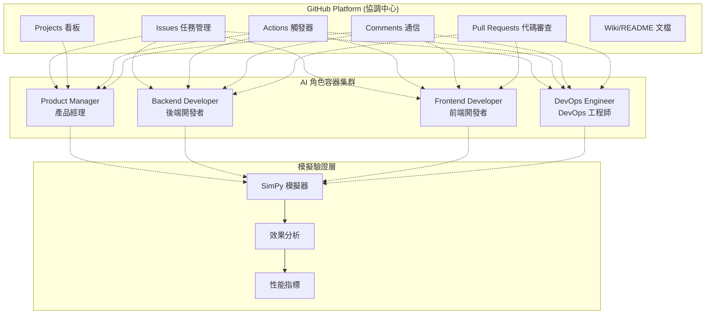
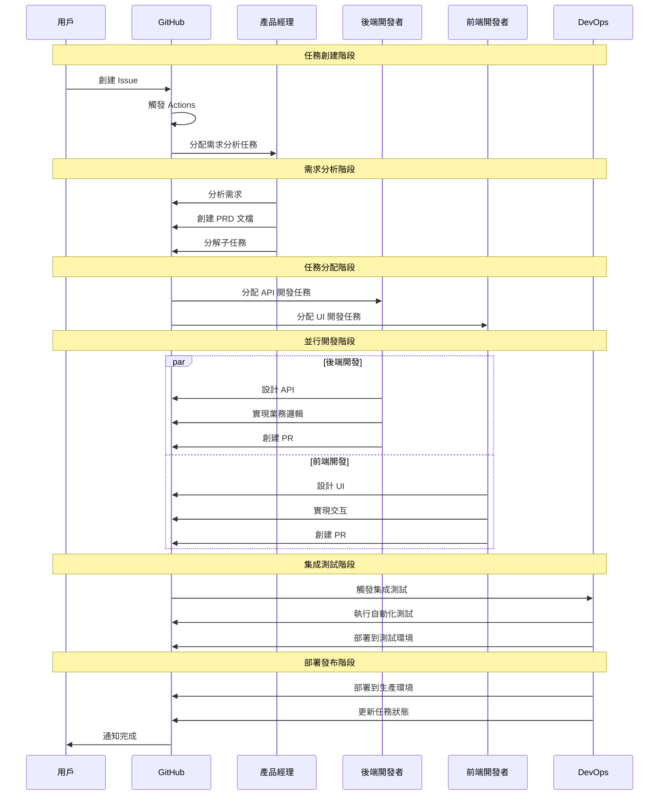

# 第2.1章 GitHub-Centric 整體架構

## 本章概要

- **章節目標**：深入理解 Bee Swarm 的 GitHub-Centric 架構設計
- **主要內容**：架構概覽、組件設計、工作流程、優勢分析
- **閱讀收穫**：掌握 GitHub-Centric 架構的設計思路和實現原理

## 詳細內容

### 🏗️ 架構概覽

Bee Swarm 採用 **GitHub-Centric** 架構，完全基於 GitHub 平台的現有功能實現 AI 角色間的協調和通信，避免了複雜的中央協調器設計。

#### 核心架構圖



#### 架構分層

```
┌─────────────────────────────────────────┐
│           用戶交互層                      │
│   ┌─────────┐ ┌─────────┐ ┌─────────┐   │
│   │ Web UI  │ │ GitHub  │ │ CLI工具 │   │
│   └─────────┘ └─────────┘ └─────────┘   │
└─────────────────────────────────────────┘
┌─────────────────────────────────────────┐
│           協調調度層                      │
│   ┌─────────┐ ┌─────────┐ ┌─────────┐   │
│   │ Issues  │ │Projects │ │Actions  │   │
│   └─────────┘ └─────────┘ └─────────┘   │
└─────────────────────────────────────────┘
┌─────────────────────────────────────────┐
│           AI 角色執行層                   │
│   ┌─────────┐ ┌─────────┐ ┌─────────┐   │
│   │   PM    │ │   BE    │ │   FE    │   │
│   └─────────┘ └─────────┘ └─────────┘   │
│   ┌─────────┐ ┌─────────┐               │
│   │  DevOps │ │   ...   │               │
│   └─────────┘ └─────────┘               │
└─────────────────────────────────────────┘
┌─────────────────────────────────────────┐
│           模擬驗證層                      │
│   ┌─────────┐ ┌─────────┐ ┌─────────┐   │
│   │ SimPy   │ │效果分析 │ │性能指標 │   │
│   └─────────┘ └─────────┘ └─────────┘   │
└─────────────────────────────────────────┘
```

### 🔧 核心組件設計

#### 1. GitHub 協調中心

**Issues 任務管理**
```
功能：
├── 需求收集和任務創建
├── 任務狀態跟踪和更新
├── 優先級和標籤管理
└── 角色分配和責任劃分

特點：
├── 自然的任務分解結構
├── 完整的歷史記錄
├── 靈活的標籤系統
└── 強大的搜索功能
```

**Projects 看板管理**
```
功能：
├── 可視化工作流程
├── 任務進度追蹤
├── 負載均衡管理
└── 里程碑規劃

特點：
├── 拖拽式操作界面
├── 自定義工作流狀態
├── 多維度數據視圖
└── 自動化規則配置
```

**Actions 觸發器**
```
功能：
├── 定時任務掃描 (每30分鐘)
├── 事件驅動響應
├── 自動化工作流執行
└── 錯誤處理和重試

特點：
├── 豐富的觸發條件
├── 並發執行控制
├── 日誌記錄和監控
└── 第三方服務集成
```

#### 2. AI 角色容器

**容器架構設計**
```
基礎映像：fallrising/novnc_llm_cli:latest
├── VNC 遠程桌面環境
├── 預裝 AI 工具集
├── 開發環境配置
└── 角色特定工具

運行時環境：
├── 獨立的網絡命名空間
├── 資源限制和隔離
├── 持久化數據存儲
└── 健康檢查機制
```

**角色專業化配置**
```
產品經理容器：
├── Claude Code (主要工具)
├── 項目管理工具
├── 文檔編輯工具
└── 協作分析工具

開發者容器：
├── Gemini CLI (主要工具)
├── 編程語言環境
├── 版本控制工具
└── 調試分析工具

DevOps 容器：
├── 部署自動化工具
├── 監控和日誌工具
├── 容器編排工具
└── 雲服務 CLI 工具
```

#### 3. 模擬驗證層

**SimPy 模擬引擎**
```python
class BeeSwarmSimulator:
    def __init__(self):
        self.env = simpy.Environment()
        self.roles = self.create_roles()
        self.metrics = MetricsCollector()
    
    def create_roles(self):
        return {
            'product_manager': ProductManagerAgent(self.env),
            'backend_developer': BackendDeveloperAgent(self.env),
            'frontend_developer': FrontendDeveloperAgent(self.env),
            'devops_engineer': DevOpsEngineerAgent(self.env)
        }
    
    def run_collaboration_scenario(self, scenario):
        """運行協作場景模擬"""
        # 創建初始任務
        issue = self.create_issue(scenario)
        
        # 啟動角色協作流程
        self.env.process(self.collaboration_workflow(issue))
        
        # 運行模擬
        self.env.run(until=scenario.duration)
        
        # 收集結果
        return self.metrics.get_results()
```

### 🔄 工作流程設計

#### 任務生命週期



#### 異步協作機制

**狀態同步設計**
```
狀態存儲：
├── Issue State (GitHub Issues)
├── Project State (GitHub Projects) 
├── Code State (Git Repository)
└── Deploy State (GitHub Pages/Actions)

同步觸發：
├── 定時掃描 (30分鐘間隔)
├── Webhook 事件響應
├── 手動觸發機制
└── 緊急處理通道

衝突解決：
├── 時間戳優先原則
├── 角色權限級別
├── 任務依賴關係
└── 人工仲裁機制
```

### 🚀 架構優勢分析

#### 相比傳統架構的優勢

| 方面 | 傳統中央協調器架構 | GitHub-Centric 架構 |
|------|-------------------|---------------------|
| **複雜度** | 高 - 需要設計複雜的協調邏輯 | 低 - 利用 GitHub 現有功能 |
| **可靠性** | 中 - 協調器是單點故障 | 高 - GitHub 平台穩定性 |
| **透明度** | 低 - 內部狀態不可見 | 高 - 所有過程公開透明 |
| **維護成本** | 高 - 需要專門團隊維護 | 低 - 利用 GitHub 維護 |
| **擴展性** | 中 - 受協調器性能限制 | 高 - GitHub 平台擴展性 |
| **學習成本** | 高 - 需要理解複雜邏輯 | 低 - 基於熟悉的 GitHub |

#### GitHub-Centric 的具體優勢

**1. 透明度優勢**
```
完全透明：
├── 所有協調過程在 GitHub 上可見
├── 決策過程有完整記錄和討論
├── 任務狀態變化有清晰軌跡
└── 代碼變更有完整的審查歷史

易於調試：
├── 問題定位通過 GitHub 歷史
├── 錯誤復現通過事件時間線
├── 性能分析通過 Actions 日誌
└── 協作問題分析通過 Comments
```

**2. 成本優勢**
```
開發成本：
├── 無需開發複雜的協調器
├── 無需設計自定義通信協議
├── 無需實現狀態管理系統
└── 無需構建監控和告警系統

運維成本：
├── 無需維護協調器服務
├── 無需管理複雜的部署
├── 無需專門的運維團隊
└── 依託 GitHub 的可靠性
```

**3. 生態優勢**
```
工具集成：
├── 豐富的 GitHub Apps 生態
├── 成熟的 CI/CD 工具鏈
├── 強大的 API 和 Webhook
└── 活躍的開發者社區

擴展能力：
├── 易於集成第三方服務
├── 支持自定義工作流
├── 靈活的權限管理
└── 強大的搜索和分析
```

### 🔧 技術實現細節

#### GitHub Actions 配置

```yaml
# .github/workflows/ai-collaboration.yml
name: AI Collaboration Trigger

on:
  schedule:
    - cron: '*/30 * * * *'  # 每30分鐘觸發
  issues:
    types: [opened, assigned, labeled, closed]
  pull_request:
    types: [opened, synchronize, closed]

jobs:
  trigger-collaboration:
    runs-on: ubuntu-latest
    steps:
      - name: Checkout code
        uses: actions/checkout@v3
      
      - name: Setup environment
        run: |
          echo "GITHUB_TOKEN=${{ secrets.GITHUB_TOKEN }}" >> $GITHUB_ENV
          echo "WEBHOOK_URL=${{ secrets.WEBHOOK_URL }}" >> $GITHUB_ENV
      
      - name: Scan for pending tasks
        run: |
          # 掃描待處理的 Issues
          curl -H "Authorization: token $GITHUB_TOKEN" \
               -H "Accept: application/vnd.github.v3+json" \
               https://api.github.com/repos/${{ github.repository }}/issues?state=open
      
      - name: Trigger AI roles
        run: |
          # 根據 Issue 標籤觸發對應的 AI 角色
          ./scripts/trigger-ai-roles.sh
```

#### API 調用控制

```python
class GitHubAPIManager:
    def __init__(self, token, rate_limit=4000):
        self.token = token
        self.rate_limit = rate_limit
        self.call_count = 0
        self.reset_time = time.time() + 3600
    
    def api_call(self, endpoint, method='GET', data=None):
        """控制 API 調用頻率"""
        if self.call_count >= self.rate_limit:
            wait_time = self.reset_time - time.time()
            if wait_time > 0:
                time.sleep(wait_time)
            self.reset_call_count()
        
        response = self._make_request(endpoint, method, data)
        self.call_count += 1
        return response
    
    def _make_request(self, endpoint, method, data):
        headers = {
            'Authorization': f'token {self.token}',
            'Accept': 'application/vnd.github.v3+json'
        }
        
        if method == 'GET':
            return requests.get(endpoint, headers=headers)
        elif method == 'POST':
            return requests.post(endpoint, json=data, headers=headers)
        # ... 其他 HTTP 方法
```

## 實踐指南

### 架構部署步驟

1. **GitHub 倉庫準備**
   ```bash
   # 創建項目倉庫
   git clone https://github.com/your-org/bee-swarm.git
   cd bee-swarm
   
   # 配置 GitHub Actions
   mkdir -p .github/workflows
   cp templates/ai-collaboration.yml .github/workflows/
   ```

2. **容器環境部署**
   ```bash
   # 編譯 AI 角色容器
   ./scripts/role-management.sh build --core-only
   
   # 啟動容器集群
   ./scripts/role-management.sh start --core-only
   ```

3. **配置驗證**
   ```bash
   # 驗證 GitHub API 連接
   curl -H "Authorization: token $GITHUB_TOKEN" \
        https://api.github.com/rate_limit
   
   # 驗證容器狀態
   ./scripts/role-management.sh status
   ```

### 架構監控指標

```python
# 關鍵指標監控
ARCHITECTURE_METRICS = {
    'api_usage': {
        'github_api_calls_per_hour': 'count',
        'api_rate_limit_remaining': 'gauge',
        'api_response_time': 'histogram'
    },
    'container_health': {
        'container_uptime': 'gauge',
        'container_memory_usage': 'gauge',
        'container_cpu_usage': 'gauge'
    },
    'collaboration_efficiency': {
        'task_completion_time': 'histogram',
        'role_response_time': 'histogram',
        'error_rate': 'counter'
    }
}
```

## 本章小結

### 關鍵要點總結
1. **GitHub-Centric 架構利用 GitHub 現有功能**，避免了複雜的中央協調器設計
2. **分層架構設計清晰**，包括用戶交互層、協調調度層、AI執行層、模擬驗證層
3. **異步協作機制**通過 GitHub 狀態同步，支持 AI 角色的獨立工作
4. **相比傳統架構具有顯著優勢**，包括透明度、成本、生態等方面
5. **技術實現基於標準工具**，降低了學習成本和維護複雜度

### 與其他章節的關聯
- **前置章節**：[核心理念](../01-項目背景/核心理念.md) - 架構設計的理念基礎
- **下一章**：[AI角色設計](AI角色設計.md) - 架構中的角色組件設計
- **實踐章節**：[容器部署](../07-部署運維/容器部署.md) - 架構的具體部署實現

### 下一步建議
1. 深入理解 GitHub 平台的各項功能
2. 學習 AI 角色系統的設計原理  
3. 通過實際部署體驗架構優勢

## 參考資料

- [GitHub API 文檔](https://docs.github.com/en/rest)
- [GitHub Actions 指南](https://docs.github.com/en/actions)
- [Docker 容器架構最佳實踐](#)
- [微服務架構設計模式](#)

---

*本章詳細介紹了 Bee Swarm 的 GitHub-Centric 整體架構，展示了如何通過簡化設計實現高效的 AI 角色協作。* 