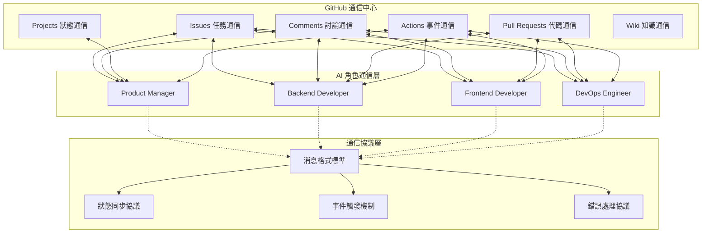
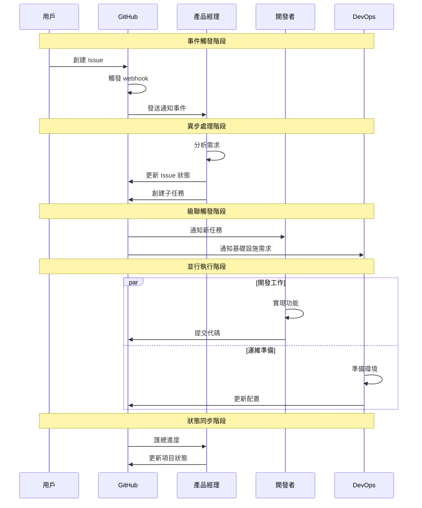

# 第2.3章 通信與協調機制

## 本章概要

- **章節目標**：深入理解 Bee Swarm 的通信協調機制設計
- **主要內容**：GitHub-Centric 通信、異步協調模式、狀態管理、衝突解決
- **閱讀收穫**：掌握 AI 角色間的通信協議和協調策略

## 詳細內容

### 📡 GitHub-Centric 通信機制

#### 通信架構概覽



#### GitHub 功能映射

**功能對應關係**
```
Issues：
├── 任務創建和分配 → 工作項管理
├── 需求討論和澄清 → 業務溝通
├── 進度跟踪和更新 → 狀態管理
└── 問題報告和解決 → 異常處理

Comments：
├── 實時討論和協商 → 同步通信
├── 決策記錄和說明 → 知識管理
├── 代碼審查意見 → 質量控制
└── 技術方案討論 → 架構設計

Pull Requests：
├── 代碼變更提案 → 版本控制
├── 代碼審查流程 → 質量保證
├── 集成測試觸發 → 自動化流程
└── 部署準備檢查 → 發布管理

Projects：
├── 工作流可視化 → 項目管理
├── 任務狀態追蹤 → 進度監控
├── 資源分配管理 → 負載均衡
└── 里程碑規劃 → 時間管理
```

### 🔄 異步協調模式

#### 協調模式設計

**事件驅動協調**


**時間窗口協調**
```python
class TimeWindowCoordinator:
    def __init__(self, window_size=30):  # 30分鐘窗口
        self.window_size = window_size
        self.active_window = None
        self.pending_actions = []
    
    def schedule_action(self, action, priority=1):
        """調度行動到時間窗口"""
        if not self.active_window:
            self.active_window = TimeWindow(
                start=datetime.now(),
                duration=self.window_size
            )
        
        self.active_window.add_action(action, priority)
    
    def execute_window(self):
        """執行當前時間窗口的所有行動"""
        if not self.active_window:
            return
        
        # 按優先級排序執行
        sorted_actions = sorted(
            self.active_window.actions,
            key=lambda x: x.priority,
            reverse=True
        )
        
        results = []
        for action in sorted_actions:
            try:
                result = action.execute()
                results.append(result)
            except Exception as e:
                self.handle_action_error(action, e)
        
        self.active_window = None
        return results
```

#### 狀態一致性保證

**狀態同步機制**
```python
class StateSync:
    def __init__(self, github_client):
        self.github = github_client
        self.state_cache = {}
        self.sync_interval = 300  # 5分鐘
    
    def sync_issue_state(self, issue_id):
        """同步 Issue 狀態"""
        # 從 GitHub 獲取最新狀態
        latest_state = self.github.get_issue(issue_id)
        
        # 檢查本地緩存
        cached_state = self.state_cache.get(issue_id)
        
        if not cached_state or latest_state.updated_at > cached_state.updated_at:
            # 更新本地狀態
            self.state_cache[issue_id] = latest_state
            
            # 通知相關角色
            self.notify_state_change(issue_id, latest_state)
            
        return latest_state
    
    def notify_state_change(self, issue_id, state):
        """通知狀態變更"""
        # 識別相關角色
        assignees = state.assignees
        labels = [label.name for label in state.labels]
        
        # 發送通知
        for assignee in assignees:
            role = self.get_role_by_assignee(assignee)
            if role:
                role.handle_state_change(issue_id, state)
```

### 📋 消息格式與協議

#### 標準化消息格式

**Issue 消息模板**
```markdown
## 🎯 任務信息
- **任務ID**: #{issue_number}
- **任務類型**: Feature/Bug/Enhancement/Research
- **優先級**: Critical/High/Medium/Low
- **預估工期**: X 天
- **截止日期**: YYYY-MM-DD

## 📋 任務描述
### 背景說明
簡要描述任務的業務背景和必要性...

### 功能需求
詳細描述需要實現的功能...

### 技術需求
列出技術實現的具體要求...

## ✅ 驗收標準
- [ ] 功能標準1
- [ ] 功能標準2  
- [ ] 性能標準1
- [ ] 質量標準1

## 🔗 相關資源
- [設計文檔](link)
- [API 規範](link)
- [測試計劃](link)

## 👥 角色分工
- **產品經理**: @pm - 需求澄清和驗收
- **後端開發**: @backend - API 實現
- **前端開發**: @frontend - 界面實現
- **DevOps**: @devops - 部署配置

## 📊 進度跟踪
- [ ] 需求分析 (PM)
- [ ] 技術設計 (DEV)
- [ ] 開發實現 (DEV) 
- [ ] 測試驗證 (QA)
- [ ] 部署上線 (DevOps)
```

**Comment 通信協議**
```markdown
## 角色通信格式

### 狀態更新
```json
{
  "type": "status_update",
  "role": "backend_developer",
  "task": "#123",
  "status": "in_progress",
  "progress": 65,
  "eta": "2024-12-25T15:00:00Z",
  "blockers": []
}
```

### 協作請求
```json
{
  "type": "collaboration_request", 
  "from_role": "backend_developer",
  "to_role": "frontend_developer",
  "task": "#123",
  "request_type": "api_spec_review",
  "priority": "high",
  "details": {
    "api_endpoint": "/api/v1/users",
    "specification_url": "link_to_spec"
  }
}
```

### 問題報告
```json
{
  "type": "issue_report",
  "role": "frontend_developer", 
  "task": "#123",
  "issue_type": "api_error",
  "severity": "medium",
  "description": "API 返回格式與規範不符",
  "reproduction_steps": ["step1", "step2", "step3"]
}
```
```

#### API 調用協議

**GitHub API 包裝器**
```python
class GitHubCommunicator:
    def __init__(self, token, rate_limit_strategy='adaptive'):
        self.github = Github(token)
        self.rate_limiter = RateLimiter(strategy=rate_limit_strategy)
        self.retry_config = RetryConfig(max_retries=3, backoff_factor=2)
    
    def create_issue(self, title, body, labels=None, assignees=None):
        """創建 Issue"""
        with self.rate_limiter:
            try:
                issue = self.github.get_repo().create_issue(
                    title=title,
                    body=body,
                    labels=labels or [],
                    assignees=assignees or []
                )
                return issue
            except GithubException as e:
                return self.handle_github_error(e)
    
    def add_comment(self, issue_number, comment_body):
        """添加評論"""
        with self.rate_limiter:
            issue = self.github.get_repo().get_issue(issue_number)
            return issue.create_comment(comment_body)
    
    def update_issue_status(self, issue_number, state, labels=None):
        """更新 Issue 狀態"""
        with self.rate_limiter:
            issue = self.github.get_repo().get_issue(issue_number)
            if state:
                issue.edit(state=state)
            if labels:
                issue.set_labels(*labels)
            return issue
```

### ⚡ 事件觸發機制

#### Webhook 事件處理

**事件路由系統**
```python
class EventRouter:
    def __init__(self):
        self.handlers = {}
        self.middleware = []
    
    def register_handler(self, event_type, handler):
        """註冊事件處理器"""
        if event_type not in self.handlers:
            self.handlers[event_type] = []
        self.handlers[event_type].append(handler)
    
    def handle_webhook(self, payload):
        """處理 Webhook 事件"""
        event_type = payload.get('action')
        event_data = payload.get('data', {})
        
        # 執行中間件
        for middleware in self.middleware:
            event_data = middleware.process(event_data)
        
        # 查找並執行處理器
        handlers = self.handlers.get(event_type, [])
        results = []
        
        for handler in handlers:
            try:
                result = handler.process(event_data)
                results.append(result)
            except Exception as e:
                self.log_handler_error(handler, e)
        
        return results

# 事件處理器示例
class IssueCreatedHandler:
    def __init__(self, role_dispatcher):
        self.dispatcher = role_dispatcher
    
    def process(self, event_data):
        issue = event_data['issue']
        
        # 分析 Issue 標籤確定目標角色
        target_roles = self.analyze_required_roles(issue.labels)
        
        # 分派給相應角色
        for role in target_roles:
            self.dispatcher.assign_task(role, issue)
```

#### GitHub Actions 集成

**自動化工作流觸發**
```yaml
# .github/workflows/ai-collaboration.yml
name: AI Collaboration Trigger

on:
  issues:
    types: [opened, edited, assigned, labeled]
  issue_comment:
    types: [created, edited]
  pull_request:
    types: [opened, synchronize, closed]
  schedule:
    - cron: '*/30 * * * *'

jobs:
  dispatch-to-roles:
    runs-on: ubuntu-latest
    steps:
      - name: Checkout
        uses: actions/checkout@v3
      
      - name: Parse Event
        id: parse
        run: |
          echo "event_type=${{ github.event_name }}" >> $GITHUB_OUTPUT
          echo "action=${{ github.event.action }}" >> $GITHUB_OUTPUT
      
      - name: Dispatch to Product Manager
        if: contains(github.event.issue.labels.*.name, 'needs-analysis')
        run: |
          curl -X POST ${{ secrets.PM_WEBHOOK_URL }} \
            -H "Content-Type: application/json" \
            -d '{"event": "${{ steps.parse.outputs.event_type }}", "issue": ${{ toJson(github.event.issue) }}}'
      
      - name: Dispatch to Developers
        if: contains(github.event.issue.labels.*.name, 'development')
        run: |
          # 根據標籤分派給不同開發者角色
          if [[ "${{ contains(github.event.issue.labels.*.name, 'backend') }}" == "true" ]]; then
            curl -X POST ${{ secrets.BACKEND_WEBHOOK_URL }} \
              -H "Content-Type: application/json" \
              -d '{"event": "${{ steps.parse.outputs.event_type }}", "issue": ${{ toJson(github.event.issue) }}}'
          fi
```

### 🛠️ 衝突解決機制

#### 衝突檢測

**衝突類型識別**
```python
class ConflictDetector:
    def __init__(self):
        self.conflict_rules = [
            ResourceConflictRule(),
            ScheduleConflictRule(), 
            DependencyConflictRule(),
            PriorityConflictRule()
        ]
    
    def detect_conflicts(self, task_assignments):
        """檢測任務分配中的衝突"""
        conflicts = []
        
        for rule in self.conflict_rules:
            rule_conflicts = rule.check(task_assignments)
            conflicts.extend(rule_conflicts)
        
        return self.prioritize_conflicts(conflicts)
    
    def prioritize_conflicts(self, conflicts):
        """衝突優先級排序"""
        return sorted(conflicts, key=lambda c: c.severity, reverse=True)

class ResourceConflictRule:
    def check(self, assignments):
        """檢查資源衝突"""
        conflicts = []
        resource_usage = {}
        
        for assignment in assignments:
            for resource in assignment.required_resources:
                if resource in resource_usage:
                    conflicts.append(ResourceConflict(
                        resource=resource,
                        conflicting_tasks=[resource_usage[resource], assignment],
                        severity='high'
                    ))
                else:
                    resource_usage[resource] = assignment
        
        return conflicts
```

#### 衝突解決策略

**自動解決機制**
```python
class ConflictResolver:
    def __init__(self):
        self.resolution_strategies = {
            'resource_conflict': self.resolve_resource_conflict,
            'schedule_conflict': self.resolve_schedule_conflict,
            'dependency_conflict': self.resolve_dependency_conflict,
            'priority_conflict': self.resolve_priority_conflict
        }
    
    def resolve_conflict(self, conflict):
        """解決衝突"""
        strategy = self.resolution_strategies.get(conflict.type)
        if strategy:
            return strategy(conflict)
        else:
            return self.escalate_to_human(conflict)
    
    def resolve_resource_conflict(self, conflict):
        """解決資源衝突"""
        # 策略1：時間分片
        if self.can_time_slice(conflict.resource):
            return self.create_time_slices(conflict)
        
        # 策略2：優先級調度
        if self.has_priority_difference(conflict.tasks):
            return self.reschedule_by_priority(conflict)
        
        # 策略3：尋找替代資源
        alternative = self.find_alternative_resource(conflict.resource)
        if alternative:
            return self.reassign_resource(conflict, alternative)
        
        # 策略4：延遲低優先級任務
        return self.delay_low_priority_task(conflict)
    
    def resolve_schedule_conflict(self, conflict):
        """解決時間衝突"""
        # 分析任務的靈活性
        flexibility = self.analyze_task_flexibility(conflict.tasks)
        
        # 優先調整靈活性高的任務
        flexible_task = max(flexibility.items(), key=lambda x: x[1])[0]
        new_schedule = self.reschedule_task(flexible_task)
        
        return ScheduleResolution(
            original_conflict=conflict,
            adjusted_task=flexible_task,
            new_schedule=new_schedule
        )
```

### 📊 通信效率監控

#### 通信指標收集

```python
class CommunicationMetrics:
    def __init__(self):
        self.metrics = {
            'message_count': Counter(),
            'response_time': defaultdict(list),
            'collaboration_efficiency': defaultdict(float),
            'conflict_resolution_time': defaultdict(list)
        }
    
    def track_message(self, from_role, to_role, message_type, timestamp):
        """跟踪消息發送"""
        self.metrics['message_count'][f"{from_role}->{to_role}"] += 1
        
        # 記錄消息時間戳用於計算響應時間
        message_id = f"{from_role}-{to_role}-{timestamp}"
        self.pending_responses[message_id] = timestamp
    
    def track_response(self, to_role, from_role, response_timestamp):
        """跟踪響應時間"""
        # 查找對應的原始消息
        for msg_id, sent_time in self.pending_responses.items():
            if f"{to_role}-{from_role}" in msg_id:
                response_time = response_timestamp - sent_time
                self.metrics['response_time'][f"{to_role}-{from_role}"].append(
                    response_time.total_seconds()
                )
                del self.pending_responses[msg_id]
                break
    
    def calculate_collaboration_score(self, role_pair):
        """計算協作效率評分"""
        message_key = f"{role_pair[0]}->{role_pair[1]}"
        response_key = f"{role_pair[1]}-{role_pair[0]}"
        
        # 消息數量因子
        msg_count = self.metrics['message_count'][message_key]
        msg_score = min(msg_count / 10, 1.0)  # 正規化到0-1
        
        # 響應時間因子
        response_times = self.metrics['response_time'][response_key]
        if response_times:
            avg_response = sum(response_times) / len(response_times)
            # 響應時間越短分數越高（以1小時為基準）
            time_score = max(0, 1 - avg_response / 3600)
        else:
            time_score = 0
        
        # 綜合評分
        collaboration_score = (msg_score * 0.4 + time_score * 0.6)
        self.metrics['collaboration_efficiency'][message_key] = collaboration_score
        
        return collaboration_score
```

#### 性能優化建議

**通信瓶頸分析**
```python
class CommunicationAnalyzer:
    def analyze_bottlenecks(self, metrics):
        """分析通信瓶頸"""
        bottlenecks = []
        
        # 響應時間瓶頸
        for role_pair, times in metrics['response_time'].items():
            if times:
                avg_time = sum(times) / len(times)
                if avg_time > 3600:  # 超過1小時
                    bottlenecks.append({
                        'type': 'response_time',
                        'role_pair': role_pair,
                        'avg_time': avg_time,
                        'severity': 'high' if avg_time > 7200 else 'medium'
                    })
        
        # 通信頻率瓶頸
        for role_pair, count in metrics['message_count'].items():
            if count > 50:  # 消息過多可能表示協作效率低
                bottlenecks.append({
                    'type': 'high_frequency',
                    'role_pair': role_pair,
                    'message_count': count,
                    'severity': 'medium'
                })
        
        return bottlenecks
    
    def suggest_optimizations(self, bottlenecks):
        """提供優化建議"""
        suggestions = []
        
        for bottleneck in bottlenecks:
            if bottleneck['type'] == 'response_time':
                suggestions.append({
                    'target': bottleneck['role_pair'],
                    'action': 'reduce_response_time',
                    'methods': [
                        '調整檢查頻率',
                        '優化任務優先級',
                        '增加自動化程度'
                    ]
                })
            elif bottleneck['type'] == 'high_frequency':
                suggestions.append({
                    'target': bottleneck['role_pair'],
                    'action': 'reduce_communication_overhead',
                    'methods': [
                        '批量處理消息',
                        '改進協作流程',
                        '使用更高效的協作模式'
                    ]
                })
        
        return suggestions
```

## 實踐指南

### 通信協議實施

1. **配置 Webhook 端點**
   ```python
   # webhook_handler.py
   from flask import Flask, request, jsonify
   
   app = Flask(__name__)
   
   @app.route('/webhook/github', methods=['POST'])
   def handle_github_webhook():
       payload = request.get_json()
       event_type = request.headers.get('X-GitHub-Event')
       
       # 路由到相應處理器
       router = EventRouter()
       results = router.handle_webhook({
           'type': event_type,
           'data': payload
       })
       
       return jsonify({'status': 'processed', 'results': len(results)})
   ```

2. **實現角色通信接口**
   ```python
   class RoleCommunicationInterface:
       def __init__(self, role_id, github_client):
           self.role_id = role_id
           self.github = github_client
           self.message_queue = MessageQueue()
       
       def send_message(self, target_role, message_type, content):
           """發送消息給其他角色"""
           message = self.format_message(target_role, message_type, content)
           return self.github.add_comment(message['issue_id'], message['body'])
       
       def process_incoming_messages(self):
           """處理接收到的消息"""
           messages = self.message_queue.get_pending_messages()
           for message in messages:
               self.handle_message(message)
   ```

### 監控儀表板設置

```python
# monitoring_dashboard.py
class CommunicationDashboard:
    def __init__(self, metrics_collector):
        self.metrics = metrics_collector
        self.dashboard = self.create_dashboard()
    
    def create_dashboard(self):
        """創建監控儀表板"""
        dashboard = {
            'real_time_metrics': self.create_realtime_panel(),
            'historical_trends': self.create_trends_panel(),
            'bottleneck_analysis': self.create_bottleneck_panel(),
            'optimization_suggestions': self.create_suggestions_panel()
        }
        return dashboard
    
    def update_dashboard(self):
        """更新儀表板數據"""
        current_metrics = self.metrics.get_current_metrics()
        self.dashboard['real_time_metrics'].update(current_metrics)
        
        # 生成趨勢圖
        trend_data = self.metrics.get_historical_data(days=7)
        self.dashboard['historical_trends'].update(trend_data)
        
        # 分析瓶頸
        analyzer = CommunicationAnalyzer()
        bottlenecks = analyzer.analyze_bottlenecks(current_metrics)
        suggestions = analyzer.suggest_optimizations(bottlenecks)
        
        self.dashboard['bottleneck_analysis'] = bottlenecks
        self.dashboard['optimization_suggestions'] = suggestions
```

## 本章小結

### 關鍵要點總結
1. **GitHub-Centric 通信機制**利用 GitHub 原生功能實現透明的協作通信
2. **異步協調模式**通過事件驅動和時間窗口機制實現高效協調
3. **標準化消息格式**確保角色間通信的一致性和可理解性
4. **衝突解決機制**提供自動化的衝突檢測和解決策略
5. **通信效率監控**通過指標收集和分析持續優化協作效率

### 與其他章節的關聯
- **前置章節**：[AI角色設計](AI角色設計.md) - 角色間如何進行通信
- **下一章**：[異步協作流程](../03-工作流程/異步協作流程.md) - 通信在工作流中的應用
- **實踐章節**：[配置指南](../06-使用指南/配置指南.md) - 通信機制的具體配置

### 下一步建議
1. 深入了解 GitHub API 的使用方法和限制
2. 實踐異步協調模式的設計和實現
3. 學習衝突解決策略的應用場景

## 參考資料

- [GitHub Webhooks 文檔](https://docs.github.com/en/developers/webhooks-and-events/webhooks)
- [分散式系統一致性理論](#)
- [異步協作模式研究](#)
- [事件驅動架構設計模式](#)

---

*本章深入介紹了 Bee Swarm 的通信與協調機制，展示了如何基於 GitHub 平台實現高效的異步協作。* 