# 🔮 Bee Swarm Gemini CLI Best Practices Guide

## 📋 Document Information
- **Target Audience**: Developers, AI Role Configuration Personnel
- **Prerequisites**: Basic command line, API concepts
- **Completion Time**: 45 minutes
- **Last Updated**: January 2025

## 🎯 Gemini CLI's Role in Bee Swarm

Based on Bee Swarm project's hybrid architecture design and core constraints, Gemini CLI is the primary tool for all AI roles except the Product Manager, providing the optimal balance of cost-effectiveness and functionality.

### 📋 Tool Allocation Strategy (Compliance with Constraints)
```yaml
ai_tool_allocation:
  product_manager:
    primary: "Claude Code (Claude Pro)"
    reason: "High-quality requirements analysis and strategy formulation"
    cost: "~$20/month"
    
  other_roles:
    primary: "Gemini CLI (Free Quota)"
    roles: ["backend_dev", "frontend_dev", "devops"]
    reason: "Sufficient free quota, complete functionality"
    cost: "Free"
    
  fallback_strategy:
    - "Gemini Pro API (Paid) as extension"
    - "Claude API (Specific tasks) as backup"
```

## 💰 Cost Optimization Strategy

### Free Quota Management
```bash
# Free quota monitoring script
#!/bin/bash
# scripts/monitor_gemini_usage.sh

check_gemini_quota() {
    echo "📊 Checking Gemini API quota..."
    
    # Check usage through API calls (needs implementation)
    USAGE=$(gemini --model gemini-1.5-flash --prompt "Hello" --debug | grep "quota")
    
    echo "Current usage: $USAGE"
    
    # Send alert if approaching limit
    if [[ $USAGE -gt 80 ]]; then
        echo "⚠️ Gemini quota usage > 80%, consider throttling"
        # Can create Issue alert through GitHub API
    fi
}

check_gemini_quota
```

### Model Selection Decision Tree

```mermaid
graph TD
    A[Task Type?] --> B[Simple Logic]
    A --> C[Medium Complexity]
    A --> D[High Complexity]
    
    B --> E[gemini-1.5-flash<br/>💰 Free quota]
    C --> F[gemini-1.5-flash + --all_files<br/>📊 Enhanced context]
    D --> G{Budget allows?}
    
    G -->|Yes| H[gemini-1.5-pro<br/>🧠 High precision]
    G -->|No| I[Break down tasks<br/>Use flash batch processing]
    
    style E fill:#e1f5fe
    style F fill:#e8f5e8
    style H fill:#fff3e0
    style I fill:#ffebee
```


### Cost Control Practices
```yaml
cost_optimization:
  model_selection:
    default: "gemini-1.5-flash"
    complex_tasks: "gemini-1.5-pro"
    batch_processing: "gemini-1.5-flash"
    
  parameter_optimization:
    temperature: 0.2  # Lower temperature, reduce retries
    max_tokens: 2000  # Moderate length, avoid overages
    batch_size: 10    # Batch processing optimization
    
  usage_limits:
    daily_calls: 1000   # Daily call limit
    monthly_budget: 50  # Monthly budget cap (USD)
    emergency_quota: 100 # Emergency quota
```

## 🔧 Role-Specific Configuration

### Backend Developer
```bash
# Backend Developer specific configuration
# roles/backend_developer/.gemini/settings.json
{
  "model": "gemini-1.5-flash",
  "temperature": 0.2,
  "max_tokens": 2000,
  "tools": ["read_file", "write_file", "run_shell_command"],
  "context_files": [
    "docs/02-architecture/hybrid-architecture.md",
    "CONTEXT.md"
  ],
  "coding_standards": {
    "languages": ["python", "javascript", "go"],
    "frameworks": ["fastapi", "express", "gin"],
    "databases": ["sqlite", "postgresql"]
  }
}

# Typical usage pattern
gemini \
  --model gemini-1.5-flash \
  --prompt "Implement user authentication API using FastAPI + SQLite" \
  --all_files \
  --yolo \
  --sandbox
```

### Frontend Developer
```bash
# Frontend Developer specific configuration
# roles/frontend_developer/.gemini/settings.json
{
  "model": "gemini-1.5-flash",
  "temperature": 0.2,
  "max_tokens": 2000,
  "ui_frameworks": ["react", "vue", "vanilla-js"],
  "styling": ["tailwindcss", "css-modules"],
  "build_tools": ["vite", "webpack"]
}

# Typical usage pattern
gemini \
  --model gemini-1.5-flash \
  --prompt "Create responsive navigation component using React + Tailwind CSS" \
  --all_files \
  --yolo
```

### DevOps Engineer
```bash
# DevOps Engineer specific configuration
# roles/devops_engineer/.gemini/settings.json
{
  "model": "gemini-1.5-flash",
  "temperature": 0.1,  # More conservative settings
  "max_tokens": 2000,
  "infrastructure": {
    "platform": "VPS",
    "containerization": "docker",
    "orchestration": "docker-compose",
    "monitoring": "github_actions"
  }
}

# Typical usage pattern
gemini \
  --model gemini-1.5-flash \
  --prompt "Check container health status and generate report" \
  --sandbox \
  --yolo \
  --debug_mode
```

## 🚀 Efficient Workflows

### Batch Processing Mode
```bash
#!/bin/bash
# scripts/batch_processing.sh

# Batch process multiple related tasks
batch_process_issues() {
    local issues=("$@")
    
    for issue in "${issues[@]}"; do
        echo "Processing issue: $issue"
        
        gemini \
          --model gemini-1.5-flash \
          --prompt "Analyze GitHub Issue #$issue and provide technical solution" \
          --all_files \
          --yolo \
          --output "./solutions/issue_${issue}_solution.md"
          
        # Small delay to avoid API limits
        sleep 2
    done
}

# Usage example
batch_process_issues 123 124 125
```

### Context Optimization Strategy
```bash
# Intelligent context management
optimize_context() {
    # 1. Analyze current task type
    local task_type="$1"
    
    case $task_type in
        "api_development")
            CONTEXT_FILES="--include='*.py,*.md,openapi.yaml'"
            ;;
        "ui_development")
            CONTEXT_FILES="--include='*.tsx,*.css,*.md'"
            ;;
        "deployment")
            CONTEXT_FILES="--include='*.yml,*.dockerfile,*.sh,*.md'"
            ;;
        *)
            CONTEXT_FILES="--all_files"
            ;;
    esac
    
    # 2. Execute optimized command
    gemini \
      --model gemini-1.5-flash \
      $CONTEXT_FILES \
      --prompt "$2" \
      --yolo
}

# Usage example
optimize_context "api_development" "Create user management API"
```

## 📊 Monitoring and Analysis

### Usage Tracking
```python
#!/usr/bin/env python3
# scripts/gemini_usage_tracker.py

import json
import datetime
from pathlib import Path

class GeminiUsageTracker:
    def __init__(self, log_file="logs/gemini_usage.json"):
        self.log_file = Path(log_file)
        self.log_file.parent.mkdir(exist_ok=True)
        
    def log_usage(self, role, model, tokens_used, cost=0):
        """Log Gemini usage"""
        usage_data = {
            "timestamp": datetime.datetime.now().isoformat(),
            "role": role,
            "model": model,
            "tokens_used": tokens_used,
            "cost": cost
        }
        
        # Read existing logs
        try:
            with open(self.log_file, 'r') as f:
                logs = json.load(f)
        except FileNotFoundError:
            logs = []
        
        # Add new record
        logs.append(usage_data)
        
        # Write back to file
        with open(self.log_file, 'w') as f:
            json.dump(logs, f, indent=2)
    
    def generate_report(self, days=30):
        """Generate usage report"""
        try:
            with open(self.log_file, 'r') as f:
                logs = json.load(f)
        except FileNotFoundError:
            return "No usage data found"
        
        # Analyze data
        total_calls = len(logs)
        total_tokens = sum(log['tokens_used'] for log in logs)
        total_cost = sum(log['cost'] for log in logs)
        
        role_usage = {}
        for log in logs:
            role = log['role']
            if role not in role_usage:
                role_usage[role] = {'calls': 0, 'tokens': 0, 'cost': 0}
            role_usage[role]['calls'] += 1
            role_usage[role]['tokens'] += log['tokens_used']
            role_usage[role]['cost'] += log['cost']
        
        # Generate report
        report = f"""
        📊 Gemini Usage Report (Last {days} days)
        ==========================================
        
        📈 Overall Statistics:
        - Total API calls: {total_calls}
        - Total tokens used: {total_tokens:,}
        - Total cost: ${total_cost:.2f}
        
        🤖 Usage by Role:
        """
        
        for role, stats in role_usage.items():
            report += f"""
        {role}:
          - Calls: {stats['calls']}
          - Tokens: {stats['tokens']:,}
          - Cost: ${stats['cost']:.2f}
        """
        
        return report

# Usage example
if __name__ == "__main__":
    tracker = GeminiUsageTracker()
    print(tracker.generate_report())
```

### Performance Analysis
```bash
#!/bin/bash
# scripts/analyze_performance.sh

analyze_gemini_performance() {
    echo "🔍 Analyzing Gemini CLI performance..."
    
    # Analyze response times
    RESPONSE_TIMES=$(grep "execution_time" logs/gemini_usage.json | awk '{print $2}')
    AVG_TIME=$(echo "$RESPONSE_TIMES" | awk '{sum+=$1} END {print sum/NR}')
    
    echo "📊 Performance Metrics:"
    echo "- Average response time: ${AVG_TIME}s"
    
    # Analyze success rate
    TOTAL_CALLS=$(grep "status" logs/gemini_usage.json | wc -l)
    SUCCESS_CALLS=$(grep "status.*success" logs/gemini_usage.json | wc -l)
    SUCCESS_RATE=$(echo "scale=2; $SUCCESS_CALLS * 100 / $TOTAL_CALLS" | bc)
    
    echo "- Success rate: ${SUCCESS_RATE}%"
    
    # Analyze cost efficiency
    TOTAL_COST=$(grep "cost" logs/gemini_usage.json | awk '{sum+=$2} END {print sum}')
    COST_PER_CALL=$(echo "scale=4; $TOTAL_COST / $TOTAL_CALLS" | bc)
    
    echo "- Cost per call: $${COST_PER_CALL}"
    
    # Provide optimization suggestions
    if (( $(echo "$AVG_TIME > 10" | bc -l) )); then
        echo "⚠️ Suggestion: Response time is long, consider using simpler prompts or reducing context"
    fi
    
    if (( $(echo "$SUCCESS_RATE < 90" | bc -l) )); then
        echo "⚠️ Suggestion: Success rate is low, check prompt design and error handling"
    fi
}

analyze_gemini_performance
```

## 🛡️ Security and Reliability

### API Key Security Management
```bash
# Secure API key configuration
# ~/.gemini/config.yml
security:
  api_key_source: "environment"  # Read from environment variables
  key_rotation: true             # Support key rotation
  encryption: true               # Local encrypted storage
  
rate_limiting:
  calls_per_minute: 60
  calls_per_hour: 1000
  burst_allowance: 10

error_handling:
  max_retries: 3
  backoff_strategy: "exponential"
  timeout: 30  # seconds
```

### Sandbox Security Configuration
```dockerfile
# Secure Gemini CLI execution environment
FROM python:3.11-slim

# Create non-privileged user
RUN useradd -m -u 1000 gemini_user

# Install necessary tools
RUN apt-get update && apt-get install -y \
    curl \
    git \
    jq \
    && rm -rf /var/lib/apt/lists/*

# Set working directory
WORKDIR /workspace

# Install Gemini CLI
RUN pip install google-generativeai

# Copy configuration files
COPY --chown=gemini_user:gemini_user .gemini/ /home/gemini_user/.gemini/

# Switch to non-privileged user
USER gemini_user

# Set environment variables
ENV GEMINI_SANDBOX=true
ENV GEMINI_SECURITY_MODE=strict

# Health check
HEALTHCHECK --interval=30s --timeout=10s --start-period=5s --retries=3 \
  CMD gemini --version || exit 1

CMD ["bash"]
```

## 📋 Troubleshooting Guide

### Common Issues and Solutions
```yaml
troubleshooting:
  api_key_issues:
    symptoms: ["authentication failed", "invalid key"]
    solutions:
      - "Check API key format and validity"
      - "Ensure environment variables are properly set"
      - "Check key permissions and quota"
      
  rate_limiting:
    symptoms: ["quota exceeded", "rate limit"]
    solutions:
      - "Implement exponential backoff retry"
      - "Use batch processing to reduce call frequency"
      - "Consider upgrading to paid plan"
      
  context_issues:
    symptoms: ["context too large", "token limit"]
    solutions:
      - "Reduce use of --all_files"
      - "Use more precise file filtering"
      - "Break large tasks into smaller tasks"
      
  performance_issues:
    symptoms: ["slow response", "timeout"]
    solutions:
      - "Optimize prompt length and complexity"
      - "Use faster model (flash vs pro)"
      - "Check network connection and latency"
```

### Debugging and Diagnostic Tools
```bash
#!/bin/bash
# scripts/gemini_diagnostics.sh

diagnose_gemini_issues() {
    echo "🔧 Gemini CLI Diagnostic Tool"
    echo "============================="
    
    # Check basic configuration
    echo "📋 Basic Configuration Check:"
    echo "- Gemini CLI version: $(gemini --version 2>/dev/null || echo 'Not installed')"
    echo "- API key status: $(test -n "$GEMINI_API_KEY" && echo 'Set' || echo 'Not set')"
    
    # Check network connectivity
    echo ""
    echo "🌐 Network Connectivity Check:"
    if curl -s --max-time 5 https://generativelanguage.googleapis.com > /dev/null; then
        echo "- Google AI API: ✅ Reachable"
    else
        echo "- Google AI API: ❌ Unreachable"
    fi
    
    # Check quota usage
    echo ""
    echo "📊 Quota Check:"
    # This requires actual API call to check quota
    # gemini --model gemini-1.5-flash --prompt "test" --debug 2>&1 | grep -i quota
    
    # Execute simple test
    echo ""
    echo "🧪 Functionality Test:"
    TEST_RESULT=$(gemini --model gemini-1.5-flash --prompt "Hello, respond with 'OK'" 2>&1)
    if echo "$TEST_RESULT" | grep -q "OK"; then
        echo "- Basic functionality: ✅ Normal"
    else
        echo "- Basic functionality: ❌ Abnormal"
        echo "  Error message: $TEST_RESULT"
    fi
}

diagnose_gemini_issues
```

## 📈 Best Practices Summary

### Golden Rules
1. **Cost Priority**: Always prioritize free quota, allocate paid resources wisely
2. **Batch Processing**: Process similar tasks in batches for efficiency
3. **Context Optimization**: Precisely control context size, avoid unnecessary overhead
4. **Error Handling**: Implement robust error handling and retry mechanisms
5. **Monitoring and Tracking**: Continuously monitor usage and performance metrics

### Performance Optimization Checklist
- [ ] Choose appropriate model (flash vs pro)
- [ ] Optimize prompt design and length
- [ ] Implement intelligent caching strategies
- [ ] Use batch processing mode
- [ ] Monitor and adjust temperature parameters
- [ ] Regularly analyze usage patterns and costs

### Security Checklist
- [ ] Secure API key storage
- [ ] Implement rate limiting
- [ ] Use sandbox environments
- [ ] Regular key rotation
- [ ] Monitor unusual usage
- [ ] Backup important configurations

---

*This guide ensures that the Bee Swarm system can efficiently, securely, and economically use Gemini CLI, fully unleashing the potential of AI collaboration.* 