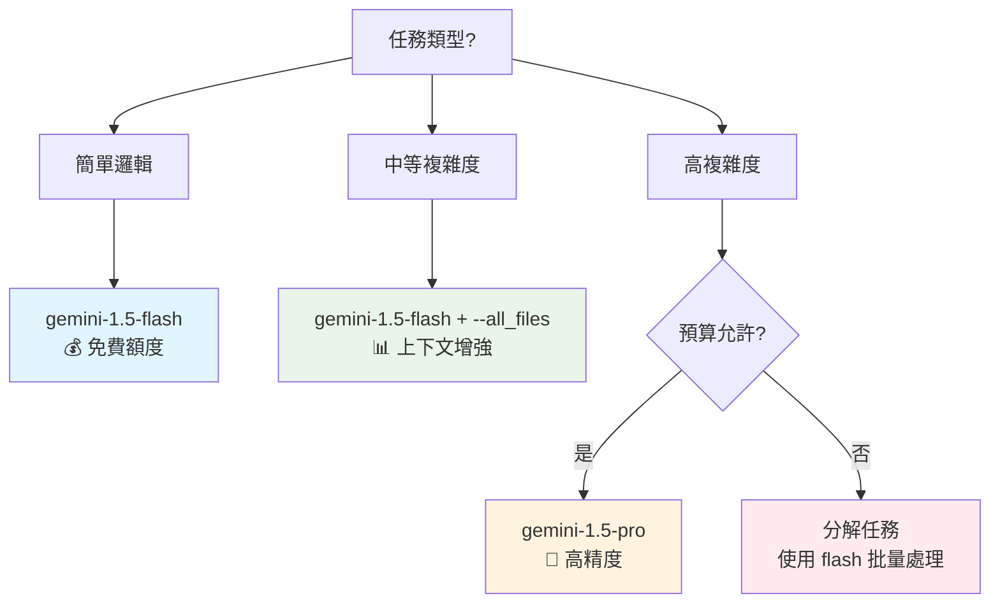

# 🔮 Bee Swarm Gemini CLI 最佳實踐指南

## 📋 文檔信息
- **目標讀者**：開發者、AI角色配置人員
- **前置知識**：基本命令行、API概念
- **完成時間**：45分鐘
- **最後更新**：2025年7月

## 🎯 Gemini CLI 在 Bee Swarm 中的角色

基於 Bee Swarm 專案的混合架構設計和核心約束，Gemini CLI 是除產品經理外所有 AI 角色的主要工具，提供成本效益和功能的最佳平衡。

### 📋 工具分配策略（符合約束）
```yaml
ai_tool_allocation:
  product_manager:
    primary: "Claude Code (Claude Pro)"
    reason: "高品質需求分析和策略制定"
    cost: "~$20/month"
    
  other_roles:
    primary: "Gemini CLI (免費額度)"
    roles: ["backend_dev", "frontend_dev", "devops"]
    reason: "免費額度充足，功能完整"
    cost: "免費"
    
  fallback_strategy:
    - "Gemini Pro API (付費) 作為擴展"
    - "Claude API (特定任務) 作為備用"
```

## 💰 成本優化策略

### 免費額度管理
```bash
# 免費額度監控腳本
#!/bin/bash
# scripts/monitor_gemini_usage.sh

check_gemini_quota() {
    echo "📊 Checking Gemini API quota..."
    
    # 通過 API 調用檢查使用量（需要實現）
    USAGE=$(gemini --model gemini-1.5-flash --prompt "Hello" --debug | grep "quota")
    
    echo "Current usage: $USAGE"
    
    # 如果接近限制，發送告警
    if [[ $USAGE -gt 80 ]]; then
        echo "⚠️ Gemini quota usage > 80%, consider throttling"
        # 可以通過 GitHub API 創建 Issue 告警
    fi
}

check_gemini_quota
```

### 模型選擇決策樹


### 成本控制實踐
```yaml
cost_optimization:
  model_selection:
    default: "gemini-1.5-flash"
    complex_tasks: "gemini-1.5-pro"
    batch_processing: "gemini-1.5-flash"
    
  parameter_optimization:
    temperature: 0.2  # 較低溫度，減少重試
    max_tokens: 2000  # 適中長度，避免超額
    batch_size: 10    # 批量處理優化
    
  usage_limits:
    daily_calls: 1000   # 每日調用限制
    monthly_budget: 50  # 月度預算上限（USD）
    emergency_quota: 100 # 緊急情況配額
```

## 🔧 角色專屬配置

### 後端開發者（Backend Developer）
```bash
# 後端開發者專用配置
# roles/backend_developer/.gemini/settings.json
{
  "model": "gemini-1.5-flash",
  "temperature": 0.2,
  "max_tokens": 2000,
  "tools": ["read_file", "write_file", "run_shell_command"],
  "context_files": [
    "docs/02-architecture/hybrid-architecture.md",
    "CONTEXT.md"
  ],
  "coding_standards": {
    "languages": ["python", "javascript", "go"],
    "frameworks": ["fastapi", "express", "gin"],
    "databases": ["sqlite", "postgresql"]
  }
}

# 典型使用模式
gemini \
  --model gemini-1.5-flash \
  --prompt "實現用戶認證 API，使用 FastAPI + SQLite" \
  --all_files \
  --yolo \
  --sandbox
```

### 前端開發者（Frontend Developer）
```bash
# 前端開發者專用配置
# roles/frontend_developer/.gemini/settings.json
{
  "model": "gemini-1.5-flash",
  "temperature": 0.2,
  "max_tokens": 2000,
  "ui_frameworks": ["react", "vue", "vanilla-js"],
  "styling": ["tailwindcss", "css-modules"],
  "build_tools": ["vite", "webpack"]
}

# 典型使用模式
gemini \
  --model gemini-1.5-flash \
  --prompt "創建響應式導航組件，使用 React + Tailwind CSS" \
  --all_files \
  --yolo
```

### DevOps 工程師（DevOps Engineer）
```bash
# DevOps 工程師專用配置
# roles/devops_engineer/.gemini/settings.json
{
  "model": "gemini-1.5-flash",
  "temperature": 0.1,  # 更保守的設置
  "max_tokens": 2000,
  "infrastructure": {
    "platform": "VPS",
    "containerization": "docker",
    "orchestration": "docker-compose",
    "monitoring": "github_actions"
  }
}

# 典型使用模式
gemini \
  --model gemini-1.5-flash \
  --prompt "檢查容器健康狀態並生成報告" \
  --sandbox \
  --yolo \
  --debug_mode
```

## 🚀 高效工作流程

### 批量處理模式
```bash
#!/bin/bash
# scripts/batch_processing.sh

# 批量處理多個相關任務
batch_process_issues() {
    local issues=("$@")
    
    for issue in "${issues[@]}"; do
        echo "Processing issue: $issue"
        
        gemini \
          --model gemini-1.5-flash \
          --prompt "分析 GitHub Issue #$issue 並提供技術方案" \
          --all_files \
          --yolo \
          --output "./solutions/issue_${issue}_solution.md"
          
        # 小延遲避免 API 限制
        sleep 2
    done
}

# 使用範例
batch_process_issues 123 124 125
```

### 上下文優化策略
```bash
# 智能上下文管理
optimize_context() {
    # 1. 分析當前任務類型
    local task_type="$1"
    
    case $task_type in
        "api_development")
            CONTEXT_FILES="--include='*.py,*.md,openapi.yaml'"
            ;;
        "ui_development")
            CONTEXT_FILES="--include='*.tsx,*.css,*.md'"
            ;;
        "deployment")
            CONTEXT_FILES="--include='*.yml,*.dockerfile,*.sh,*.md'"
            ;;
        *)
            CONTEXT_FILES="--all_files"
            ;;
    esac
    
    # 2. 執行優化的命令
    gemini \
      --model gemini-1.5-flash \
      $CONTEXT_FILES \
      --prompt "$2" \
      --yolo
}

# 使用範例
optimize_context "api_development" "創建用戶管理 API"
```

## 📊 監控與分析

### 使用量追蹤
```python
#!/usr/bin/env python3
# scripts/gemini_usage_tracker.py

import json
import datetime
from pathlib import Path

class GeminiUsageTracker:
    def __init__(self, log_file="logs/gemini_usage.json"):
        self.log_file = Path(log_file)
        self.log_file.parent.mkdir(exist_ok=True)
        
    def log_usage(self, role, model, tokens_used, cost=0):
        """記錄 Gemini 使用情況"""
        usage_data = {
            "timestamp": datetime.datetime.now().isoformat(),
            "role": role,
            "model": model,
            "tokens_used": tokens_used,
            "cost": cost
        }
        
        # 讀取現有日誌
        try:
            with open(self.log_file, 'r') as f:
                logs = json.load(f)
        except FileNotFoundError:
            logs = []
        
        # 添加新記錄
        logs.append(usage_data)
        
        # 寫回文件
        with open(self.log_file, 'w') as f:
            json.dump(logs, f, indent=2)
    
    def generate_report(self, days=30):
        """生成使用報告"""
        try:
            with open(self.log_file, 'r') as f:
                logs = json.load(f)
        except FileNotFoundError:
            return "No usage data found"
        
        # 分析數據
        total_calls = len(logs)
        total_tokens = sum(log['tokens_used'] for log in logs)
        total_cost = sum(log['cost'] for log in logs)
        
        role_usage = {}
        for log in logs:
            role = log['role']
            if role not in role_usage:
                role_usage[role] = {'calls': 0, 'tokens': 0, 'cost': 0}
            role_usage[role]['calls'] += 1
            role_usage[role]['tokens'] += log['tokens_used']
            role_usage[role]['cost'] += log['cost']
        
        # 生成報告
        report = f"""
        📊 Gemini Usage Report (Last {days} days)
        ==========================================
        
        📈 Overall Statistics:
        - Total API calls: {total_calls}
        - Total tokens used: {total_tokens:,}
        - Total cost: ${total_cost:.2f}
        
        🤖 Usage by Role:
        """
        
        for role, stats in role_usage.items():
            report += f"""
        {role}:
          - Calls: {stats['calls']}
          - Tokens: {stats['tokens']:,}
          - Cost: ${stats['cost']:.2f}
        """
        
        return report

# 使用範例
if __name__ == "__main__":
    tracker = GeminiUsageTracker()
    print(tracker.generate_report())
```

### 性能優化分析
```bash
#!/bin/bash
# scripts/analyze_performance.sh

analyze_gemini_performance() {
    echo "🔍 Analyzing Gemini CLI performance..."
    
    # 分析響應時間
    RESPONSE_TIMES=$(grep "execution_time" logs/gemini_usage.json | awk '{print $2}')
    AVG_TIME=$(echo "$RESPONSE_TIMES" | awk '{sum+=$1} END {print sum/NR}')
    
    echo "📊 Performance Metrics:"
    echo "- Average response time: ${AVG_TIME}s"
    
    # 分析成功率
    TOTAL_CALLS=$(grep "status" logs/gemini_usage.json | wc -l)
    SUCCESS_CALLS=$(grep "status.*success" logs/gemini_usage.json | wc -l)
    SUCCESS_RATE=$(echo "scale=2; $SUCCESS_CALLS * 100 / $TOTAL_CALLS" | bc)
    
    echo "- Success rate: ${SUCCESS_RATE}%"
    
    # 分析成本效益
    TOTAL_COST=$(grep "cost" logs/gemini_usage.json | awk '{sum+=$2} END {print sum}')
    COST_PER_CALL=$(echo "scale=4; $TOTAL_COST / $TOTAL_CALLS" | bc)
    
    echo "- Cost per call: $${COST_PER_CALL}"
    
    # 提供優化建議
    if (( $(echo "$AVG_TIME > 10" | bc -l) )); then
        echo "⚠️ 建議：響應時間較長，考慮使用更簡單的 prompt 或減少上下文"
    fi
    
    if (( $(echo "$SUCCESS_RATE < 90" | bc -l) )); then
        echo "⚠️ 建議：成功率較低，檢查 prompt 設計和錯誤處理"
    fi
}

analyze_gemini_performance
```

## 🛡️ 安全與可靠性

### API 密鑰安全管理
```bash
# 安全的 API 密鑰配置
# ~/.gemini/config.yml
security:
  api_key_source: "environment"  # 從環境變量讀取
  key_rotation: true             # 支持密鑰輪轉
  encryption: true               # 本地加密存儲
  
rate_limiting:
  calls_per_minute: 60
  calls_per_hour: 1000
  burst_allowance: 10

error_handling:
  max_retries: 3
  backoff_strategy: "exponential"
  timeout: 30  # 秒
```

### 沙盒安全配置
```dockerfile
# 安全的 Gemini CLI 執行環境
FROM python:3.11-slim

# 創建非特權用戶
RUN useradd -m -u 1000 gemini_user

# 安裝必要工具
RUN apt-get update && apt-get install -y \
    curl \
    git \
    jq \
    && rm -rf /var/lib/apt/lists/*

# 設置工作目錄
WORKDIR /workspace

# 安裝 Gemini CLI
RUN pip install google-generativeai

# 複製配置文件
COPY --chown=gemini_user:gemini_user .gemini/ /home/gemini_user/.gemini/

# 切換到非特權用戶
USER gemini_user

# 設置環境變量
ENV GEMINI_SANDBOX=true
ENV GEMINI_SECURITY_MODE=strict

# 健康檢查
HEALTHCHECK --interval=30s --timeout=10s --start-period=5s --retries=3 \
  CMD gemini --version || exit 1

CMD ["bash"]
```

## 📋 故障排除指南

### 常見問題解決
```yaml
troubleshooting:
  api_key_issues:
    symptoms: ["authentication failed", "invalid key"]
    solutions:
      - "檢查 API 密鑰格式和有效性"
      - "確認環境變量正確設置"
      - "檢查密鑰權限和配額"
      
  rate_limiting:
    symptoms: ["quota exceeded", "rate limit"]
    solutions:
      - "實施指數退避重試"
      - "使用批量處理減少調用頻率"
      - "考慮升級到付費計劃"
      
  context_issues:
    symptoms: ["context too large", "token limit"]
    solutions:
      - "減少 --all_files 的使用"
      - "使用更精確的文件過濾"
      - "分解大型任務為小任務"
      
  performance_issues:
    symptoms: ["slow response", "timeout"]
    solutions:
      - "優化 prompt 長度和複雜度"
      - "使用更快的模型 (flash vs pro)"
      - "檢查網絡連接和延遲"
```

### 調試和診斷工具
```bash
#!/bin/bash
# scripts/gemini_diagnostics.sh

diagnose_gemini_issues() {
    echo "🔧 Gemini CLI 診斷工具"
    echo "======================"
    
    # 檢查基本配置
    echo "📋 基本配置檢查:"
    echo "- Gemini CLI 版本: $(gemini --version 2>/dev/null || echo '未安裝')"
    echo "- API 密鑰狀態: $(test -n "$GEMINI_API_KEY" && echo '已設置' || echo '未設置')"
    
    # 檢查網絡連接
    echo ""
    echo "🌐 網絡連接檢查:"
    if curl -s --max-time 5 https://generativelanguage.googleapis.com > /dev/null; then
        echo "- Google AI API: ✅ 可達"
    else
        echo "- Google AI API: ❌ 不可達"
    fi
    
    # 檢查配額使用
    echo ""
    echo "📊 配額檢查:"
    # 這裡需要實際的 API 調用來檢查配額
    # gemini --model gemini-1.5-flash --prompt "test" --debug 2>&1 | grep -i quota
    
    # 執行簡單測試
    echo ""
    echo "🧪 功能測試:"
    TEST_RESULT=$(gemini --model gemini-1.5-flash --prompt "Hello, respond with 'OK'" 2>&1)
    if echo "$TEST_RESULT" | grep -q "OK"; then
        echo "- 基本功能: ✅ 正常"
    else
        echo "- 基本功能: ❌ 異常"
        echo "  錯誤信息: $TEST_RESULT"
    fi
}

diagnose_gemini_issues
```

## 📈 最佳實踐總結

### 黃金法則
1. **成本優先**: 始終優先使用免費額度，合理分配付費資源
2. **批量處理**: 將相似任務批量處理，提高效率
3. **上下文優化**: 精確控制上下文大小，避免不必要的開銷
4. **錯誤處理**: 實施健壯的錯誤處理和重試機制
5. **監控追蹤**: 持續監控使用情況和性能指標

### 性能優化清單
- [ ] 選擇合適的模型（flash vs pro）
- [ ] 優化 prompt 設計和長度
- [ ] 實施智能緩存策略
- [ ] 使用批量處理模式
- [ ] 監控和調整 temperature 參數
- [ ] 定期分析使用模式和成本

### 安全檢查清單
- [ ] API 密鑰安全存儲
- [ ] 實施速率限制
- [ ] 使用沙盒環境
- [ ] 定期輪轉密鑰
- [ ] 監控異常使用
- [ ] 備份重要配置

---

*本指南確保 Bee Swarm 系統能夠高效、安全、經濟地使用 Gemini CLI，充分發揮 AI 協作的潛力。* 