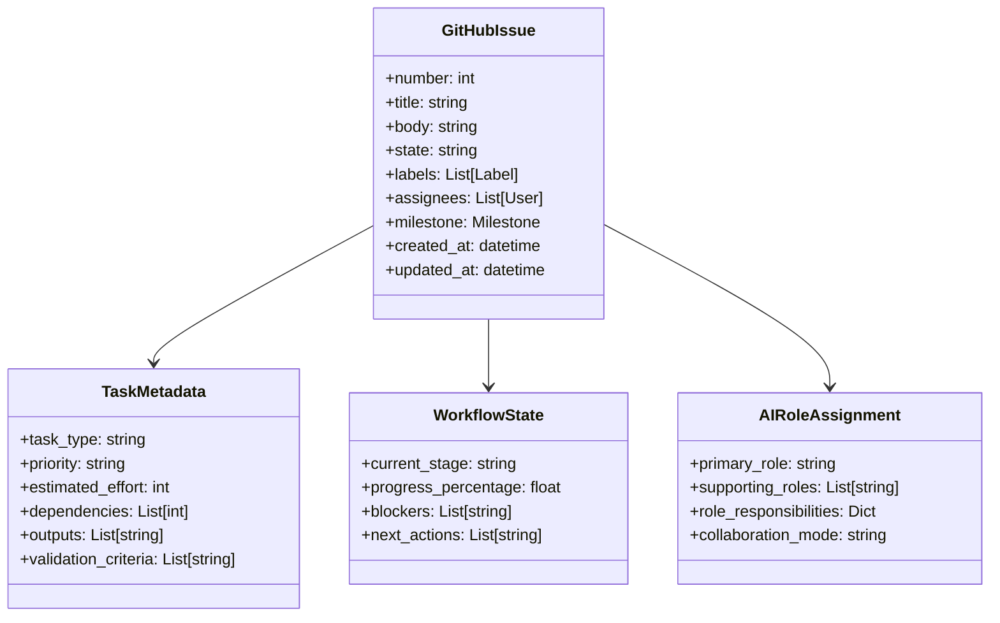

# 第3.2章 基於 GitHub 的任務管理

## 本章概要

- **章節目標**：深入理解 Bee Swarm 基於 GitHub 的任務管理機制
- **主要內容**：GitHub Issues 任務模型、任務生命週期、優先級管理、依賴處理
- **閱讀收穫**：掌握如何利用 GitHub 原生功能實現高效的任務管理

## 詳細內容

### 📋 GitHub Issues 任務模型

#### Issues 作為任務載體

**傳統任務管理 vs GitHub Issues**
```
傳統任務管理系統：
├── 專用的任務跟踪數據庫
├── 複雜的狀態管理邏輯
├── 自定義的工作流引擎
└── 獨立的權限管理系統

GitHub Issues 模型：
├── 利用 GitHub 原生 Issues
├── 基於標籤的狀態管理
├── Projects 看板可視化
└── 集成的權限和通知系統
```

**Issues 任務模型設計**


#### 標準化任務模板

**功能開發任務模板**
```markdown
---
name: Feature Development Task
about: Template for new feature development
title: '[FEATURE] '
labels: ['feature', 'needs-analysis']
assignees: []
---

## 🎯 功能概述
### 功能描述
簡要描述需要開發的功能...

### 業務價值
說明該功能的業務價值和用戶價值...

### 成功標準
- [ ] 功能標準1
- [ ] 功能標準2
- [ ] 性能標準1

## 📋 任務詳情
### 任務類型
- [ ] 新功能開發
- [ ] 功能增強
- [ ] 技術改進
- [ ] Bug修復

### 優先級
- [ ] Critical (P0) - 必須立即處理
- [ ] High (P1) - 本週內完成
- [ ] Medium (P2) - 本月內完成
- [ ] Low (P3) - 可延後處理

### 預估工期
- **總工期**: X 個工作日
- **後端開發**: X 個工作日
- **前端開發**: X 個工作日
- **測試驗證**: X 個工作日
- **部署上線**: X 個工作日

## 🔗 依賴關係
### 前置依賴
- [ ] #issue-number - 依賴任務描述
- [ ] #issue-number - 依賴任務描述

### 阻塞任務
- [ ] #issue-number - 被阻塞任務描述

## 🎯 角色分工
### 產品經理 (@pm)
- [ ] 需求分析和澄清
- [ ] 驗收標準定義
- [ ] 進度跟踪協調

### 後端開發者 (@backend)
- [ ] API 設計和實現
- [ ] 數據模型設計
- [ ] 業務邏輯開發

### 前端開發者 (@frontend)
- [ ] UI/UX 設計實現
- [ ] 前端邏輯開發
- [ ] API 集成

### DevOps 工程師 (@devops)
- [ ] 部署環境準備
- [ ] CI/CD 配置
- [ ] 監控和日誌

## 📊 驗收標準
### 功能驗收
- [ ] 功能符合PRD要求
- [ ] 用戶體驗流暢
- [ ] 邊界條件處理正確

### 技術驗收
- [ ] 代碼質量達標
- [ ] 測試覆蓋率 >80%
- [ ] 性能指標滿足要求
- [ ] 安全檢查通過

### 部署驗收
- [ ] 生產環境部署成功
- [ ] 監控指標正常
- [ ] 回滾方案準備

## 📝 相關資源
- [PRD文檔](link)
- [設計稿](link)
- [技術方案](link)
- [測試計劃](link)

## 🔄 狀態追蹤
<!-- 這部分由AI角色自動更新 -->
- **當前狀態**: 待分析
- **進度**: 0%
- **最後更新**: YYYY-MM-DD
- **下一步行動**: 產品經理進行需求分析
```

**Bug修復任務模板**
```markdown
---
name: Bug Fix Task
about: Template for bug fixes
title: '[BUG] '
labels: ['bug', 'needs-triage']
assignees: []
---

## 🐛 Bug 描述
### 問題現象
詳細描述遇到的問題...

### 期望行為
描述應該的正確行為...

### 實際行為
描述當前的錯誤行為...

## 🔍 重現步驟
1. 第一步操作
2. 第二步操作
3. 第三步操作
4. 觀察結果

## 🌐 環境信息
- **瀏覽器**: Chrome/Firefox/Safari/Edge
- **版本**: v1.2.3
- **操作系統**: Windows/Mac/Linux
- **其他相關信息**: 

## 📋 任務詳情
### 嚴重程度
- [ ] Critical - 系統無法使用
- [ ] High - 核心功能受影響
- [ ] Medium - 非核心功能問題
- [ ] Low - 輕微問題或改進

### 影響範圍
- [ ] 所有用戶
- [ ] 特定用戶群體
- [ ] 特定功能模塊
- [ ] 開發/測試環境

### 預估修復時間
- **調查時間**: X 小時
- **修復時間**: X 小時
- **測試時間**: X 小時
- **部署時間**: X 小時

## 🎯 分配策略
### 主要負責人
根據Bug類型自動分配：
- 前端問題 → @frontend
- 後端問題 → @backend
- 基礎設施問題 → @devops
- 產品邏輯問題 → @pm

### 協作角色
- **QA**: @qa - 問題復現和測試驗證
- **DevOps**: @devops - 生產環境分析

## ✅ 修復驗證
### 驗證清單
- [ ] Bug 現象消失
- [ ] 相關功能正常
- [ ] 無新增副作用
- [ ] 自動化測試通過
- [ ] 手動測試通過

### 回歸測試
- [ ] 核心功能測試
- [ ] 相關模塊測試
- [ ] 性能影響測試
```

### 🔄 任務生命週期管理

#### 任務狀態定義

**狀態標籤體系**
```python
TASK_STATES = {
    # 初始狀態
    'created': {
        'label': 'status/created',
        'color': 'e1e4e8',
        'description': '任務已創建，等待初步分析'
    },
    
    # 分析階段
    'needs-analysis': {
        'label': 'status/needs-analysis', 
        'color': 'f9c513',
        'description': '需要產品經理進行需求分析'
    },
    'analyzing': {
        'label': 'status/analyzing',
        'color': 'fbca04', 
        'description': '正在進行需求分析'
    },
    
    # 設計階段
    'needs-design': {
        'label': 'status/needs-design',
        'color': '0366d6',
        'description': '需要技術設計和方案制定'
    },
    'designing': {
        'label': 'status/designing',
        'color': '0366d6',
        'description': '正在進行技術設計'
    },
    
    # 開發階段
    'ready-for-development': {
        'label': 'status/ready-for-dev',
        'color': '28a745',
        'description': '準備開始開發'
    },
    'in-development': {
        'label': 'status/in-development', 
        'color': '28a745',
        'description': '正在開發中'
    },
    
    # 測試階段
    'needs-testing': {
        'label': 'status/needs-testing',
        'color': 'f66a0a',
        'description': '需要測試驗證'
    },
    'testing': {
        'label': 'status/testing',
        'color': 'f66a0a', 
        'description': '正在測試中'
    },
    
    # 部署階段
    'ready-for-deployment': {
        'label': 'status/ready-for-deploy',
        'color': '6f42c1',
        'description': '準備部署'
    },
    'deploying': {
        'label': 'status/deploying',
        'color': '6f42c1',
        'description': '正在部署中'
    },
    
    # 完成狀態
    'completed': {
        'label': 'status/completed',
        'color': '28a745',
        'description': '任務已完成'
    },
    
    # 阻塞狀態
    'blocked': {
        'label': 'status/blocked',
        'color': 'd93f0b',
        'description': '任務被阻塞'
    },
    'on-hold': {
        'label': 'status/on-hold',
        'color': 'ffd33d', 
        'description': '任務暫停'
    }
}
```

**狀態轉換規則**
```python
class TaskStateManager:
    def __init__(self):
        self.state_transitions = {
            'created': ['needs-analysis', 'blocked'],
            'needs-analysis': ['analyzing', 'blocked', 'on-hold'],
            'analyzing': ['needs-design', 'needs-analysis', 'blocked'],
            'needs-design': ['designing', 'blocked'],
            'designing': ['ready-for-development', 'needs-design', 'blocked'],
            'ready-for-development': ['in-development', 'blocked'],
            'in-development': ['needs-testing', 'blocked'],
            'needs-testing': ['testing', 'blocked'],
            'testing': ['ready-for-deployment', 'in-development', 'blocked'],
            'ready-for-deployment': ['deploying', 'blocked'],
            'deploying': ['completed', 'ready-for-deployment', 'blocked'],
            'blocked': ['needs-analysis', 'needs-design', 'ready-for-development'],
            'on-hold': ['needs-analysis', 'blocked']
        }
    
    def can_transition(self, current_state, target_state):
        """檢查狀態轉換是否合法"""
        allowed_transitions = self.state_transitions.get(current_state, [])
        return target_state in allowed_transitions
    
    def transition_task_state(self, issue, new_state, reason=None):
        """執行任務狀態轉換"""
        current_labels = [label.name for label in issue.labels]
        current_status = self.extract_current_status(current_labels)
        
        if not self.can_transition(current_status, new_state):
            raise InvalidStateTransition(
                f"Cannot transition from {current_status} to {new_state}"
            )
        
        # 移除舊狀態標籤
        old_status_label = f"status/{current_status}"
        if old_status_label in current_labels:
            issue.remove_from_labels(old_status_label)
        
        # 添加新狀態標籤
        new_status_label = f"status/{new_state}"
        issue.add_to_labels(new_status_label)
        
        # 記錄狀態變更
        self.log_state_transition(issue, current_status, new_state, reason)
        
        # 觸發狀態變更事件
        self.trigger_state_change_event(issue, new_state)
    
    def trigger_state_change_event(self, issue, new_state):
        """觸發狀態變更事件"""
        event_handlers = {
            'needs-analysis': self.notify_product_manager,
            'needs-design': self.notify_developers,
            'ready-for-development': self.assign_developers,
            'needs-testing': self.notify_qa_team,
            'ready-for-deployment': self.notify_devops,
            'completed': self.notify_stakeholders,
            'blocked': self.escalate_blockage
        }
        
        handler = event_handlers.get(new_state)
        if handler:
            handler(issue)
```

#### 自動化狀態管理

**基於事件的狀態更新**
```python
class AutomatedStateManager:
    def __init__(self, github_client):
        self.github = github_client
        self.event_handlers = self.setup_event_handlers()
    
    def setup_event_handlers(self):
        """設置事件處理器"""
        return {
            'issue_comment': self.handle_comment_event,
            'pull_request': self.handle_pr_event,
            'check_run': self.handle_ci_event,
            'deployment': self.handle_deployment_event
        }
    
    def handle_comment_event(self, event_data):
        """處理評論事件"""
        comment = event_data['comment']
        issue = event_data['issue']
        
        # 檢查是否為狀態更新評論
        if self.is_status_update_comment(comment):
            status_info = self.parse_status_update(comment)
            self.update_task_status(issue, status_info)
        
        # 檢查是否為AI角色響應
        if self.is_ai_role_response(comment):
            role_info = self.parse_role_response(comment)
            self.handle_role_response(issue, role_info)
    
    def handle_pr_event(self, event_data):
        """處理 Pull Request 事件"""
        pr = event_data['pull_request']
        
        # 查找相關的任務Issue
        related_issues = self.find_related_issues(pr)
        
        for issue in related_issues:
            if pr['state'] == 'open':
                self.transition_to_testing(issue)
            elif pr['state'] == 'closed' and pr['merged']:
                self.transition_to_deployment_ready(issue)
    
    def parse_status_update(self, comment):
        """解析狀態更新評論"""
        # 識別JSON格式的狀態更新
        json_pattern = r'```json\s*\n(.*?)\n```'
        match = re.search(json_pattern, comment['body'], re.DOTALL)
        
        if match:
            try:
                status_data = json.loads(match.group(1))
                return {
                    'role': status_data.get('role'),
                    'status': status_data.get('status'),
                    'progress': status_data.get('progress', 0),
                    'eta': status_data.get('eta'),
                    'blockers': status_data.get('blockers', []),
                    'outputs': status_data.get('outputs', [])
                }
            except json.JSONDecodeError:
                return None
        
        return None
```

### 🎯 優先級管理

#### 動態優先級評估

**優先級評估模型**
```python
class PriorityAssessmentEngine:
    def __init__(self):
        self.priority_factors = {
            'business_impact': 0.4,      # 業務影響度
            'user_impact': 0.3,          # 用戶影響度  
            'technical_urgency': 0.15,   # 技術緊急度
            'resource_availability': 0.1, # 資源可用性
            'dependency_pressure': 0.05  # 依賴壓力
        }
    
    def assess_task_priority(self, task_data):
        """評估任務優先級"""
        scores = {}
        
        # 業務影響度評分
        scores['business_impact'] = self.assess_business_impact(task_data)
        
        # 用戶影響度評分
        scores['user_impact'] = self.assess_user_impact(task_data)
        
        # 技術緊急度評分
        scores['technical_urgency'] = self.assess_technical_urgency(task_data)
        
        # 資源可用性評分
        scores['resource_availability'] = self.assess_resource_availability(task_data)
        
        # 依賴壓力評分
        scores['dependency_pressure'] = self.assess_dependency_pressure(task_data)
        
        # 計算加權總分
        total_score = sum(
            scores[factor] * weight 
            for factor, weight in self.priority_factors.items()
        )
        
        # 轉換為優先級等級
        priority_level = self.score_to_priority_level(total_score)
        
        return {
            'priority_level': priority_level,
            'total_score': total_score,
            'factor_scores': scores,
            'assessment_time': datetime.now()
        }
    
    def assess_business_impact(self, task_data):
        """評估業務影響度"""
        impact_indicators = {
            'revenue_impact': task_data.get('revenue_impact', 0),
            'customer_satisfaction': task_data.get('customer_satisfaction', 0),
            'competitive_advantage': task_data.get('competitive_advantage', 0),
            'regulatory_compliance': task_data.get('regulatory_compliance', 0)
        }
        
        # 加權計算業務影響度
        weights = {'revenue_impact': 0.4, 'customer_satisfaction': 0.3, 
                  'competitive_advantage': 0.2, 'regulatory_compliance': 0.1}
        
        return sum(impact_indicators[k] * weights[k] for k in weights)
    
    def score_to_priority_level(self, score):
        """將評分轉換為優先級等級"""
        if score >= 0.8:
            return 'critical'
        elif score >= 0.6:
            return 'high'
        elif score >= 0.4:
            return 'medium'
        else:
            return 'low'
```

**優先級調整機制**
```python
class DynamicPriorityManager:
    def __init__(self, priority_engine):
        self.priority_engine = priority_engine
        self.adjustment_rules = self.setup_adjustment_rules()
    
    def setup_adjustment_rules(self):
        """設置優先級調整規則"""
        return [
            DeadlineApproachingRule(),
            BlockingDependencyRule(),
            ResourceAvailabilityRule(),
            StackholderEscalationRule(),
            SeasonalFactorRule()
        ]
    
    def periodic_priority_review(self):
        """定期優先級評估"""
        # 獲取所有活躍任務
        active_tasks = self.get_active_tasks()
        
        priority_updates = []
        for task in active_tasks:
            # 重新評估優先級
            new_assessment = self.priority_engine.assess_task_priority(task)
            current_priority = self.get_current_priority(task)
            
            # 檢查是否需要調整
            if self.should_update_priority(current_priority, new_assessment):
                priority_updates.append({
                    'task': task,
                    'old_priority': current_priority,
                    'new_priority': new_assessment['priority_level'],
                    'reason': self.get_adjustment_reason(current_priority, new_assessment)
                })
        
        # 執行優先級更新
        self.apply_priority_updates(priority_updates)
        
        return priority_updates
    
    def apply_priority_updates(self, updates):
        """應用優先級更新"""
        for update in updates:
            task = update['task']
            new_priority = update['new_priority']
            reason = update['reason']
            
            # 更新GitHub Issue標籤
            self.update_priority_label(task, new_priority)
            
            # 添加優先級變更說明
            self.add_priority_change_comment(task, update, reason)
            
            # 重新排序任務隊列
            self.reorder_task_queue(task, new_priority)
            
            # 通知相關角色
            self.notify_priority_change(task, update)
```

### 🔗 依賴關係管理

#### 依賴類型定義

**依賴關係分類**
```python
DEPENDENCY_TYPES = {
    'technical': {
        'api_dependency': 'API 接口依賴',
        'data_dependency': '數據依賴',
        'infrastructure_dependency': '基礎設施依賴',
        'library_dependency': '函式庫依賴'
    },
    'business': {
        'feature_dependency': '功能依賴',
        'approval_dependency': '審批依賴',
        'resource_dependency': '資源依賴',
        'timeline_dependency': '時間依賴'
    },
    'organizational': {
        'role_dependency': '角色依賴',
        'skill_dependency': '技能依賴',
        'external_dependency': '外部依賴',
        'regulatory_dependency': '法規依賴'
    }
}
```

**依賴關係建模**
```python
class TaskDependencyManager:
    def __init__(self, github_client):
        self.github = github_client
        self.dependency_graph = nx.DiGraph()
    
    def add_dependency(self, dependent_task, prerequisite_task, dependency_type, strength='strong'):
        """添加任務依賴關係"""
        dependency = TaskDependency(
            dependent=dependent_task,
            prerequisite=prerequisite_task,
            type=dependency_type,
            strength=strength,  # strong, medium, weak
            created_at=datetime.now()
        )
        
        # 更新依賴圖
        self.dependency_graph.add_edge(
            prerequisite_task, dependent_task, 
            dependency=dependency
        )
        
        # 檢查循環依賴
        if self.has_circular_dependency():
            self.dependency_graph.remove_edge(prerequisite_task, dependent_task)
            raise CircularDependencyError(
                f"Adding dependency would create circular dependency"
            )
        
        # 更新GitHub Issue
        self.update_issue_dependencies(dependent_task, prerequisite_task)
        
        return dependency
    
    def resolve_dependency(self, prerequisite_task):
        """解決依賴關係"""
        # 獲取所有依賴此任務的任務
        dependent_tasks = list(self.dependency_graph.successors(prerequisite_task))
        
        for dependent_task in dependent_tasks:
            # 檢查是否所有前置依賴都已完成
            if self.all_prerequisites_completed(dependent_task):
                # 解除阻塞狀態
                self.unblock_task(dependent_task)
                
                # 通知相關角色
                self.notify_dependency_resolved(dependent_task, prerequisite_task)
    
    def all_prerequisites_completed(self, task):
        """檢查所有前置依賴是否完成"""
        prerequisites = list(self.dependency_graph.predecessors(task))
        
        for prerequisite in prerequisites:
            if not self.is_task_completed(prerequisite):
                return False
        
        return True
    
    def get_dependency_chain(self, task):
        """獲取依賴鏈"""
        # 獲取所有前置依賴
        predecessors = list(nx.ancestors(self.dependency_graph, task))
        
        # 獲取所有後續依賴
        successors = list(nx.descendants(self.dependency_graph, task))
        
        return {
            'prerequisites': predecessors,
            'dependents': successors,
            'depth': len(predecessors),
            'impact_scope': len(successors)
        }
```

#### 依賴衝突解決

**依賴衝突檢測**
```python
class DependencyConflictResolver:
    def __init__(self, dependency_manager):
        self.dependency_manager = dependency_manager
        self.conflict_detectors = [
            CircularDependencyDetector(),
            ResourceConflictDetector(), 
            TimelineConflictDetector(),
            CapacityConflictDetector()
        ]
    
    def detect_conflicts(self):
        """檢測依賴衝突"""
        conflicts = []
        
        for detector in self.conflict_detectors:
            detected_conflicts = detector.detect(self.dependency_manager.dependency_graph)
            conflicts.extend(detected_conflicts)
        
        return self.prioritize_conflicts(conflicts)
    
    def resolve_conflict(self, conflict):
        """解決依賴衝突"""
        resolution_strategies = {
            'circular_dependency': self.resolve_circular_dependency,
            'resource_conflict': self.resolve_resource_conflict,
            'timeline_conflict': self.resolve_timeline_conflict,
            'capacity_conflict': self.resolve_capacity_conflict
        }
        
        strategy = resolution_strategies.get(conflict.type)
        if strategy:
            return strategy(conflict)
        else:
            return self.escalate_conflict(conflict)
    
    def resolve_circular_dependency(self, conflict):
        """解決循環依賴"""
        cycle = conflict.cycle_path
        
        # 策略1：移除最弱的依賴關係
        weakest_dependency = self.find_weakest_dependency_in_cycle(cycle)
        if weakest_dependency:
            self.dependency_manager.remove_dependency(weakest_dependency)
            return CircularDependencyResolution(
                strategy='remove_weak_dependency',
                removed_dependency=weakest_dependency
            )
        
        # 策略2：分解任務
        splittable_task = self.find_splittable_task_in_cycle(cycle)
        if splittable_task:
            sub_tasks = self.split_task(splittable_task)
            return CircularDependencyResolution(
                strategy='task_splitting',
                original_task=splittable_task,
                sub_tasks=sub_tasks
            )
        
        # 策略3：重新設計依賴關係
        return self.redesign_dependencies(cycle)
```

### 📊 任務度量與分析

#### 任務性能指標

**關鍵指標定義**
```python
TASK_METRICS = {
    'throughput': {
        'tasks_completed_per_day': 'gauge',
        'story_points_completed_per_sprint': 'gauge',
        'features_delivered_per_month': 'gauge'
    },
    'cycle_time': {
        'average_task_cycle_time': 'histogram',
        'median_task_cycle_time': 'gauge',
        'cycle_time_by_priority': 'histogram'
    },
    'quality': {
        'first_time_success_rate': 'gauge',
        'rework_percentage': 'gauge',
        'defect_escape_rate': 'gauge'
    },
    'predictability': {
        'estimation_accuracy': 'gauge',
        'delivery_predictability': 'gauge',
        'scope_creep_rate': 'gauge'
    }
}
```

**任務分析引擎**
```python
class TaskAnalyticsEngine:
    def __init__(self, github_client):
        self.github = github_client
        self.metrics_collector = TaskMetricsCollector()
    
    def analyze_task_performance(self, time_period):
        """分析任務性能"""
        # 收集任務數據
        task_data = self.collect_task_data(time_period)
        
        # 計算性能指標
        performance_metrics = self.calculate_performance_metrics(task_data)
        
        # 識別趨勢和異常
        trends = self.identify_trends(performance_metrics)
        anomalies = self.detect_anomalies(performance_metrics)
        
        # 生成洞察和建議
        insights = self.generate_insights(performance_metrics, trends, anomalies)
        recommendations = self.generate_recommendations(insights)
        
        return TaskPerformanceReport(
            metrics=performance_metrics,
            trends=trends,
            anomalies=anomalies,
            insights=insights,
            recommendations=recommendations
        )
    
    def calculate_performance_metrics(self, task_data):
        """計算性能指標"""
        metrics = {}
        
        # 吞吐量指標
        metrics['throughput'] = {
            'total_completed': len(task_data['completed_tasks']),
            'avg_completion_rate': len(task_data['completed_tasks']) / len(task_data['all_tasks']),
            'completion_by_priority': self.group_by_priority(task_data['completed_tasks'])
        }
        
        # 周期時間指標
        cycle_times = [task.cycle_time for task in task_data['completed_tasks']]
        metrics['cycle_time'] = {
            'average': statistics.mean(cycle_times) if cycle_times else 0,
            'median': statistics.median(cycle_times) if cycle_times else 0,
            'p95': self.percentile(cycle_times, 95) if cycle_times else 0,
            'distribution': self.get_distribution(cycle_times)
        }
        
        # 質量指標
        metrics['quality'] = {
            'first_time_success_rate': self.calculate_first_time_success_rate(task_data),
            'rework_rate': self.calculate_rework_rate(task_data),
            'defect_rate': self.calculate_defect_rate(task_data)
        }
        
        return metrics
    
    def generate_recommendations(self, insights):
        """生成改進建議"""
        recommendations = []
        
        for insight in insights:
            if insight.type == 'high_cycle_time':
                recommendations.append({
                    'category': 'process_improvement',
                    'title': '優化任務處理流程',
                    'description': '周期時間偏高，建議優化任務分解和並行處理',
                    'actions': [
                        '細化任務分解粒度',
                        '增加並行工作機會',
                        '減少任務等待時間',
                        '改進角色間協作效率'
                    ],
                    'expected_impact': '預期可縮短周期時間 20-30%'
                })
            elif insight.type == 'low_quality':
                recommendations.append({
                    'category': 'quality_improvement',
                    'title': '提升任務質量',
                    'description': '重新工作比例較高，需要改進質量控制',
                    'actions': [
                        '增強需求分析質量',
                        '改進代碼審查流程',
                        '加強測試覆蓋',
                        '建立質量檢查點'
                    ],
                    'expected_impact': '預期可減少重工 15-25%'
                })
        
        return recommendations
```

## 實踐指南

### 任務管理實施

1. **設置GitHub Issues模板**
   ```bash
   # 創建 .github/ISSUE_TEMPLATE/ 目錄
   mkdir -p .github/ISSUE_TEMPLATE
   
   # 複製任務模板文件
   cp templates/feature-task.md .github/ISSUE_TEMPLATE/
   cp templates/bug-fix.md .github/ISSUE_TEMPLATE/
   cp templates/enhancement.md .github/ISSUE_TEMPLATE/
   ```

2. **配置標籤系統**
   ```python
   # setup_labels.py
   def setup_github_labels():
       """設置GitHub標籤系統"""
       labels_config = [
           # 狀態標籤
           {'name': 'status/created', 'color': 'e1e4e8'},
           {'name': 'status/needs-analysis', 'color': 'f9c513'},
           {'name': 'status/in-development', 'color': '28a745'},
           
           # 優先級標籤
           {'name': 'priority/critical', 'color': 'd93f0b'},
           {'name': 'priority/high', 'color': 'f66a0a'},
           {'name': 'priority/medium', 'color': 'fbca04'},
           {'name': 'priority/low', 'color': '0e8a16'},
           
           # 類型標籤
           {'name': 'type/feature', 'color': '0366d6'},
           {'name': 'type/bug', 'color': 'd93f0b'},
           {'name': 'type/enhancement', 'color': '6f42c1'},
           
           # 角色標籤
           {'name': 'role/pm', 'color': 'ff6347'},
           {'name': 'role/backend', 'color': '32cd32'},
           {'name': 'role/frontend', 'color': '4169e1'},
           {'name': 'role/devops', 'color': 'ff8c00'}
       ]
       
       for label_config in labels_config:
           create_or_update_label(label_config)
   ```

3. **自動化工作流配置**
   ```yaml
   # .github/workflows/task-management.yml
   name: Automated Task Management
   
   on:
     issues:
       types: [opened, edited, labeled, closed]
     issue_comment:
       types: [created]
   
   jobs:
     task-processing:
       runs-on: ubuntu-latest
       steps:
         - name: Process Task Event
           uses: ./.github/actions/process-task
           with:
             github-token: ${{ secrets.GITHUB_TOKEN }}
             event-type: ${{ github.event_name }}
             event-data: ${{ toJson(github.event) }}
   ```

### 監控和優化

**任務監控儀表板**
```python
# task_dashboard.py
class TaskDashboard:
    def create_dashboard(self):
        """創建任務監控儀表板"""
        dashboard_config = {
            'panels': [
                {
                    'title': '任務狀態分佈',
                    'type': 'pie_chart',
                    'query': 'task_status_distribution'
                },
                {
                    'title': '周期時間趨勢', 
                    'type': 'line_chart',
                    'query': 'cycle_time_trend'
                },
                {
                    'title': '優先級處理效率',
                    'type': 'bar_chart', 
                    'query': 'priority_efficiency'
                },
                {
                    'title': '依賴關係圖',
                    'type': 'network_graph',
                    'query': 'dependency_graph'
                }
            ]
        }
        return dashboard_config
```

## 本章小結

### 關鍵要點總結
1. **GitHub Issues 作為任務載體**，提供了完整的任務生命週期管理能力
2. **標準化任務模板**確保了任務信息的完整性和一致性
3. **自動化狀態管理**通過事件驅動實現了高效的任務狀態追蹤
4. **動態優先級管理**根據多因素評估提供了智能的優先級調整
5. **依賴關係管理**解決了複雜項目中的任務協調問題

### 與其他章節的關聯
- **前置章節**：[異步協作流程](異步協作流程.md) - 任務管理在工作流程中的位置
- **下一章**：[狀態同步](狀態同步.md) - 任務狀態的同步機制
- **實踐章節**：[GitHub最佳實踐](../06-使用指南/最佳實踐.md) - 任務管理的最佳實踐

### 下一步建議
1. 熟悉 GitHub Issues 和 Projects 的功能和操作
2. 實踐任務模板的設計和使用
3. 學習依賴關係管理和衝突解決策略

## 參考資料

- [GitHub Issues 文檔](https://docs.github.com/en/issues)
- [GitHub Projects 指南](https://docs.github.com/en/issues/planning-and-tracking-with-projects)
- [敏捷項目管理方法](#)
- [任務依賴管理理論](#)

---

*本章詳細介紹了 Bee Swarm 基於 GitHub 的任務管理機制，展示了如何利用 GitHub 原生功能實現高效的任務協調和跟踪。* 