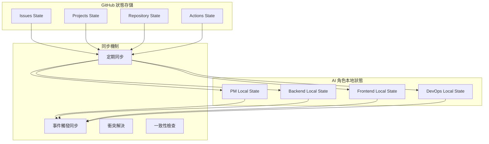

# 第3.3章 狀態同步與事件驅動

## 本章概要

- **章節目標**：理解 Bee Swarm 的狀態同步機制和事件驅動架構
- **主要內容**：狀態管理模型、同步策略、事件驅動機制、一致性保證
- **閱讀收穫**：掌握分散式 AI 角色系統的狀態同步方法

## 詳細內容

### 🔄 狀態管理模型

#### 分散式狀態架構



#### 狀態層次模型

```python
class StateHierarchy:
    """狀態層次模型"""
    
    def __init__(self):
        self.global_state = GlobalState()      # GitHub 全局狀態
        self.project_state = ProjectState()   # 項目級狀態
        self.task_state = TaskState()         # 任務級狀態
        self.role_state = RoleState()         # 角色級狀態
    
    def sync_hierarchy(self):
        """同步狀態層次"""
        # 從全局狀態同步到項目狀態
        self.project_state.sync_from_global(self.global_state)
        
        # 從項目狀態同步到任務狀態
        self.task_state.sync_from_project(self.project_state)
        
        # 從任務狀態同步到角色狀態
        self.role_state.sync_from_task(self.task_state)

class StateSnapshot:
    """狀態快照"""
    
    def __init__(self, timestamp, state_data):
        self.timestamp = timestamp
        self.state_data = state_data
        self.version = self.calculate_version()
    
    def calculate_version(self):
        """計算狀態版本"""
        return hashlib.sha256(
            json.dumps(self.state_data, sort_keys=True).encode()
        ).hexdigest()[:8]
```

### ⚡ 事件驅動同步

#### 事件類型定義

```python
EVENT_TYPES = {
    'state_change': {
        'issue_updated': 'Issue 狀態更新',
        'task_assigned': '任務分配',
        'progress_reported': '進度報告',
        'dependency_resolved': '依賴解決'
    },
    'system_events': {
        'role_online': '角色上線',
        'role_offline': '角色離線',
        'sync_failed': '同步失敗',
        'conflict_detected': '衝突檢測'
    },
    'workflow_events': {
        'phase_completed': '階段完成',
        'milestone_reached': '里程碑達成',
        'deadline_approaching': '截止日期臨近',
        'error_occurred': '錯誤發生'
    }
}
```

#### 事件處理引擎

```python
class EventDrivenSyncEngine:
    def __init__(self):
        self.event_queue = EventQueue()
        self.event_handlers = self.setup_handlers()
        self.sync_policies = self.load_sync_policies()
    
    def setup_handlers(self):
        """設置事件處理器"""
        return {
            'issue_updated': IssueUpdateHandler(),
            'task_assigned': TaskAssignmentHandler(),
            'progress_reported': ProgressReportHandler(),
            'role_status_changed': RoleStatusHandler()
        }
    
    def process_event(self, event):
        """處理事件"""
        handler = self.event_handlers.get(event.type)
        if handler:
            try:
                result = handler.handle(event)
                self.trigger_dependent_syncs(event, result)
                return result
            except Exception as e:
                self.handle_sync_error(event, e)
        else:
            self.log_unhandled_event(event)
    
    def trigger_dependent_syncs(self, original_event, result):
        """觸發依賴同步"""
        dependent_events = self.calculate_dependent_events(original_event)
        for event in dependent_events:
            self.event_queue.enqueue(event)
```

### 🔧 同步策略

#### 多層次同步策略

```python
class MultiLayerSyncStrategy:
    def __init__(self):
        self.sync_intervals = {
            'critical': 60,    # 1分鐘
            'high': 300,       # 5分鐘
            'medium': 900,     # 15分鐘
            'low': 1800        # 30分鐘
        }
    
    def determine_sync_priority(self, state_change):
        """確定同步優先級"""
        if state_change.affects_critical_path():
            return 'critical'
        elif state_change.affects_multiple_roles():
            return 'high'
        elif state_change.affects_single_task():
            return 'medium'
        else:
            return 'low'
    
    def schedule_sync(self, state_change):
        """調度同步任務"""
        priority = self.determine_sync_priority(state_change)
        interval = self.sync_intervals[priority]
        
        sync_task = SyncTask(
            state_change=state_change,
            priority=priority,
            scheduled_time=datetime.now() + timedelta(seconds=interval)
        )
        
        return self.sync_scheduler.schedule(sync_task)
```

#### 衝突解決機制

```python
class ConflictResolver:
    def __init__(self):
        self.resolution_strategies = {
            'timestamp_based': TimestampConflictResolver(),
            'role_priority': RolePriorityResolver(),
            'consensus_based': ConsensusResolver(),
            'manual_resolution': ManualResolver()
        }
    
    def resolve_conflict(self, conflict):
        """解決狀態衝突"""
        strategy_name = self.select_resolution_strategy(conflict)
        strategy = self.resolution_strategies[strategy_name]
        
        resolution = strategy.resolve(conflict)
        
        # 記錄解決過程
        self.log_conflict_resolution(conflict, resolution)
        
        # 通知相關角色
        self.notify_conflict_resolution(conflict, resolution)
        
        return resolution
    
    def select_resolution_strategy(self, conflict):
        """選擇解決策略"""
        if conflict.involves_critical_state():
            return 'manual_resolution'
        elif conflict.has_clear_timestamp_order():
            return 'timestamp_based'
        elif conflict.involves_role_hierarchy():
            return 'role_priority'
        else:
            return 'consensus_based'
```

### 📊 監控與度量

#### 同步性能指標

```python
SYNC_METRICS = {
    'performance': {
        'sync_latency': 'histogram',
        'sync_throughput': 'gauge',
        'event_processing_time': 'histogram'
    },
    'reliability': {
        'sync_success_rate': 'gauge',
        'conflict_rate': 'counter',
        'data_consistency_score': 'gauge'
    },
    'efficiency': {
        'redundant_syncs': 'counter',
        'bandwidth_usage': 'gauge',
        'api_call_efficiency': 'gauge'
    }
}

class SyncMonitor:
    def __init__(self):
        self.metrics_collector = MetricsCollector()
        self.alert_manager = AlertManager()
    
    def monitor_sync_health(self):
        """監控同步健康狀況"""
        metrics = self.collect_sync_metrics()
        
        # 檢查性能指標
        if metrics['sync_latency_p95'] > 5000:  # 5秒
            self.alert_manager.trigger_alert('high_sync_latency')
        
        # 檢查一致性
        if metrics['consistency_score'] < 0.95:
            self.alert_manager.trigger_alert('low_consistency')
        
        # 檢查錯誤率
        if metrics['sync_error_rate'] > 0.05:  # 5%
            self.alert_manager.trigger_alert('high_error_rate')
```

## 實踐指南

### 狀態同步實施

**1. 配置同步系統**
```python
# sync_config.py
SYNC_CONFIG = {
    'sync_intervals': {
        'global_sync': 1800,    # 30分鐘全局同步
        'role_sync': 300,       # 5分鐘角色同步
        'task_sync': 60         # 1分鐘任務同步
    },
    'conflict_resolution': {
        'strategy': 'timestamp_based',
        'timeout': 30,          # 30秒超時
        'max_retries': 3
    },
    'consistency_checks': {
        'enabled': True,
        'interval': 900,        # 15分鐘檢查
        'repair_mode': 'automatic'
    }
}
```

**2. 事件監聽設置**
```python
# event_listener.py
class GitHubEventListener:
    def __init__(self, webhook_url):
        self.webhook_url = webhook_url
        self.event_processor = EventProcessor()
    
    def listen_for_events(self):
        """監聽 GitHub 事件"""
        app = Flask(__name__)
        
        @app.route('/webhook', methods=['POST'])
        def handle_webhook():
            event_data = request.get_json()
            event_type = request.headers.get('X-GitHub-Event')
            
            event = Event(
                type=event_type,
                data=event_data,
                timestamp=datetime.now()
            )
            
            self.event_processor.process(event)
            return {'status': 'processed'}
        
        app.run(host='0.0.0.0', port=5000)
```

### 故障排除

**常見同步問題**
```python
SYNC_TROUBLESHOOTING = {
    'sync_lag': {
        'symptoms': ['狀態更新延遲', '數據不一致'],
        'solutions': [
            '檢查網絡連接',
            '調整同步頻率',
            '優化事件處理邏輯'
        ]
    },
    'conflict_loops': {
        'symptoms': ['重複衝突', '無法收斂'],
        'solutions': [
            '檢查衝突解決邏輯',
            '調整角色優先級',
            '引入手動仲裁'
        ]
    },
    'data_corruption': {
        'symptoms': ['狀態不匹配', '數據丟失'],
        'solutions': [
            '執行一致性檢查',
            '從備份恢復',
            '重新初始化狀態'
        ]
    }
}
```

## 本章小結

### 關鍵要點總結
1. **分散式狀態管理**通過層次化模型確保狀態的有序管理
2. **事件驅動同步**提供了高效的狀態更新機制
3. **多層次同步策略**平衡了實時性和系統穩定性
4. **衝突解決機制**保證了狀態的最終一致性
5. **監控體系**確保同步系統的健康運行

### 與其他章節的關聯
- **前置章節**：[任務管理](任務管理.md) - 狀態同步的數據來源
- **下一章**：[角色概覽](../04-角色定義/角色概覽.md) - 狀態同步在角色協作中的應用
- **實踐章節**：[監控指南](../06-使用指南/監控指南.md) - 狀態同步的監控實踐

### 下一步建議
1. 深入理解分散式系統的一致性理論
2. 實踐事件驅動架構的設計和實現
3. 學習狀態同步的監控和調優方法

## 參考資料

- [分散式系統一致性理論](#)
- [事件驅動架構設計](#)
- [狀態管理最佳實踐](#)
- [GitHub Webhooks 文檔](https://docs.github.com/en/developers/webhooks-and-events/webhooks)

---

*本章介紹了 Bee Swarm 的狀態同步與事件驅動機制，展示了如何在分散式 AI 角色系統中維護狀態一致性。* 