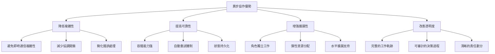
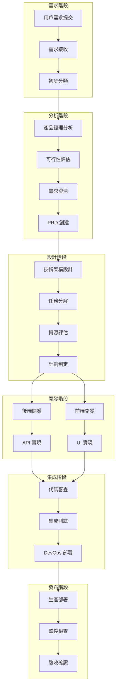

# 第3.1章 異步協作流程設計

## 本章概要

- **章節目標**：深入理解 Bee Swarm 的異步協作流程設計原理
- **主要內容**：異步協作模型、工作流程設計、時序管理、效率優化
- **閱讀收穫**：掌握 AI 角色異步協作的工作流程和時序控制

## 詳細內容

### 🔄 異步協作模型

#### 異步協作的核心概念

**傳統同步 vs 異步協作**
```
同步協作模式：
├── 實時通信和決策
├── 即時響應和反饋
├── 複雜的協調機制
└── 高耦合的依賴關係

異步協作模式：
├── 時間解耦的工作流
├── 狀態驅動的協調
├── 消息隊列通信
└── 獨立的工作單元
```

**異步協作的優勢**


#### 異步協作的設計原則

**1. 時間解耦原則**
```
設計要求：
├── 任務不依賴即時響應
├── 工作可以分時段完成
├── 支持延遲處理機制
└── 狀態變化持久化記錄

實現方式：
├── 基於事件的觸發機制
├── 時間窗口協調模式
├── 消息隊列緩衝處理
└── 定時掃描和執行
```

**2. 狀態驅動原則**
```
狀態類型：
├── 任務狀態 (pending, in_progress, completed)
├── 角色狀態 (available, busy, offline)
├── 項目狀態 (planning, development, testing)
└── 系統狀態 (normal, degraded, maintenance)

狀態轉換：
├── 明確的狀態轉換規則
├── 狀態變化的觸發條件
├── 狀態一致性保證機制
└── 異常狀態的恢復策略
```

**3. 獨立工作單元原則**
```
工作單元特性：
├── 原子性：不可分割的工作單位
├── 獨立性：不依賴其他角色的即時狀態
├── 冪等性：重複執行不產生副作用
└── 可重試性：失敗後可以安全重試

設計指導：
├── 明確的輸入和輸出定義
├── 完整的上下文信息
├── 清晰的成功失敗標準
└── 標準化的結果格式
```

### 🏗️ 工作流程設計

#### 總體工作流程架構



#### 詳細工作流程定義

**階段1：需求收集與分析**
```python
class RequirementWorkflow:
    def __init__(self):
        self.stages = [
            'requirement_submission',
            'initial_analysis', 
            'feasibility_study',
            'requirement_refinement',
            'prd_creation'
        ]
    
    def process_requirement(self, issue):
        """處理需求工作流"""
        workflow_context = {
            'issue': issue,
            'current_stage': 'requirement_submission',
            'assigned_pm': None,
            'analysis_result': None,
            'prd_document': None
        }
        
        # 階段1：需求提交
        self.handle_requirement_submission(workflow_context)
        
        # 階段2：分配產品經理
        self.assign_product_manager(workflow_context)
        
        # 階段3：需求分析
        self.conduct_requirement_analysis(workflow_context)
        
        return workflow_context
    
    def handle_requirement_submission(self, context):
        """處理需求提交"""
        issue = context['issue']
        
        # 自動分類和標籤
        labels = self.classify_requirement(issue)
        self.add_labels_to_issue(issue, labels)
        
        # 優先級評估
        priority = self.assess_priority(issue)
        self.set_issue_priority(issue, priority)
        
        # 更新上下文
        context['labels'] = labels
        context['priority'] = priority
        context['current_stage'] = 'initial_analysis'
```

**階段2：技術設計與規劃**
```python
class DesignWorkflow:
    def process_design_phase(self, prd_context):
        """處理設計階段工作流"""
        design_context = {
            'prd': prd_context['prd_document'],
            'architecture_design': None,
            'api_specification': None,
            'ui_mockups': None,
            'deployment_plan': None
        }
        
        # 並行執行技術設計
        design_tasks = [
            self.create_architecture_design_task(design_context),
            self.create_api_design_task(design_context),
            self.create_ui_design_task(design_context),
            self.create_deployment_design_task(design_context)
        ]
        
        # 等待所有設計任務完成
        completed_designs = self.wait_for_design_completion(design_tasks)
        
        # 設計評審
        review_result = self.conduct_design_review(completed_designs)
        
        return design_context
    
    def create_architecture_design_task(self, context):
        """創建架構設計任務"""
        task = {
            'type': 'architecture_design',
            'assignee': 'backend_developer',
            'input': context['prd'],
            'output_format': 'architecture_document',
            'estimated_time': timedelta(hours=4)
        }
        return self.create_github_issue(task)
```

**階段3：並行開發流程**
```python
class DevelopmentWorkflow:
    def process_development_phase(self, design_context):
        """處理開發階段工作流"""
        development_context = {
            'backend_tasks': [],
            'frontend_tasks': [],
            'devops_tasks': [],
            'integration_plan': None
        }
        
        # 基於設計創建開發任務
        backend_tasks = self.create_backend_tasks(design_context)
        frontend_tasks = self.create_frontend_tasks(design_context)
        devops_tasks = self.create_devops_tasks(design_context)
        
        # 設置任務依賴關係
        self.setup_task_dependencies(backend_tasks, frontend_tasks, devops_tasks)
        
        # 啟動並行開發
        self.start_parallel_development([
            backend_tasks, frontend_tasks, devops_tasks
        ])
        
        return development_context
    
    def setup_task_dependencies(self, backend_tasks, frontend_tasks, devops_tasks):
        """設置任務依賴關係"""
        dependency_rules = [
            # 前端 UI 開發依賴 API 規範
            ('api_specification', 'ui_implementation'),
            # 集成測試依賴前後端完成
            ('backend_implementation', 'integration_testing'),
            ('frontend_implementation', 'integration_testing'),
            # 部署依賴集成測試完成
            ('integration_testing', 'production_deployment')
        ]
        
        for dependency in dependency_rules:
            self.create_task_dependency(dependency[0], dependency[1])
```

### ⏰ 時序管理與調度

#### 時間窗口協調機制

**時間窗口設計**
```python
class TimeWindowManager:
    def __init__(self, window_size=30):  # 30分鐘窗口
        self.window_size = window_size
        self.current_window = None
        self.scheduled_actions = []
        self.execution_history = []
    
    def schedule_action(self, action, trigger_time=None, priority=1):
        """調度行動到時間窗口"""
        scheduled_action = ScheduledAction(
            action=action,
            trigger_time=trigger_time or datetime.now(),
            priority=priority,
            window_id=self.get_or_create_window(trigger_time)
        )
        
        self.scheduled_actions.append(scheduled_action)
        return scheduled_action
    
    def get_or_create_window(self, trigger_time):
        """獲取或創建時間窗口"""
        if not trigger_time:
            trigger_time = datetime.now()
        
        # 計算窗口開始時間（對齊到窗口邊界）
        window_start = self.align_to_window_boundary(trigger_time)
        window_id = f"window_{window_start.isoformat()}"
        
        if not self.current_window or self.current_window.id != window_id:
            self.current_window = TimeWindow(
                id=window_id,
                start_time=window_start,
                end_time=window_start + timedelta(minutes=self.window_size),
                actions=[]
            )
        
        return window_id
    
    def execute_current_window(self):
        """執行當前時間窗口的所有行動"""
        if not self.current_window:
            return []
        
        # 獲取當前窗口的所有行動
        window_actions = [
            action for action in self.scheduled_actions
            if action.window_id == self.current_window.id
        ]
        
        # 按優先級排序
        window_actions.sort(key=lambda x: x.priority, reverse=True)
        
        # 執行行動
        execution_results = []
        for action in window_actions:
            try:
                result = self.execute_action(action)
                execution_results.append(result)
                self.mark_action_completed(action)
            except Exception as e:
                self.handle_action_error(action, e)
        
        # 記錄執行歷史
        self.execution_history.append({
            'window': self.current_window,
            'executed_actions': len(execution_results),
            'execution_time': datetime.now(),
            'results': execution_results
        })
        
        return execution_results
```

#### 定時任務調度

**GitHub Actions 定時觸發**
```yaml
# .github/workflows/periodic-coordination.yml
name: Periodic AI Coordination

on:
  schedule:
    # 每30分鐘觸發一次主要協調
    - cron: '*/30 * * * *'
    # 每5分鐘觸發一次狀態同步
    - cron: '*/5 * * * *'
  workflow_dispatch:
    inputs:
      coordination_type:
        description: 'Type of coordination to run'
        required: true
        default: 'full'
        type: choice
        options:
        - full
        - status_sync
        - emergency

jobs:
  main-coordination:
    if: github.event.schedule == '*/30 * * * *' || github.event.inputs.coordination_type == 'full'
    runs-on: ubuntu-latest
    steps:
      - name: Trigger AI Role Coordination
        run: |
          # 觸發完整的角色協調流程
          curl -X POST ${{ secrets.COORDINATION_WEBHOOK }} \
            -H "Content-Type: application/json" \
            -d '{"type": "full_coordination", "timestamp": "'$(date -Iseconds)'"}'
  
  status-sync:
    if: github.event.schedule == '*/5 * * * *' || github.event.inputs.coordination_type == 'status_sync'
    runs-on: ubuntu-latest
    steps:
      - name: Sync Role Status
        run: |
          # 同步角色狀態
          curl -X POST ${{ secrets.STATUS_SYNC_WEBHOOK }} \
            -H "Content-Type: application/json" \
            -d '{"type": "status_sync", "timestamp": "'$(date -Iseconds)'"}'
```

**智能調度策略**
```python
class IntelligentScheduler:
    def __init__(self):
        self.role_workload = {}
        self.task_priority_queue = PriorityQueue()
        self.scheduling_history = []
    
    def schedule_task(self, task, preferred_roles=None):
        """智能任務調度"""
        # 分析任務要求
        task_requirements = self.analyze_task_requirements(task)
        
        # 評估可用角色
        available_roles = self.get_available_roles()
        
        # 計算最佳分配
        optimal_assignment = self.calculate_optimal_assignment(
            task, available_roles, preferred_roles
        )
        
        # 執行分配
        assignment_result = self.assign_task_to_role(task, optimal_assignment)
        
        # 更新調度歷史
        self.record_scheduling_decision(task, optimal_assignment, assignment_result)
        
        return assignment_result
    
    def calculate_optimal_assignment(self, task, available_roles, preferred_roles):
        """計算最佳任務分配"""
        scoring_factors = {
            'role_capability': 0.4,      # 角色能力匹配度
            'current_workload': 0.3,     # 當前工作負載
            'historical_performance': 0.2, # 歷史表現
            'availability_time': 0.1     # 可用時間
        }
        
        role_scores = {}
        for role in available_roles:
            score = 0
            
            # 能力匹配評分
            capability_score = self.evaluate_role_capability(role, task)
            score += capability_score * scoring_factors['role_capability']
            
            # 工作負載評分
            workload_score = self.evaluate_role_workload(role)
            score += workload_score * scoring_factors['current_workload']
            
            # 歷史表現評分
            performance_score = self.evaluate_role_performance(role, task.type)
            score += performance_score * scoring_factors['historical_performance']
            
            # 可用時間評分
            availability_score = self.evaluate_role_availability(role)
            score += availability_score * scoring_factors['availability_time']
            
            role_scores[role] = score
        
        # 返回得分最高的角色
        return max(role_scores.items(), key=lambda x: x[1])[0]
```

### 📊 效率優化機制

#### 工作流程效率指標

**關鍵性能指標（KPI）**
```python
WORKFLOW_EFFICIENCY_METRICS = {
    'throughput': {
        'tasks_completed_per_hour': 'gauge',
        'features_delivered_per_day': 'gauge',
        'issues_resolved_per_sprint': 'gauge'
    },
    'latency': {
        'average_task_completion_time': 'histogram',
        'requirement_to_delivery_time': 'histogram',
        'bug_fix_response_time': 'histogram'
    },
    'quality': {
        'first_time_success_rate': 'gauge',
        'rework_percentage': 'gauge',
        'defect_escape_rate': 'gauge'
    },
    'resource_utilization': {
        'role_utilization_rate': 'gauge',
        'idle_time_percentage': 'gauge',
        'parallel_work_efficiency': 'gauge'
    }
}
```

**效率瓶頸識別**
```python
class EfficiencyAnalyzer:
    def __init__(self, metrics_collector):
        self.metrics = metrics_collector
        self.bottleneck_detectors = [
            TaskQueueBottleneckDetector(),
            RoleCapacityBottleneckDetector(),
            DependencyBottleneckDetector(),
            CommunicationBottleneckDetector()
        ]
    
    def analyze_workflow_efficiency(self, time_period):
        """分析工作流程效率"""
        metrics_data = self.metrics.get_data(time_period)
        
        bottlenecks = []
        for detector in self.bottleneck_detectors:
            detected = detector.detect(metrics_data)
            bottlenecks.extend(detected)
        
        # 優先級排序
        prioritized_bottlenecks = self.prioritize_bottlenecks(bottlenecks)
        
        # 生成優化建議
        optimization_suggestions = self.generate_optimization_suggestions(
            prioritized_bottlenecks
        )
        
        return {
            'bottlenecks': prioritized_bottlenecks,
            'suggestions': optimization_suggestions,
            'efficiency_score': self.calculate_efficiency_score(metrics_data)
        }
    
    def generate_optimization_suggestions(self, bottlenecks):
        """生成優化建議"""
        suggestions = []
        
        for bottleneck in bottlenecks:
            if bottleneck.type == 'task_queue':
                suggestions.append({
                    'type': 'resource_allocation',
                    'description': '增加並行處理能力',
                    'actions': [
                        '優化任務分解粒度',
                        '增加角色實例數量',
                        '改進任務調度算法'
                    ],
                    'expected_improvement': '提升吞吐量 20-30%'
                })
            elif bottleneck.type == 'role_capacity':
                suggestions.append({
                    'type': 'workload_balancing',
                    'description': '平衡角色工作負載',
                    'actions': [
                        '重新分配任務類型',
                        '提升角色處理能力',
                        '引入負載均衡機制'
                    ],
                    'expected_improvement': '減少等待時間 15-25%'
                })
            elif bottleneck.type == 'dependency':
                suggestions.append({
                    'type': 'dependency_optimization',
                    'description': '優化任務依賴關係',
                    'actions': [
                        '減少強依賴關係',
                        '增加並行工作機會',
                        '實現漸進式交付'
                    ],
                    'expected_improvement': '縮短交付週期 10-20%'
                })
        
        return suggestions
```

#### 自動化優化機制

**自適應調度優化**
```python
class AdaptiveSchedulingOptimizer:
    def __init__(self):
        self.performance_history = []
        self.optimization_rules = []
        self.learning_rate = 0.1
    
    def optimize_scheduling_strategy(self, recent_performance):
        """優化調度策略"""
        # 分析性能趨勢
        performance_trend = self.analyze_performance_trend(recent_performance)
        
        # 識別優化機會
        optimization_opportunities = self.identify_optimization_opportunities(
            performance_trend
        )
        
        # 生成優化策略
        optimization_strategies = []
        for opportunity in optimization_opportunities:
            strategy = self.generate_optimization_strategy(opportunity)
            optimization_strategies.append(strategy)
        
        # 應用優化策略
        self.apply_optimization_strategies(optimization_strategies)
        
        return optimization_strategies
    
    def generate_optimization_strategy(self, opportunity):
        """生成優化策略"""
        if opportunity.type == 'high_latency':
            return {
                'name': 'latency_reduction',
                'adjustments': {
                    'task_batch_size': opportunity.optimal_batch_size,
                    'polling_interval': opportunity.optimal_polling_interval,
                    'priority_weights': opportunity.optimal_priority_weights
                },
                'expected_impact': opportunity.expected_latency_reduction
            }
        elif opportunity.type == 'low_throughput':
            return {
                'name': 'throughput_improvement',
                'adjustments': {
                    'parallel_execution_limit': opportunity.optimal_parallel_limit,
                    'resource_allocation': opportunity.optimal_resource_allocation,
                    'queue_processing_strategy': opportunity.optimal_queue_strategy
                },
                'expected_impact': opportunity.expected_throughput_increase
            }
        elif opportunity.type == 'resource_underutilization':
            return {
                'name': 'resource_optimization',
                'adjustments': {
                    'idle_time_threshold': opportunity.optimal_idle_threshold,
                    'task_redistribution_rules': opportunity.optimal_redistribution,
                    'capacity_scaling_rules': opportunity.optimal_scaling
                },
                'expected_impact': opportunity.expected_utilization_improvement
            }
```

#### 持續改進機制

**學習與改進循環**
```python
class ContinuousImprovementEngine:
    def __init__(self):
        self.performance_baseline = None
        self.improvement_experiments = []
        self.validated_improvements = []
    
    def run_improvement_cycle(self):
        """運行持續改進循環"""
        # 1. 收集性能數據
        current_performance = self.collect_performance_data()
        
        # 2. 與基線比較
        performance_comparison = self.compare_with_baseline(current_performance)
        
        # 3. 識別改進機會
        improvement_opportunities = self.identify_improvement_opportunities(
            performance_comparison
        )
        
        # 4. 設計改進實驗
        experiments = self.design_improvement_experiments(improvement_opportunities)
        
        # 5. 執行實驗
        experiment_results = self.execute_experiments(experiments)
        
        # 6. 評估結果
        validated_improvements = self.validate_improvements(experiment_results)
        
        # 7. 應用改進
        self.apply_validated_improvements(validated_improvements)
        
        # 8. 更新基線
        self.update_performance_baseline(current_performance)
        
        return {
            'experiments_conducted': len(experiments),
            'improvements_validated': len(validated_improvements),
            'performance_gain': self.calculate_performance_gain()
        }
    
    def design_improvement_experiments(self, opportunities):
        """設計改進實驗"""
        experiments = []
        
        for opportunity in opportunities:
            if opportunity.confidence_level > 0.7:
                # 高信心度的機會：設計 A/B 測試
                experiment = self.design_ab_test(opportunity)
            else:
                # 低信心度的機會：設計小規模試驗
                experiment = self.design_pilot_test(opportunity)
            
            experiments.append(experiment)
        
        return experiments
    
    def validate_improvements(self, experiment_results):
        """驗證改進效果"""
        validated = []
        
        for result in experiment_results:
            # 統計顯著性檢驗
            if self.is_statistically_significant(result):
                # 實際業務影響評估
                if self.has_positive_business_impact(result):
                    # 副作用檢查
                    if not self.has_negative_side_effects(result):
                        validated.append(result)
        
        return validated
```

## 實踐指南

### 工作流程實施步驟

1. **建立基礎工作流程**
   ```python
   # workflow_setup.py
   class WorkflowSetup:
       def initialize_basic_workflow(self):
           """初始化基礎工作流程"""
           # 創建工作流程模板
           workflow_templates = self.create_workflow_templates()
           
           # 配置 GitHub Issues 模板
           self.setup_github_issue_templates()
           
           # 設置自動化觸發器
           self.setup_automation_triggers()
           
           # 配置角色分派規則
           self.setup_role_assignment_rules()
   ```

2. **配置時間窗口協調**
   ```python
   # coordination_config.py
   COORDINATION_CONFIG = {
       'time_window_size': 30,  # 分鐘
       'max_concurrent_tasks': 5,
       'priority_levels': ['critical', 'high', 'medium', 'low'],
       'scheduling_strategy': 'intelligent',
       'retry_policy': {
           'max_retries': 3,
           'backoff_factor': 2,
           'retry_exceptions': ['NetworkError', 'TemporaryFailure']
       }
   }
   ```

3. **設置效率監控**
   ```python
   # efficiency_monitoring.py
   class EfficiencyMonitor:
       def setup_monitoring(self):
           """設置效率監控"""
           # 配置指標收集
           self.setup_metrics_collection()
           
           # 創建監控儀表板
           self.create_monitoring_dashboard()
           
           # 設置告警規則
           self.setup_alerting_rules()
           
           # 配置自動化報告
           self.setup_automated_reporting()
   ```

### 故障排除指南

**常見問題與解決方案**
```python
TROUBLESHOOTING_GUIDE = {
    'task_stuck_in_queue': {
        'symptoms': ['任務長時間處於 pending 狀態', '無角色響應'],
        'causes': ['角色離線', '依賴未滿足', '優先級過低'],
        'solutions': [
            '檢查角色容器狀態',
            '驗證任務依賴關係',
            '調整任務優先級',
            '手動重新分配任務'
        ]
    },
    'communication_failure': {
        'symptoms': ['GitHub API 調用失敗', 'Webhook 超時'],
        'causes': ['API 限制超出', '網絡連接問題', '權限不足'],
        'solutions': [
            '檢查 API 調用頻率',
            '驗證網絡連接',
            '確認 GitHub Token 權限',
            '實施重試機制'
        ]
    },
    'performance_degradation': {
        'symptoms': ['響應時間增加', '吞吐量下降'],
        'causes': ['資源不足', '任務積壓', '系統瓶頸'],
        'solutions': [
            '增加資源分配',
            '優化任務調度',
            '識別並解決瓶頸',
            '實施負載均衡'
        ]
    }
}
```

## 本章小結

### 關鍵要點總結
1. **異步協作模型基於時間解耦和狀態驅動**，提供了高可靠性和擴展性
2. **工作流程設計採用階段化處理**，確保每個階段的獨立性和可追溯性
3. **時序管理通過時間窗口協調**，平衡了響應性和系統穩定性
4. **效率優化機制持續改進**，通過指標監控和自動化優化提升性能
5. **實踐指南提供了完整的實施路徑**，幫助快速建立和優化工作流程

### 與其他章節的關聯
- **前置章節**：[通信協調](../02-系統架構/通信協調.md) - 工作流程的通信基礎
- **下一章**：[任務管理](任務管理.md) - 工作流程中的任務管理機制
- **實踐章節**：[快速開始](../06-使用指南/快速開始.md) - 工作流程的實際應用

### 下一步建議
1. 深入理解異步協作模型的設計原理
2. 實踐時間窗口協調機制的配置和使用
3. 學習效率優化和持續改進的方法

## 參考資料

- [異步協作模式研究](#)
- [工作流程引擎設計](#)
- [分散式系統協調理論](#)
- [持續改進方法論](#)

---

*本章深入介紹了 Bee Swarm 的異步協作流程設計，展示了如何通過時間解耦和狀態驅動實現高效的 AI 角色協作。* 