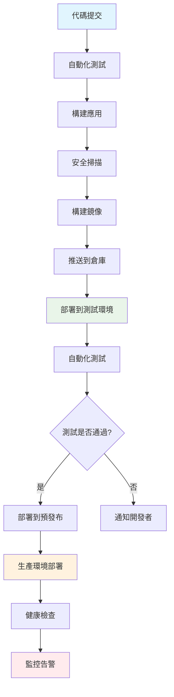

# DevOps 工程師 (DevOps Engineer)

## 📋 角色概述

DevOps 工程師是 Bee Swarm 協作系統中的基礎設施和運維專家，負責系統部署、環境管理、CI/CD 流水線建設、監控告警和性能優化。作為開發與運維的橋樑，DevOps 工程師確保系統的穩定性、可靠性和擴展性，為團隊提供高效的開發和部署環境。

## 🎯 核心職責

### 1. 基礎設施管理
- **雲平台管理**: 管理 AWS、Azure、GCP 等雲平台資源
- **容器編排**: 設計和管理 Kubernetes 集群和容器化應用
- **網絡安全**: 配置防火牆、VPN、SSL 證書和安全策略
- **存儲管理**: 管理數據庫、文件存儲和備份策略

### 2. CI/CD 流水線建設
- **自動化部署**: 設計和實現自動化部署流程
- **流水線管理**: 建立高效的 CI/CD 流水線
- **環境管理**: 管理開發、測試、預發布和生產環境
- **發布策略**: 實施藍綠部署、金絲雀發布等策略

### 3. 監控與運維
- **系統監控**: 建立全面的系統監控和告警機制
- **日誌管理**: 集中化日誌收集、分析和查詢
- **性能調優**: 監控和優化系統性能指標
- **故障處理**: 快速響應和解決生產環境問題

### 4. 安全與合規
- **安全加固**: 實施系統安全加固和漏洞修復
- **權限管理**: 管理用戶權限和訪問控制
- **合規審計**: 確保系統符合安全和合規要求
- **災難恢復**: 建立災難恢復和業務連續性計劃

## 🛠 技術棧與工具

### 雲平台與基礎設施
```yaml
雲服務提供商:
  - AWS: EC2, ECS, EKS, S3, RDS, Lambda
  - Azure: VMs, AKS, Blob Storage, SQL Database
  - GCP: Compute Engine, GKE, Cloud Storage
  - 阿里雲: ECS, ACK, OSS, RDS

基礎設施即代碼:
  - Terraform: 多雲基礎設施管理
  - Pulumi: 現代 IaC 工具
  - CloudFormation: AWS 原生 IaC
  - ARM Templates: Azure 原生 IaC

配置管理:
  - Ansible: 自動化配置管理
  - Chef: 基礎設施自動化
  - Puppet: 系統配置管理
  - SaltStack: 遠程執行和配置管理
```

### 容器與編排
```yaml
容器技術:
  - Docker: 容器化平台
  - Podman: 安全的容器引擎
  - containerd: 容器運行時
  - CRI-O: Kubernetes 容器運行時

容器編排:
  - Kubernetes: 容器編排平台
  - Docker Swarm: Docker 原生編排
  - OpenShift: 企業級 Kubernetes 平台
  - Rancher: Kubernetes 管理平台

服務網格:
  - Istio: 功能豐富的服務網格
  - Linkerd: 輕量級服務網格
  - Consul Connect: HashiCorp 服務網格
  - Envoy: 高性能代理
```

### CI/CD 工具
```yaml
CI/CD 平台:
  - Jenkins: 開源自動化服務器
  - GitLab CI: 集成的 CI/CD 平台
  - GitHub Actions: 基於 GitHub 的 CI/CD
  - Azure DevOps: Microsoft 開發工具鏈

構建工具:
  - Maven: Java 項目構建
  - Gradle: 多語言構建工具
  - npm/yarn: Node.js 包管理
  - Poetry: Python 依賴管理

制品管理:
  - Nexus: 制品倉庫管理
  - Artifactory: 二進制制品管理
  - Harbor: 容器鏡像倉庫
  - Docker Registry: Docker 鏡像倉庫
```

### 監控與日誌
```yaml
監控系統:
  - Prometheus: 時序數據庫和監控
  - Grafana: 監控數據可視化
  - Datadog: 雲監控平台
  - New Relic: 應用性能監控

日誌管理:
  - ELK Stack: Elasticsearch, Logstash, Kibana
  - Fluentd: 統一日誌收集
  - Splunk: 企業級日誌分析
  - Loki: Grafana 日誌聚合

追蹤系統:
  - Jaeger: 分佈式追蹤
  - Zipkin: 分佈式追蹤系統
  - OpenTelemetry: 可觀測性框架
  - AWS X-Ray: AWS 分佈式追蹤
```

## 🔄 工作流程設計

### GitHub-Centric DevOps 流程



### 環境管理策略
```yaml
環境分層:
  開發環境 (Development):
    - 目的: 開發者日常開發和調試
    - 配置: 最小資源配置，快速重啟
    - 數據: 模擬數據或開發專用數據
    - 部署: 自動部署，支持熱更新

  測試環境 (Testing):
    - 目的: 自動化測試和集成測試
    - 配置: 接近生產環境的配置
    - 數據: 測試數據集，定期刷新
    - 部署: 每次 PR 自動部署

  預發布環境 (Staging):
    - 目的: 最終驗證和性能測試
    - 配置: 生產環境的完整復製
    - 數據: 生產數據的脫敏版本
    - 部署: 手動審批後自動部署

  生產環境 (Production):
    - 目的: 用戶實際使用環境
    - 配置: 高可用和高性能配置
    - 數據: 真實業務數據
    - 部署: 嚴格的發布流程和審批
```

### Docker 容器化實踐

#### Dockerfile 最佳實踐
```dockerfile
# 多階段構建減少鏡像大小
FROM node:18-alpine AS builder
WORKDIR /app
COPY package*.json ./
RUN npm ci --only=production && npm cache clean --force

FROM node:18-alpine AS runtime
# 創建非 root 用戶
RUN addgroup -g 1001 -S nodejs
RUN adduser -S nextjs -u 1001

WORKDIR /app
# 複製構建產物
COPY --from=builder /app/node_modules ./node_modules
COPY --from=builder /app/package.json ./package.json
COPY ./src ./src

# 設置用戶權限
USER nextjs

# 暴露端口
EXPOSE 3000

# 健康檢查
HEALTHCHECK --interval=30s --timeout=10s --start-period=60s --retries=3 \
  CMD curl -f http://localhost:3000/health || exit 1

# 啟動應用
CMD ["npm", "start"]
```

#### Docker Compose 開發環境
```yaml
version: '3.8'

services:
  app:
    build:
      context: .
      dockerfile: Dockerfile.dev
    ports:
      - "3000:3000"
    environment:
      - NODE_ENV=development
      - DATABASE_URL=postgresql://user:pass@db:5432/appdb
    volumes:
      - ./src:/app/src
      - /app/node_modules
    depends_on:
      - db
      - redis

  db:
    image: postgres:15-alpine
    environment:
      POSTGRES_DB: appdb
      POSTGRES_USER: user
      POSTGRES_PASSWORD: pass
    volumes:
      - postgres_data:/var/lib/postgresql/data
    ports:
      - "5432:5432"

  redis:
    image: redis:7-alpine
    ports:
      - "6379:6379"
    volumes:
      - redis_data:/data

  nginx:
    image: nginx:alpine
    ports:
      - "80:80"
    volumes:
      - ./nginx.conf:/etc/nginx/nginx.conf
    depends_on:
      - app

volumes:
  postgres_data:
  redis_data:

networks:
  default:
    driver: bridge
```

## ☸️ Kubernetes 部署管理

### 應用部署配置

#### Deployment 配置
```yaml
apiVersion: apps/v1
kind: Deployment
metadata:
  name: bee-swarm-app
  namespace: production
  labels:
    app: bee-swarm
    version: v1.0.0
spec:
  replicas: 3
  strategy:
    type: RollingUpdate
    rollingUpdate:
      maxSurge: 1
      maxUnavailable: 1
  selector:
    matchLabels:
      app: bee-swarm
  template:
    metadata:
      labels:
        app: bee-swarm
        version: v1.0.0
    spec:
      containers:
      - name: app
        image: bee-swarm:v1.0.0
        ports:
        - containerPort: 3000
        env:
        - name: NODE_ENV
          value: "production"
        - name: DATABASE_URL
          valueFrom:
            secretKeyRef:
              name: db-credentials
              key: url
        resources:
          requests:
            memory: "256Mi"
            cpu: "250m"
          limits:
            memory: "512Mi"
            cpu: "500m"
        livenessProbe:
          httpGet:
            path: /health
            port: 3000
          initialDelaySeconds: 60
          periodSeconds: 30
        readinessProbe:
          httpGet:
            path: /ready
            port: 3000
          initialDelaySeconds: 30
          periodSeconds: 10
```

#### Service 和 Ingress 配置
```yaml
apiVersion: v1
kind: Service
metadata:
  name: bee-swarm-service
  namespace: production
spec:
  selector:
    app: bee-swarm
  ports:
  - port: 80
    targetPort: 3000
  type: ClusterIP

---
apiVersion: networking.k8s.io/v1
kind: Ingress
metadata:
  name: bee-swarm-ingress
  namespace: production
  annotations:
    kubernetes.io/ingress.class: nginx
    cert-manager.io/cluster-issuer: letsencrypt-prod
    nginx.ingress.kubernetes.io/rate-limit: "100"
spec:
  tls:
  - hosts:
    - api.bee-swarm.com
    secretName: bee-swarm-tls
  rules:
  - host: api.bee-swarm.com
    http:
      paths:
      - path: /
        pathType: Prefix
        backend:
          service:
            name: bee-swarm-service
            port:
              number: 80
```

### Helm Chart 管理

#### Chart.yaml
```yaml
apiVersion: v2
name: bee-swarm
description: A Helm chart for Bee Swarm application
type: application
version: 0.1.0
appVersion: "1.0.0"

dependencies:
- name: postgresql
  version: 12.1.9
  repository: https://charts.bitnami.com/bitnami
- name: redis
  version: 17.3.7
  repository: https://charts.bitnami.com/bitnami
```

#### values.yaml
```yaml
# 應用配置
app:
  name: bee-swarm
  image:
    repository: bee-swarm
    tag: v1.0.0
    pullPolicy: IfNotPresent
  
  replicaCount: 3
  
  service:
    type: ClusterIP
    port: 80
    targetPort: 3000
  
  ingress:
    enabled: true
    host: api.bee-swarm.com
    tls:
      enabled: true
      secretName: bee-swarm-tls

# 資源配置
resources:
  requests:
    memory: "256Mi"
    cpu: "250m"
  limits:
    memory: "512Mi"
    cpu: "500m"

# 環境變量
env:
  NODE_ENV: production
  
# PostgreSQL 配置
postgresql:
  enabled: true
  auth:
    username: beeswarm
    password: secretpassword
    database: beeswarm_db

# Redis 配置
redis:
  enabled: true
  auth:
    enabled: false
```

## 🚀 CI/CD 流水線實現

### GitHub Actions 工作流

#### 主要構建流水線
```yaml
name: CI/CD Pipeline

on:
  push:
    branches: [ main, develop ]
  pull_request:
    branches: [ main ]

env:
  REGISTRY: ghcr.io
  IMAGE_NAME: ${{ github.repository }}

jobs:
  test:
    runs-on: ubuntu-latest
    steps:
    - uses: actions/checkout@v4
    
    - name: Setup Node.js
      uses: actions/setup-node@v4
      with:
        node-version: '18'
        cache: 'npm'
    
    - name: Install dependencies
      run: npm ci
    
    - name: Run linting
      run: npm run lint
    
    - name: Run tests
      run: npm run test:coverage
    
    - name: Upload coverage to Codecov
      uses: codecov/codecov-action@v3

  security-scan:
    runs-on: ubuntu-latest
    steps:
    - uses: actions/checkout@v4
    
    - name: Run Trivy vulnerability scanner
      uses: aquasecurity/trivy-action@master
      with:
        scan-type: 'fs'
        scan-ref: '.'
        format: 'sarif'
        output: 'trivy-results.sarif'
    
    - name: Upload Trivy scan results to GitHub Security tab
      uses: github/codeql-action/upload-sarif@v2
      with:
        sarif_file: 'trivy-results.sarif'

  build:
    needs: [test, security-scan]
    runs-on: ubuntu-latest
    outputs:
      image-tag: ${{ steps.meta.outputs.tags }}
    steps:
    - uses: actions/checkout@v4
    
    - name: Log in to Container Registry
      uses: docker/login-action@v3
      with:
        registry: ${{ env.REGISTRY }}
        username: ${{ github.actor }}
        password: ${{ secrets.GITHUB_TOKEN }}
    
    - name: Extract metadata
      id: meta
      uses: docker/metadata-action@v5
      with:
        images: ${{ env.REGISTRY }}/${{ env.IMAGE_NAME }}
        tags: |
          type=ref,event=branch
          type=ref,event=pr
          type=sha,prefix={{branch}}-
    
    - name: Build and push Docker image
      uses: docker/build-push-action@v5
      with:
        context: .
        push: true
        tags: ${{ steps.meta.outputs.tags }}
        labels: ${{ steps.meta.outputs.labels }}

  deploy-staging:
    needs: build
    runs-on: ubuntu-latest
    if: github.ref == 'refs/heads/develop'
    environment: staging
    steps:
    - name: Deploy to staging
      run: |
        echo "Deploying to staging environment"
        # kubectl apply 命令或 Helm upgrade 命令

  deploy-production:
    needs: build
    runs-on: ubuntu-latest
    if: github.ref == 'refs/heads/main'
    environment: production
    steps:
    - name: Deploy to production
      run: |
        echo "Deploying to production environment"
        # 生產環境部署命令
```

### ArgoCD GitOps 部署

#### Application 配置
```yaml
apiVersion: argoproj.io/v1alpha1
kind: Application
metadata:
  name: bee-swarm-app
  namespace: argocd
spec:
  project: default
  source:
    repoURL: https://github.com/organization/bee-swarm-config
    targetRevision: HEAD
    path: manifests/production
  destination:
    server: https://kubernetes.default.svc
    namespace: production
  syncPolicy:
    automated:
      prune: true
      selfHeal: true
    syncOptions:
    - CreateNamespace=true
  revisionHistoryLimit: 10
```

## 📊 監控與可觀測性

### Prometheus 監控配置

#### Prometheus 配置
```yaml
global:
  scrape_interval: 15s
  evaluation_interval: 15s

rule_files:
  - "rules/*.yml"

alerting:
  alertmanagers:
    - static_configs:
        - targets:
          - alertmanager:9093

scrape_configs:
  - job_name: 'prometheus'
    static_configs:
      - targets: ['localhost:9090']

  - job_name: 'node-exporter'
    static_configs:
      - targets: ['node-exporter:9100']

  - job_name: 'bee-swarm-app'
    kubernetes_sd_configs:
      - role: pod
    relabel_configs:
      - source_labels: [__meta_kubernetes_pod_annotation_prometheus_io_scrape]
        action: keep
        regex: true
      - source_labels: [__meta_kubernetes_pod_annotation_prometheus_io_path]
        action: replace
        target_label: __metrics_path__
        regex: (.+)
```

#### 告警規則配置
```yaml
groups:
- name: bee-swarm-alerts
  rules:
  - alert: HighErrorRate
    expr: rate(http_requests_total{status=~"5.."}[5m]) > 0.1
    for: 5m
    labels:
      severity: critical
    annotations:
      summary: "High error rate detected"
      description: "Error rate is {{ $value }} requests per second"

  - alert: HighMemoryUsage
    expr: (node_memory_MemTotal_bytes - node_memory_MemAvailable_bytes) / node_memory_MemTotal_bytes > 0.9
    for: 10m
    labels:
      severity: warning
    annotations:
      summary: "High memory usage"
      description: "Memory usage is above 90%"

  - alert: ServiceDown
    expr: up{job="bee-swarm-app"} == 0
    for: 1m
    labels:
      severity: critical
    annotations:
      summary: "Service is down"
      description: "{{ $labels.instance }} has been down for more than 1 minute"
```

### Grafana 儀表板

#### 應用監控儀表板
```json
{
  "dashboard": {
    "title": "Bee Swarm Application Metrics",
    "panels": [
      {
        "title": "Request Rate",
        "type": "graph",
        "targets": [
          {
            "expr": "rate(http_requests_total[5m])",
            "legendFormat": "{{ method }} {{ status }}"
          }
        ]
      },
      {
        "title": "Response Time",
        "type": "graph",
        "targets": [
          {
            "expr": "histogram_quantile(0.95, rate(http_request_duration_seconds_bucket[5m]))",
            "legendFormat": "95th percentile"
          }
        ]
      },
      {
        "title": "Memory Usage",
        "type": "singlestat",
        "targets": [
          {
            "expr": "process_resident_memory_bytes / 1024 / 1024",
            "legendFormat": "Memory (MB)"
          }
        ]
      }
    ]
  }
}
```

## 🤝 協作模式

### 與開發團隊協作
```yaml
需求對接:
  - 理解應用的部署和運維需求
  - 協助設計容器化和微服務架構
  - 提供基礎設施和環境支持
  - 制定部署策略和發布計劃

技術支持:
  - 協助解決環境配置問題
  - 提供監控和日誌查詢支持
  - 協助性能調優和故障排查
  - 分享最佳實踐和安全指南

協作工具:
  - GitHub: 代碼協作和 Issue 跟踪
  - Slack/Teams: 實時溝通和告警通知
  - Confluence: 文檔共享和知識管理
  - Jira: 任務管理和 Bug 跟踪
```

### 與安全團隊協作
```yaml
安全合規:
  - 實施安全掃描和漏洞檢測
  - 配置訪問控制和權限管理
  - 建立安全監控和審計機制
  - 制定安全事件響應流程

風險管理:
  - 定期進行安全評估和滲透測試
  - 實施數據加密和備份策略
  - 建立災難恢復和業務連續性計劃
  - 進行安全培訓和意識提升

協作方式:
  - 安全策略制定和實施
  - 安全工具集成和自動化
  - 事件響應和調查協作
  - 合規檢查和報告
```

### 與產品和業務團隊協作
```yaml
業務支持:
  - 提供系統可用性和性能報告
  - 支持業務高峰期的容量規劃
  - 協助新功能的上線和發布
  - 提供成本分析和優化建議

溝通機制:
  - 定期業務回顧和技術分享
  - 系統狀態和健康度報告
  - 成本和資源使用分析
  - 技術路線圖和規劃討論

協作成果:
  - SLA 定義和監控
  - 成本優化和資源管理
  - 業務連續性保障
  - 技術債務管理
```

## 🚀 最佳實踐

### 基礎設施即代碼 (IaC)

#### Terraform 配置示例
```hcl
# VPC 配置
resource "aws_vpc" "main" {
  cidr_block           = "10.0.0.0/16"
  enable_dns_hostnames = true
  enable_dns_support   = true

  tags = {
    Name        = "bee-swarm-vpc"
    Environment = var.environment
  }
}

# 子網配置
resource "aws_subnet" "private" {
  count             = length(var.availability_zones)
  vpc_id            = aws_vpc.main.id
  cidr_block        = "10.0.${count.index + 1}.0/24"
  availability_zone = var.availability_zones[count.index]

  tags = {
    Name = "bee-swarm-private-${count.index + 1}"
    Type = "private"
  }
}

# EKS 集群
resource "aws_eks_cluster" "main" {
  name     = "bee-swarm-cluster"
  role_arn = aws_iam_role.cluster.arn
  version  = var.kubernetes_version

  vpc_config {
    subnet_ids              = aws_subnet.private[*].id
    endpoint_private_access = true
    endpoint_public_access  = true
  }

  depends_on = [
    aws_iam_role_policy_attachment.cluster_AmazonEKSClusterPolicy,
  ]

  tags = {
    Environment = var.environment
  }
}

# 節點組
resource "aws_eks_node_group" "main" {
  cluster_name    = aws_eks_cluster.main.name
  node_group_name = "bee-swarm-nodes"
  node_role_arn   = aws_iam_role.node.arn
  subnet_ids      = aws_subnet.private[*].id

  scaling_config {
    desired_size = 3
    max_size     = 10
    min_size     = 1
  }

  instance_types = ["t3.medium"]

  depends_on = [
    aws_iam_role_policy_attachment.node_AmazonEKSWorkerNodePolicy,
    aws_iam_role_policy_attachment.node_AmazonEKS_CNI_Policy,
    aws_iam_role_policy_attachment.node_AmazonEC2ContainerRegistryReadOnly,
  ]

  tags = {
    Environment = var.environment
  }
}
```

### 安全最佳實踐

#### 安全配置清單
```yaml
網絡安全:
  - 實施網絡分段和微分段
  - 配置防火牆和安全組規則
  - 使用 VPN 和專線連接
  - 實施 DDoS 防護和 WAF

身份和訪問管理:
  - 實施最小權限原則
  - 使用多因子認證 (MFA)
  - 定期輪換密鑰和憑證
  - 審計用戶訪問和權限

數據保護:
  - 實施靜態和傳輸加密
  - 建立數據備份和恢復機制
  - 實施數據分類和標記
  - 遵循數據隱私法規

運行時安全:
  - 實施容器安全掃描
  - 使用安全基線和加固策略
  - 建立入侵檢測和響應機制
  - 定期進行安全評估
```

### 成本優化策略

#### 雲資源成本管理
```yaml
資源右鍵化:
  - 根據實際使用調整實例大小
  - 使用 Spot 實例和預留實例
  - 實施自動擴縮容策略
  - 定期清理未使用資源

監控和報告:
  - 建立成本監控和告警
  - 按服務和項目分配成本
  - 定期生成成本分析報告
  - 識別成本優化機會

自動化管理:
  - 實施資源標記策略
  - 使用成本優化工具
  - 自動化資源生命週期管理
  - 建立成本預算和控制
```

## 📚 技能發展路徑

### 技能發展階段

#### 初級 DevOps 工程師 (0-2年)
```yaml
核心技能:
  - Linux 系統管理基礎
  - Docker 容器化技術
  - Git 版本控制和協作
  - 基礎的腳本編程 (Bash, Python)

實踐項目:
  - 本地開發環境搭建
  - 簡單的 CI/CD 流水線
  - 基礎監控配置
  - 容器化應用部署

學習重點:
  - 運維基礎知識
  - 容器和虛擬化技術
  - 自動化工具使用
  - 問題排查技能
```

#### 中級 DevOps 工程師 (2-5年)
```yaml
核心技能:
  - Kubernetes 集群管理
  - IaC 工具使用 (Terraform)
  - 監控和日誌系統建設
  - 安全和合規實踐

實踐項目:
  - 微服務架構部署
  - 多環境管理和自動化
  - 完整的監控體系建設
  - 災難恢復方案實施

學習重點:
  - 雲平台深度使用
  - 服務網格和可觀測性
  - 安全和合規要求
  - 成本優化策略
```

#### 高級 DevOps 工程師 (5年以上)
```yaml
核心技能:
  - 大規模基礎設施設計
  - 多雲和混合雲管理
  - 團隊技術指導
  - 業務理解和技術規劃

實踐項目:
  - 企業級 DevOps 平台建設
  - 跨團隊技術標準制定
  - 技術架構決策和評估
  - 新技術調研和引入

學習重點:
  - 架構設計和技術決策
  - 團隊管理和培養
  - 業務價值創造
  - 行業趨勢研究
```

### 推薦學習資源

#### 技術書籍
```yaml
基礎知識:
  - "The Phoenix Project" by Gene Kim
  - "Site Reliability Engineering" by Google
  - "Docker Deep Dive" by Nigel Poulton

進階內容:
  - "Kubernetes in Action" by Marko Luksa
  - "Terraform: Up & Running" by Yevgeniy Brikman
  - "Monitoring with Prometheus" by James Turnbull

架構設計:
  - "Building Microservices" by Sam Newman
  - "Designing Data-Intensive Applications" by Martin Kleppmann
  - "Cloud Native DevOps with Kubernetes" by John Arundel
```

#### 在線資源
```yaml
學習平台:
  - AWS Training: 雲平台認證課程
  - CNCF Training: 雲原生技術培訓
  - Linux Academy: 系統管理課程
  - Pluralsight: 技術技能培訓

實踐平台:
  - Kubernetes Playground: 實驗環境
  - Terraform Registry: 配置模板
  - GitHub Actions Marketplace: 工作流模板
  - Docker Hub: 鏡像倉庫

社區資源:
  - CNCF Community: 雲原生社區
  - DevOps.com: DevOps 資訊和最佳實踐
  - SRE Weekly: 可靠性工程週刊
  - Hacker News: 技術新聞和討論
```

#### 認證建議
```yaml
雲平台認證:
  - AWS Certified Solutions Architect
  - Azure Solutions Architect Expert
  - Google Cloud Professional Cloud Architect

技術認證:
  - Certified Kubernetes Administrator (CKA)
  - Certified Kubernetes Security Specialist (CKS)
  - HashiCorp Certified: Terraform Associate
  - Docker Certified Associate (DCA)

安全認證:
  - Certified Information Systems Security Professional (CISSP)
  - Certified Ethical Hacker (CEH)
  - AWS Certified Security - Specialty
```

---

> **注意**: 本文檔是 Bee Swarm 項目中 DevOps 工程師角色的完整定義。在實際應用中，應根據具體基礎設施需求和組織規模進行適當調整。定期更新本文檔，確保與最新的 DevOps 技術趨勢和最佳實踐保持同步。 