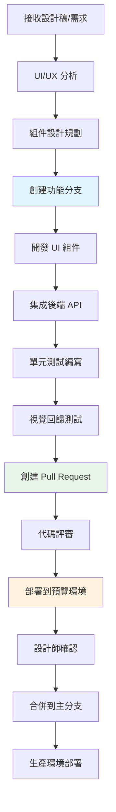
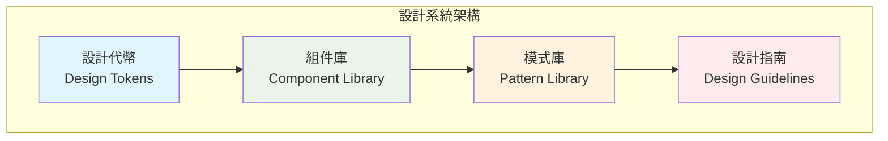
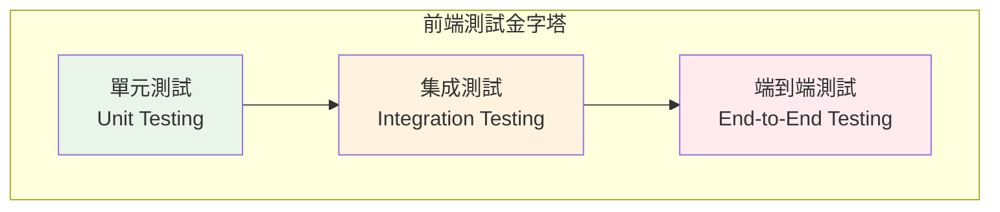

# 前端開發者 (Frontend Developer)

## 📋 角色概述

前端開發者是 Bee Swarm 協作系統中的用戶體驗創造者，負責用戶界面設計、交互體驗優化、前端架構設計和性能優化。作為用戶與系統的橋樑，前端開發者確保應用的易用性、美觀性和響應性，為用戶提供流暢、直觀的操作體驗。

## 🎯 核心職責

### 1. 用戶界面開發
- **響應式設計**: 實現適配不同設備和屏幕的界面
- **組件化開發**: 設計和開發可復用的 UI 組件
- **交互體驗**: 實現流暢的用戶交互和動畫效果
- **無障礙設計**: 確保應用的可訪問性和包容性

### 2. 前端架構設計
- **應用架構**: 設計可維護的前端應用架構
- **狀態管理**: 實現高效的應用狀態管理
- **路由設計**: 設計清晰的頁面路由和導航
- **模塊化開發**: 建立模塊化的代碼組織結構

### 3. 性能優化
- **加載優化**: 優化應用加載速度和資源使用
- **渲染優化**: 提升頁面渲染性能和用戶體驗
- **包大小優化**: 減少打包文件大小和網絡傳輸
- **緩存策略**: 實現有效的前端緩存機制

### 4. 工程化建設
- **構建工具**: 配置和優化前端構建流程
- **代碼質量**: 建立代碼規範和質量檢查
- **測試體系**: 建立前端測試框架和用例
- **CI/CD 集成**: 集成前端自動化部署流程

## 🛠 技術棧與工具

### 核心框架與語言
```yaml
編程語言:
  - TypeScript: 主要開發語言
  - JavaScript: ES6+ 語法
  - HTML5: 語義化標記
  - CSS3: 現代樣式和動畫

前端框架:
  - React: 組件化開發框架
  - Vue.js: 漸進式框架
  - Angular: 企業級應用框架
  - Svelte: 編譯時優化框架

狀態管理:
  - Redux/Redux Toolkit: React 狀態管理
  - Vuex/Pinia: Vue 狀態管理
  - MobX: 響應式狀態管理
  - Zustand: 輕量級狀態管理
```

### UI 開發工具
```yaml
UI 框架:
  - Material-UI: React Material Design
  - Ant Design: 企業級 UI 設計語言
  - Chakra UI: 模組化 UI 框架
  - Tailwind CSS: 實用工具 CSS 框架

樣式工具:
  - Styled-components: CSS-in-JS 解決方案
  - SCSS/SASS: CSS 預處理器
  - PostCSS: CSS 後處理工具
  - Emotion: 高性能 CSS-in-JS

設計工具:
  - Figma: UI/UX 設計和協作
  - Sketch: 界面設計工具
  - Adobe XD: 用戶體驗設計
  - Zeplin: 設計與開發協作
```

### 開發與構建工具
```yaml
構建工具:
  - Vite: 快速構建工具
  - Webpack: 模塊打包器
  - Rollup: 庫打包工具
  - esbuild: 極速 JavaScript 打包器

開發工具:
  - ESLint: 代碼質量檢查
  - Prettier: 代碼格式化
  - Husky: Git hooks 管理
  - lint-staged: 暫存區代碼檢查

測試工具:
  - Jest: JavaScript 測試框架
  - Testing Library: 組件測試
  - Playwright: 端到端測試
  - Storybook: 組件開發和測試
```

## 🔄 開發流程設計

### GitHub-Centric 開發流程



### 組件開發生命週期
```yaml
設計階段:
  - 分析設計稿和交互需求
  - 識別可復用組件
  - 定義組件 API 和屬性
  - 制定組件開發計劃

開發階段:
  - 實現組件基礎結構
  - 添加樣式和動畫效果
  - 實現交互邏輯和狀態管理
  - 編寫 TypeScript 類型定義

測試階段:
  - 編寫單元測試用例
  - 進行視覺回歸測試
  - 測試組件在不同場景下的表現
  - 驗證無障礙性要求

文檔階段:
  - 編寫組件使用文檔
  - 創建 Storybook 示例
  - 記錄組件 API 和屬性
  - 提供使用最佳實踐
```

### 響應式設計實踐

#### 斷點系統設計
```css
/* 移動優先的響應式設計 */
.container {
  width: 100%;
  padding: 0 1rem;
}

/* 平板設備 */
@media (min-width: 768px) {
  .container {
    max-width: 750px;
    margin: 0 auto;
  }
}

/* 桌面設備 */
@media (min-width: 1024px) {
  .container {
    max-width: 1200px;
    padding: 0 2rem;
  }
}

/* 大屏設備 */
@media (min-width: 1440px) {
  .container {
    max-width: 1400px;
  }
}
```

#### CSS Grid 和 Flexbox 應用
```css
/* 響應式網格佈局 */
.grid-container {
  display: grid;
  grid-template-columns: repeat(auto-fit, minmax(300px, 1fr));
  gap: 1.5rem;
  padding: 1rem;
}

/* Flexbox 佈局 */
.flex-container {
  display: flex;
  flex-wrap: wrap;
  align-items: center;
  justify-content: space-between;
  gap: 1rem;
}

.flex-item {
  flex: 1 1 calc(50% - 0.5rem);
  min-width: 250px;
}

@media (max-width: 768px) {
  .flex-item {
    flex: 1 1 100%;
  }
}
```

## 🎨 UI/UX 設計實踐

### 設計系統建立



#### 設計代幣 (Design Tokens)
```javascript
// 顏色系統
export const colors = {
  primary: {
    50: '#e3f2fd',
    100: '#bbdefb',
    500: '#2196f3',
    600: '#1976d2',
    900: '#0d47a1'
  },
  semantic: {
    success: '#4caf50',
    warning: '#ff9800',
    error: '#f44336',
    info: '#2196f3'
  },
  neutral: {
    50: '#fafafa',
    100: '#f5f5f5',
    500: '#9e9e9e',
    900: '#212121'
  }
}

// 間距系統
export const spacing = {
  xs: '0.25rem',   // 4px
  sm: '0.5rem',    // 8px
  md: '1rem',      // 16px
  lg: '1.5rem',    // 24px
  xl: '2rem',      // 32px
  xxl: '3rem'      // 48px
}

// 字體系統
export const typography = {
  fontFamily: {
    sans: ['Inter', 'system-ui', 'sans-serif'],
    mono: ['JetBrains Mono', 'monospace']
  },
  fontSize: {
    xs: '0.75rem',
    sm: '0.875rem',
    base: '1rem',
    lg: '1.125rem',
    xl: '1.25rem',
    '2xl': '1.5rem',
    '3xl': '1.875rem'
  }
}
```

### 組件設計模式

#### 原子設計方法論
```yaml
原子 (Atoms):
  - Button: 按鈕組件
  - Input: 輸入框組件
  - Icon: 圖標組件
  - Typography: 文本組件

分子 (Molecules):
  - SearchBox: 搜索框 (Input + Button)
  - FormField: 表單字段 (Label + Input + ErrorMessage)
  - Card: 卡片 (Image + Typography + Button)

有機體 (Organisms):
  - Header: 頁頭 (Logo + Navigation + SearchBox)
  - ProductList: 產品列表 (多個 Card 組件)
  - Footer: 頁腳 (Navigation + Social Links)

模板 (Templates):
  - PageLayout: 頁面佈局模板
  - DashboardLayout: 儀表板佈局
  - FormLayout: 表單佈局模板

頁面 (Pages):
  - HomePage: 首頁
  - ProductPage: 產品頁面
  - UserProfile: 用戶資料頁面
```

#### React 組件開發示例
```typescript
// Button 原子組件
interface ButtonProps {
  variant?: 'primary' | 'secondary' | 'outline';
  size?: 'sm' | 'md' | 'lg';
  disabled?: boolean;
  loading?: boolean;
  children: React.ReactNode;
  onClick?: () => void;
}

const Button: React.FC<ButtonProps> = ({
  variant = 'primary',
  size = 'md',
  disabled = false,
  loading = false,
  children,
  onClick
}) => {
  const baseClasses = 'inline-flex items-center justify-center font-medium rounded-md transition-colors';
  
  const variantClasses = {
    primary: 'bg-blue-600 text-white hover:bg-blue-700',
    secondary: 'bg-gray-600 text-white hover:bg-gray-700',
    outline: 'border border-blue-600 text-blue-600 hover:bg-blue-50'
  };
  
  const sizeClasses = {
    sm: 'px-3 py-1.5 text-sm',
    md: 'px-4 py-2 text-base',
    lg: 'px-6 py-3 text-lg'
  };
  
  return (
    <button
      className={cn(
        baseClasses,
        variantClasses[variant],
        sizeClasses[size],
        disabled && 'opacity-50 cursor-not-allowed'
      )}
      disabled={disabled || loading}
      onClick={onClick}
    >
      {loading && <Spinner className="mr-2" />}
      {children}
    </button>
  );
};

// SearchBox 分子組件
interface SearchBoxProps {
  placeholder?: string;
  value: string;
  onChange: (value: string) => void;
  onSearch: () => void;
}

const SearchBox: React.FC<SearchBoxProps> = ({
  placeholder = "搜索...",
  value,
  onChange,
  onSearch
}) => {
  return (
    <div className="flex items-center space-x-2">
      <Input
        type="text"
        placeholder={placeholder}
        value={value}
        onChange={(e) => onChange(e.target.value)}
        onKeyPress={(e) => e.key === 'Enter' && onSearch()}
      />
      <Button onClick={onSearch}>
        <SearchIcon className="w-4 h-4" />
      </Button>
    </div>
  );
};
```

## 🤝 協作模式

### 與設計師協作
```yaml
設計評審:
  - 參與設計稿評審會議
  - 評估設計的技術可行性
  - 提供實現方案和建議
  - 確認交互細節和動畫效果

設計交付:
  - 使用 Figma/Sketch 獲取設計規範
  - 提取設計代幣和組件規範
  - 確認響應式設計要求
  - 獲取切圖和圖標資源

協作工具:
  - Figma: 設計稿查看和標註
  - Zeplin: 設計規範自動生成
  - Abstract: 設計版本管理
  - InVision: 原型演示和反饋
```

### 與後端開發者協作
```yaml
API 對接:
  - 確認 API 接口設計和數據格式
  - 討論前端數據處理需求
  - 處理錯誤狀態和邊界情況
  - 優化數據傳輸和緩存策略

開發協調:
  - 同步開發進度和依賴關係
  - 協助後端理解前端需求
  - 共同進行接口聯調測試
  - 協商發布計劃和時程

協作工具:
  - OpenAPI/Swagger: API 文檔和測試
  - Postman: API 測試和 Mock
  - GitHub: 代碼協作和問題跟踪
  - 共享環境: 開發和測試環境
```

### 與產品經理協作
```yaml
需求對接:
  - 參與產品需求評審
  - 理解用戶場景和業務邏輯
  - 評估功能的實現複雜度
  - 提供用戶體驗優化建議

原型開發:
  - 快速開發功能原型
  - 進行用戶體驗測試
  - 收集用戶反饋並迭代
  - 驗證產品假設和需求

溝通方式:
  - 定期產品評審會議
  - 原型演示和用戶測試
  - GitHub Issues 需求跟踪
  - 實時溝通和反饋
```

## 🧪 測試與質量保證

### 前端測試策略



#### 測試類型與工具
```yaml
單元測試 (70%):
  - 組件邏輯測試: Jest + Testing Library
  - 工具函數測試: Jest + 自定義測試
  - Hook 測試: React Hook Testing
  - 狀態管理測試: Redux/Zustand 測試

集成測試 (20%):
  - 組件集成測試: Testing Library
  - API 集成測試: MSW (Mock Service Worker)
  - 路由測試: React Router Testing
  - 表單流程測試: 完整表單提交流程

端到端測試 (10%):
  - 關鍵用戶流程: Playwright/Cypress
  - 跨瀏覽器測試: 多瀏覽器兼容性
  - 性能測試: Lighthouse CI
  - 視覺回歸測試: Percy/Chromatic
```

#### 組件測試示例
```typescript
import { render, screen, fireEvent } from '@testing-library/react';
import { Button } from './Button';

describe('Button Component', () => {
  it('renders with correct text', () => {
    render(<Button>Click me</Button>);
    expect(screen.getByText('Click me')).toBeInTheDocument();
  });

  it('calls onClick when clicked', () => {
    const mockOnClick = jest.fn();
    render(<Button onClick={mockOnClick}>Click me</Button>);
    
    fireEvent.click(screen.getByText('Click me'));
    expect(mockOnClick).toHaveBeenCalledTimes(1);
  });

  it('shows loading state correctly', () => {
    render(<Button loading>Click me</Button>);
    expect(screen.getByTestId('spinner')).toBeInTheDocument();
    expect(screen.getByRole('button')).toBeDisabled();
  });

  it('applies correct variant styles', () => {
    render(<Button variant="secondary">Click me</Button>);
    const button = screen.getByRole('button');
    expect(button).toHaveClass('bg-gray-600');
  });
});
```

### 代碼質量保證

#### ESLint 配置
```javascript
// .eslintrc.js
module.exports = {
  extends: [
    'eslint:recommended',
    '@typescript-eslint/recommended',
    'plugin:react/recommended',
    'plugin:react-hooks/recommended',
    'plugin:jsx-a11y/recommended'
  ],
  rules: {
    // React 相關
    'react/prop-types': 'off',
    'react/react-in-jsx-scope': 'off',
    'react-hooks/exhaustive-deps': 'warn',
    
    // TypeScript 相關
    '@typescript-eslint/no-unused-vars': 'error',
    '@typescript-eslint/explicit-function-return-type': 'off',
    
    // 無障礙性
    'jsx-a11y/anchor-is-valid': 'warn',
    'jsx-a11y/img-redundant-alt': 'error',
    
    // 代碼風格
    'prefer-const': 'error',
    'no-var': 'error'
  }
};
```

## 📊 性能優化策略

### 渲染性能優化

#### React 性能優化技巧
```typescript
// 1. 使用 React.memo 避免不必要的重渲染
const ExpensiveComponent = React.memo<Props>(({ data, config }) => {
  return (
    <div>
      {/* 昂貴的渲染邏輯 */}
    </div>
  );
}, (prevProps, nextProps) => {
  // 自定義比較函數
  return prevProps.data.id === nextProps.data.id;
});

// 2. 使用 useMemo 緩存計算結果
const ProcessedData: React.FC<{ rawData: any[] }> = ({ rawData }) => {
  const processedData = useMemo(() => {
    return rawData
      .filter(item => item.active)
      .map(item => transformItem(item))
      .sort((a, b) => a.priority - b.priority);
  }, [rawData]);

  return <DataList data={processedData} />;
};

// 3. 使用 useCallback 緩存函數
const ItemList: React.FC<{ items: Item[] }> = ({ items }) => {
  const [selectedItems, setSelectedItems] = useState<Set<string>>(new Set());

  const handleItemSelect = useCallback((itemId: string) => {
    setSelectedItems(prev => {
      const newSet = new Set(prev);
      if (newSet.has(itemId)) {
        newSet.delete(itemId);
      } else {
        newSet.add(itemId);
      }
      return newSet;
    });
  }, []);

  return (
    <div>
      {items.map(item => (
        <Item
          key={item.id}
          item={item}
          onSelect={handleItemSelect}
          selected={selectedItems.has(item.id)}
        />
      ))}
    </div>
  );
};
```

### 加載性能優化

#### 代碼分割策略
```typescript
// 1. 路由級別的代碼分割
import { lazy, Suspense } from 'react';
import { Routes, Route } from 'react-router-dom';

const HomePage = lazy(() => import('./pages/HomePage'));
const UserProfile = lazy(() => import('./pages/UserProfile'));
const Settings = lazy(() => import('./pages/Settings'));

function App() {
  return (
    <Suspense fallback={<div>Loading...</div>}>
      <Routes>
        <Route path="/" element={<HomePage />} />
        <Route path="/profile" element={<UserProfile />} />
        <Route path="/settings" element={<Settings />} />
      </Routes>
    </Suspense>
  );
}

// 2. 組件級別的代碼分割
const HeavyChart = lazy(() => 
  import('./HeavyChart').then(module => ({
    default: module.HeavyChart
  }))
);

// 3. 動態導入第三方庫
const loadMarkdownEditor = async () => {
  const { default: MarkdownEditor } = await import('react-markdown-editor');
  return MarkdownEditor;
};
```

#### 資源優化
```yaml
圖片優化:
  - WebP 格式: 現代瀏覽器優先使用
  - 響應式圖片: srcset 和 sizes 屬性
  - 懶加載: Intersection Observer API
  - 圖片壓縮: TinyPNG/ImageOptim

字體優化:
  - 字體預加載: rel="preload"
  - 字體顯示策略: font-display: swap
  - 子集化: 只包含需要的字符
  - Web 字體服務: Google Fonts

JavaScript 優化:
  - Tree Shaking: 移除未使用的代碼
  - 壓縮混淆: Terser/UglifyJS
  - Gzip 壓縮: 服務器端壓縮
  - 緩存策略: 長期緩存 + hash
```

## 🚀 最佳實踐

### 可訪問性 (Accessibility)

#### WCAG 2.1 指南實施
```typescript
// 1. 語義化 HTML
const NavigationMenu: React.FC = () => {
  return (
    <nav role="navigation" aria-label="主導航">
      <ul>
        <li><a href="/" aria-current="page">首頁</a></li>
        <li><a href="/products">產品</a></li>
        <li><a href="/about">關於我們</a></li>
      </ul>
    </nav>
  );
};

// 2. 鍵盤導航支持
const Modal: React.FC<ModalProps> = ({ isOpen, onClose, children }) => {
  useEffect(() => {
    if (isOpen) {
      // 陷阱焦點在模態框內
      const focusableElements = modal.current?.querySelectorAll(
        'button, [href], input, select, textarea, [tabindex]:not([tabindex="-1"])'
      );
      
      const firstElement = focusableElements?.[0] as HTMLElement;
      const lastElement = focusableElements?.[focusableElements.length - 1] as HTMLElement;
      
      firstElement?.focus();
      
      const handleKeyDown = (e: KeyboardEvent) => {
        if (e.key === 'Escape') onClose();
        
        if (e.key === 'Tab') {
          if (e.shiftKey && document.activeElement === firstElement) {
            e.preventDefault();
            lastElement?.focus();
          } else if (!e.shiftKey && document.activeElement === lastElement) {
            e.preventDefault();
            firstElement?.focus();
          }
        }
      };
      
      document.addEventListener('keydown', handleKeyDown);
      return () => document.removeEventListener('keydown', handleKeyDown);
    }
  }, [isOpen]);

  return (
    <div
      role="dialog"
      aria-modal="true"
      aria-labelledby="modal-title"
      className={isOpen ? 'block' : 'hidden'}
    >
      {children}
    </div>
  );
};

// 3. ARIA 屬性使用
const ProgressBar: React.FC<{ value: number; max: number }> = ({ value, max }) => {
  const percentage = (value / max) * 100;
  
  return (
    <div
      role="progressbar"
      aria-valuenow={value}
      aria-valuemin={0}
      aria-valuemax={max}
      aria-label={`進度: ${percentage.toFixed(0)}%`}
      className="progress-bar"
    >
      <div 
        className="progress-fill"
        style={{ width: `${percentage}%` }}
      />
    </div>
  );
};
```

### 國際化 (i18n)

#### 多語言支持實現
```typescript
// 1. i18n 配置
import i18n from 'i18next';
import { initReactI18next } from 'react-i18next';

const resources = {
  'zh-TW': {
    translation: {
      welcome: '歡迎',
      login: '登入',
      logout: '登出',
      profile: '個人資料'
    }
  },
  'en-US': {
    translation: {
      welcome: 'Welcome',
      login: 'Login',
      logout: 'Logout',
      profile: 'Profile'
    }
  }
};

i18n
  .use(initReactI18next)
  .init({
    resources,
    lng: 'zh-TW',
    fallbackLng: 'en-US',
    interpolation: {
      escapeValue: false
    }
  });

// 2. 組件中使用
import { useTranslation } from 'react-i18next';

const WelcomeMessage: React.FC<{ userName: string }> = ({ userName }) => {
  const { t } = useTranslation();
  
  return (
    <h1>{t('welcome')}, {userName}!</h1>
  );
};

// 3. 日期和數字格式化
const formatCurrency = (amount: number, locale: string) => {
  return new Intl.NumberFormat(locale, {
    style: 'currency',
    currency: locale === 'zh-TW' ? 'TWD' : 'USD'
  }).format(amount);
};

const formatDate = (date: Date, locale: string) => {
  return new Intl.DateTimeFormat(locale, {
    year: 'numeric',
    month: 'long',
    day: 'numeric'
  }).format(date);
};
```

## 📚 技術成長路徑

### 技能發展階段

#### 初級前端開發者 (0-2年)
```yaml
核心技能:
  - HTML5, CSS3 基礎
  - JavaScript ES6+ 語法
  - 一個主流前端框架 (React/Vue)
  - 基礎的響應式設計

實踐項目:
  - 靜態網站開發
  - 簡單的單頁應用
  - 組件化開發練習
  - 基礎的 API 集成

學習重點:
  - Web 開發基礎知識
  - 框架和生態系統
  - 工具鏈和開發環境
  - 基本的調試技能
```

#### 中級前端開發者 (2-5年)
```yaml
核心技能:
  - TypeScript 開發
  - 狀態管理和架構設計
  - 性能優化和最佳實踐
  - 測試驅動開發

實踐項目:
  - 複雜的企業級應用
  - 組件庫和設計系統
  - 微前端架構實踐
  - 性能優化項目

學習重點:
  - 軟件工程實踐
  - 用戶體驗設計
  - 團隊協作和溝通
  - 新技術調研和應用
```

#### 高級前端開發者 (5年以上)
```yaml
核心技能:
  - 前端架構設計
  - 技術選型和決策
  - 團隊技術指導
  - 跨端技術整合

實踐項目:
  - 大型前端架構設計
  - 跨團隊技術協作
  - 技術標準制定
  - 開源項目貢獻

學習重點:
  - 業務理解和產品思維
  - 團隊管理和培養
  - 技術趨勢研究
  - 行業影響力建設
```

### 推薦學習資源

#### 技術書籍
```yaml
基礎知識:
  - "You Don't Know JS" 系列
  - "JavaScript: The Definitive Guide"
  - "CSS: The Definitive Guide"

進階內容:
  - "React 設計模式與最佳實踐"
  - "前端架構設計"
  - "Web Performance in Action"

設計相關:
  - "Don't Make Me Think"
  - "The Design of Everyday Things"
  - "Atomic Design"
```

#### 在線資源
```yaml
學習平台:
  - MDN Web Docs: Web 標準文檔
  - React/Vue 官方文檔
  - Frontend Masters: 高質量課程
  - Egghead.io: 實用技能課程

實踐平台:
  - CodePen: 前端實驗和分享
  - CodeSandbox: 在線開發環境
  - Figma Community: 設計資源
  - Dribbble: 設計靈感

技術社區:
  - Frontend Focus: 前端週刊
  - CSS-Tricks: CSS 技巧和教程
  - Smashing Magazine: 設計和開發
  - Dev.to: 開發者社區
```

---

> **注意**: 本文檔是 Bee Swarm 項目中前端開發者角色的完整定義。在實際應用中，應根據具體項目需求和技術棧進行適當調整。定期更新本文檔，確保與最新的前端技術趨勢和最佳實踐保持同步。 