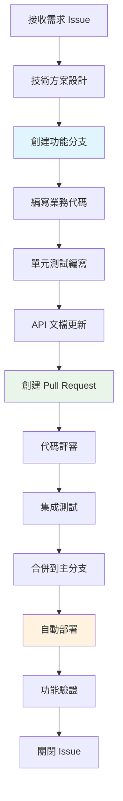
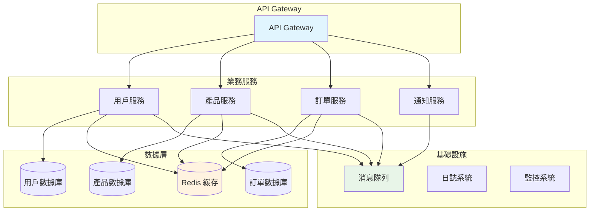

# 後端開發者 (Backend Developer)

## 📋 角色概述

後端開發者是 Bee Swarm 協作系統中的核心技術角色，負責系統架構設計、服務端開發、數據庫設計、API 開發和系統性能優化。作為系統的技術基石，後端開發者確保應用的穩定性、擴展性和安全性，為前端和其他服務提供可靠的數據和業務邏輯支持。

## 🎯 核心職責

### 1. 系統架構與設計
- **服務架構設計**: 設計可擴展的微服務或模塊化架構
- **數據庫設計**: 設計高效的數據模型和數據庫架構
- **技術選型**: 根據業務需求選擇合適的技術棧和框架
- **性能架構**: 設計高並發、高可用的系統架構

### 2. API 開發與設計
- **RESTful API 設計**: 設計符合 REST 原則的 API 接口
- **GraphQL 實現**: 根據需要實現 GraphQL API
- **API 文檔維護**: 編寫和維護詳細的 API 文檔
- **接口版本管理**: 管理 API 版本的向後兼容性

### 3. 業務邏輯實現
- **核心業務開發**: 實現複雜的業務邏輯和算法
- **數據處理**: 處理數據的增刪改查和複雜查詢
- **業務規則引擎**: 實現靈活的業務規則配置
- **工作流引擎**: 設計和實現業務流程自動化

### 4. 系統安全與優化
- **安全防護**: 實施身份驗證、授權和數據加密
- **性能優化**: 優化查詢性能、緩存策略和系統響應
- **監控告警**: 建立系統監控和日誌收集機制
- **故障排查**: 快速定位和解決系統問題

## 🛠 技術棧與工具

### 編程語言與框架
```yaml
主要語言:
  - Python: Django, FastAPI, Flask
  - Java: Spring Boot, Spring Cloud
  - Node.js: Express, NestJS, Koa
  - Go: Gin, Echo, Fiber
  - Rust: Actix, Warp, Rocket

API 框架:
  - REST: FastAPI, Spring Boot, Express
  - GraphQL: Apollo Server, Hasura
  - gRPC: Protocol Buffers, gRPC Gateway
```

### 數據庫與存儲
```yaml
關係型數據庫:
  - PostgreSQL: 主要數據存儲
  - MySQL: 業務數據存儲
  - SQLite: 開發測試環境

NoSQL 數據庫:
  - MongoDB: 文檔存儲
  - Redis: 緩存和會話存儲
  - Elasticsearch: 全文搜索

雲存儲:
  - AWS S3: 文件存儲
  - MinIO: 私有雲存儲
  - CDN: 靜態資源分發
```

### 開發與部署工具
```yaml
版本控制:
  - Git: 代碼版本管理
  - GitHub: 代碼託管和協作
  - GitHub Actions: CI/CD 自動化

容器技術:
  - Docker: 應用容器化
  - Docker Compose: 本地開發環境
  - Kubernetes: 生產環境編排

監控與日誌:
  - Prometheus: 系統監控
  - Grafana: 監控可視化
  - ELK Stack: 日誌分析
  - Sentry: 錯誤跟踪
```

## 🔄 開發流程設計

### GitHub-Centric 開發流程



### 開發週期管理
```yaml
需求分析階段:
  - 理解產品需求和技術需求
  - 評估技術可行性和開發成本
  - 設計技術方案和架構
  - 確定開發時間線

開發實施階段:
  - 搭建開發環境和基礎框架
  - 實現核心業務邏輯
  - 編寫單元測試和集成測試
  - 完善 API 文檔和註釋

測試部署階段:
  - 本地功能測試和性能測試
  - 代碼評審和質量檢查
  - 部署到測試環境驗證
  - 生產環境部署和監控
```

### API 設計規範

#### RESTful API 設計標準
```yaml
URL 設計規範:
  - 使用名詞而非動詞: /api/users 而非 /api/getUsers
  - 使用複數形式: /api/users 而非 /api/user
  - 層級關係清晰: /api/users/{id}/posts
  - 版本控制: /api/v1/users

HTTP 方法使用:
  - GET: 獲取資源 (冪等)
  - POST: 創建資源
  - PUT: 更新完整資源 (冪等)
  - PATCH: 部分更新資源
  - DELETE: 刪除資源 (冪等)

狀態碼規範:
  - 200: 成功響應
  - 201: 創建成功
  - 400: 請求錯誤
  - 401: 未授權
  - 403: 禁止訪問
  - 404: 資源不存在
  - 500: 服務器錯誤
```

#### API 響應格式標準
```json
{
  "success": true,
  "code": 200,
  "message": "操作成功",
  "data": {
    "id": 1,
    "name": "用戶名",
    "email": "user@example.com"
  },
  "meta": {
    "timestamp": "2024-01-01T00:00:00Z",
    "version": "v1.0.0",
    "request_id": "uuid-123"
  },
  "pagination": {
    "page": 1,
    "per_page": 20,
    "total": 100,
    "total_pages": 5
  }
}
```

## 🏗 系統架構模式

### 微服務架構設計



### 數據庫設計模式

#### 核心數據模型設計
```sql
-- 用戶表設計
CREATE TABLE users (
    id BIGSERIAL PRIMARY KEY,
    email VARCHAR(255) UNIQUE NOT NULL,
    username VARCHAR(100) UNIQUE NOT NULL,
    password_hash VARCHAR(255) NOT NULL,
    profile JSONB DEFAULT '{}',
    status VARCHAR(20) DEFAULT 'active',
    created_at TIMESTAMP WITH TIME ZONE DEFAULT NOW(),
    updated_at TIMESTAMP WITH TIME ZONE DEFAULT NOW()
);

-- 項目表設計
CREATE TABLE projects (
    id BIGSERIAL PRIMARY KEY,
    name VARCHAR(255) NOT NULL,
    description TEXT,
    owner_id BIGINT REFERENCES users(id),
    settings JSONB DEFAULT '{}',
    status VARCHAR(20) DEFAULT 'active',
    created_at TIMESTAMP WITH TIME ZONE DEFAULT NOW(),
    updated_at TIMESTAMP WITH TIME ZONE DEFAULT NOW()
);

-- 任務表設計
CREATE TABLE tasks (
    id BIGSERIAL PRIMARY KEY,
    project_id BIGINT REFERENCES projects(id),
    title VARCHAR(500) NOT NULL,
    description TEXT,
    assignee_id BIGINT REFERENCES users(id),
    priority VARCHAR(20) DEFAULT 'medium',
    status VARCHAR(20) DEFAULT 'pending',
    due_date TIMESTAMP WITH TIME ZONE,
    metadata JSONB DEFAULT '{}',
    created_at TIMESTAMP WITH TIME ZONE DEFAULT NOW(),
    updated_at TIMESTAMP WITH TIME ZONE DEFAULT NOW()
);

-- 索引設計
CREATE INDEX idx_users_email ON users(email);
CREATE INDEX idx_projects_owner_id ON projects(owner_id);
CREATE INDEX idx_tasks_project_id ON tasks(project_id);
CREATE INDEX idx_tasks_assignee_id ON tasks(assignee_id);
CREATE INDEX idx_tasks_status ON tasks(status);
```

## 🤝 協作模式

### 與產品經理協作
```yaml
需求對接:
  - 參與需求評審會議，理解業務需求
  - 評估技術可行性和開發成本
  - 提供技術方案和替代建議
  - 確定開發優先級和時間線

API 設計協作:
  - 根據業務需求設計 API 接口
  - 與前端開發者確定數據格式
  - 編寫 API 文檔和使用示例
  - 處理 API 變更和版本管理

溝通工具:
  - GitHub Issues: 需求追踪和問題反饋
  - Pull Request: 代碼評審和討論
  - API 文檔: Swagger/OpenAPI 規範
  - 會議: 需求評審、技術方案討論
```

### 與前端開發者協作
```yaml
接口設計:
  - 協商 API 接口設計和數據格式
  - 提供 Mock 數據和測試接口
  - 協助前端進行接口聯調
  - 處理跨域和安全性問題

開發協調:
  - 同步開發進度和依賴關係
  - 協助解決前後端集成問題
  - 提供技術支持和問題排查
  - 共同制定發布計劃

協作工具:
  - Postman: API 測試和文檔分享
  - Swagger UI: 接口文檔和測試
  - GitHub: 代碼協作和問題跟踪
  - 共享環境: 開發和測試環境
```

### 與 DevOps 工程師協作
```yaml
部署配置:
  - 提供應用部署配置和依賴
  - 配置環境變量和秘鑰管理
  - 設計容器化部署方案
  - 協助建立 CI/CD 流水線

監控運維:
  - 定義系統監控指標和告警
  - 協助故障排查和性能調優
  - 參與事故響應和恢復
  - 持續優化系統性能

協作方式:
  - 基礎設施即代碼 (IaC)
  - 容器化部署配置
  - 監控和日誌配置
  - 自動化測試和部署
```

## 🧪 測試與質量保證

### 測試策略設計

```mermaid
pyramid TB
    subgraph "測試金字塔"
        UI[UI 測試<br/>End-to-End Tests]
        INT[集成測試<br/>Integration Tests]
        UNIT[單元測試<br/>Unit Tests]
    end
    
    UNIT --> INT
    INT --> UI
    
    style UNIT fill:#e8f5e8
    style INT fill:#fff3e0
    style UI fill:#ffebee
```

#### 測試類型與覆蓋率
```yaml
單元測試 (70%):
  - 業務邏輯測試: 核心算法和業務規則
  - 數據層測試: 數據訪問和 ORM 操作
  - 工具函數測試: 通用工具和輔助函數
  - 異常處理測試: 錯誤處理和邊界條件

集成測試 (20%):
  - API 接口測試: 接口功能和數據完整性
  - 數據庫集成測試: 複雜查詢和事務處理
  - 第三方服務測試: 外部 API 和服務集成
  - 消息隊列測試: 異步處理和消息傳遞

端到端測試 (10%):
  - 關鍵業務流程: 完整的用戶操作流程
  - 系統集成驗證: 多個服務協作的場景
  - 性能和負載測試: 高並發和大數據量測試
```

### 代碼質量標準

#### 代碼規範與檢查
```yaml
代碼風格:
  - Python: PEP 8, Black, isort
  - JavaScript: ESLint, Prettier
  - Java: CheckStyle, PMD
  - Go: gofmt, golint

質量檢查:
  - 靜態分析: SonarQube, CodeClimate
  - 安全掃描: Bandit, Safety
  - 依賴檢查: Snyk, OWASP Dependency Check
  - 覆蓋率: Coverage.py, JaCoCo

文檔要求:
  - API 文檔: Swagger/OpenAPI 自動生成
  - 代碼註釋: 關鍵邏輯和複雜算法說明
  - README: 項目說明和快速開始指南
  - 變更日誌: 版本更新記錄和影響說明
```

## 📊 性能與監控

### 性能優化策略

#### 數據庫優化
```yaml
查詢優化:
  - 索引設計: 合理設計單列和複合索引
  - 查詢優化: 避免 N+1 查詢，使用連接查詢
  - 分頁優化: 使用游標分頁而非 OFFSET
  - 緩存策略: Redis 緩存熱點數據

架構優化:
  - 讀寫分離: 主從數據庫分離讀寫操作
  - 分庫分表: 水平拆分大表和高並發表
  - 連接池: 合理配置數據庫連接池
  - 事務優化: 減少事務範圍和鎖定時間
```

#### 應用性能優化
```yaml
緩存策略:
  - 多級緩存: L1(應用緩存) + L2(Redis) + L3(CDN)
  - 緩存模式: Cache-Aside, Write-Through, Write-Behind
  - 失效策略: TTL, LRU, 主動失效
  - 緩存預熱: 系統啟動時預加載熱點數據

並發處理:
  - 異步處理: 使用異步 I/O 和任務隊列
  - 線程池: 合理配置線程池大小
  - 限流保護: 令牌桶、漏桶算法
  - 熔斷器: 快速失敗和服務降級
```

### 監控指標體系

#### 系統指標監控
```yaml
基礎指標:
  - CPU 使用率: 平均值、峰值、趨勢
  - 內存使用率: 總量、可用量、緩存量
  - 磁盤 I/O: 讀寫速度、使用率、剩餘空間
  - 網絡流量: 帶寬使用、連接數、錯誤率

應用指標:
  - 響應時間: P50, P95, P99 分位數
  - 吞吐量: QPS, TPS, 並發數
  - 錯誤率: HTTP 4xx/5xx 錯誤比例
  - 可用性: 服務可用時間比例

業務指標:
  - 用戶活躍度: DAU, MAU, 留存率
  - 功能使用率: API 調用頻次分布
  - 業務轉化: 關鍵業務流程轉化率
```

## 🚀 最佳實踐

### 設計模式應用

#### 常用設計模式
```python
# 1. 單例模式 - 數據庫連接管理
class DatabaseManager:
    _instance = None
    _connection = None
    
    def __new__(cls):
        if cls._instance is None:
            cls._instance = super().__new__(cls)
        return cls._instance
    
    def get_connection(self):
        if self._connection is None:
            self._connection = create_connection()
        return self._connection

# 2. 工廠模式 - 服務創建
class ServiceFactory:
    @staticmethod
    def create_service(service_type: str):
        if service_type == "user":
            return UserService()
        elif service_type == "order":
            return OrderService()
        else:
            raise ValueError(f"Unknown service type: {service_type}")

# 3. 策略模式 - 業務規則
class PricingStrategy:
    def calculate_price(self, product, quantity):
        raise NotImplementedError

class RegularPricing(PricingStrategy):
    def calculate_price(self, product, quantity):
        return product.price * quantity

class VIPPricing(PricingStrategy):
    def calculate_price(self, product, quantity):
        return product.price * quantity * 0.9  # 9折優惠
```

### 安全最佳實踐

#### 身份驗證與授權
```yaml
身份驗證:
  - JWT Token: 無狀態的身份驗證
  - OAuth 2.0: 第三方登錄集成
  - 多因子驗證: 短信、郵箱、TOTP
  - 會話管理: 安全的會話存儲和失效

授權控制:
  - RBAC: 基於角色的訪問控制
  - ABAC: 基於屬性的訪問控制
  - 資源權限: 細粒度的資源訪問控制
  - API 權限: 接口級別的權限驗證

數據安全:
  - 數據加密: 敏感數據的加密存儲
  - 傳輸安全: HTTPS/TLS 加密傳輸
  - 輸入驗證: 防止 SQL 注入、XSS 攻擊
  - 審計日誌: 重要操作的日誌記錄
```

## 📚 技術成長路徑

### 技能發展階段

#### 初級後端開發者 (0-2年)
```yaml
核心技能:
  - 掌握一門後端編程語言
  - 熟悉關係型數據庫操作
  - 理解 HTTP 協議和 REST API
  - 學會使用版本控制工具

實踐項目:
  - 簡單的 CRUD 應用
  - RESTful API 開發
  - 數據庫設計練習
  - 基礎的單元測試

學習重點:
  - 編程語言基礎和框架
  - 數據庫設計和 SQL
  - Web 開發基礎知識
  - 調試和問題排查技能
```

#### 中級後端開發者 (2-5年)
```yaml
核心技能:
  - 系統設計和架構思維
  - 多種數據存儲技術
  - 緩存和性能優化
  - 微服務架構理解

實踐項目:
  - 分佈式系統設計
  - 高並發應用開發
  - 微服務拆分實踐
  - 性能調優項目

學習重點:
  - 分佈式系統理論
  - 緩存和消息隊列
  - 系統監控和運維
  - 代碼質量和重構
```

#### 高級後端開發者 (5年以上)
```yaml
核心技能:
  - 大型系統架構設計
  - 技術選型和決策
  - 團隊技術指導
  - 業務理解和產品思維

實踐項目:
  - 技術架構重構
  - 跨團隊技術協作
  - 技術標準制定
  - 新技術調研和引入

學習重點:
  - 業務和產品理解
  - 團隊管理和溝通
  - 技術趨勢研究
  - 開源貢獻和分享
```

### 推薦學習資源

#### 技術書籍
```yaml
系統設計:
  - "設計數據密集型應用" by Martin Kleppmann
  - "高性能MySQL" by Baron Schwartz
  - "Redis 設計與實現" by 黃健宏

架構模式:
  - "微服務架構設計模式" by Chris Richardson
  - "企業應用架構模式" by Martin Fowler
  - "領域驅動設計" by Eric Evans

性能優化:
  - "性能之巔" by Brendan Gregg
  - "Java 性能權威指南" by Scott Oaks
  - "高性能網站建設指南" by Steve Souders
```

#### 在線資源
```yaml
技術社區:
  - GitHub: 開源項目和代碼學習
  - Stack Overflow: 技術問題解答
  - InfoQ: 技術趨勢和最佳實踐
  - 掘金: 中文技術文章和分享

實踐平台:
  - LeetCode: 算法和數據結構練習
  - HackerRank: 編程技能提升
  - Coursera: 在線課程學習
  - Pluralsight: 技術技能培訓
```

---

> **注意**: 本文檔是 Bee Swarm 項目中後端開發者角色的完整定義。在實際應用中，應根據具體項目需求和技術棧進行適當調整。定期更新本文檔，確保與最新的技術趨勢和最佳實踐保持同步。 