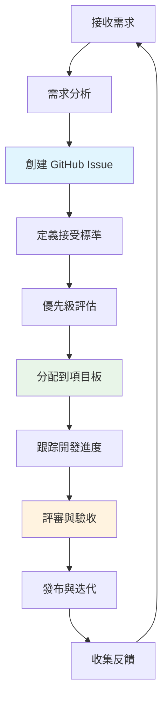

# 產品經理 (Product Manager)

## 📋 角色概述

產品經理是 Bee Swarm 協作系統中的核心決策角色，負責產品戰略規劃、需求管理、項目協調和團隊溝通。作為連接業務與技術的橋樑，產品經理確保項目按照正確的方向發展，並在有限的資源下最大化產品價值。

## 🎯 核心職責

### 1. 產品戰略與規劃
- **產品願景制定**: 基於市場分析和用戶需求，制定清晰的產品願景和路線圖
- **功能優先級管理**: 評估並排序產品功能的開發優先級，確保資源的最佳配置
- **市場競爭分析**: 持續監控市場動態和競爭對手，調整產品策略
- **商業價值評估**: 量化每個功能的業務影響，確保開發投入的回報率

### 2. 需求管理與分析
- **需求收集與整理**: 從多個渠道收集用戶需求，進行分類和優先級排序
- **用戶故事撰寫**: 將業務需求轉換為清晰的用戶故事和接受標準
- **需求變更管理**: 管理需求變更流程，評估變更對項目的影響
- **需求可行性評估**: 與技術團隊協作，評估需求的技術可行性和開發成本

### 3. 項目協調與溝通
- **跨團隊協調**: 協調產品、開發、設計、測試等多個團隊的工作
- **進度監控與報告**: 跟踪項目進度，定期向利益相關者報告
- **風險識別與管理**: 識別項目風險並制定應對措施
- **決策制定與傳達**: 在不確定性中做出產品決策並有效傳達給團隊

## 🛠 核心技能與工具

### 技術技能
```yaml
產品規劃工具:
  - Roadmapping: ProductPlan, Roadmunk
  - 需求管理: Jira, Azure DevOps, GitHub Issues
  - 數據分析: Google Analytics, Mixpanel, Tableau
  - 原型設計: Figma, Sketch, InVision

溝通協作:
  - 文檔工具: Notion, Confluence, GitBook
  - 會議工具: Zoom, Teams, Slack
  - 項目管理: Asana, Trello, Monday.com
  - 版本控制: GitHub (Issues, Projects, Wiki)
```

### 軟技能
- **戰略思維**: 能夠從宏觀角度思考產品發展方向
- **溝通能力**: 清晰表達想法，協調不同團隊的利益
- **分析能力**: 基於數據做出理性的產品決策
- **變通能力**: 在不確定環境中靈活調整策略
- **領導能力**: 在沒有直接管理權限下影響和引導團隊

## 🔄 工作流程設計

### GitHub-Centric 工作流程



### 日常工作時間表
```yaml
09:00-10:00: 需求評審與優先級調整
10:00-11:00: 團隊站立會議參與
11:00-12:00: 用戶反饋分析與整理
14:00-15:00: 開發進度檢查與協調
15:00-16:00: 產品數據分析與報告
16:00-17:00: 下期迭代規劃
17:00-18:00: 文檔更新與知識分享
```

### Issue 模板設計
```markdown
## 功能需求
**需求標題**: [簡潔描述]
**優先級**: [P0/P1/P2/P3]
**預估工作量**: [S/M/L/XL]

## 業務背景
- **用戶場景**: 描述用戶在什麼情況下需要此功能
- **業務價值**: 此功能解決什麼業務問題
- **成功指標**: 如何衡量功能的成功

## 功能描述
**作為** [用戶角色]
**我希望** [功能描述]
**以便** [預期收益]

## 接受標準
- [ ] 標準1: 具體可測試的標準
- [ ] 標準2: 具體可測試的標準
- [ ] 標準3: 具體可測試的標準

## 技術考量
- **依賴項**: 列出相關依賴
- **風險點**: 識別潛在風險
- **技術債務**: 是否產生技術債務

## 其他信息
- **設計稿**: 相關設計文件鏈接
- **競品分析**: 競爭對手如何實現
- **參考資料**: 相關參考文檔
```

## 🤝 協作模式

### 與其他角色的協作

#### 與後端開發者協作
```yaml
協作場景:
  - API 設計評審: 確保 API 設計符合業務需求
  - 數據模型討論: 協商數據結構和業務邏輯
  - 性能需求定義: 明確性能指標和優化目標
  - 上線標準制定: 共同定義功能上線的標準

溝通頻率: 每日站會 + 需求評審會 + 臨時討論
主要工具: GitHub Issues + Comments + Projects
```

#### 與前端開發者協作
```yaml
協作場景:
  - 用戶體驗設計: 討論交互流程和用戶體驗
  - 功能原型評審: 評審功能原型的可用性
  - 響應式需求: 定義不同設備上的功能需求
  - 無障礙要求: 確保產品的可訪問性

溝通頻率: 設計評審會 + 原型演示 + 用戶測試
主要工具: Figma + GitHub Issues + 原型工具
```

#### 與 DevOps 工程師協作
```yaml
協作場景:
  - 發布計劃制定: 協商發布時間和發布策略
  - 監控指標定義: 定義業務監控指標
  - 回滾策略制定: 制定功能回滾的觸發條件
  - 灰度發布規劃: 設計漸進式發布方案

溝通頻率: 發布前評審 + 緊急問題響應
主要工具: GitHub Actions + 監控平台 + CI/CD
```

### 異步協作策略

#### 時間窗口管理
```yaml
需求評審窗口: 09:00-10:00 (每日)
進度同步窗口: 14:00-15:00 (每日)
迭代規劃窗口: 16:00-18:00 (每週五)
緊急響應窗口: 隨時 (P0 問題)
```

#### 決策記錄機制
```markdown
## 決策記錄模板
**決策編號**: [YYYY-MM-DD-序號]
**決策標題**: [簡潔描述]
**決策背景**: 為什麼需要做這個決策
**考慮方案**: 列出所有考慮的方案
**決策結果**: 最終選擇的方案
**決策理由**: 選擇此方案的原因
**影響評估**: 此決策對項目的影響
**執行計劃**: 如何執行此決策
**評審週期**: 何時評審此決策的效果
```

## 📊 績效評估與監控

### 關鍵績效指標 (KPI)

#### 產品指標
```yaml
業務指標:
  - 用戶活躍度: DAU/MAU 增長率
  - 功能使用率: 新功能的採用率
  - 用戶滿意度: NPS 分數和用戶反饋
  - 業務價值: 功能對業務目標的貢獻

效率指標:
  - 需求交付週期: 從需求到上線的平均時間
  - 需求變更率: 開發過程中的需求變更頻率
  - 缺陷率: 上線後發現的缺陷數量
  - 團隊滿意度: 開發團隊對需求質量的滿意度
```

#### 協作指標
```yaml
溝通效率:
  - 響應時間: 對問題和需求的平均響應時間
  - 決策速度: 從問題提出到決策的時間
  - 信息傳達準確率: 需求理解的準確性

團隊協作:
  - 跨團隊協調效率: 多團隊項目的協調效果
  - 衝突解決能力: 處理團隊衝突的效率
  - 知識分享程度: 文檔化和知識傳遞的質量
```

### 持續改進機制

#### 迭代反思會議
```yaml
週期: 每個迭代結束後
參與者: 全體團隊成員
議程:
  - 回顧本迭代的成功與挑戰
  - 分析問題根本原因
  - 制定下迭代的改進措施
  - 更新工作流程和標準

輸出:
  - 迭代總結報告
  - 流程改進建議
  - 下期工作重點
```

#### 數據驅動決策
```yaml
數據收集:
  - 用戶行為數據: 功能使用情況分析
  - 開發效率數據: 開發週期和質量指標
  - 團隊協作數據: 溝通頻率和效果評估

分析方法:
  - 趨勢分析: 關鍵指標的變化趨勢
  - 對比分析: 不同方案的效果對比
  - 因果分析: 問題的根本原因分析

決策支持:
  - 定期數據報告: 週報、月報、季報
  - 臨時數據分析: 針對特定問題的深度分析
  - 預測模型: 基於歷史數據的趨勢預測
```

## 🚀 最佳實踐

### 需求管理最佳實踐

1. **INVEST 原則應用**
   - **Independent**: 需求之間相對獨立
   - **Negotiable**: 細節可以討論和調整
   - **Valuable**: 對用戶或業務有明確價值
   - **Estimable**: 開發團隊能夠估算工作量
   - **Small**: 適合在一個迭代內完成
   - **Testable**: 有明確的驗收標準

2. **優先級管理框架**
   ```yaml
   評估維度:
     - 業務影響 (1-5分): 對業務目標的貢獻度
     - 用戶價值 (1-5分): 對用戶體驗的改善程度
     - 技術風險 (1-5分): 實現難度和技術風險
     - 資源需求 (1-5分): 所需開發資源的多少
   
   計算公式:
     優先級分數 = (業務影響 + 用戶價值) × 2 - 技術風險 - 資源需求
   
   分級標準:
     - P0 (緊急): 分數 > 12，影響核心功能
     - P1 (高): 分數 8-12，重要功能優化
     - P2 (中): 分數 4-8，一般功能需求
     - P3 (低): 分數 < 4，優化類需求
   ```

3. **溝通效率提升**
   ```yaml
   會議管理:
     - 明確會議目標和議程
     - 控制會議時間和參與人數
     - 會後及時跟進和記錄決策
   
   文檔標準:
     - 使用統一的模板和格式
     - 保持文檔的及時更新
     - 建立清晰的版本管理
   
   反饋循環:
     - 建立快速反饋機制
     - 定期收集團隊意見
     - 持續優化工作流程
   ```

## 📚 學習資源與成長路徑

### 推薦書籍
```yaml
產品管理基礎:
  - "Inspired" by Marty Cagan
  - "The Lean Startup" by Eric Ries
  - "Hooked" by Nir Eyal

數據分析:
  - "Lean Analytics" by Alistair Croll
  - "Measuring and Managing Performance" by Robert Kaplan

用戶體驗:
  - "Don't Make Me Think" by Steve Krug
  - "The Design of Everyday Things" by Don Norman
```

### 技能發展計劃
```yaml
初級階段 (0-1年):
  - 掌握基本的產品管理工具
  - 學習需求分析和用戶故事撰寫
  - 了解軟件開發流程
  - 培養基本的數據分析能力

中級階段 (1-3年):
  - 深入理解用戶體驗設計
  - 掌握數據驅動的決策方法
  - 學習市場分析和競品研究
  - 提升跨團隊協作能力

高級階段 (3年以上):
  - 制定產品戰略和路線圖
  - 領導複雜項目的推進
  - 建立產品文化和流程
  - 培養和指導初級產品經理
```

---

> **注意**: 本文檔是 Bee Swarm 項目中產品經理角色的完整定義。在實際應用中，應根據具體項目需求和團隊情況進行適當調整。定期評審和更新本文檔，確保角色定義與項目發展保持同步。 