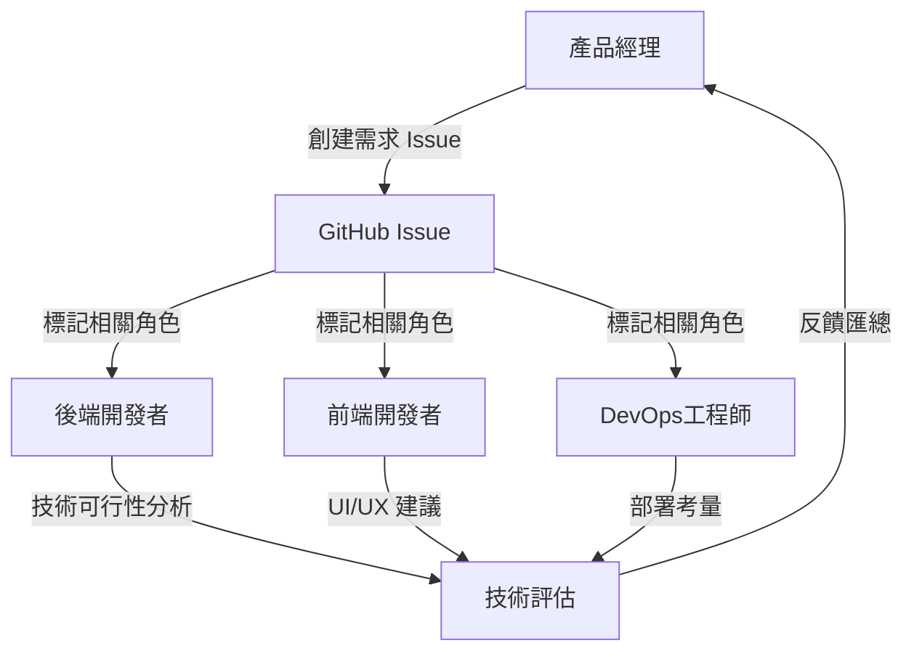
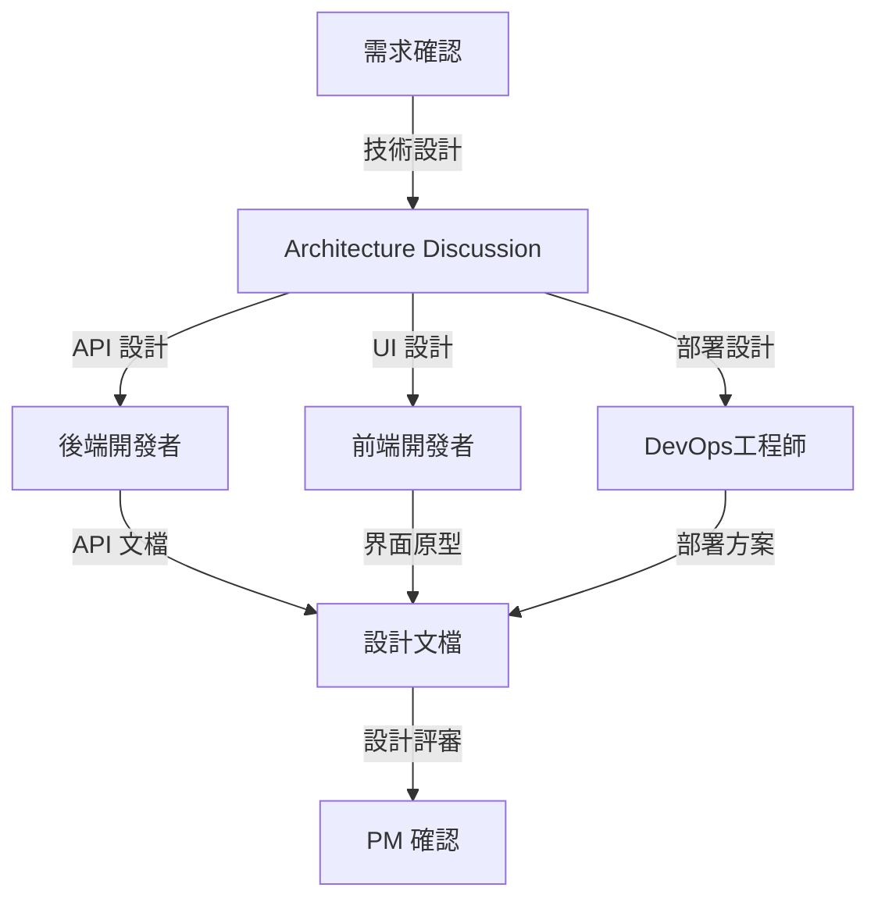
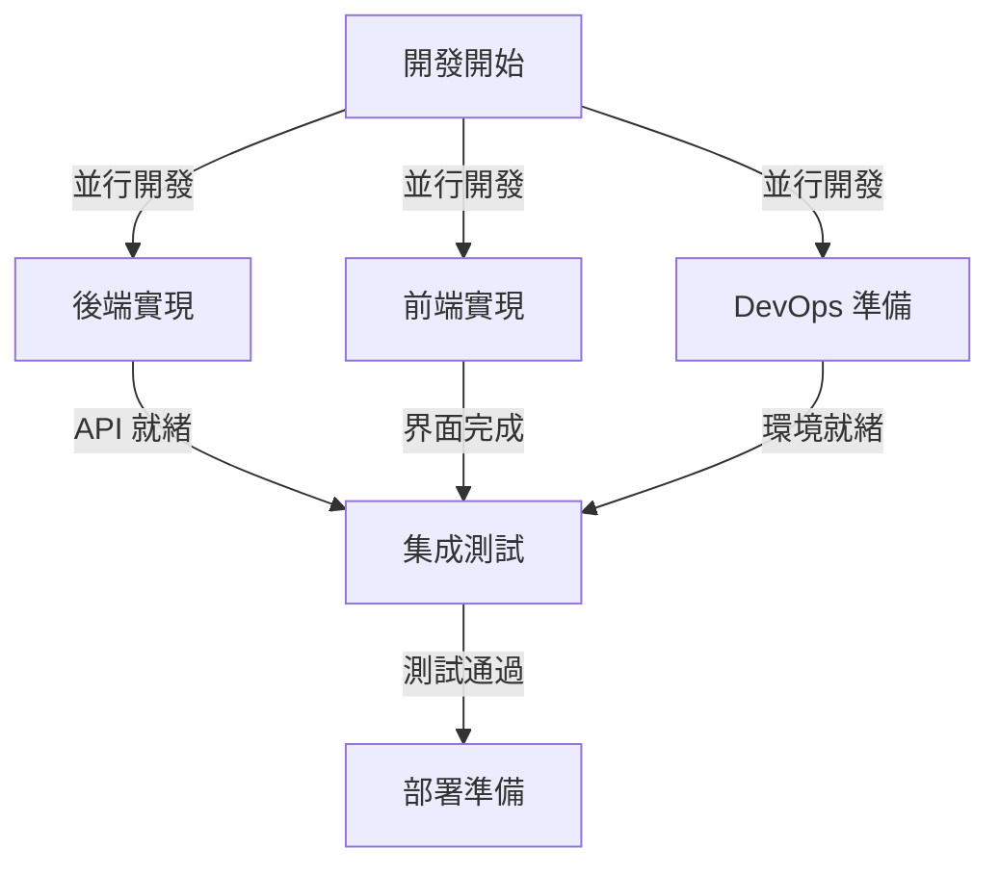
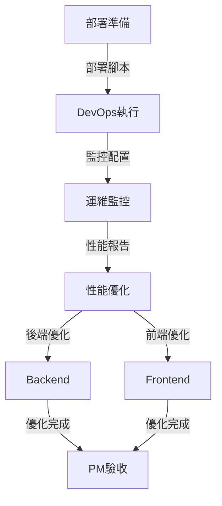

# 角色協作模式

## 本章概要

本章詳細描述 Bee Swarm 項目中四個核心 AI 角色（產品經理、後端開發者、前端開發者、DevOps 工程師）之間的協作模式，包括協作流程、交互方式和協調機制。

- **章節目標**：建立清晰的角色協作框架
- **主要內容**：協作模式、交互流程、衝突解決
- **閱讀收穫**：理解如何有效組織 AI 角色協作

## 🎯 協作設計原則

### 1. 角色專業化分工
- **產品經理**：需求分析、優先級決策、項目協調
- **後端開發者**：API 設計、數據處理、性能優化
- **前端開發者**：用戶界面、交互設計、用戶體驗
- **DevOps 工程師**：部署自動化、監控運維、基礎設施

### 2. 異步協作優先
- 基於 GitHub Issues/PR 的異步溝通
- 避免實時會議依賴
- 支持不同時區和工作節奏

### 3. 透明度與可追蹤性
- 所有決策都有文檔記錄
- 變更歷史完整可查
- 責任歸屬清晰明確

## 🔄 核心協作流程

### Phase 1: 需求分析階段

**協作步驟：**
1. **PM** 創建功能需求 Issue，描述業務目標
2. **Backend** 評估數據模型和 API 設計需求
3. **Frontend** 分析用戶界面和交互需求
4. **DevOps** 評估部署和監控需求
5. **PM** 整合反饋，確定最終需求

### Phase 2: 設計與規劃階段

**協作要點：**
- 後端優先設計 API 契約
- 前端基於 API 設計界面邏輯
- DevOps 準備部署環境規劃
- PM 確保設計符合業務目標

### Phase 3: 開發實現階段

**協作機制：**
- 通過 Feature Branch 隔離開發
- 定期 PR Review 確保代碼質量
- 持續集成驗證兼容性
- 階段性集成測試

### Phase 4: 部署與運維階段

## 🤝 角色間交互模式

### 1. PM ↔ 技術角色
**交互方式：**
- **需求傳達**：通過詳細的 User Story
- **進度跟蹤**：基於 GitHub Project Board
- **決策溝通**：在 Issue 中記錄決策過程

**協作重點：**
- PM 提供業務上下文
- 技術角色提供實現建議
- 共同確定優先級和時間線

### 2. Backend ↔ Frontend
**交互方式：**
- **API 契約**：通過 OpenAPI/Swagger 文檔
- **數據模型**：共享數據結構定義
- **錯誤處理**：統一錯誤碼和消息格式

**協作重點：**
- Backend 優先定義 API 接口
- Frontend 提供用戶體驗需求
- 共同優化數據傳輸效率

### 3. DevOps ↔ 開發角色
**交互方式：**
- **部署需求**：通過部署配置文檔
- **監控指標**：定義關鍵性能指標
- **環境管理**：標準化開發/測試/生產環境

**協作重點：**
- DevOps 提供部署最佳實踐
- 開發者提供應用特定需求
- 共同確保系統穩定性

## ⚡ 衝突解決機制

### 1. 技術分歧處理
**決策流程：**
1. 在相關 Issue 中提出不同觀點
2. 每個角色提供技術論證
3. PM 基於業務目標做最終決策
4. 記錄決策原因和權衡考量

### 2. 優先級衝突
**解決原則：**
- 用戶價值優先
- 技術債務平衡
- 資源約束考慮
- 時間窗口限制

### 3. 資源競爭
**協調機制：**
- 通過 GitHub Project 可視化工作量
- 動態調整任務分配
- 識別瓶頸並優化流程

## 📊 協作效果評估

### 1. 效率指標
- **Issue 解決時間**：從創建到關閉的平均時間
- **PR 合併時間**：從提交到合併的平均時間
- **缺陷修復時間**：Bug 發現到修復的時間

### 2. 質量指標
- **代碼審查覆蓋率**：PR 審查的完整性
- **測試覆蓋率**：自動化測試的代碼覆蓋
- **生產事故率**：部署後出現問題的頻率

### 3. 協作指標
- **跨角色交互頻率**：角色間溝通的活躍度
- **決策響應時間**：問題提出到決策的時間
- **知識共享程度**：文檔完整性和更新頻率

## 實踐指南

### 開始新項目
1. **PM** 創建項目總體 Issue，描述目標和範圍
2. 各角色在 Issue 中添加初步評估和建議
3. 通過 Discussion 功能討論架構方案
4. 創建 Project Board 跟蹤開發進度

### 處理功能變更
1. **PM** 創建變更請求 Issue，說明變更原因
2. 相關角色評估變更影響和工作量
3. 更新項目時間線和優先級
4. 調整現有任務分配

### 應對緊急問題
1. 創建高優先級 Issue，標記所有相關角色
2. 快速分析問題原因和影響範圍
3. 分配緊急修復任務
4. 事後進行問題回顧和流程改進

## 本章小結

### 關鍵要點
- **異步協作**是 Bee Swarm 的核心特色
- **角色專業化**確保高質量輸出
- **透明溝通**建立信任和問責
- **工具支撐**提高協作效率

### 與其他章節的關聯
- 第2章：系統架構設計支撐協作模式
- 第3章：工作流程提供具體操作指南
- 第5章：模擬工具驗證協作效果

### 下一步建議
1. 閱讀第5章了解協作模擬工具
2. 參考第6章掌握具體使用方法
3. 查看第8章學習實際應用案例

## 參考資料

- [GitHub Issues 最佳實踐](https://docs.github.com/en/issues)
- [敏捷開發協作模式](https://agilemanifesto.org/)
- [遠程團隊協作指南](https://about.gitlab.com/company/culture/all-remote/)
- [代碼審查最佳實踐](https://github.com/features/code-review) 