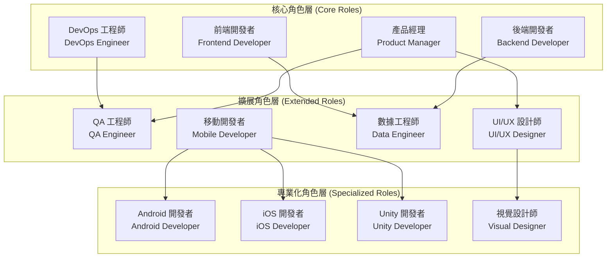
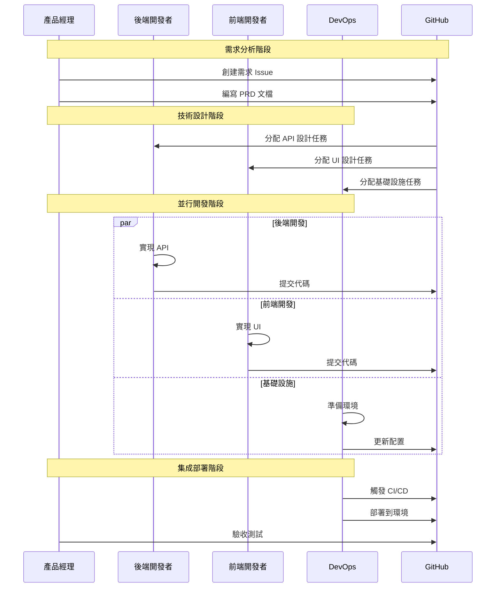

# 第4.1章 AI 角色系統概覽

## 本章概要

- **章節目標**：全面了解 Bee Swarm 的 AI 角色系統設計和組織架構
- **主要內容**：角色系統架構、核心角色職責、協作模式、擴展機制
- **閱讀收穫**：掌握 AI 角色系統的整體設計思路和實施方案

## 詳細內容

### 🎭 角色系統架構

#### 角色分層設計



#### 角色關係矩陣

| 角色 | 產品經理 | 後端開發者 | 前端開發者 | DevOps 工程師 |
|------|----------|------------|------------|---------------|
| **產品經理** | - | 需求傳達 | 需求傳達 | 部署協調 |
| **後端開發者** | 技術評估 | - | API 協調 | 部署配置 |
| **前端開發者** | UI 反饋 | API 集成 | - | 構建配置 |
| **DevOps 工程師** | 運維報告 | 環境支持 | 環境支持 | - |

### 🎯 核心角色職責

#### 1. 產品經理 (Product Manager)

**核心價值觀**
- 用戶中心：始終以用戶需求為導向
- 數據驅動：基於數據和事實做決策
- 協作共贏：與團隊成員密切合作
- 持續改進：持續優化產品和流程

**主要職責**
```
需求管理：
├── 需求收集和分析
├── 需求文檔編寫
├── 可行性評估
└── 驗收標準制定

產品規劃：
├── 產品路線圖制定
├── 版本規劃
├── 功能設計
└── 競品分析

項目管理：
├── 任務分解
├── 進度跟踪
├── 風險管理
└── 資源協調
```

#### 2. 後端開發者 (Backend Developer)

**核心價值觀**
- 代碼質量：編寫高質量、可維護的代碼
- 性能優化：追求系統性能和用戶體驗的卓越
- 安全第一：在開發中優先考慮安全性
- 持續學習：不斷學習新技術和最佳實踐

**主要職責**
```
API 設計開發：
├── RESTful API 設計
├── GraphQL 開發
├── API 文檔編寫
└── 版本管理

數據庫管理：
├── 數據庫設計
├── 數據建模
├── 性能優化
└── 數據遷移

業務邏輯實現：
├── 核心業務功能
├── 數據處理
├── 業務規則
└── 算法優化
```

#### 3. 前端開發者 (Frontend Developer)

**核心價值觀**
- 用戶體驗：始終以用戶體驗為優先
- 視覺美學：追求視覺設計的完美
- 技術創新：不斷探索前端技術的邊界
- 性能優化：確保前端應用的高性能

**主要職責**
```
界面開發：
├── 組件開發
├── 頁面實現
├── 響應式設計
└── 動畫效果

用戶體驗：
├── 交互設計
├── 可用性測試
├── 性能優化
└── 無障礙設計

前端架構：
├── 技術選型
├── 架構設計
├── 狀態管理
└── 路由設計
```

#### 4. DevOps 工程師 (DevOps Engineer)

**核心價值觀**
- 自動化優先：通過自動化提高效率和可靠性
- 持續改進：不斷優化開發和運維流程
- 協作文化：促進開發和運維團隊的協作
- 監控驅動：基於監控數據做運維決策

**主要職責**
```
基礎設施管理：
├── 容器化部署
├── 雲平台管理
├── 網絡配置
└── 安全配置

CI/CD 流程：
├── 構建流程
├── 測試自動化
├── 部署自動化
└── 發布管理

監控運維：
├── 系統監控
├── 日誌管理
├── 性能調優
└── 故障處理
```

### 🔄 協作模式設計

#### 異步協作流程



#### 角色協作原則

**1. 責任明確原則**
```
職責邊界：
├── 每個角色有明確的職責範圍
├── 避免職責重疊和空白
├── 清晰的交接點和標準
└── 明確的決策權限

協作接口：
├── 標準化的溝通協議
├── 統一的工作產出格式
├── 清晰的依賴關係
└── 定期的同步機制
```

**2. 異步優先原則**
```
時間解耦：
├── 不依賴即時響應
├── 支持不同時區工作
├── 狀態驅動的協調
└── 可追溯的工作歷史

工作獨立：
├── 原子化的工作單元
├── 最小化的依賴關係
├── 可重試的操作
└── 明確的輸入輸出
```

### 🛠️ 工具配置與能力

#### AI 工具配置策略

```python
ROLE_TOOL_CONFIG = {
    'product_manager': {
        'primary_tool': 'Claude Code',    # 高級分析能力
        'secondary_tools': ['Gemini CLI', 'GitHub API'],
        'capabilities': ['requirement_analysis', 'project_management'],
        'resource_allocation': 'premium'
    },
    
    'backend_developer': {
        'primary_tool': 'Gemini CLI',     # 代碼生成
        'secondary_tools': ['Claude Code', 'Cursor'],
        'capabilities': ['api_development', 'database_design'],
        'resource_allocation': 'standard'
    },
    
    'frontend_developer': {
        'primary_tool': 'Gemini CLI',     # 組件生成
        'secondary_tools': ['Claude Code', 'Cursor'],
        'capabilities': ['ui_development', 'component_design'],
        'resource_allocation': 'standard'
    },
    
    'devops_engineer': {
        'primary_tool': 'Gemini CLI',     # 腳本生成
        'secondary_tools': ['Claude Code', 'Warp'],
        'capabilities': ['infrastructure_automation', 'deployment'],
        'resource_allocation': 'standard'
    }
}
```

#### 容器化部署架構

```yaml
# docker-compose.yml
version: '3.8'
services:
  product-manager:
    build: ./roles/product_manager
    ports:
      - "6080:6080"
    environment:
      - ROLE_TYPE=product_manager
      - AI_TOOL_PRIMARY=claude_code
    volumes:
      - ./workspace:/workspace
    networks:
      - bee-swarm-network
  
  backend-developer:
    build: ./roles/backend_developer
    ports:
      - "6081:6080"
    environment:
      - ROLE_TYPE=backend_developer
      - AI_TOOL_PRIMARY=gemini_cli
    volumes:
      - ./workspace:/workspace
    networks:
      - bee-swarm-network
  
  frontend-developer:
    build: ./roles/frontend_developer
    ports:
      - "6082:6080"
    environment:
      - ROLE_TYPE=frontend_developer
      - AI_TOOL_PRIMARY=gemini_cli
    volumes:
      - ./workspace:/workspace
    networks:
      - bee-swarm-network
  
  devops-engineer:
    build: ./roles/devops_engineer
    ports:
      - "6083:6080"
    environment:
      - ROLE_TYPE=devops_engineer
      - AI_TOOL_PRIMARY=gemini_cli
    volumes:
      - ./workspace:/workspace
    networks:
      - bee-swarm-network

networks:
  bee-swarm-network:
    driver: bridge
```

### 📊 角色性能指標

#### 關鍵性能指標 (KPIs)

```python
ROLE_PERFORMANCE_METRICS = {
    'productivity': {
        'task_completion_rate': 'gauge',
        'average_task_duration': 'histogram',
        'output_quality_score': 'gauge',
        'collaboration_efficiency': 'gauge'
    },
    
    'quality': {
        'code_review_score': 'gauge',
        'defect_rate': 'gauge',
        'rework_percentage': 'gauge',
        'documentation_completeness': 'gauge'
    },
    
    'collaboration': {
        'response_time': 'histogram',
        'communication_frequency': 'counter',
        'conflict_resolution_time': 'histogram',
        'knowledge_sharing_score': 'gauge'
    },
    
    'learning': {
        'skill_improvement_rate': 'gauge',
        'new_technology_adoption': 'counter',
        'best_practice_application': 'gauge',
        'innovation_contribution': 'counter'
    }
}
```

#### 角色評估框架

```python
class RolePerformanceEvaluator:
    def __init__(self):
        self.evaluation_criteria = self.load_criteria()
        self.weight_config = self.load_weights()
    
    def evaluate_role_performance(self, role_id, time_period):
        """評估角色性能"""
        # 收集性能數據
        performance_data = self.collect_performance_data(role_id, time_period)
        
        # 計算各維度得分
        scores = {
            'productivity': self.calculate_productivity_score(performance_data),
            'quality': self.calculate_quality_score(performance_data),
            'collaboration': self.calculate_collaboration_score(performance_data),
            'learning': self.calculate_learning_score(performance_data)
        }
        
        # 計算總體得分
        overall_score = self.calculate_overall_score(scores)
        
        # 生成改進建議
        recommendations = self.generate_recommendations(scores)
        
        return {
            'role_id': role_id,
            'evaluation_period': time_period,
            'scores': scores,
            'overall_score': overall_score,
            'recommendations': recommendations
        }
```

### 🔧 角色擴展機制

#### 新角色集成框架

```python
class RoleExtensionFramework:
    def __init__(self):
        self.role_registry = RoleRegistry()
        self.container_manager = ContainerManager()
        self.workflow_engine = WorkflowEngine()
    
    def register_new_role(self, role_definition):
        """註冊新角色"""
        # 驗證角色定義
        self.validate_role_definition(role_definition)
        
        # 創建容器配置
        container_config = self.generate_container_config(role_definition)
        
        # 註冊到系統
        self.role_registry.register(role_definition)
        
        # 更新工作流
        self.workflow_engine.integrate_role(role_definition)
        
        # 部署容器
        self.container_manager.deploy_role_container(container_config)
    
    def validate_role_definition(self, role_definition):
        """驗證角色定義"""
        required_fields = [
            'role_id', 'role_name', 'core_responsibilities',
            'collaboration_patterns', 'tool_configuration'
        ]
        
        for field in required_fields:
            if field not in role_definition:
                raise ValueError(f"Missing required field: {field}")
        
        # 驗證協作模式兼容性
        self.validate_collaboration_compatibility(role_definition)
```

#### 角色定制指南

**1. 角色定義模板**
```yaml
# role_template.yml
role_metadata:
  id: "custom_role_id"
  name: "Custom Role Name"
  version: "1.0.0"
  category: "development"

core_capabilities:
  - capability_1
  - capability_2
  - capability_3

responsibilities:
  primary:
    - responsibility_1
    - responsibility_2
  secondary:
    - responsibility_3

collaboration_patterns:
  input_roles:
    - role_a
    - role_b
  output_roles:
    - role_c
    - role_d

tool_configuration:
  primary_tool: "ai_tool_name"
  secondary_tools:
    - "tool_1"
    - "tool_2"
  
container_specification:
  base_image: "fallrising/novnc_llm_cli:latest"
  additional_packages:
    - package_1
    - package_2
  environment_variables:
    - ENV_VAR_1=value1
    - ENV_VAR_2=value2
```

**2. 集成測試清單**
```
功能測試：
├── 角色基本功能驗證
├── AI 工具集成測試
├── 容器啟動和運行測試
└── 角色間通信測試

性能測試：
├── 響應時間測試
├── 資源使用率測試
├── 並發處理能力測試
└── 長期穩定性測試

兼容性測試：
├── 與現有角色協作測試
├── GitHub API 集成測試
├── 工作流集成測試
└── 監控系統集成測試
```

## 實踐指南

### 角色系統部署

**1. 環境準備**
```bash
# 創建角色工作目錄
mkdir -p bee-swarm-roles/{workspace,logs,config}

# 設置環境變量
export GITHUB_TOKEN="your_github_token"
export WEBHOOK_BASE_URL="your_webhook_url"

# 配置 Docker 網絡
docker network create bee-swarm-network
```

**2. 批量角色部署**
```bash
# 使用角色管理腳本
./scripts/role-management.sh build --core-only
./scripts/role-management.sh start --core-only

# 驗證角色狀態
./scripts/role-management.sh status
```

**3. 監控設置**
```python
# 角色監控配置
MONITORING_CONFIG = {
    'metrics_collection_interval': 60,  # 秒
    'health_check_interval': 30,        # 秒
    'performance_evaluation_interval': 3600,  # 秒
    'alert_thresholds': {
        'response_time': 5000,          # 毫秒
        'error_rate': 0.05,             # 5%
        'resource_usage': 0.8           # 80%
    }
}
```

## 本章小結

### 關鍵要點總結
1. **角色系統採用分層設計**，包含核心角色、擴展角色和專業化角色
2. **四個核心角色職責互補**，覆蓋軟件開發的全生命週期
3. **異步協作模式**通過 GitHub 平台實現高效的角色協調
4. **工具配置策略**基於角色特點進行差異化配置
5. **擴展機制**支持新角色的動態集成和定制

### 與其他章節的關聯
- **前置章節**：[AI角色設計](../02-系統架構/AI角色設計.md) - 角色系統的設計基礎
- **下一章**：[產品經理](產品經理.md) - 產品經理角色的詳細說明
- **實踐章節**：[容器部署](../07-部署運維/容器部署.md) - 角色系統的部署實踐

### 下一步建議
1. 深入了解每個核心角色的具體職責和工作方式
2. 實踐角色容器的部署和管理
3. 學習角色協作模式的配置和優化

## 參考資料

- [軟件團隊角色定義最佳實踐](#)
- [AI Agent 協作架構設計](#)
- [容器化部署指南](#)
- [DevOps 文化和實踐](#)

---

*本章全面介紹了 Bee Swarm 的 AI 角色系統概覽，為理解具體角色實現奠定了基礎。* 