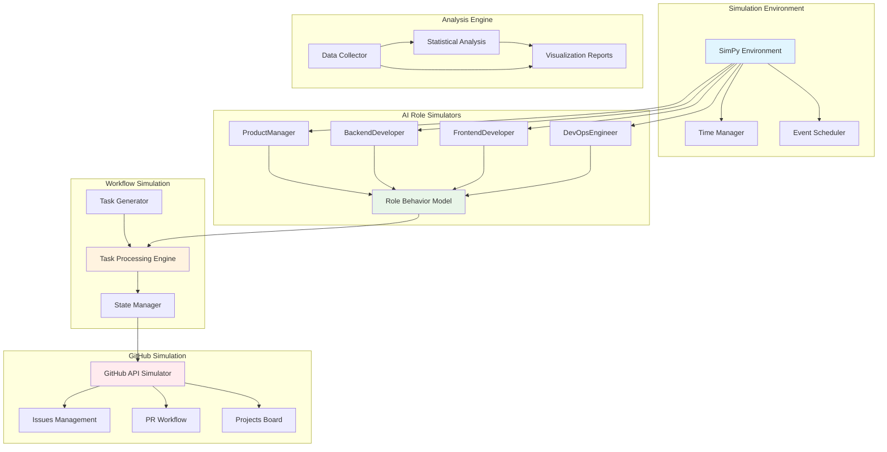

# 🔬 Bee Swarm Simulator Usage Guide

## 📋 Document Information
- **Target Audience**: Researchers, System Designers, Project Managers
- **Prerequisites**: Python basics, Statistics concepts
- **Completion Time**: 60-90 minutes
- **Last Updated**: January 2025

## 🎯 Simulator Overview

The Bee Swarm simulator is based on the SimPy discrete event simulation framework, specifically designed to validate and optimize AI role collaboration patterns. By simulating real software development processes, it helps researchers quantitatively analyze the effectiveness of different collaboration strategies.

### Core Features
- **Collaboration Pattern Validation**: Test different AI role configurations and workflows
- **Performance Prediction**: Predict project delivery time and resource requirements
- **Bottleneck Identification**: Discover bottlenecks and optimization opportunities in collaboration processes
- **Strategy Comparison**: Compare the effectiveness of different collaboration patterns

### Application Scenarios
```yaml
use_cases:
  project_planning:
    description: "Feasibility analysis before project launch"
    duration: "Hours of simulation for 3-6 month projects"
    
  process_optimization:
    description: "Improvement and optimization of existing processes"
    duration: "Days of simulating historical projects"
    
  team_configuration:
    description: "Exploration of optimal team configurations"
    duration: "Hours testing multiple configurations"
    
  research_analysis:
    description: "Empirical research on AI collaboration theory"
    duration: "Weeks of in-depth analysis"
```

## 🏗️ Simulator Architecture

### Core Component Diagram


### Main Simulator Classes
```python
# Simulator core architecture
class BeeSwarmSimulator:
    def __init__(self, config: SimulationConfig):
        self.env = simpy.Environment()
        self.config = config
        self.roles = {}
        self.github = GitHubSimulator(self.env)
        self.task_queue = simpy.Store(self.env)
        self.metrics = MetricsCollector()
        
    def add_role(self, role_name: str, role_class):
        """Add AI role to simulation environment"""
        self.roles[role_name] = role_class(self.env, self.github)
        
    def run_simulation(self, duration: int) -> SimulationResults:
        """Run simulation and return results"""
        # Start all role processes
        for role in self.roles.values():
            self.env.process(role.work_process())
            
        # Run simulation
        self.env.run(until=duration)
        
        # Collect and analyze results
        return self.metrics.generate_report()
```

## 🤖 AI Role Modeling

### Product Manager Simulator
```python
class ProductManagerSimulator:
    def __init__(self, env, github_api):
        self.env = env
        self.github = github_api
        self.workload = simpy.Resource(env, capacity=1)
        self.skill_level = 0.8  # Skill level 0-1
        self.decision_speed = 2.0  # Decision speed (hours)
        
    def work_process(self):
        """Product manager workflow"""
        while True:
            # Requirements gathering phase
            yield self.env.timeout(random.exponential(4))  # Check every 4 hours
            
            # Create new requirements
            if random.random() < 0.3:  # 30% probability of new requirement
                requirement = self.create_requirement()
                yield self.env.process(self.process_requirement(requirement))
            
            # Check and manage existing tasks
            yield self.env.process(self.manage_existing_tasks())
    
    def create_requirement(self):
        """Create functional requirement"""
        return {
            'type': random.choice(['feature', 'enhancement', 'epic']),
            'complexity': random.triangular(1, 10, 5),
            'priority': random.choice(['high', 'medium', 'low']),
            'estimated_hours': random.lognormal(3, 0.5),
            'dependencies': []
        }
    
    def process_requirement(self, requirement):
        """Process requirement analysis"""
        analysis_time = requirement['complexity'] * self.decision_speed / self.skill_level
        yield self.env.timeout(analysis_time)
        
        # Create GitHub Issue
        issue = yield self.env.process(
            self.github.create_issue(requirement)
        )
        
        # Assign to appropriate role
        yield self.env.process(self.assign_task(issue))
        
        return issue
```

### Developer Simulator
```python
class DeveloperSimulator:
    def __init__(self, env, github_api, role_type='backend'):
        self.env = env
        self.github = github_api
        self.role_type = role_type
        self.coding_speed = random.normal(1.0, 0.2)  # Coding speed variation
        self.bug_rate = 0.1  # Defect rate
        self.current_task = None
        
    def work_process(self):
        """Developer workflow"""
        while True:
            # Check for assigned tasks
            task = yield self.env.process(self.get_assigned_task())
            
            if task:
                yield self.env.process(self.implement_task(task))
            else:
                # Wait when no tasks
                yield self.env.timeout(1)  # Wait 1 hour
    
    def implement_task(self, task):
        """Implement task"""
        # Design phase
        design_time = task['estimated_hours'] * 0.2
        yield self.env.timeout(design_time / self.coding_speed)
        
        # Coding phase
        coding_time = task['estimated_hours'] * 0.6
        yield self.env.timeout(coding_time / self.coding_speed)
        
        # Testing phase
        testing_time = task['estimated_hours'] * 0.2
        yield self.env.timeout(testing_time)
        
        # Submit Pull Request
        pr = yield self.env.process(
            self.github.create_pull_request(task)
        )
        
        # Possible bug fixes needed
        if random.random() < self.bug_rate:
            fix_time = task['estimated_hours'] * 0.1
            yield self.env.timeout(fix_time)
        
        return pr
```

### GitHub API Simulator
```python
class GitHubSimulator:
    def __init__(self, env):
        self.env = env
        self.issues = []
        self.pull_requests = []
        self.api_rate_limit = simpy.Resource(env, capacity=5000)  # API limit
        
    def create_issue(self, requirement):
        """Simulate creating GitHub Issue"""
        with self.api_rate_limit.request() as req:
            yield req
            yield self.env.timeout(0.1)  # API delay
            
            issue = Issue({
                'id': len(self.issues) + 1,
                'title': f"{requirement['type']}: {requirement.get('title', 'Task')}",
                'labels': [requirement['type'], requirement['priority']],
                'assignee': None,
                'created_at': self.env.now,
                'complexity': requirement['complexity']
            })
            
            self.issues.append(issue)
            return issue
    
    def create_pull_request(self, task):
        """Simulate creating Pull Request"""
        with self.api_rate_limit.request() as req:
            yield req
            yield self.env.timeout(0.1)
            
            pr = PullRequest({
                'id': len(self.pull_requests) + 1,
                'issue_id': task['id'],
                'created_at': self.env.now,
                'status': 'open'
            })
            
            self.pull_requests.append(pr)
            return pr
```

## 📊 Simulation Configuration and Parameters

### Basic Configuration File
```yaml
# config/simulation_config.yml
simulation:
  duration: 2160  # 90 days (hours)
  random_seed: 42
  
roles:
  product_manager:
    count: 1
    skill_level: 0.8
    decision_speed: 2.0  # hours
    availability: 0.8    # 80% available time
    
  backend_developer:
    count: 1
    coding_speed: 1.0
    bug_rate: 0.1
    review_time: 1.0
    
  frontend_developer:
    count: 1
    coding_speed: 0.9
    bug_rate: 0.08
    design_time_ratio: 0.3
    
  devops_engineer:
    count: 1
    automation_level: 0.7
    deployment_success_rate: 0.95
    monitoring_overhead: 0.1

project_parameters:
  feature_arrival_rate: 0.5  # 0.5 features per day
  epic_ratio: 0.2            # 20% are large features
  urgent_request_rate: 0.1   # 10% urgent requests
  
  complexity_distribution:
    simple: 0.4   # 40% simple tasks
    medium: 0.4   # 40% medium tasks
    complex: 0.2  # 20% complex tasks
    
constraints:
  github_api_limit: 5000  # API calls per hour
  vps_cpu_cores: 2
  vps_memory_gb: 4
  working_hours_per_day: 8
```

### Advanced Parameter Tuning
```python
class SimulationConfig:
    def __init__(self, config_file: str):
        self.config = self.load_config(config_file)
        self.setup_distributions()
    
    def setup_distributions(self):
        """Set up random distribution parameters"""
        self.task_complexity = {
            'simple': (1, 8),      # 1-8 hours
            'medium': (8, 40),     # 1-5 days
            'complex': (40, 160)   # 1-4 weeks
        }
        
        self.communication_delay = {
            'same_timezone': (0.5, 2),    # 0.5-2 hours
            'different_timezone': (4, 12)  # 4-12 hours
        }
        
        self.review_time = {
            'code_review': (0.5, 3),      # 30 minutes-3 hours
            'design_review': (1, 8),      # 1-8 hours
            'requirements_review': (2, 16) # 2-16 hours
        }
```

## 🚀 Running Simulations

### Basic Usage Example
```python
# examples/basic_simulation.py
from bee_swarm_simulator import BeeSwarmSimulator, SimulationConfig

def run_basic_simulation():
    # Load configuration
    config = SimulationConfig('config/basic_config.yml')
    
    # Create simulator
    simulator = BeeSwarmSimulator(config)
    
    # Add roles
    simulator.add_role('pm', ProductManagerSimulator)
    simulator.add_role('backend', BackendDeveloperSimulator)
    simulator.add_role('frontend', FrontendDeveloperSimulator)
    simulator.add_role('devops', DevOpsEngineerSimulator)
    
    # Run simulation
    print("🚀 Starting Bee Swarm collaboration simulation...")
    results = simulator.run_simulation(duration=2160)  # 90 days
    
    # Output results
    print("\n📊 Simulation Results Summary:")
    print(f"- Completed tasks: {results.completed_tasks}")
    print(f"- Average completion time: {results.avg_completion_time:.1f} hours")
    print(f"- Team utilization: {results.team_utilization:.1%}")
    print(f"- Collaboration efficiency: {results.collaboration_efficiency:.1%}")
    
    return results

if __name__ == "__main__":
    results = run_basic_simulation()
```

### Batch Experiment Framework
```python
# examples/experiment_runner.py
class ExperimentRunner:
    def __init__(self):
        self.experiments = []
        self.results = []
    
    def add_experiment(self, name: str, config: dict):
        """Add experiment configuration"""
        self.experiments.append({
            'name': name,
            'config': config,
            'replications': 10  # Run each experiment 10 times
        })
    
    def run_all_experiments(self):
        """Run all experiments"""
        for exp in self.experiments:
            print(f"\n🧪 Running experiment: {exp['name']}")
            exp_results = []
            
            for i in range(exp['replications']):
                print(f"  🔄 Replication {i+1}/{exp['replications']}")
                
                # Create configuration
                config = SimulationConfig(exp['config'])
                config.random_seed = i  # Different random seed
                
                # Run simulation
                simulator = BeeSwarmSimulator(config)
                self.setup_roles(simulator)
                result = simulator.run_simulation(duration=2160)
                
                exp_results.append(result)
            
            # Calculate statistics
            self.results.append({
                'experiment': exp['name'],
                'results': exp_results,
                'statistics': self.calculate_statistics(exp_results)
            })
    
    def calculate_statistics(self, results):
        """Calculate statistical data"""
        completion_times = [r.avg_completion_time for r in results]
        team_utilizations = [r.team_utilization for r in results]
        
        return {
            'completion_time': {
                'mean': np.mean(completion_times),
                'std': np.std(completion_times),
                'ci_95': np.percentile(completion_times, [2.5, 97.5])
            },
            'team_utilization': {
                'mean': np.mean(team_utilizations),
                'std': np.std(team_utilizations),
                'ci_95': np.percentile(team_utilizations, [2.5, 97.5])
            }
        }

# Usage example
runner = ExperimentRunner()

# Compare different team configurations
runner.add_experiment('small_team', {'roles': {'pm': 1, 'dev': 2}})
runner.add_experiment('medium_team', {'roles': {'pm': 1, 'dev': 3, 'devops': 1}})
runner.add_experiment('large_team', {'roles': {'pm': 1, 'dev': 4, 'devops': 1, 'qa': 1}})

runner.run_all_experiments()
```

## 📈 Data Analysis and Visualization

### Results Analyzer
```python
class SimulationAnalyzer:
    def __init__(self, results):
        self.results = results
        self.df = self.results_to_dataframe()
    
    def generate_performance_report(self):
        """Generate performance analysis report"""
        report = {
            'summary': self.get_summary_statistics(),
            'bottlenecks': self.identify_bottlenecks(),
            'trends': self.analyze_trends(),
            'recommendations': self.generate_recommendations()
        }
        return report
    
    def plot_timeline(self):
        """Plot project timeline"""
        fig, (ax1, ax2, ax3) = plt.subplots(3, 1, figsize=(12, 10))
        
        # Task completion timeline
        completed_tasks = self.df[self.df['status'] == 'completed']
        ax1.scatter(completed_tasks['completion_time'], 
                   completed_tasks['task_id'],
                   c=completed_tasks['complexity'],
                   cmap='viridis',
                   alpha=0.7)
        ax1.set_xlabel('Completion Time (hours)')
        ax1.set_ylabel('Task ID')
        ax1.set_title('Task Completion Timeline')
        
        # Team utilization
        hourly_utilization = self.calculate_hourly_utilization()
        ax2.plot(hourly_utilization.index, hourly_utilization.values)
        ax2.set_xlabel('Time (hours)')
        ax2.set_ylabel('Team Utilization')
        ax2.set_title('Team Utilization Trends')
        
        # Collaboration network
        self.plot_collaboration_network(ax3)
        
        plt.tight_layout()
        return fig
    
    def plot_collaboration_network(self, ax):
        """Plot collaboration network diagram"""
        import networkx as nx
        
        # Build collaboration network
        G = nx.Graph()
        collaboration_data = self.analyze_collaboration_patterns()
        
        for collab in collaboration_data:
            G.add_edge(collab['role1'], collab['role2'], 
                      weight=collab['frequency'])
        
        # Draw network
        pos = nx.spring_layout(G)
        nx.draw_networkx_nodes(G, pos, ax=ax, node_color='lightblue', 
                              node_size=1000)
        nx.draw_networkx_labels(G, pos, ax=ax)
        
        # Draw edges, thickness represents collaboration frequency
        edges = G.edges()
        weights = [G[u][v]['weight'] for u, v in edges]
        nx.draw_networkx_edges(G, pos, ax=ax, width=weights)
        
        ax.set_title('Role Collaboration Network')
        ax.axis('off')
```

### Comparison Analysis Tools
```python
def compare_scenarios(scenarios: List[SimulationResults]):
    """Compare results from different scenarios"""
    comparison = pd.DataFrame()
    
    for i, scenario in enumerate(scenarios):
        comparison[f'Scenario_{i+1}'] = {
            'Avg Completion Time': scenario.avg_completion_time,
            'Team Utilization': scenario.team_utilization,
            'Collaboration Efficiency': scenario.collaboration_efficiency,
            'Total Cost': scenario.total_cost,
            'Quality Score': scenario.quality_score
        }
    
    # Generate comparison charts
    fig, axes = plt.subplots(2, 3, figsize=(15, 10))
    
    metrics = ['Avg Completion Time', 'Team Utilization', 
               'Collaboration Efficiency', 'Total Cost', 'Quality Score']
    
    for i, metric in enumerate(metrics):
        ax = axes[i//3, i%3]
        comparison.loc[metric].plot(kind='bar', ax=ax)
        ax.set_title(metric)
        ax.set_ylabel('Value')
        ax.tick_params(axis='x', rotation=45)
    
    plt.tight_layout()
    return fig, comparison
```

## 🔧 Advanced Features

### Custom Role Modeling
```python
class CustomRoleSimulator:
    def __init__(self, env, config):
        self.env = env
        self.config = config
        self.setup_behavior_model()
    
    def setup_behavior_model(self):
        """Set up behavior model"""
        # Can be based on machine learning models or rule engines
        self.behavior_patterns = {
            'work_intensity': self.config.get('work_intensity', 0.8),
            'collaboration_preference': self.config.get('collab_pref', 0.6),
            'learning_rate': self.config.get('learning_rate', 0.1),
            'stress_tolerance': self.config.get('stress_tolerance', 0.7)
        }
    
    def adaptive_behavior(self, current_state):
        """Adaptive behavior adjustment"""
        # Adjust behavior parameters based on current state
        if current_state['workload'] > 0.9:
            self.behavior_patterns['work_intensity'] *= 0.9
        elif current_state['workload'] < 0.5:
            self.behavior_patterns['work_intensity'] *= 1.1
            
        return self.behavior_patterns
```

### Real-time Monitoring and Debugging
```python
class SimulationMonitor:
    def __init__(self, simulator):
        self.simulator = simulator
        self.events = []
        self.metrics_history = []
    
    def log_event(self, event_type, data):
        """Log simulation events"""
        self.events.append({
            'timestamp': self.simulator.env.now,
            'type': event_type,
            'data': data
        })
    
    def real_time_dashboard(self):
        """Real-time dashboard (using Streamlit or similar)"""
        import streamlit as st
        
        st.title("Bee Swarm Simulator Real-time Monitoring")
        
        # Real-time metrics
        col1, col2, col3 = st.columns(3)
        with col1:
            st.metric("Current Time", f"{self.simulator.env.now:.1f}h")
        with col2:
            st.metric("Active Tasks", len(self.get_active_tasks()))
        with col3:
            st.metric("Completed Tasks", len(self.get_completed_tasks()))
        
        # Real-time charts
        if self.metrics_history:
            df = pd.DataFrame(self.metrics_history)
            st.line_chart(df.set_index('timestamp'))
```

## 📚 Practical Guide

### Simulation Experiment Design
```yaml
experiment_design:
  research_questions:
    - "Impact of different team sizes on delivery efficiency"
    - "Comparison of async vs sync collaboration modes"
    - "Effect of AI tool capabilities on project success rate"
    
  variables:
    independent:
      - team_size: [2, 3, 4, 5]
      - collaboration_mode: [async, sync, hybrid]
      - ai_capability: [low, medium, high]
    dependent:
      - delivery_time
      - quality_score
      - cost_efficiency
      - team_satisfaction
      
  experimental_plan:
    full_factorial: "3 x 4 x 3 = 36 conditions"
    replications: 10
    total_runs: 360
    estimated_time: "6-8 hours"
```

### Results Interpretation Guide
```python
def interpret_results(results):
    """Results interpretation guide"""
    interpretation = {
        'performance_indicators': {
            'excellent': {'completion_time': '<= planned time', 'quality': '>= 90%'},
            'good': {'completion_time': '<= 110% planned time', 'quality': '>= 80%'},
            'poor': {'completion_time': '> 120% planned time', 'quality': '< 70%'}
        },
        'bottleneck_patterns': {
            'pm_bottleneck': 'Frequent requirement changes, decision delays',
            'dev_bottleneck': 'High technical complexity, implementation difficulties',
            'communication_bottleneck': 'Poor inter-role coordination'
        },
        'optimization_suggestions': {
            'add_resources': 'Increase role count or capabilities',
            'improve_process': 'Optimize workflows and communication',
            'reduce_scope': 'Reduce project complexity'
        }
    }
    return interpretation
```

---

## 📋 Usage Checklist

### Pre-simulation Preparation
- [ ] Clarify research objectives and hypotheses
- [ ] Prepare configuration files and parameters
- [ ] Set up experiment environment and dependencies
- [ ] Determine simulation duration and replication count
- [ ] Prepare result analysis tools

### Simulation Execution
- [ ] Verify configuration file correctness
- [ ] Run pre-test validation
- [ ] Monitor simulation process
- [ ] Record anomalies
- [ ] Backup raw result data

### Result Analysis
- [ ] Check data completeness
- [ ] Perform statistical significance tests
- [ ] Generate visualization reports
- [ ] Interpret results and findings
- [ ] Propose improvement recommendations

---

*This guide provides comprehensive methods for using the Bee Swarm simulator, supporting researchers in conducting in-depth collaboration pattern analysis and optimization.* 