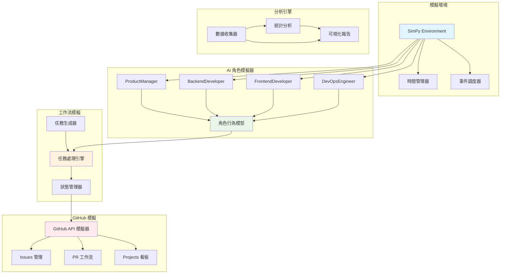

# 🔬 Bee Swarm 模擬器使用指南

## 📋 文檔信息
- **目標讀者**：研究者、系統設計師、項目經理
- **前置知識**：Python 基礎、統計學概念
- **完成時間**：60-90分鐘
- **最後更新**：2025年7月

## 🎯 模擬器概述

Bee Swarm 模擬器基於 SimPy 離散事件模擬框架，專門設計用於驗證和優化 AI 角色協作模式。通過模擬真實的軟件開發流程，幫助研究者量化分析不同協作策略的效果。

### 核心功能
- **協作模式驗證**：測試不同的 AI 角色配置和工作流程
- **性能預測**：預測項目交付時間和資源需求
- **瓶頸識別**：發現協作過程中的瓶頸和優化機會
- **策略比較**：對比不同協作模式的效果

### 應用場景
```yaml
use_cases:
  project_planning:
    description: "項目啟動前的可行性分析"
    duration: "數小時模擬3-6個月項目"
    
  process_optimization:
    description: "現有流程的改進和優化"
    duration: "數天模擬歷史項目"
    
  team_configuration:
    description: "最佳團隊配置的探索"
    duration: "數小時測試多種配置"
    
  research_analysis:
    description: "AI 協作理論的實證研究"
    duration: "數週深入分析"
```

## 🏗️ 模擬器架構

### 核心組件圖


### 主要模擬器類
```python
# 模擬器核心架構
class BeeSwarmSimulator:
    def __init__(self, config: SimulationConfig):
        self.env = simpy.Environment()
        self.config = config
        self.roles = {}
        self.github = GitHubSimulator(self.env)
        self.task_queue = simpy.Store(self.env)
        self.metrics = MetricsCollector()
        
    def add_role(self, role_name: str, role_class):
        """添加 AI 角色到模擬環境"""
        self.roles[role_name] = role_class(self.env, self.github)
        
    def run_simulation(self, duration: int) -> SimulationResults:
        """運行模擬並返回結果"""
        # 啟動所有角色進程
        for role in self.roles.values():
            self.env.process(role.work_process())
            
        # 運行模擬
        self.env.run(until=duration)
        
        # 收集和分析結果
        return self.metrics.generate_report()
```

## 🤖 AI 角色建模

### 產品經理模擬器
```python
class ProductManagerSimulator:
    def __init__(self, env, github_api):
        self.env = env
        self.github = github_api
        self.workload = simpy.Resource(env, capacity=1)
        self.skill_level = 0.8  # 技能水平 0-1
        self.decision_speed = 2.0  # 決策速度（小時）
        
    def work_process(self):
        """產品經理工作流程"""
        while True:
            # 需求收集階段
            yield self.env.timeout(random.exponential(4))  # 每4小時檢查一次
            
            # 創建新需求
            if random.random() < 0.3:  # 30% 概率產生新需求
                requirement = self.create_requirement()
                yield self.env.process(self.process_requirement(requirement))
            
            # 檢查和管理現有任務
            yield self.env.process(self.manage_existing_tasks())
    
    def create_requirement(self):
        """創建功能需求"""
        return {
            'type': random.choice(['feature', 'enhancement', 'epic']),
            'complexity': random.triangular(1, 10, 5),
            'priority': random.choice(['high', 'medium', 'low']),
            'estimated_hours': random.lognormal(3, 0.5),
            'dependencies': []
        }
    
    def process_requirement(self, requirement):
        """處理需求分析"""
        analysis_time = requirement['complexity'] * self.decision_speed / self.skill_level
        yield self.env.timeout(analysis_time)
        
        # 創建 GitHub Issue
        issue = yield self.env.process(
            self.github.create_issue(requirement)
        )
        
        # 分配給相應角色
        yield self.env.process(self.assign_task(issue))
        
        return issue
```

### 開發者模擬器
```python
class DeveloperSimulator:
    def __init__(self, env, github_api, role_type='backend'):
        self.env = env
        self.github = github_api
        self.role_type = role_type
        self.coding_speed = random.normal(1.0, 0.2)  # 編程速度變異
        self.bug_rate = 0.1  # 缺陷率
        self.current_task = None
        
    def work_process(self):
        """開發者工作流程"""
        while True:
            # 檢查是否有分配的任務
            task = yield self.env.process(self.get_assigned_task())
            
            if task:
                yield self.env.process(self.implement_task(task))
            else:
                # 沒有任務時等待
                yield self.env.timeout(1)  # 等待1小時
    
    def implement_task(self, task):
        """實現任務"""
        # 設計階段
        design_time = task['estimated_hours'] * 0.2
        yield self.env.timeout(design_time / self.coding_speed)
        
        # 編碼階段
        coding_time = task['estimated_hours'] * 0.6
        yield self.env.timeout(coding_time / self.coding_speed)
        
        # 測試階段
        testing_time = task['estimated_hours'] * 0.2
        yield self.env.timeout(testing_time)
        
        # 提交 Pull Request
        pr = yield self.env.process(
            self.github.create_pull_request(task)
        )
        
        # 可能需要修復缺陷
        if random.random() < self.bug_rate:
            fix_time = task['estimated_hours'] * 0.1
            yield self.env.timeout(fix_time)
        
        return pr
```

### GitHub API 模擬器
```python
class GitHubSimulator:
    def __init__(self, env):
        self.env = env
        self.issues = []
        self.pull_requests = []
        self.api_rate_limit = simpy.Resource(env, capacity=5000)  # API 限制
        
    def create_issue(self, requirement):
        """模擬創建 GitHub Issue"""
        with self.api_rate_limit.request() as req:
            yield req
            yield self.env.timeout(0.1)  # API 延遲
            
            issue = Issue({
                'id': len(self.issues) + 1,
                'title': f"{requirement['type']}: {requirement.get('title', 'Task')}",
                'labels': [requirement['type'], requirement['priority']],
                'assignee': None,
                'created_at': self.env.now,
                'complexity': requirement['complexity']
            })
            
            self.issues.append(issue)
            return issue
    
    def create_pull_request(self, task):
        """模擬創建 Pull Request"""
        with self.api_rate_limit.request() as req:
            yield req
            yield self.env.timeout(0.1)
            
            pr = PullRequest({
                'id': len(self.pull_requests) + 1,
                'issue_id': task['id'],
                'created_at': self.env.now,
                'status': 'open'
            })
            
            self.pull_requests.append(pr)
            return pr
```

## 📊 模擬配置與參數

### 基礎配置文件
```yaml
# config/simulation_config.yml
simulation:
  duration: 2160  # 90天（小時）
  random_seed: 42
  
roles:
  product_manager:
    count: 1
    skill_level: 0.8
    decision_speed: 2.0  # 小時
    availability: 0.8    # 80% 可用時間
    
  backend_developer:
    count: 1
    coding_speed: 1.0
    bug_rate: 0.1
    review_time: 1.0
    
  frontend_developer:
    count: 1
    coding_speed: 0.9
    bug_rate: 0.08
    design_time_ratio: 0.3
    
  devops_engineer:
    count: 1
    automation_level: 0.7
    deployment_success_rate: 0.95
    monitoring_overhead: 0.1

project_parameters:
  feature_arrival_rate: 0.5  # 每天0.5個新功能
  epic_ratio: 0.2            # 20% 是大型功能
  urgent_request_rate: 0.1   # 10% 緊急需求
  
  complexity_distribution:
    simple: 0.4   # 40% 簡單任務
    medium: 0.4   # 40% 中等任務
    complex: 0.2  # 20% 複雜任務
    
constraints:
  github_api_limit: 5000  # 每小時API調用限制
  vps_cpu_cores: 2
  vps_memory_gb: 4
  working_hours_per_day: 8
```

### 高級參數調整
```python
class SimulationConfig:
    def __init__(self, config_file: str):
        self.config = self.load_config(config_file)
        self.setup_distributions()
    
    def setup_distributions(self):
        """設置隨機分佈參數"""
        self.task_complexity = {
            'simple': (1, 8),      # 1-8小時
            'medium': (8, 40),     # 1-5天
            'complex': (40, 160)   # 1-4週
        }
        
        self.communication_delay = {
            'same_timezone': (0.5, 2),    # 0.5-2小時
            'different_timezone': (4, 12)  # 4-12小時
        }
        
        self.review_time = {
            'code_review': (0.5, 3),      # 30分鐘-3小時
            'design_review': (1, 8),      # 1-8小時
            'requirements_review': (2, 16) # 2-16小時
        }
```

## 🚀 運行模擬

### 基本使用範例
```python
# examples/basic_simulation.py
from bee_swarm_simulator import BeeSwarmSimulator, SimulationConfig

def run_basic_simulation():
    # 加載配置
    config = SimulationConfig('config/basic_config.yml')
    
    # 創建模擬器
    simulator = BeeSwarmSimulator(config)
    
    # 添加角色
    simulator.add_role('pm', ProductManagerSimulator)
    simulator.add_role('backend', BackendDeveloperSimulator)
    simulator.add_role('frontend', FrontendDeveloperSimulator)
    simulator.add_role('devops', DevOpsEngineerSimulator)
    
    # 運行模擬
    print("🚀 開始模擬 Bee Swarm 協作流程...")
    results = simulator.run_simulation(duration=2160)  # 90天
    
    # 輸出結果
    print("\n📊 模擬結果摘要:")
    print(f"- 完成任務數: {results.completed_tasks}")
    print(f"- 平均完成時間: {results.avg_completion_time:.1f} 小時")
    print(f"- 團隊利用率: {results.team_utilization:.1%}")
    print(f"- 協作效率: {results.collaboration_efficiency:.1%}")
    
    return results

if __name__ == "__main__":
    results = run_basic_simulation()
```

### 批量實驗框架
```python
# examples/experiment_runner.py
class ExperimentRunner:
    def __init__(self):
        self.experiments = []
        self.results = []
    
    def add_experiment(self, name: str, config: dict):
        """添加實驗配置"""
        self.experiments.append({
            'name': name,
            'config': config,
            'replications': 10  # 每個實驗運行10次
        })
    
    def run_all_experiments(self):
        """運行所有實驗"""
        for exp in self.experiments:
            print(f"\n🧪 運行實驗: {exp['name']}")
            exp_results = []
            
            for i in range(exp['replications']):
                print(f"  🔄 重複 {i+1}/{exp['replications']}")
                
                # 創建配置
                config = SimulationConfig(exp['config'])
                config.random_seed = i  # 不同的隨機種子
                
                # 運行模擬
                simulator = BeeSwarmSimulator(config)
                self.setup_roles(simulator)
                result = simulator.run_simulation(duration=2160)
                
                exp_results.append(result)
            
            # 統計結果
            self.results.append({
                'experiment': exp['name'],
                'results': exp_results,
                'statistics': self.calculate_statistics(exp_results)
            })
    
    def calculate_statistics(self, results):
        """計算統計數據"""
        completion_times = [r.avg_completion_time for r in results]
        team_utilizations = [r.team_utilization for r in results]
        
        return {
            'completion_time': {
                'mean': np.mean(completion_times),
                'std': np.std(completion_times),
                'ci_95': np.percentile(completion_times, [2.5, 97.5])
            },
            'team_utilization': {
                'mean': np.mean(team_utilizations),
                'std': np.std(team_utilizations),
                'ci_95': np.percentile(team_utilizations, [2.5, 97.5])
            }
        }

# 使用範例
runner = ExperimentRunner()

# 對比不同團隊配置
runner.add_experiment('small_team', {'roles': {'pm': 1, 'dev': 2}})
runner.add_experiment('medium_team', {'roles': {'pm': 1, 'dev': 3, 'devops': 1}})
runner.add_experiment('large_team', {'roles': {'pm': 1, 'dev': 4, 'devops': 1, 'qa': 1}})

runner.run_all_experiments()
```

## 📈 數據分析與可視化

### 結果分析器
```python
class SimulationAnalyzer:
    def __init__(self, results):
        self.results = results
        self.df = self.results_to_dataframe()
    
    def generate_performance_report(self):
        """生成性能分析報告"""
        report = {
            'summary': self.get_summary_statistics(),
            'bottlenecks': self.identify_bottlenecks(),
            'trends': self.analyze_trends(),
            'recommendations': self.generate_recommendations()
        }
        return report
    
    def plot_timeline(self):
        """繪製項目時間線"""
        fig, (ax1, ax2, ax3) = plt.subplots(3, 1, figsize=(12, 10))
        
        # 任務完成時間線
        completed_tasks = self.df[self.df['status'] == 'completed']
        ax1.scatter(completed_tasks['completion_time'], 
                   completed_tasks['task_id'],
                   c=completed_tasks['complexity'],
                   cmap='viridis',
                   alpha=0.7)
        ax1.set_xlabel('完成時間（小時）')
        ax1.set_ylabel('任務 ID')
        ax1.set_title('任務完成時間線')
        
        # 團隊利用率
        hourly_utilization = self.calculate_hourly_utilization()
        ax2.plot(hourly_utilization.index, hourly_utilization.values)
        ax2.set_xlabel('時間（小時）')
        ax2.set_ylabel('團隊利用率')
        ax2.set_title('團隊利用率趨勢')
        
        # 協作網絡
        self.plot_collaboration_network(ax3)
        
        plt.tight_layout()
        return fig
    
    def plot_collaboration_network(self, ax):
        """繪製協作網絡圖"""
        import networkx as nx
        
        # 構建協作網絡
        G = nx.Graph()
        collaboration_data = self.analyze_collaboration_patterns()
        
        for collab in collaboration_data:
            G.add_edge(collab['role1'], collab['role2'], 
                      weight=collab['frequency'])
        
        # 繪製網絡
        pos = nx.spring_layout(G)
        nx.draw_networkx_nodes(G, pos, ax=ax, node_color='lightblue', 
                              node_size=1000)
        nx.draw_networkx_labels(G, pos, ax=ax)
        
        # 繪製邊，粗細代表協作頻率
        edges = G.edges()
        weights = [G[u][v]['weight'] for u, v in edges]
        nx.draw_networkx_edges(G, pos, ax=ax, width=weights)
        
        ax.set_title('角色協作網絡')
        ax.axis('off')
```

### 比較分析工具
```python
def compare_scenarios(scenarios: List[SimulationResults]):
    """比較不同場景的結果"""
    comparison = pd.DataFrame()
    
    for i, scenario in enumerate(scenarios):
        comparison[f'Scenario_{i+1}'] = {
            'Avg Completion Time': scenario.avg_completion_time,
            'Team Utilization': scenario.team_utilization,
            'Collaboration Efficiency': scenario.collaboration_efficiency,
            'Total Cost': scenario.total_cost,
            'Quality Score': scenario.quality_score
        }
    
    # 生成比較圖表
    fig, axes = plt.subplots(2, 3, figsize=(15, 10))
    
    metrics = ['Avg Completion Time', 'Team Utilization', 
               'Collaboration Efficiency', 'Total Cost', 'Quality Score']
    
    for i, metric in enumerate(metrics):
        ax = axes[i//3, i%3]
        comparison.loc[metric].plot(kind='bar', ax=ax)
        ax.set_title(metric)
        ax.set_ylabel('Value')
        ax.tick_params(axis='x', rotation=45)
    
    plt.tight_layout()
    return fig, comparison
```

## 🔧 高級功能

### 自定義角色建模
```python
class CustomRoleSimulator:
    def __init__(self, env, config):
        self.env = env
        self.config = config
        self.setup_behavior_model()
    
    def setup_behavior_model(self):
        """設置行為模型"""
        # 可以基於機器學習模型或規則引擎
        self.behavior_patterns = {
            'work_intensity': self.config.get('work_intensity', 0.8),
            'collaboration_preference': self.config.get('collab_pref', 0.6),
            'learning_rate': self.config.get('learning_rate', 0.1),
            'stress_tolerance': self.config.get('stress_tolerance', 0.7)
        }
    
    def adaptive_behavior(self, current_state):
        """自適應行為調整"""
        # 根據當前狀態調整行為參數
        if current_state['workload'] > 0.9:
            self.behavior_patterns['work_intensity'] *= 0.9
        elif current_state['workload'] < 0.5:
            self.behavior_patterns['work_intensity'] *= 1.1
            
        return self.behavior_patterns
```

### 實時監控與調試
```python
class SimulationMonitor:
    def __init__(self, simulator):
        self.simulator = simulator
        self.events = []
        self.metrics_history = []
    
    def log_event(self, event_type, data):
        """記錄模擬事件"""
        self.events.append({
            'timestamp': self.simulator.env.now,
            'type': event_type,
            'data': data
        })
    
    def real_time_dashboard(self):
        """實時儀表板（使用 Streamlit 或類似工具）"""
        import streamlit as st
        
        st.title("Bee Swarm 模擬器實時監控")
        
        # 實時指標
        col1, col2, col3 = st.columns(3)
        with col1:
            st.metric("當前時間", f"{self.simulator.env.now:.1f}h")
        with col2:
            st.metric("活躍任務", len(self.get_active_tasks()))
        with col3:
            st.metric("完成任務", len(self.get_completed_tasks()))
        
        # 實時圖表
        if self.metrics_history:
            df = pd.DataFrame(self.metrics_history)
            st.line_chart(df.set_index('timestamp'))
```

## 📚 實踐指南

### 模擬實驗設計
```yaml
experiment_design:
  research_questions:
    - "不同團隊規模對交付效率的影響"
    - "異步 vs 同步協作模式的比較"
    - "AI 工具能力對項目成功率的影響"
    
  variables:
    independent:
      - team_size: [2, 3, 4, 5]
      - collaboration_mode: [async, sync, hybrid]
      - ai_capability: [low, medium, high]
    dependent:
      - delivery_time
      - quality_score
      - cost_efficiency
      - team_satisfaction
      
  experimental_plan:
    full_factorial: "3 x 4 x 3 = 36 條件"
    replications: 10
    total_runs: 360
    estimated_time: "6-8 小時"
```

### 結果解釋指南
```python
def interpret_results(results):
    """結果解釋指南"""
    interpretation = {
        'performance_indicators': {
            'excellent': {'completion_time': '<= 計劃時間', 'quality': '>= 90%'},
            'good': {'completion_time': '<= 110% 計劃時間', 'quality': '>= 80%'},
            'poor': {'completion_time': '> 120% 計劃時間', 'quality': '< 70%'}
        },
        'bottleneck_patterns': {
            'pm_bottleneck': '需求變更頻繁，決策延遲',
            'dev_bottleneck': '技術複雜度高，實現困難',
            'communication_bottleneck': '角色間協調不暢'
        },
        'optimization_suggestions': {
            'add_resources': '增加角色數量或能力',
            'improve_process': '優化工作流程和溝通',
            'reduce_scope': '降低項目複雜度'
        }
    }
    return interpretation
```

---

## 📋 使用檢查清單

### 模擬前準備
- [ ] 明確研究目標和假設
- [ ] 準備配置文件和參數
- [ ] 設置實驗環境和依賴
- [ ] 確定模擬duration和重複次數
- [ ] 準備結果分析工具

### 模擬執行
- [ ] 驗證配置文件正確性
- [ ] 運行預試驗檢查
- [ ] 監控模擬過程
- [ ] 記錄異常情況
- [ ] 備份原始結果數據

### 結果分析
- [ ] 檢查數據完整性
- [ ] 進行統計顯著性測試
- [ ] 生成可視化報告
- [ ] 解釋結果和發現
- [ ] 提出改進建議

---

*本指南提供了完整的 Bee Swarm 模擬器使用方法，支持研究者進行深入的協作模式分析和優化。* 