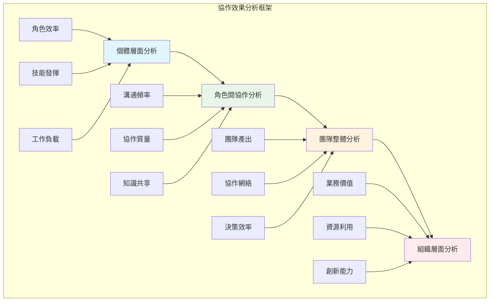

# 協作效果分析

## 📋 概述

協作效果分析是 Bee Swarm 模擬系統的核心功能之一，通過量化分析 AI 角色間的協作模式、溝通效率和任務完成質量，為優化團隊配置和工作流程提供數據支持。

## 🎯 分析目標

### 協作模式評估
- **溝通模式**: 分析角色間的溝通頻率、方式和效果
- **協作網絡**: 識別核心協作節點和潛在孤立點
- **工作流效率**: 評估任務流轉的順暢度和瓶頸
- **決策效率**: 分析決策制定的速度和質量

### 團隊動力學分析
- **負載均衡**: 評估工作分配的合理性
- **技能互補**: 分析角色技能的互補性和協同效應
- **衝突處理**: 識別和分析協作中的衝突模式
- **學習效應**: 評估團隊協作能力的提升趨勢

## 📊 分析框架

### 多維度分析模型



### 關鍵指標體系
```yaml
協作效率指標:
  溝通效率:
    - 響應時間 (Response Time)
    - 溝通準確性 (Communication Accuracy)
    - 信息傳遞完整性 (Information Completeness)
    
  協作質量:
    - 任務完成質量 (Task Quality)
    - 協作滿意度 (Collaboration Satisfaction)
    - 衝突解決效率 (Conflict Resolution)
    
  工作流效率:
    - 任務流轉時間 (Task Flow Time)
    - 決策週期 (Decision Cycle)
    - 並行工作效率 (Parallel Work Efficiency)

團隊動力指標:
  負載分佈:
    - 工作負載方差 (Workload Variance)
    - 技能利用率 (Skill Utilization)
    - 資源配置效率 (Resource Allocation)
    
  協作網絡:
    - 網絡密度 (Network Density)
    - 中心性指標 (Centrality Measures)
    - 集群係數 (Clustering Coefficient)
    
  學習成長:
    - 效率提升趨勢 (Efficiency Trend)
    - 技能發展速度 (Skill Development)
    - 知識積累效果 (Knowledge Accumulation)
```

## 🔍 分析方法

### 1. 時序分析法

#### 趨勢分析
```python
import pandas as pd
import numpy as np
from scipy import stats
import matplotlib.pyplot as plt

class CollaborationTrendAnalyzer:
    def __init__(self, simulation_data):
        self.data = simulation_data
        self.trends = {}
    
    def analyze_efficiency_trends(self):
        """分析效率趨勢"""
        
        # 計算滾動平均效率
        efficiency_data = []
        for role, utilization in self.data['role_utilization'].items():
            df = pd.DataFrame({
                'time': range(len(utilization)),
                'utilization': utilization,
                'role': role
            })
            
            # 計算趨勢
            df['rolling_mean'] = df['utilization'].rolling(window=7).mean()
            df['trend'] = df['utilization'].rolling(window=14).apply(
                lambda x: stats.linregress(range(len(x)), x)[0]
            )
            
            efficiency_data.append(df)
        
        return pd.concat(efficiency_data, ignore_index=True)
    
    def detect_pattern_changes(self, threshold=0.15):
        """檢測協作模式變化"""
        
        collaboration_events = self.data['collaboration_events']
        
        # 按時間窗口分組統計
        time_windows = {}
        window_size = 24 * 7  # 一週為一個窗口
        
        for event in collaboration_events:
            window_idx = int(event['timestamp'] // window_size)
            if window_idx not in time_windows:
                time_windows[window_idx] = []
            time_windows[window_idx].append(event)
        
        # 檢測變化點
        pattern_changes = []
        prev_patterns = None
        
        for window_idx in sorted(time_windows.keys()):
            current_patterns = self._analyze_window_patterns(time_windows[window_idx])
            
            if prev_patterns is not None:
                change_score = self._calculate_pattern_similarity(prev_patterns, current_patterns)
                if change_score > threshold:
                    pattern_changes.append({
                        'window': window_idx,
                        'change_score': change_score,
                        'changes': self._identify_specific_changes(prev_patterns, current_patterns)
                    })
            
            prev_patterns = current_patterns
        
        return pattern_changes
    
    def _analyze_window_patterns(self, events):
        """分析時間窗口內的協作模式"""
        patterns = {
            'collaboration_frequency': {},
            'communication_patterns': {},
            'decision_patterns': {}
        }
        
        for event in events:
            event_type = event['type']
            participants = tuple(sorted(event['participants']))
            
            # 統計協作頻率
            if participants not in patterns['collaboration_frequency']:
                patterns['collaboration_frequency'][participants] = 0
            patterns['collaboration_frequency'][participants] += 1
            
            # 統計溝通模式
            if event_type not in patterns['communication_patterns']:
                patterns['communication_patterns'][event_type] = 0
            patterns['communication_patterns'][event_type] += 1
        
        return patterns
```

### 2. 網絡分析法

#### 協作網絡分析
```python
import networkx as nx
from collections import defaultdict

class CollaborationNetworkAnalyzer:
    def __init__(self, collaboration_events):
        self.events = collaboration_events
        self.network = nx.Graph()
        self._build_network()
    
    def _build_network(self):
        """構建協作網絡"""
        
        # 添加節點（角色）
        roles = set()
        for event in self.events:
            roles.update(event['participants'])
        
        for role in roles:
            self.network.add_node(role, role_type=role)
        
        # 添加邊（協作關係）
        collaboration_weights = defaultdict(int)
        
        for event in self.events:
            participants = event['participants']
            if len(participants) >= 2:
                for i in range(len(participants)):
                    for j in range(i + 1, len(participants)):
                        edge = tuple(sorted([participants[i], participants[j]]))
                        collaboration_weights[edge] += 1
        
        # 添加加權邊
        for (node1, node2), weight in collaboration_weights.items():
            self.network.add_edge(node1, node2, weight=weight)
    
    def calculate_centrality_measures(self):
        """計算中心性指標"""
        
        centrality_measures = {
            'degree_centrality': nx.degree_centrality(self.network),
            'betweenness_centrality': nx.betweenness_centrality(self.network),
            'closeness_centrality': nx.closeness_centrality(self.network),
            'eigenvector_centrality': nx.eigenvector_centrality(self.network)
        }
        
        return centrality_measures
    
    def identify_collaboration_clusters(self):
        """識別協作集群"""
        
        # 使用社區檢測算法
        from networkx.algorithms import community
        
        # Louvain 算法
        communities = community.louvain_communities(self.network)
        
        # 計算模塊度
        modularity = community.modularity(self.network, communities)
        
        return {
            'communities': [list(c) for c in communities],
            'modularity': modularity,
            'num_communities': len(communities)
        }
    
    def analyze_network_evolution(self, time_windows):
        """分析網絡演化"""
        
        evolution_metrics = []
        
        for window_start in time_windows:
            window_end = window_start + 24 * 7  # 一週窗口
            
            # 過濾事件
            window_events = [
                event for event in self.events
                if window_start <= event['timestamp'] < window_end
            ]
            
            # 構建窗口網絡
            window_analyzer = CollaborationNetworkAnalyzer(window_events)
            
            # 計算指標
            metrics = {
                'window_start': window_start,
                'num_nodes': window_analyzer.network.number_of_nodes(),
                'num_edges': window_analyzer.network.number_of_edges(),
                'density': nx.density(window_analyzer.network),
                'clustering': nx.average_clustering(window_analyzer.network)
            }
            
            # 計算中心性
            centralities = window_analyzer.calculate_centrality_measures()
            for measure_name, values in centralities.items():
                metrics[f'avg_{measure_name}'] = np.mean(list(values.values()))
            
            evolution_metrics.append(metrics)
        
        return evolution_metrics
```

### 3. 統計學習法

#### 協作效果預測模型
```python
from sklearn.ensemble import RandomForestRegressor
from sklearn.model_selection import train_test_split
from sklearn.metrics import mean_squared_error, r2_score
import pandas as pd

class CollaborationEffectPredictor:
    def __init__(self):
        self.model = RandomForestRegressor(n_estimators=100, random_state=42)
        self.feature_columns = None
        self.is_trained = False
    
    def prepare_features(self, simulation_data):
        """準備特徵數據"""
        
        features = []
        
        for task in simulation_data.get('completed_tasks', []):
            task_features = {
                # 任務特徵
                'task_complexity': self._encode_complexity(task['complexity']),
                'task_priority': self._encode_priority(task['priority']),
                'estimated_hours': task['estimated_hours'],
                
                # 團隊特徵
                'team_size': len(task.get('assigned_roles', [])),
                'skill_diversity': self._calculate_skill_diversity(task['assigned_roles']),
                
                # 時間特徵
                'day_of_week': (task['created_at'] // 24) % 7,
                'project_progress': task['created_at'] / simulation_data['total_duration'],
                
                # 協作特徵
                'collaboration_intensity': self._calculate_collaboration_intensity(
                    task, simulation_data['collaboration_events']
                ),
                
                # 目標變量
                'actual_completion_time': task['actual_completion_time'],
                'quality_score': task.get('quality_score', 0.8)
            }
            
            features.append(task_features)
        
        return pd.DataFrame(features)
    
    def train_model(self, features_df):
        """訓練預測模型"""
        
        # 分離特徵和目標
        target_columns = ['actual_completion_time', 'quality_score']
        feature_columns = [col for col in features_df.columns if col not in target_columns]
        
        X = features_df[feature_columns]
        y = features_df['actual_completion_time']  # 先預測完成時間
        
        # 分割數據
        X_train, X_test, y_train, y_test = train_test_split(
            X, y, test_size=0.2, random_state=42
        )
        
        # 訓練模型
        self.model.fit(X_train, y_train)
        self.feature_columns = feature_columns
        self.is_trained = True
        
        # 評估模型
        y_pred = self.model.predict(X_test)
        mse = mean_squared_error(y_test, y_pred)
        r2 = r2_score(y_test, y_pred)
        
        return {
            'mse': mse,
            'r2': r2,
            'feature_importance': dict(zip(feature_columns, self.model.feature_importances_))
        }
    
    def predict_collaboration_effect(self, task_config, team_config):
        """預測協作效果"""
        
        if not self.is_trained:
            raise ValueError("模型尚未訓練")
        
        # 準備預測特徵
        features = pd.DataFrame([{
            'task_complexity': self._encode_complexity(task_config['complexity']),
            'task_priority': self._encode_priority(task_config['priority']),
            'estimated_hours': task_config['estimated_hours'],
            'team_size': len(team_config['roles']),
            'skill_diversity': self._calculate_skill_diversity(team_config['roles']),
            'day_of_week': task_config.get('day_of_week', 1),
            'project_progress': task_config.get('project_progress', 0.5),
            'collaboration_intensity': team_config.get('collaboration_intensity', 0.7)
        }])
        
        # 預測
        predicted_time = self.model.predict(features[self.feature_columns])[0]
        
        return {
            'predicted_completion_time': predicted_time,
            'confidence_interval': self._calculate_confidence_interval(features)
        }
```

## 📈 結果可視化

### 協作效果儀表板
```python
import plotly.graph_objects as go
import plotly.express as px
from plotly.subplots import make_subplots
import pandas as pd

class CollaborationDashboard:
    def __init__(self, analysis_results):
        self.results = analysis_results
    
    def create_comprehensive_dashboard(self):
        """創建綜合協作效果儀表板"""
        
        # 創建子圖佈局
        fig = make_subplots(
            rows=4, cols=3,
            subplot_titles=[
                '協作網絡圖', '角色效率雷達圖', '任務完成時間趨勢',
                '溝通頻率熱圖', '負載分佈圖', '決策效率分析',
                '技能互補分析', '協作質量趨勢', '瓶頸識別圖',
                '團隊動力評分', '預測準確性', '改進建議'
            ],
            specs=[
                [{"type": "scatter"}, {"type": "scatterpolar"}, {"type": "scatter"}],
                [{"type": "heatmap"}, {"type": "bar"}, {"type": "scatter"}],
                [{"type": "radar"}, {"type": "scatter"}, {"type": "scatter"}],
                [{"type": "bar"}, {"type": "scatter"}, {"type": "table"}]
            ]
        )
        
        # 1. 協作網絡圖
        self._add_network_plot(fig, row=1, col=1)
        
        # 2. 角色效率雷達圖
        self._add_efficiency_radar(fig, row=1, col=2)
        
        # 3. 任務完成時間趨勢
        self._add_completion_trend(fig, row=1, col=3)
        
        # 4. 溝通頻率熱圖
        self._add_communication_heatmap(fig, row=2, col=1)
        
        # 5. 負載分佈圖
        self._add_workload_distribution(fig, row=2, col=2)
        
        # 6. 決策效率分析
        self._add_decision_efficiency(fig, row=2, col=3)
        
        # 7. 技能互補分析
        self._add_skill_complementarity(fig, row=3, col=1)
        
        # 8. 協作質量趨勢
        self._add_quality_trend(fig, row=3, col=2)
        
        # 9. 瓶頸識別圖
        self._add_bottleneck_analysis(fig, row=3, col=3)
        
        # 10. 團隊動力評分
        self._add_team_dynamics_score(fig, row=4, col=1)
        
        # 11. 預測準確性
        self._add_prediction_accuracy(fig, row=4, col=2)
        
        # 12. 改進建議表格
        self._add_improvement_suggestions(fig, row=4, col=3)
        
        # 更新佈局
        fig.update_layout(
            title="Bee Swarm 協作效果分析儀表板",
            height=1600,
            showlegend=True
        )
        
        return fig
    
    def _add_network_plot(self, fig, row, col):
        """添加協作網絡圖"""
        network_data = self.results['network_analysis']
        
        # 提取節點和邊的座標（使用春力導向佈局）
        import networkx as nx
        
        G = nx.Graph()
        for edge in network_data['edges']:
            G.add_edge(edge['source'], edge['target'], weight=edge['weight'])
        
        pos = nx.spring_layout(G)
        
        # 添加邊
        for edge in G.edges():
            x0, y0 = pos[edge[0]]
            x1, y1 = pos[edge[1]]
            
            fig.add_trace(
                go.Scatter(
                    x=[x0, x1, None],
                    y=[y0, y1, None],
                    mode='lines',
                    line=dict(color='gray', width=1),
                    showlegend=False
                ),
                row=row, col=col
            )
        
        # 添加節點
        node_x = [pos[node][0] for node in G.nodes()]
        node_y = [pos[node][1] for node in G.nodes()]
        node_text = list(G.nodes())
        
        fig.add_trace(
            go.Scatter(
                x=node_x,
                y=node_y,
                mode='markers+text',
                text=node_text,
                textposition='middle center',
                marker=dict(size=20, color='lightblue'),
                showlegend=False
            ),
            row=row, col=col
        )
    
    def _add_efficiency_radar(self, fig, row, col):
        """添加角色效率雷達圖"""
        efficiency_data = self.results['role_efficiency']
        
        categories = ['溝通效率', '任務完成', '協作質量', '創新能力', '問題解決']
        
        for role, metrics in efficiency_data.items():
            fig.add_trace(
                go.Scatterpolar(
                    r=[metrics.get(cat, 0.5) for cat in categories],
                    theta=categories,
                    fill='toself',
                    name=role
                ),
                row=row, col=col
            )
    
    def generate_summary_report(self):
        """生成協作效果總結報告"""
        
        summary = {
            "overall_score": self._calculate_overall_score(),
            "key_findings": self._identify_key_findings(),
            "strengths": self._identify_strengths(),
            "improvement_areas": self._identify_improvement_areas(),
            "recommendations": self._generate_recommendations()
        }
        
        return summary
    
    def _calculate_overall_score(self):
        """計算整體協作效果評分"""
        
        # 加權計算各維度得分
        weights = {
            'efficiency': 0.3,
            'quality': 0.25,
            'communication': 0.2,
            'innovation': 0.15,
            'satisfaction': 0.1
        }
        
        scores = {}
        for dimension in weights.keys():
            scores[dimension] = self.results.get(f'{dimension}_score', 0.7)
        
        overall_score = sum(weights[dim] * scores[dim] for dim in weights)
        
        return {
            'overall': overall_score,
            'dimensions': scores,
            'grade': self._score_to_grade(overall_score)
        }
    
    def _score_to_grade(self, score):
        """將分數轉換為等級"""
        if score >= 0.9:
            return 'A+'
        elif score >= 0.8:
            return 'A'
        elif score >= 0.7:
            return 'B'
        elif score >= 0.6:
            return 'C'
        else:
            return 'D'
```

## 🎯 實踐案例

### 案例1：傳統瀑布流 vs 敏捷協作

#### 對比實驗設計
```python
def compare_collaboration_models():
    """對比不同協作模型的效果"""
    
    # 瀑布流模型配置
    waterfall_config = {
        'workflow_type': 'waterfall',
        'phase_gates': True,
        'parallel_work': False,
        'review_cycles': 'end_of_phase'
    }
    
    # 敏捷模型配置  
    agile_config = {
        'workflow_type': 'agile',
        'sprint_length': 14,  # 天
        'parallel_work': True,
        'review_cycles': 'continuous'
    }
    
    # 運行對比實驗
    waterfall_results = run_simulation(waterfall_config)
    agile_results = run_simulation(agile_config)
    
    # 對比分析
    comparison = {
        'delivery_speed': {
            'waterfall': waterfall_results['avg_completion_time'],
            'agile': agile_results['avg_completion_time'],
            'improvement': calculate_improvement(
                waterfall_results['avg_completion_time'],
                agile_results['avg_completion_time']
            )
        },
        'quality_metrics': {
            'waterfall': waterfall_results['quality_score'],
            'agile': agile_results['quality_score']
        },
        'collaboration_intensity': {
            'waterfall': waterfall_results['collaboration_events_per_day'],
            'agile': agile_results['collaboration_events_per_day']
        },
        'adaptability': {
            'waterfall': waterfall_results['change_adaptation_time'],
            'agile': agile_results['change_adaptation_time']
        }
    }
    
    return comparison
```

### 案例2：團隊規模優化分析

#### 規模效應研究
```python
def analyze_team_scale_effects():
    """分析團隊規模對協作效果的影響"""
    
    team_sizes = [3, 4, 6, 8, 10, 12, 15]
    results = {}
    
    for size in team_sizes:
        # 配置團隊
        team_config = generate_team_config(size)
        
        # 運行模擬
        simulation_result = run_simulation(team_config)
        
        # 分析結果
        results[size] = {
            'productivity': simulation_result['tasks_per_day'] / size,
            'communication_overhead': simulation_result['communication_time_ratio'],
            'coordination_complexity': simulation_result['coordination_events'] / size,
            'decision_speed': simulation_result['avg_decision_time'],
            'quality_score': simulation_result['avg_quality_score']
        }
    
    # 尋找最優規模
    optimal_size = find_optimal_team_size(results)
    
    return {
        'scale_analysis': results,
        'optimal_size': optimal_size,
        'scaling_insights': generate_scaling_insights(results)
    }
```

## 📋 最佳實踐

### 分析工作流程
```yaml
分析準備階段:
  1. 數據質量檢查:
     - 檢查數據完整性
     - 驗證數據一致性
     - 識別異常值
  
  2. 基準線建立:
     - 設定性能基準
     - 定義成功標準
     - 確定對比基線

執行分析階段:
  1. 多維度分析:
     - 個體角色分析
     - 角色間協作分析
     - 團隊整體分析
  
  2. 深度挖掘:
     - 模式識別
     - 因果關係分析
     - 預測建模

結果解釋階段:
  1. 結果驗證:
     - 交叉驗證分析結果
     - 敏感性分析
     - 假設檢驗
  
  2. 洞察提取:
     - 關鍵發現總結
     - 改進建議生成
     - 風險評估
```

### 常見陷阱與對策
```yaml
數據陷阱:
  陷阱: 樣本偏差
  對策: 多場景模擬，確保代表性
  
  陷阱: 辛普森悖論
  對策: 分層分析，控制混淆變量

分析陷阱:
  陷阱: 過度擬合
  對策: 交叉驗證，簡化模型
  
  陷阱: 因果推斷錯誤
  對策: 使用因果推斷方法

解釋陷阱:
  陷阱: 忽略統計顯著性
  對策: 進行假設檢驗
  
  陷阱: 忽略實際意義
  對策: 評估效應大小
```

---

> **注意**: 協作效果分析需要充分的數據支持和合理的分析方法。建議結合多種分析手段，從不同角度驗證結論的可靠性。同時，要注意分析結果的適用範圍和局限性。 