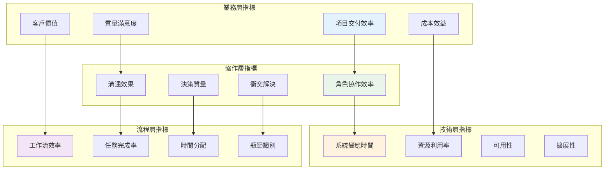
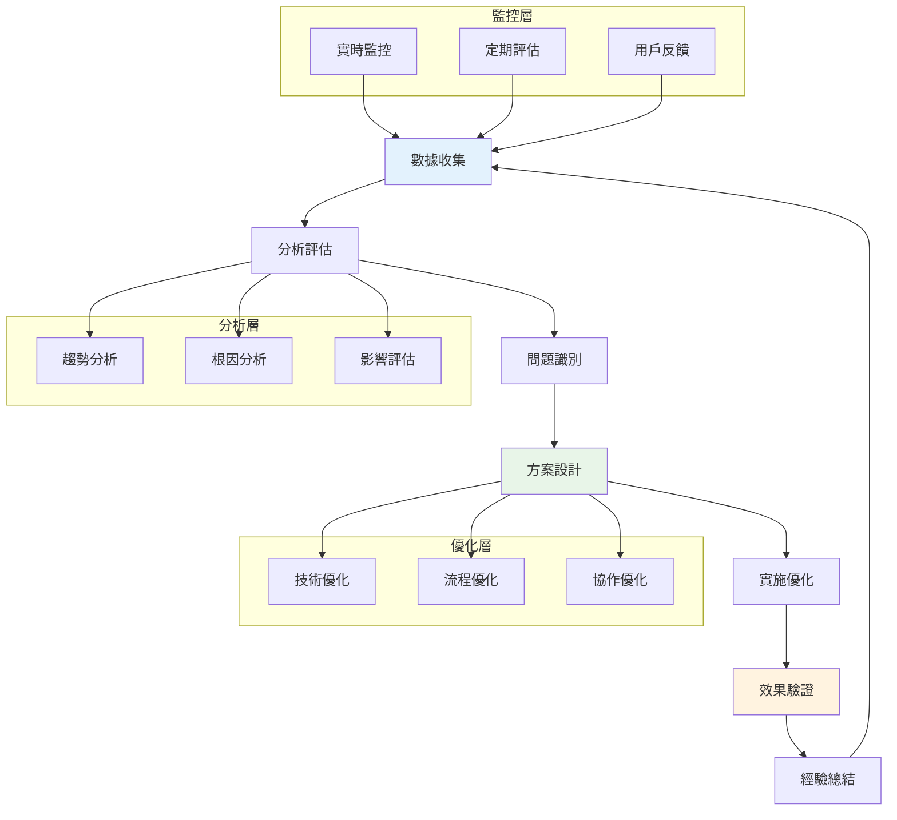

# 性能指標評估 (Performance Metrics Evaluation)

## 📊 概述

性能指標評估是 Bee Swarm 模擬工具的重要組成部分，通過定義和測量關鍵性能指標（KPI），評估 AI 角色協作系統的效率、質量和可靠性。本文檔詳細說明了性能指標體系、測量方法、分析框架和優化策略。

## 🎯 指標體系架構

### 指標分層模型



## 📈 核心性能指標 (KPIs)

### 1. 項目交付指標

#### 交付效率指標
```yaml
週期時間指標:
  - 需求到交付週期: 從需求提出到功能上線的總時間
  - 開發週期時間: 從開發開始到完成的時間
  - 測試週期時間: 從測試開始到通過的時間
  - 部署週期時間: 從部署開始到上線的時間

吞吐量指標:
  - 功能交付數量: 單位時間內完成的功能數量
  - 故事點速度: 每個迭代完成的故事點數
  - 缺陷修復數量: 單位時間內修復的缺陷數量
  - 程式碼提交頻率: 代碼提交的頻率和規模

計算公式:
  交付效率 = 完成功能數 / 總開發時間
  平均週期時間 = Σ(各功能週期時間) / 功能總數
  速度穩定性 = 1 - (週期時間標準差 / 平均週期時間)
```

#### 質量指標
```yaml
缺陷指標:
  - 缺陷密度: 每千行代碼的缺陷數量
  - 缺陷逃逸率: 生產環境發現的缺陷比例
  - 修復效率: 缺陷從發現到修復的平均時間
  - 回歸缺陷率: 修復後再次出現的缺陷比例

測試指標:
  - 測試覆蓋率: 代碼和功能的測試覆蓋程度
  - 測試通過率: 自動化測試的通過比例
  - 測試執行時間: 完整測試套件的執行時間
  - 測試穩定性: 測試結果的一致性

計算公式:
  缺陷密度 = 缺陷總數 / (代碼行數 / 1000)
  質量指數 = (100 - 缺陷逃逸率) × 測試覆蓋率 / 100
  修復效率 = Σ(修復時間) / 缺陷總數
```

### 2. 角色協作指標

#### 溝通效率指標
```yaml
響應指標:
  - 平均響應時間: 收到消息到回覆的平均時間
  - 問題解決時間: 從問題提出到解決的時間
  - 決策時間: 從討論開始到達成決策的時間
  - 信息傳遞準確率: 信息理解和執行的準確性

互動指標:
  - 溝通頻率: 角色間的互動次數和頻率
  - 會議效率: 會議時間利用率和產出
  - 文檔質量: 文檔的完整性和可理解性
  - 知識分享率: 知識在團隊中的傳播效果

計算公式:
  溝通效率 = 有效溝通次數 / 總溝通次數
  響應及時率 = 及時響應次數 / 總消息數
  協作滿意度 = Σ(各角色滿意度評分) / 角色數量
```

#### 決策質量指標
```yaml
決策效果:
  - 決策正確率: 決策執行後達到預期效果的比例
  - 決策穩定性: 決策變更的頻率和影響
  - 風險識別率: 提前識別和處理風險的比例
  - 創新程度: 決策的創新性和突破性

決策過程:
  - 參與度: 相關角色的參與程度
  - 信息完整性: 決策所依據信息的完整性
  - 考慮因素: 決策時考慮因素的全面性
  - 執行可行性: 決策的可執行性評估

計算公式:
  決策質量指數 = (正確率 × 0.4) + (穩定性 × 0.3) + (創新度 × 0.3)
  決策效率 = 有效決策數 / 總決策時間
```

### 3. 系統技術指標

#### 性能指標
```yaml
響應時間:
  - API 響應時間: 各 API 接口的響應時間分佈
  - 頁面加載時間: 前端頁面的完整加載時間
  - 數據庫查詢時間: 各類查詢的執行時間
  - 處理吞吐量: 系統每秒處理的請求數量

資源使用:
  - CPU 利用率: 系統 CPU 的使用情況
  - 內存使用率: 內存的使用和回收情況
  - 磁盤 I/O: 磁盤讀寫操作的效率
  - 網絡帶寬: 網絡資源的使用情況

計算公式:
  系統性能指數 = (響應時間得分 + 吞吐量得分 + 資源利用得分) / 3
  可用性 = (總時間 - 故障時間) / 總時間 × 100%
```

#### 可靠性指標
```yaml
穩定性:
  - 系統可用性: 系統正常運行的時間比例
  - 故障恢復時間: 從故障發生到恢復的時間
  - 錯誤率: 系統錯誤和異常的發生頻率
  - 數據一致性: 分佈式系統的數據一致性

擴展性:
  - 並發處理能力: 系統支持的最大並發用戶數
  - 數據處理能力: 系統處理大數據量的能力
  - 功能擴展性: 新功能集成的難易程度
  - 性能線性度: 資源增加與性能提升的關係

計算公式:
  可靠性指數 = (可用性 × 0.4) + (恢復能力 × 0.3) + (數據完整性 × 0.3)
  擴展性指數 = (並發能力 + 數據處理能力 + 功能擴展能力) / 3
```

## 🔍 測量方法與工具

### 自動化監控系統

#### 監控架構設計
```yaml
數據收集層:
  - 應用監控: APM 工具收集應用性能數據
  - 系統監控: 系統資源使用情況監控
  - 業務監控: 業務指標和用戶行為數據
  - 日誌監控: 結構化日誌分析和警報

數據處理層:
  - 實時處理: 流式數據處理和實時計算
  - 批次處理: 定期數據聚合和分析
  - 數據清洗: 異常數據檢測和處理
  - 指標計算: KPI 和衍生指標計算

數據展示層:
  - 實時儀表板: 關鍵指標的實時展示
  - 報告系統: 定期性能報告生成
  - 告警系統: 異常情況的及時通知
  - 分析工具: 深度數據分析和挖掘
```

#### 監控工具配置
```python
# 性能監控配置示例
import time
import psutil
import requests
from dataclasses import dataclass
from typing import Dict, List, Optional
from datetime import datetime, timedelta

@dataclass
class PerformanceMetric:
    """性能指標數據模型"""
    name: str
    value: float
    unit: str
    timestamp: datetime
    tags: Dict[str, str] = None

class MetricsCollector:
    """指標收集器"""
    
    def __init__(self):
        self.metrics: List[PerformanceMetric] = []
    
    def collect_system_metrics(self) -> List[PerformanceMetric]:
        """收集系統性能指標"""
        timestamp = datetime.now()
        
        # CPU 使用率
        cpu_percent = psutil.cpu_percent(interval=1)
        cpu_metric = PerformanceMetric(
            name="system.cpu.usage",
            value=cpu_percent,
            unit="percent",
            timestamp=timestamp,
            tags={"host": "local"}
        )
        
        # 內存使用率
        memory = psutil.virtual_memory()
        memory_metric = PerformanceMetric(
            name="system.memory.usage",
            value=memory.percent,
            unit="percent",
            timestamp=timestamp,
            tags={"host": "local"}
        )
        
        # 磁盤使用率
        disk = psutil.disk_usage('/')
        disk_metric = PerformanceMetric(
            name="system.disk.usage",
            value=(disk.used / disk.total) * 100,
            unit="percent",
            timestamp=timestamp,
            tags={"host": "local", "mount": "/"}
        )
        
        return [cpu_metric, memory_metric, disk_metric]
    
    def collect_api_metrics(self, api_url: str) -> PerformanceMetric:
        """收集 API 性能指標"""
        start_time = time.time()
        
        try:
            response = requests.get(api_url, timeout=10)
            response_time = (time.time() - start_time) * 1000  # 轉換為毫秒
            
            return PerformanceMetric(
                name="api.response_time",
                value=response_time,
                unit="ms",
                timestamp=datetime.now(),
                tags={
                    "url": api_url,
                    "status_code": str(response.status_code),
                    "method": "GET"
                }
            )
        except Exception as e:
            return PerformanceMetric(
                name="api.response_time",
                value=-1,  # 表示請求失敗
                unit="ms",
                timestamp=datetime.now(),
                tags={
                    "url": api_url,
                    "error": str(e),
                    "method": "GET"
                }
            )

class CollaborationMetricsCalculator:
    """協作指標計算器"""
    
    def calculate_response_time(self, messages: List[Dict]) -> float:
        """計算平均響應時間"""
        response_times = []
        
        for i in range(1, len(messages)):
            prev_msg = messages[i-1]
            curr_msg = messages[i]
            
            if prev_msg['sender'] != curr_msg['sender']:
                # 計算響應時間（分鐘）
                prev_time = datetime.fromisoformat(prev_msg['timestamp'])
                curr_time = datetime.fromisoformat(curr_msg['timestamp'])
                response_time = (curr_time - prev_time).total_seconds() / 60
                response_times.append(response_time)
        
        return sum(response_times) / len(response_times) if response_times else 0
    
    def calculate_decision_quality(self, decisions: List[Dict]) -> Dict[str, float]:
        """計算決策質量指標"""
        total_decisions = len(decisions)
        if total_decisions == 0:
            return {"accuracy": 0, "stability": 0, "innovation": 0}
        
        # 決策正確率
        correct_decisions = sum(1 for d in decisions if d.get('outcome') == 'success')
        accuracy = correct_decisions / total_decisions
        
        # 決策穩定性（變更頻率的倒數）
        changed_decisions = sum(1 for d in decisions if d.get('changed', False))
        stability = 1 - (changed_decisions / total_decisions)
        
        # 創新程度（基於決策的創新性評分）
        innovation_scores = [d.get('innovation_score', 0) for d in decisions]
        innovation = sum(innovation_scores) / total_decisions / 10  # 假設滿分10分
        
        return {
            "accuracy": accuracy,
            "stability": stability,
            "innovation": innovation,
            "quality_index": (accuracy * 0.4 + stability * 0.3 + innovation * 0.3)
        }

class PerformanceAnalyzer:
    """性能分析器"""
    
    def __init__(self):
        self.collector = MetricsCollector()
        self.collab_calculator = CollaborationMetricsCalculator()
    
    def analyze_trend(self, metrics: List[PerformanceMetric], 
                     window_size: int = 10) -> Dict:
        """分析指標趨勢"""
        if len(metrics) < window_size:
            return {"trend": "insufficient_data"}
        
        recent_values = [m.value for m in metrics[-window_size:]]
        older_values = [m.value for m in metrics[-window_size*2:-window_size]]
        
        if not older_values:
            return {"trend": "no_comparison"}
        
        recent_avg = sum(recent_values) / len(recent_values)
        older_avg = sum(older_values) / len(older_values)
        
        change_percent = ((recent_avg - older_avg) / older_avg) * 100
        
        if change_percent > 5:
            trend = "improving"
        elif change_percent < -5:
            trend = "degrading"
        else:
            trend = "stable"
        
        return {
            "trend": trend,
            "change_percent": change_percent,
            "recent_average": recent_avg,
            "previous_average": older_avg
        }
    
    def generate_performance_report(self, start_date: datetime, 
                                  end_date: datetime) -> Dict:
        """生成性能報告"""
        # 這裡應該從數據庫或監控系統獲取實際數據
        # 示例數據結構
        report = {
            "period": {
                "start": start_date.isoformat(),
                "end": end_date.isoformat()
            },
            "summary": {
                "total_requests": 150000,
                "average_response_time": 245,  # ms
                "error_rate": 0.02,  # 2%
                "availability": 99.95  # %
            },
            "collaboration": {
                "average_response_time": 15.5,  # minutes
                "decision_quality_index": 0.85,
                "communication_efficiency": 0.78
            },
            "trends": {
                "response_time": "improving",
                "error_rate": "stable",
                "collaboration_efficiency": "improving"
            },
            "recommendations": [
                "繼續優化數據庫查詢以提升響應時間",
                "增強錯誤監控和告警機制",
                "改進跨角色溝通流程"
            ]
        }
        
        return report
```

### 基準測試框架

#### 性能基準設定
```yaml
響應時間基準:
  - API 響應時間: < 200ms (P95)
  - 頁面加載時間: < 3s (首次加載)
  - 數據庫查詢: < 100ms (簡單查詢)
  - 複雜計算: < 5s (報告生成)

吞吐量基準:
  - 並發用戶: > 1000 (同時在線)
  - API QPS: > 500 (每秒請求)
  - 數據處理: > 10MB/s (批量處理)
  - 事務處理: > 100 TPS (每秒事務)

協作效率基準:
  - 響應時間: < 30分鐘 (工作時間)
  - 決策時間: < 2小時 (一般決策)
  - 問題解決: < 4小時 (緊急問題)
  - 溝通效率: > 80% (有效溝通率)
```

## 📊 數據分析框架

### 統計分析模型

#### 描述性統計
```python
import numpy as np
import pandas as pd
import matplotlib.pyplot as plt
import seaborn as sns
from scipy import stats
from typing import Dict, List, Tuple

class PerformanceAnalytics:
    """性能數據分析"""
    
    def __init__(self):
        self.data = None
    
    def load_data(self, data_source: str) -> pd.DataFrame:
        """加載性能數據"""
        # 示例數據加載
        # 實際應用中從數據庫或文件加載
        dates = pd.date_range('2024-01-01', periods=100, freq='D')
        data = {
            'date': dates,
            'response_time': np.random.normal(200, 50, 100),
            'cpu_usage': np.random.normal(65, 15, 100),
            'memory_usage': np.random.normal(70, 10, 100),
            'error_rate': np.random.exponential(0.02, 100),
            'throughput': np.random.normal(800, 200, 100)
        }
        self.data = pd.DataFrame(data)
        return self.data
    
    def descriptive_statistics(self, column: str) -> Dict:
        """計算描述性統計"""
        if self.data is None or column not in self.data.columns:
            return {}
        
        series = self.data[column]
        return {
            'count': len(series),
            'mean': series.mean(),
            'median': series.median(),
            'std': series.std(),
            'min': series.min(),
            'max': series.max(),
            'q25': series.quantile(0.25),
            'q75': series.quantile(0.75),
            'skewness': stats.skew(series),
            'kurtosis': stats.kurtosis(series)
        }
    
    def correlation_analysis(self) -> pd.DataFrame:
        """相關性分析"""
        if self.data is None:
            return pd.DataFrame()
        
        numeric_columns = self.data.select_dtypes(include=[np.number]).columns
        return self.data[numeric_columns].corr()
    
    def anomaly_detection(self, column: str, method: str = 'zscore') -> List[int]:
        """異常檢測"""
        if self.data is None or column not in self.data.columns:
            return []
        
        series = self.data[column]
        
        if method == 'zscore':
            z_scores = np.abs(stats.zscore(series))
            return self.data[z_scores > 3].index.tolist()
        
        elif method == 'iqr':
            Q1 = series.quantile(0.25)
            Q3 = series.quantile(0.75)
            IQR = Q3 - Q1
            lower_bound = Q1 - 1.5 * IQR
            upper_bound = Q3 + 1.5 * IQR
            return self.data[(series < lower_bound) | (series > upper_bound)].index.tolist()
        
        return []
    
    def trend_analysis(self, column: str, window: int = 7) -> Dict:
        """趨勢分析"""
        if self.data is None or column not in self.data.columns:
            return {}
        
        series = self.data[column]
        
        # 移動平均
        moving_avg = series.rolling(window=window).mean()
        
        # 線性回歸趨勢
        x = np.arange(len(series))
        slope, intercept, r_value, p_value, std_err = stats.linregress(x, series)
        
        return {
            'slope': slope,
            'r_squared': r_value**2,
            'p_value': p_value,
            'trend_direction': 'increasing' if slope > 0 else 'decreasing',
            'trend_strength': abs(r_value),
            'moving_average': moving_avg.iloc[-1] if not moving_avg.empty else None
        }

class CollaborationAnalytics:
    """協作數據分析"""
    
    def __init__(self):
        self.interaction_data = None
        self.performance_data = None
    
    def network_analysis(self, interactions: List[Dict]) -> Dict:
        """協作網絡分析"""
        import networkx as nx
        
        # 構建協作網絡圖
        G = nx.Graph()
        
        for interaction in interactions:
            sender = interaction['sender']
            receiver = interaction['receiver']
            weight = interaction.get('frequency', 1)
            
            if G.has_edge(sender, receiver):
                G[sender][receiver]['weight'] += weight
            else:
                G.add_edge(sender, receiver, weight=weight)
        
        # 計算網絡指標
        metrics = {
            'nodes_count': G.number_of_nodes(),
            'edges_count': G.number_of_edges(),
            'density': nx.density(G),
            'average_clustering': nx.average_clustering(G),
            'centrality': nx.degree_centrality(G),
            'betweenness': nx.betweenness_centrality(G),
            'closeness': nx.closeness_centrality(G)
        }
        
        return metrics
    
    def communication_pattern_analysis(self, messages: List[Dict]) -> Dict:
        """溝通模式分析"""
        # 按時間分組分析
        df = pd.DataFrame(messages)
        df['timestamp'] = pd.to_datetime(df['timestamp'])
        df['hour'] = df['timestamp'].dt.hour
        df['day_of_week'] = df['timestamp'].dt.day_of_week
        
        patterns = {
            'hourly_distribution': df.groupby('hour').size().to_dict(),
            'daily_distribution': df.groupby('day_of_week').size().to_dict(),
            'sender_frequency': df.groupby('sender').size().to_dict(),
            'message_length_stats': {
                'avg_length': df['content'].str.len().mean(),
                'max_length': df['content'].str.len().max(),
                'min_length': df['content'].str.len().min()
            }
        }
        
        return patterns

class PredictiveAnalytics:
    """預測分析"""
    
    def __init__(self):
        self.models = {}
    
    def train_performance_predictor(self, historical_data: pd.DataFrame):
        """訓練性能預測模型"""
        from sklearn.ensemble import RandomForestRegressor
        from sklearn.model_selection import train_test_split
        from sklearn.metrics import mean_squared_error, r2_score
        
        # 特徵工程
        features = ['cpu_usage', 'memory_usage', 'throughput']
        target = 'response_time'
        
        X = historical_data[features]
        y = historical_data[target]
        
        # 分割訓練和測試數據
        X_train, X_test, y_train, y_test = train_test_split(
            X, y, test_size=0.2, random_state=42
        )
        
        # 訓練模型
        model = RandomForestRegressor(n_estimators=100, random_state=42)
        model.fit(X_train, y_train)
        
        # 模型評估
        y_pred = model.predict(X_test)
        mse = mean_squared_error(y_test, y_pred)
        r2 = r2_score(y_test, y_pred)
        
        self.models['response_time'] = {
            'model': model,
            'features': features,
            'performance': {'mse': mse, 'r2': r2}
        }
        
        return {'mse': mse, 'r2': r2}
    
    def predict_performance(self, current_metrics: Dict) -> Dict:
        """預測性能"""
        if 'response_time' not in self.models:
            return {'error': 'Model not trained'}
        
        model_info = self.models['response_time']
        model = model_info['model']
        features = model_info['features']
        
        # 準備預測數據
        X_pred = np.array([[current_metrics.get(f, 0) for f in features]])
        
        # 進行預測
        prediction = model.predict(X_pred)[0]
        
        # 計算置信區間（簡化版本）
        confidence_interval = prediction * 0.1  # 假設10%的置信區間
        
        return {
            'predicted_response_time': prediction,
            'confidence_interval': {
                'lower': prediction - confidence_interval,
                'upper': prediction + confidence_interval
            },
            'model_performance': model_info['performance']
        }
```

### 可視化展示

#### 儀表板設計
```python
import plotly.graph_objects as go
import plotly.express as px
from plotly.subplots import make_subplots
import streamlit as st

class PerformanceDashboard:
    """性能儀表板"""
    
    def __init__(self):
        self.analytics = PerformanceAnalytics()
    
    def create_kpi_cards(self, metrics: Dict) -> None:
        """創建 KPI 卡片"""
        col1, col2, col3, col4 = st.columns(4)
        
        with col1:
            st.metric(
                label="平均響應時間",
                value=f"{metrics.get('avg_response_time', 0):.1f} ms",
                delta=f"{metrics.get('response_time_change', 0):.1f}%"
            )
        
        with col2:
            st.metric(
                label="系統可用性",
                value=f"{metrics.get('availability', 0):.2f}%",
                delta=f"{metrics.get('availability_change', 0):.2f}%"
            )
        
        with col3:
            st.metric(
                label="錯誤率",
                value=f"{metrics.get('error_rate', 0):.3f}%",
                delta=f"{metrics.get('error_rate_change', 0):.3f}%"
            )
        
        with col4:
            st.metric(
                label="吞吐量",
                value=f"{metrics.get('throughput', 0):.0f} QPS",
                delta=f"{metrics.get('throughput_change', 0):.1f}%"
            )
    
    def create_trend_chart(self, data: pd.DataFrame, column: str) -> go.Figure:
        """創建趨勢圖表"""
        fig = go.Figure()
        
        fig.add_trace(go.Scatter(
            x=data['date'],
            y=data[column],
            mode='lines+markers',
            name=column.replace('_', ' ').title(),
            line=dict(width=2)
        ))
        
        fig.update_layout(
            title=f"{column.replace('_', ' ').title()} 趨勢",
            xaxis_title="日期",
            yaxis_title=column.replace('_', ' ').title(),
            hovermode='x'
        )
        
        return fig
    
    def create_correlation_heatmap(self, correlation_matrix: pd.DataFrame) -> go.Figure:
        """創建相關性熱力圖"""
        fig = go.Figure(data=go.Heatmap(
            z=correlation_matrix.values,
            x=correlation_matrix.columns,
            y=correlation_matrix.index,
            colorscale='RdBu',
            zmid=0
        ))
        
        fig.update_layout(
            title="性能指標相關性分析",
            width=600,
            height=500
        )
        
        return fig
    
    def create_distribution_plot(self, data: pd.DataFrame, column: str) -> go.Figure:
        """創建分佈圖"""
        fig = make_subplots(
            rows=1, cols=2,
            subplot_titles=('直方圖', '箱線圖')
        )
        
        # 直方圖
        fig.add_trace(
            go.Histogram(x=data[column], name='分佈'),
            row=1, col=1
        )
        
        # 箱線圖
        fig.add_trace(
            go.Box(y=data[column], name='統計'),
            row=1, col=2
        )
        
        fig.update_layout(
            title=f"{column.replace('_', ' ').title()} 分佈分析",
            showlegend=False
        )
        
        return fig

def main_dashboard():
    """主儀表板"""
    st.set_page_config(
        page_title="Bee Swarm 性能監控",
        page_icon="🐝",
        layout="wide"
    )
    
    st.title("🐝 Bee Swarm 性能監控儀表板")
    
    # 側邊欄控制
    st.sidebar.header("控制面板")
    
    # 時間範圍選擇
    time_range = st.sidebar.selectbox(
        "選擇時間範圍",
        ["最近1小時", "最近24小時", "最近7天", "最近30天"]
    )
    
    # 指標選擇
    metrics_selection = st.sidebar.multiselect(
        "選擇指標",
        ["response_time", "cpu_usage", "memory_usage", "error_rate", "throughput"],
        default=["response_time", "cpu_usage"]
    )
    
    # 加載數據
    dashboard = PerformanceDashboard()
    data = dashboard.analytics.load_data("sample_data")
    
    # 計算 KPI
    kpis = {
        'avg_response_time': data['response_time'].mean(),
        'response_time_change': 2.3,  # 示例變化率
        'availability': 99.95,
        'availability_change': 0.02,
        'error_rate': data['error_rate'].mean() * 100,
        'error_rate_change': -0.5,
        'throughput': data['throughput'].mean(),
        'throughput_change': 5.2
    }
    
    # 顯示 KPI 卡片
    dashboard.create_kpi_cards(kpis)
    
    # 趨勢圖表
    st.header("📈 性能趨勢")
    
    col1, col2 = st.columns(2)
    
    for i, metric in enumerate(metrics_selection):
        if i % 2 == 0:
            with col1:
                fig = dashboard.create_trend_chart(data, metric)
                st.plotly_chart(fig, use_container_width=True)
        else:
            with col2:
                fig = dashboard.create_trend_chart(data, metric)
                st.plotly_chart(fig, use_container_width=True)
    
    # 相關性分析
    st.header("🔗 指標相關性分析")
    correlation_matrix = dashboard.analytics.correlation_analysis()
    fig = dashboard.create_correlation_heatmap(correlation_matrix)
    st.plotly_chart(fig, use_container_width=True)
    
    # 分佈分析
    st.header("📊 數據分佈分析")
    selected_metric = st.selectbox("選擇要分析的指標", metrics_selection)
    
    if selected_metric:
        fig = dashboard.create_distribution_plot(data, selected_metric)
        st.plotly_chart(fig, use_container_width=True)
        
        # 顯示統計信息
        stats = dashboard.analytics.descriptive_statistics(selected_metric)
        st.json(stats)

if __name__ == "__main__":
    main_dashboard()
```

## 🎯 優化策略

### 性能優化路線圖

#### 短期優化（1-3個月）
```yaml
技術優化:
  - 數據庫查詢優化: 添加索引、優化 SQL
  - 緩存策略改進: 實施多級緩存
  - API 響應優化: 減少數據傳輸量
  - 前端性能優化: 代碼分割、懶加載

協作優化:
  - 溝通流程標準化: 統一溝通模板
  - 響應時間目標: 設定明確的響應時間 SLA
  - 決策流程優化: 簡化決策審批流程
  - 工具集成: 整合協作工具鏈

監控優化:
  - 實時監控: 部署實時監控系統
  - 告警機制: 建立分級告警體系
  - 日誌分析: 結構化日誌收集
  - 性能基準: 建立性能基準線
```

#### 中期優化（3-6個月）
```yaml
架構優化:
  - 微服務拆分: 按業務域拆分服務
  - 異步處理: 引入消息隊列處理
  - 負載均衡: 實施智能負載分配
  - 容器化部署: 完整容器化部署

AI 協作優化:
  - 智能路由: AI 驅動的任務分配
  - 預測分析: 預測性能瓶頸
  - 自動化決策: 自動化常規決策
  - 學習優化: 基於歷史數據的流程優化

質量保障:
  - 自動化測試: 完善測試覆蓋
  - 持續集成: 完整 CI/CD 流水線
  - 性能測試: 定期性能壓測
  - 安全審計: 定期安全評估
```

#### 長期優化（6個月以上）
```yaml
智能化升級:
  - AI 性能調優: 基於 ML 的自動調優
  - 預測性維護: 故障預測和預防
  - 智能擴容: 自動資源擴縮容
  - 自適應系統: 自我優化的系統架構

協作進化:
  - 協作 AI: 更智能的協作助手
  - 知識圖譜: 構建協作知識體系
  - 社交網絡分析: 深度協作模式分析
  - 創新支持: 支持創新協作模式

生態建設:
  - 開放平台: 構建開放的協作平台
  - 社區建設: 建設開發者社區
  - 最佳實踐: 總結和推廣最佳實踐
  - 標準制定: 制定行業協作標準
```

### 持續改進機制

#### 改進循環框架


---

> **注意**: 本文檔定義了 Bee Swarm 項目的完整性能指標評估體系。實際應用中應根據具體業務需求和技術環境調整指標定義和閾值設定。建議定期評審和更新指標體系，確保其持續有效性和相關性。 