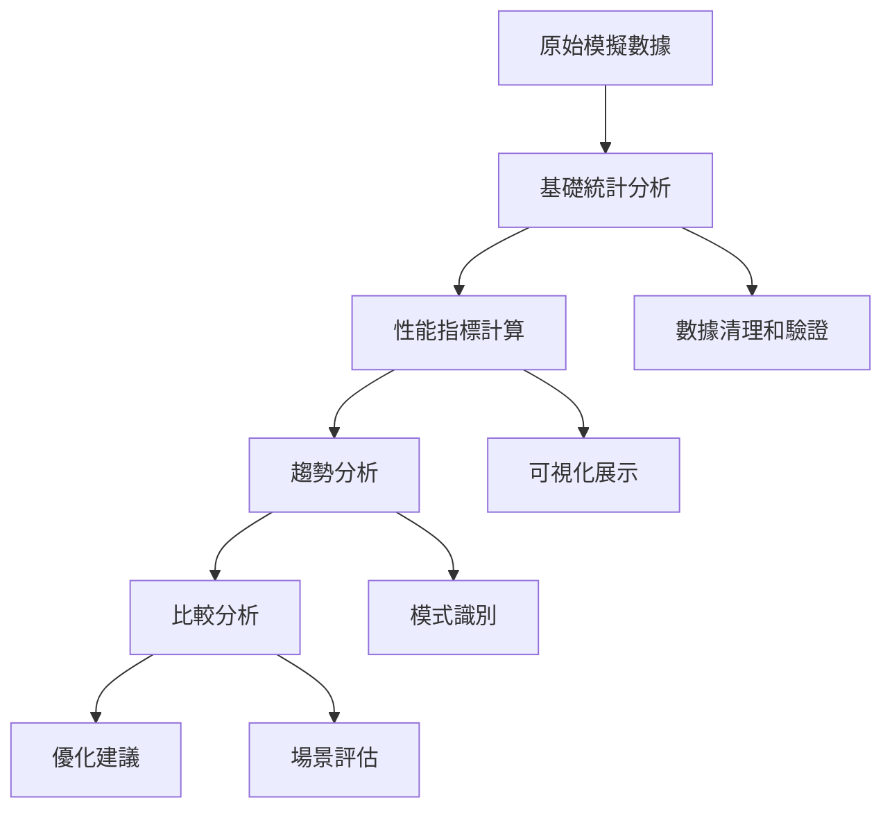

# 效果分析

## 本章概要

本章介紹如何分析 Bee Swarm 模擬器的輸出結果，包括數據分析方法、可視化技術和效果評估指標。

- **章節目標**：掌握模擬結果的分析和解讀方法
- **主要內容**：數據分析、可視化、效果評估、優化建議
- **閱讀收穫**：學會從模擬數據中提取有價值的洞察

## 🎯 分析框架概述

### 分析層次結構



### 核心分析維度

1. **效率維度**：吞吐量、週期時間、資源利用率
2. **質量維度**：缺陷率、返工次數、客戶滿意度
3. **協作維度**：溝通效率、決策速度、知識共享
4. **適應性維度**：變更響應、學習曲線、創新能力

## 📊 基礎統計分析

### 描述性統計

```python
class BasicStatistics:
    def __init__(self, simulation_data):
        self.data = simulation_data
        
    def calculate_descriptive_stats(self, metric):
        """計算基礎統計指標"""
        values = self.data[metric]
        return {
            'mean': np.mean(values),
            'median': np.median(values),
            'std': np.std(values),
            'min': np.min(values),
            'max': np.max(values),
            'q25': np.percentile(values, 25),
            'q75': np.percentile(values, 75),
            'skewness': stats.skew(values),
            'kurtosis': stats.kurtosis(values)
        }
    
    def generate_summary_report(self):
        """生成統計摘要報告"""
        metrics = ['task_completion_time', 'defect_rate', 'throughput']
        summary = {}
        
        for metric in metrics:
            summary[metric] = self.calculate_descriptive_stats(metric)
            
        return summary
```

### 分布分析

```python
class DistributionAnalyzer:
    def __init__(self, data):
        self.data = data
        
    def fit_distribution(self, values, distributions=['normal', 'exponential', 'gamma']):
        """擬合最佳分布"""
        best_fit = None
        best_aic = float('inf')
        
        for dist_name in distributions:
            if dist_name == 'normal':
                params = stats.norm.fit(values)
                aic = self._calculate_aic(values, stats.norm, params)
            elif dist_name == 'exponential':
                params = stats.expon.fit(values)
                aic = self._calculate_aic(values, stats.expon, params)
            elif dist_name == 'gamma':
                params = stats.gamma.fit(values)
                aic = self._calculate_aic(values, stats.gamma, params)
                
            if aic < best_aic:
                best_aic = aic
                best_fit = {'distribution': dist_name, 'parameters': params}
                
        return best_fit
    
    def _calculate_aic(self, data, distribution, params):
        """計算 AIC 值"""
        log_likelihood = np.sum(distribution.logpdf(data, *params))
        k = len(params)
        n = len(data)
        return 2 * k - 2 * log_likelihood
```

## 📈 性能指標計算

### 核心 KPI 定義

```python
class PerformanceMetrics:
    def __init__(self, simulation_data):
        self.data = simulation_data
        
    def calculate_throughput(self, time_window='daily'):
        """計算吞吐量"""
        completed_tasks = self.data['completed_tasks']
        if time_window == 'daily':
            return len(completed_tasks) / self.data['simulation_days']
        elif time_window == 'weekly':
            return len(completed_tasks) / (self.data['simulation_days'] / 7)
        
    def calculate_lead_time(self):
        """計算平均交付週期"""
        lead_times = []
        for task in self.data['tasks']:
            if task['status'] == 'completed':
                lead_time = task['completed_at'] - task['created_at']
                lead_times.append(lead_time)
        
        return {
            'mean_lead_time': np.mean(lead_times),
            'percentile_50': np.percentile(lead_times, 50),
            'percentile_95': np.percentile(lead_times, 95)
        }
    
    def calculate_resource_utilization(self):
        """計算資源利用率"""
        utilization = {}
        for role in self.data['roles']:
            total_capacity = self.data['simulation_hours'] * role['capacity']
            actual_work = sum(activity['duration'] 
                            for activity in role['activities'] 
                            if activity['type'] == 'productive_work')
            utilization[role['name']] = actual_work / total_capacity
            
        return utilization
    
    def calculate_quality_metrics(self):
        """計算質量指標"""
        total_tasks = len(self.data['tasks'])
        defective_tasks = len([t for t in self.data['tasks'] if t['has_defects']])
        rework_tasks = len([t for t in self.data['tasks'] if t['rework_count'] > 0])
        
        return {
            'defect_rate': defective_tasks / total_tasks,
            'rework_rate': rework_tasks / total_tasks,
            'first_time_right': (total_tasks - rework_tasks) / total_tasks
        }
```

### 高級性能指標

```python
class AdvancedMetrics:
    def __init__(self, simulation_data):
        self.data = simulation_data
        
    def calculate_flow_efficiency(self):
        """計算流動效率"""
        total_time = 0
        value_add_time = 0
        
        for task in self.data['tasks']:
            if task['status'] == 'completed':
                total_time += task['total_cycle_time']
                value_add_time += task['active_work_time']
                
        return value_add_time / total_time if total_time > 0 else 0
    
    def calculate_predictability(self):
        """計算交付可預測性"""
        planned_dates = [task['planned_completion'] for task in self.data['tasks']]
        actual_dates = [task['actual_completion'] for task in self.data['tasks'] 
                       if task['status'] == 'completed']
        
        variance = np.var([actual - planned for planned, actual in 
                          zip(planned_dates, actual_dates)])
        
        return 1 / (1 + variance)  # 歸一化的可預測性分數
    
    def calculate_collaboration_index(self):
        """計算協作指數"""
        cross_role_interactions = 0
        total_interactions = 0
        
        for interaction in self.data['interactions']:
            total_interactions += 1
            if interaction['from_role'] != interaction['to_role']:
                cross_role_interactions += 1
                
        return cross_role_interactions / total_interactions if total_interactions > 0 else 0
```

## 📊 可視化分析

### 時間序列分析

```python
class TimeSeriesAnalyzer:
    def __init__(self, data):
        self.data = data
        
    def plot_throughput_trend(self):
        """繪製吞吐量趨勢圖"""
        daily_throughput = self._calculate_daily_throughput()
        
        plt.figure(figsize=(12, 6))
        plt.plot(daily_throughput.index, daily_throughput.values)
        plt.title('Daily Throughput Trend')
        plt.xlabel('Day')
        plt.ylabel('Tasks Completed')
        plt.grid(True, alpha=0.3)
        
        # 添加趨勢線
        z = np.polyfit(range(len(daily_throughput)), daily_throughput.values, 1)
        p = np.poly1d(z)
        plt.plot(daily_throughput.index, p(range(len(daily_throughput))), 
                "r--", alpha=0.8, label='Trend')
        plt.legend()
        plt.show()
    
    def plot_cycle_time_distribution(self):
        """繪製週期時間分布圖"""
        cycle_times = [task['cycle_time'] for task in self.data['tasks'] 
                      if task['status'] == 'completed']
        
        fig, (ax1, ax2) = plt.subplots(1, 2, figsize=(15, 6))
        
        # 直方圖
        ax1.hist(cycle_times, bins=30, alpha=0.7, edgecolor='black')
        ax1.set_title('Cycle Time Distribution')
        ax1.set_xlabel('Days')
        ax1.set_ylabel('Frequency')
        
        # 箱線圖
        ax2.boxplot(cycle_times)
        ax2.set_title('Cycle Time Box Plot')
        ax2.set_ylabel('Days')
        
        plt.tight_layout()
        plt.show()
    
    def create_burndown_chart(self):
        """創建燃盡圖"""
        remaining_work = self._calculate_remaining_work_by_day()
        
        plt.figure(figsize=(12, 6))
        plt.plot(remaining_work.index, remaining_work.values, 'b-', linewidth=2)
        plt.title('Sprint Burndown Chart')
        plt.xlabel('Day')
        plt.ylabel('Remaining Story Points')
        plt.grid(True, alpha=0.3)
        
        # 理想燃盡線
        ideal_line = np.linspace(remaining_work.iloc[0], 0, len(remaining_work))
        plt.plot(remaining_work.index, ideal_line, 'r--', alpha=0.7, label='Ideal')
        plt.legend()
        plt.show()
```

### 角色協作分析

```python
class CollaborationAnalyzer:
    def __init__(self, data):
        self.data = data
        
    def create_interaction_heatmap(self):
        """創建角色交互熱力圖"""
        roles = ['PM', 'Backend', 'Frontend', 'DevOps']
        interaction_matrix = np.zeros((len(roles), len(roles)))
        
        for interaction in self.data['interactions']:
            from_idx = roles.index(interaction['from_role'])
            to_idx = roles.index(interaction['to_role'])
            interaction_matrix[from_idx][to_idx] += 1
            
        plt.figure(figsize=(8, 6))
        sns.heatmap(interaction_matrix, 
                   xticklabels=roles, 
                   yticklabels=roles,
                   annot=True, 
                   cmap='YlOrRd')
        plt.title('Role Interaction Heatmap')
        plt.xlabel('To Role')
        plt.ylabel('From Role')
        plt.show()
    
    def plot_communication_network(self):
        """繪製溝通網絡圖"""
        G = nx.Graph()
        
        # 添加節點
        for role in self.data['roles']:
            G.add_node(role['name'])
            
        # 添加邊
        for interaction in self.data['interactions']:
            G.add_edge(interaction['from_role'], 
                      interaction['to_role'],
                      weight=interaction['frequency'])
        
        plt.figure(figsize=(10, 8))
        pos = nx.spring_layout(G)
        nx.draw(G, pos, with_labels=True, 
               node_color='lightblue', 
               node_size=1500,
               font_size=10, 
               font_weight='bold')
        
        # 繪製邊的權重
        edge_labels = nx.get_edge_attributes(G, 'weight')
        nx.draw_networkx_edge_labels(G, pos, edge_labels)
        
        plt.title('Communication Network')
        plt.show()
```

## 🔍 深度分析技術

### 瓶頸識別

```python
class BottleneckAnalyzer:
    def __init__(self, data):
        self.data = data
        
    def identify_resource_bottlenecks(self):
        """識別資源瓶頸"""
        role_queues = {}
        
        for role in self.data['roles']:
            queue_lengths = []
            for timestamp in self.data['timeline']:
                queue_length = len([task for task in self.data['task_queue']
                                  if task['assigned_role'] == role['name'] 
                                  and task['timestamp'] <= timestamp 
                                  and task['status'] == 'waiting'])
                queue_lengths.append(queue_length)
            
            role_queues[role['name']] = {
                'avg_queue_length': np.mean(queue_lengths),
                'max_queue_length': np.max(queue_lengths),
                'queue_time_90th': np.percentile(queue_lengths, 90)
            }
            
        return role_queues
    
    def analyze_wait_times(self):
        """分析等待時間"""
        wait_time_analysis = {}
        
        for task in self.data['tasks']:
            if 'wait_events' in task:
                for wait_event in task['wait_events']:
                    reason = wait_event['reason']
                    duration = wait_event['duration']
                    
                    if reason not in wait_time_analysis:
                        wait_time_analysis[reason] = []
                    wait_time_analysis[reason].append(duration)
        
        summary = {}
        for reason, durations in wait_time_analysis.items():
            summary[reason] = {
                'total_wait_time': sum(durations),
                'avg_wait_time': np.mean(durations),
                'frequency': len(durations)
            }
            
        return summary
```

### 趨勢分析

```python
class TrendAnalyzer:
    def __init__(self, data):
        self.data = data
        
    def detect_performance_trends(self):
        """檢測性能趨勢"""
        daily_metrics = self._aggregate_daily_metrics()
        trends = {}
        
        for metric in daily_metrics.columns:
            # 線性趨勢檢測
            x = np.arange(len(daily_metrics))
            y = daily_metrics[metric].values
            slope, intercept, r_value, p_value, std_err = stats.linregress(x, y)
            
            trends[metric] = {
                'slope': slope,
                'r_squared': r_value**2,
                'p_value': p_value,
                'trend_direction': 'improving' if slope > 0 else 'declining',
                'trend_strength': abs(r_value)
            }
            
        return trends
    
    def forecast_performance(self, periods=30):
        """預測未來性能"""
        daily_throughput = self._calculate_daily_throughput()
        
        # 使用簡單移動平均預測
        window_size = min(7, len(daily_throughput) // 3)
        recent_avg = daily_throughput.rolling(window=window_size).mean().iloc[-1]
        
        # 考慮趨勢
        trend = self.detect_performance_trends()['throughput']['slope']
        
        forecast = []
        for i in range(periods):
            predicted_value = recent_avg + (trend * i)
            forecast.append(max(0, predicted_value))  # 確保非負
            
        return forecast
```

## 📋 場景比較分析

### A/B 測試框架

```python
class ScenarioComparator:
    def __init__(self, scenario_a_data, scenario_b_data):
        self.scenario_a = scenario_a_data
        self.scenario_b = scenario_b_data
        
    def compare_metrics(self):
        """比較兩個場景的關鍵指標"""
        metrics_a = self._extract_metrics(self.scenario_a)
        metrics_b = self._extract_metrics(self.scenario_b)
        
        comparison = {}
        for metric in metrics_a.keys():
            comparison[metric] = {
                'scenario_a': metrics_a[metric],
                'scenario_b': metrics_b[metric],
                'difference': metrics_b[metric] - metrics_a[metric],
                'percentage_change': ((metrics_b[metric] - metrics_a[metric]) / 
                                    metrics_a[metric] * 100),
                'statistical_significance': self._test_significance(
                    metric, self.scenario_a, self.scenario_b)
            }
            
        return comparison
    
    def _test_significance(self, metric, data_a, data_b):
        """統計顯著性檢驗"""
        values_a = self._extract_metric_values(metric, data_a)
        values_b = self._extract_metric_values(metric, data_b)
        
        # 使用 t 檢驗
        t_stat, p_value = stats.ttest_ind(values_a, values_b)
        
        return {
            't_statistic': t_stat,
            'p_value': p_value,
            'is_significant': p_value < 0.05
        }
    
    def generate_comparison_report(self):
        """生成比較報告"""
        comparison = self.compare_metrics()
        
        report = "## Scenario Comparison Report\n\n"
        
        for metric, data in comparison.items():
            improvement = "improvement" if data['difference'] > 0 else "decline"
            significance = "significant" if data['statistical_significance']['is_significant'] else "not significant"
            
            report += f"### {metric.replace('_', ' ').title()}\n"
            report += f"- Scenario A: {data['scenario_a']:.2f}\n"
            report += f"- Scenario B: {data['scenario_b']:.2f}\n"
            report += f"- Change: {data['percentage_change']:.1f}% ({improvement})\n"
            report += f"- Statistical Significance: {significance}\n\n"
            
        return report
```

### 多場景分析

```python
class MultiScenarioAnalyzer:
    def __init__(self, scenarios_data):
        self.scenarios = scenarios_data
        
    def rank_scenarios(self, weights=None):
        """根據綜合得分排序場景"""
        if weights is None:
            weights = {
                'throughput': 0.3,
                'quality': 0.3,
                'lead_time': 0.2,
                'resource_utilization': 0.2
            }
        
        scenario_scores = {}
        
        for scenario_name, data in self.scenarios.items():
            metrics = self._extract_metrics(data)
            
            # 歸一化指標（0-1 範圍）
            normalized_metrics = self._normalize_metrics(metrics)
            
            # 計算加權得分
            score = sum(normalized_metrics[metric] * weight 
                       for metric, weight in weights.items())
            
            scenario_scores[scenario_name] = {
                'total_score': score,
                'metrics': normalized_metrics
            }
        
        # 按得分排序
        ranked_scenarios = sorted(scenario_scores.items(), 
                                key=lambda x: x[1]['total_score'], 
                                reverse=True)
        
        return ranked_scenarios
    
    def create_radar_chart(self):
        """創建雷達圖比較多個場景"""
        metrics = ['throughput', 'quality', 'lead_time', 'collaboration']
        
        fig, ax = plt.subplots(figsize=(10, 10), subplot_kw=dict(projection='polar'))
        
        angles = np.linspace(0, 2 * np.pi, len(metrics), endpoint=False)
        angles = np.concatenate((angles, [angles[0]]))
        
        for scenario_name, data in self.scenarios.items():
            scenario_metrics = self._extract_metrics(data)
            normalized_values = [scenario_metrics[metric] for metric in metrics]
            normalized_values += [normalized_values[0]]  # 閉合圖形
            
            ax.plot(angles, normalized_values, 'o-', linewidth=2, label=scenario_name)
            ax.fill(angles, normalized_values, alpha=0.25)
        
        ax.set_xticks(angles[:-1])
        ax.set_xticklabels(metrics)
        ax.set_ylim(0, 1)
        ax.legend(loc='upper right', bbox_to_anchor=(0.1, 0.1))
        
        plt.title('Scenario Comparison Radar Chart')
        plt.show()
```

## 🎯 優化建議生成

### 自動化建議系統

```python
class OptimizationRecommender:
    def __init__(self, analysis_results):
        self.results = analysis_results
        
    def generate_recommendations(self):
        """生成優化建議"""
        recommendations = []
        
        # 基於瓶頸分析的建議
        bottlenecks = self.results['bottlenecks']
        for role, queue_info in bottlenecks.items():
            if queue_info['avg_queue_length'] > 3:
                recommendations.append({
                    'type': 'resource_optimization',
                    'priority': 'high',
                    'description': f'{role} role is experiencing high queue lengths',
                    'suggested_action': f'Consider adding capacity to {role} or redistributing workload',
                    'expected_impact': 'Reduced lead time and improved throughput'
                })
        
        # 基於質量指標的建議
        quality_metrics = self.results['quality']
        if quality_metrics['defect_rate'] > 0.1:
            recommendations.append({
                'type': 'quality_improvement',
                'priority': 'medium',
                'description': 'High defect rate detected',
                'suggested_action': 'Implement additional code review processes and testing',
                'expected_impact': 'Reduced rework and improved customer satisfaction'
            })
        
        # 基於協作分析的建議
        collaboration_index = self.results['collaboration']['collaboration_index']
        if collaboration_index < 0.3:
            recommendations.append({
                'type': 'collaboration_enhancement',
                'priority': 'medium',
                'description': 'Low cross-role collaboration detected',
                'suggested_action': 'Implement regular cross-functional meetings and pair programming',
                'expected_impact': 'Improved knowledge sharing and reduced handoff delays'
            })
        
        return sorted(recommendations, key=lambda x: x['priority'])
    
    def estimate_improvement_potential(self, recommendation):
        """估算改進潛力"""
        current_metrics = self.results['current_state']
        
        if recommendation['type'] == 'resource_optimization':
            # 基於佇列理論估算改進
            current_utilization = current_metrics['resource_utilization']
            if current_utilization > 0.8:
                potential_throughput_improvement = 0.2
                potential_lead_time_reduction = 0.3
            else:
                potential_throughput_improvement = 0.1
                potential_lead_time_reduction = 0.15
                
        elif recommendation['type'] == 'quality_improvement':
            potential_defect_reduction = 0.5
            potential_rework_reduction = 0.6
            
        return {
            'throughput_improvement': potential_throughput_improvement,
            'lead_time_reduction': potential_lead_time_reduction,
            'quality_improvement': potential_defect_reduction
        }
```

## 實踐指南

### 分析流程建議

1. **數據驗證**
   - 檢查數據完整性
   - 識別異常值
   - 驗證模擬參數合理性

2. **基礎分析**
   - 計算描述性統計
   - 繪製基本可視化圖表
   - 識別明顯的模式

3. **深度分析**
   - 瓶頸識別
   - 趨勢分析
   - 相關性檢驗

4. **比較分析**
   - 多場景對比
   - 最佳實踐識別
   - 優化機會評估

5. **建議生成**
   - 自動化建議
   - 人工專家審核
   - 實施優先級排序

### 常見分析陷阱

**統計陷阱：**
- 樣本量不足
- 相關性不等於因果關系
- 多重比較問題

**解釋陷阱：**
- 過度解讀異常值
- 忽略模擬假設限制
- 缺乏業務上下文

**可視化陷阱：**
- 誤導性的圖表尺度
- 過於複雜的圖表
- 缺乏適當的標註

## 本章小結

### 關鍵要點
- **系統性分析**確保全面理解模擬結果
- **多層次指標**提供不同視角的洞察
- **可視化工具**幫助識別模式和趨勢
- **自動化建議**提高分析效率和一致性

### 與其他章節的關聯
- 第4章：角色定義影響分析維度
- 第5章：SimPy模擬器提供分析數據
- 第8章：實際案例驗證分析方法

### 下一步建議
1. 學習統計分析基礎知識
2. 實踐可視化工具使用
3. 參考真實項目進行對比分析

## 參考資料

- [統計分析方法](https://www.scipy.org/scipylib/statistics.html)
- [數據可視化最佳實踐](https://matplotlib.org/stable/tutorials/index.html)
- [軟件度量指標](https://ieeexplore.ieee.org/document/software-metrics)
- [敏捷度量與分析](https://www.agilealliance.org/agile101/agile-metrics/) 