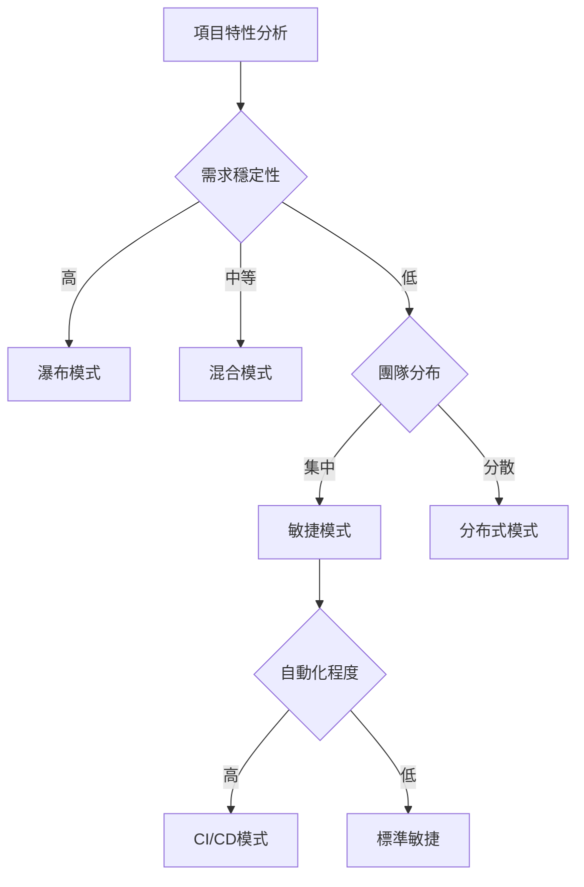

# 模擬場景

## 本章概要

本章詳細介紹 Bee Swarm 模擬器支持的各種模擬場景，包括不同的開發模式、團隊配置和工作流程變體。

- **章節目標**：了解可用的模擬場景類型
- **主要內容**：場景分類、參數配置、實際應用
- **閱讀收穫**：學會選擇和配置適合的模擬場景

## 🎯 場景分類概述

### 1. 開發流程場景
- **瀑布模型**：傳統的順序開發流程
- **敏捷開發**：迭代式開發和快速反饋
- **持續集成/部署**：自動化程度極高的現代流程
- **混合模式**：結合多種方法的靈活流程

### 2. 團隊配置場景
- **標準四角色**：PM + Backend + Frontend + DevOps
- **擴展團隊**：增加專業角色（QA、設計師、架構師）
- **精簡團隊**：全棧開發者 + DevOps
- **分布式團隊**：跨時區協作模擬

### 3. 工作負載場景
- **穩定負載**：均勻分布的工作請求
- **突發負載**：集中的高強度工作期
- **季節性負載**：週期性的工作量變化
- **緊急響應**：突發事件和緊急修復

## 📋 詳細場景描述

### 場景1：傳統瀑布開發模式

**場景描述：**
模擬傳統的瀑布式開發流程，各階段依序進行，強調文檔和計劃。

```yaml
waterfall_scenario:
  name: "Traditional Waterfall Development"
  duration: 90  # 90天專案週期
  
  workflow:
    sequential: true
    phases:
      - name: "requirement_analysis"
        duration: 14
        participants: ["product_manager", "all_developers"]
        deliverables: ["requirements_doc", "technical_spec"]
        
      - name: "system_design"
        duration: 21
        participants: ["backend_developer", "frontend_developer", "devops_engineer"]
        deliverables: ["architecture_doc", "api_spec", "deployment_plan"]
        
      - name: "implementation"
        duration: 35
        participants: ["backend_developer", "frontend_developer"]
        deliverables: ["source_code", "unit_tests"]
        
      - name: "integration_testing"
        duration: 14
        participants: ["all_developers"]
        deliverables: ["integration_tests", "bug_reports"]
        
      - name: "deployment"
        duration: 7
        participants: ["devops_engineer"]
        deliverables: ["production_deployment"]

  parameters:
    documentation_overhead: 0.3  # 30% 時間用於文檔
    change_request_frequency: 0.1  # 10% 的功能會有變更
    defect_rate: 0.15  # 15% 的功能有缺陷
    rework_cost_multiplier: 3.0  # 後期修改成本是初期的3倍
```

**適用情況：**
- 大型企業級專案
- 法規要求嚴格的行業
- 需求相對穩定的系統

### 場景2：敏捷迭代開發模式

**場景描述：**
模擬敏捷開發流程，短週期迭代，頻繁交付和反饋。

```yaml
agile_scenario:
  name: "Agile Iterative Development"
  duration: 90
  
  workflow:
    iterative: true
    sprint_length: 14  # 2週衝刺
    total_sprints: 6
    
    sprint_activities:
      - name: "sprint_planning"
        duration: 0.5
        participants: ["product_manager", "all_developers"]
        
      - name: "development"
        duration: 10
        participants: ["backend_developer", "frontend_developer"]
        parallel: true
        
      - name: "integration"
        duration: 2
        participants: ["all_developers"]
        
      - name: "deployment"
        duration: 0.5
        participants: ["devops_engineer"]
        
      - name: "retrospective"
        duration: 1
        participants: ["all_team"]

  parameters:
    story_points_per_sprint: 40
    velocity_variation: 0.2  # ±20% 速度變化
    backlog_grooming_overhead: 0.1
    daily_standup_overhead: 0.05
    defect_rate: 0.08  # 較低的缺陷率
    feedback_cycle_length: 14  # 每衝刺結束後收到反饋
```

**適用情況：**
- 互聯網產品開發
- 需求變化頻繁的專案
- 注重用戶反饋的產品

### 場景3：持續集成/持續部署模式

**場景描述：**
模擬現代 CI/CD 流程，高度自動化，頻繁部署。

```yaml
cicd_scenario:
  name: "Continuous Integration/Deployment"
  duration: 90
  
  workflow:
    continuous: true
    deployment_frequency: "multiple_per_day"
    
    development_cycle:
      - name: "feature_development"
        duration: [0.5, 3]  # 半天到3天的功能
        participants: ["developer"]
        
      - name: "code_review"
        duration: [0.2, 1]
        participants: ["peer_developer"]
        
      - name: "automated_testing"
        duration: [0.1, 0.5]
        automated: true
        
      - name: "deployment"
        duration: [0.05, 0.2]
        automated: true
        participants: ["devops_engineer"]

  parameters:
    automation_level: 0.9  # 90% 流程自動化
    build_success_rate: 0.95
    test_coverage: 0.85
    rollback_frequency: 0.02  # 2% 部署需要回滾
    deployment_time_minutes: [5, 15]
    monitoring_alert_response_time: [5, 30]  # 分鐘
```

**適用情況：**
- 雲原生應用
- SaaS 產品
- 高頻迭代的服務

### 場景4：混合開發模式

**場景描述：**
結合多種開發方法的靈活模式，根據項目需要調整流程。

```yaml
hybrid_scenario:
  name: "Hybrid Development Model"
  duration: 120
  
  workflow:
    adaptive: true
    phases:
      - name: "discovery"
        duration: 14
        method: "design_thinking"
        participants: ["product_manager", "designers"]
        
      - name: "mvp_development"
        duration: 28
        method: "agile"
        sprint_length: 7
        participants: ["core_team"]
        
      - name: "feature_expansion"
        duration: 56
        method: "continuous"
        participants: ["full_team"]
        
      - name: "stabilization"
        duration: 22
        method: "waterfall"
        participants: ["all_developers", "qa_engineers"]

  parameters:
    method_switching_overhead: 0.15  # 切換方法的成本
    team_size_variation: [4, 8]  # 團隊大小會變化
    skill_development_factor: 1.2  # 團隊技能會提升
    process_optimization_rate: 0.05  # 流程持續優化
```

### 場景5：分布式團隊協作

**場景描述：**
模擬跨時區、跨地域的分布式團隊協作模式。

```yaml
distributed_scenario:
  name: "Distributed Team Collaboration"
  duration: 90
  
  team_distribution:
    time_zones:
      - name: "asia_pacific"
        offset: 0
        members: ["backend_developer", "devops_engineer"]
        working_hours: [9, 18]
        
      - name: "europe"
        offset: -7
        members: ["product_manager", "frontend_developer"]
        working_hours: [9, 18]
        
      - name: "americas"
        offset: -15
        members: ["qa_engineer"]
        working_hours: [9, 18]

  workflow:
    asynchronous: true
    handoff_zones:
      - from: "asia_pacific"
        to: "europe"
        overlap_hours: 2
        
      - from: "europe"
        to: "americas"
        overlap_hours: 1

  parameters:
    communication_delay: [1, 8]  # 小時
    context_switching_cost: 0.3
    documentation_requirement: 0.4  # 更多文檔需求
    meeting_coordination_overhead: 0.2
    cultural_adaptation_factor: 0.9
```

## 🔧 場景配置指南

### 基本配置步驟

1. **選擇基礎場景模板**
```python
from bee_swarm_simulator import ScenarioManager

scenario_manager = ScenarioManager()
base_scenario = scenario_manager.load_template('agile_scenario')
```

2. **自定義參數**
```python
custom_params = {
    'sprint_length': 7,  # 改為1週衝刺
    'team_size': 6,      # 6人團隊
    'defect_rate': 0.05  # 降低缺陷率
}
scenario = scenario_manager.customize(base_scenario, custom_params)
```

3. **添加特殊事件**
```python
scenario.add_event('emergency_fix', 
                   probability=0.1, 
                   impact={'all_work_stopped': True, 'duration': 4})
scenario.add_event('team_member_leave', 
                   probability=0.05, 
                   impact={'capacity_reduction': 0.25})
```

### 高級配置選項

**角色技能矩陣：**
```yaml
role_skills:
  backend_developer:
    python: 0.9
    database: 0.8
    api_design: 0.85
    testing: 0.7
    
  frontend_developer:
    javascript: 0.9
    react: 0.8
    css: 0.9
    testing: 0.6
```

**工作負載模式：**
```yaml
workload_patterns:
  steady_state:
    issues_per_day: 3
    variance: 0.2
    
  launch_period:
    issues_per_day: 8
    variance: 0.4
    duration: 14
    
  maintenance_mode:
    issues_per_day: 1
    variance: 0.1
```

## 📊 場景比較分析

### 效率指標對比

| 場景 | 交付週期 | 缺陷率 | 變更成本 | 團隊滿意度 |
|------|----------|--------|----------|------------|
| 瀑布模式 | 90天 | 15% | 高 | 中等 |
| 敏捷模式 | 14天 | 8% | 低 | 高 |
| CI/CD模式 | 1天 | 5% | 極低 | 高 |
| 混合模式 | 28天 | 10% | 中等 | 高 |
| 分布式 | 21天 | 12% | 中等 | 中等 |

### 適用性矩陣



## 實踐指南

### 場景選擇決策樹

1. **評估項目特性**
   - 需求穩定性：高/中/低
   - 團隊規模：小(<5)/中(5-15)/大(>15)
   - 技術複雜度：簡單/中等/複雜
   - 時間壓力：低/中/高

2. **評估團隊能力**
   - 敏捷經驗：新手/有經驗/專家
   - 自動化能力：基礎/中等/高級
   - 溝通協作：同地/分布式/全遠程

3. **選擇最佳場景**
```python
def select_scenario(project_characteristics, team_capabilities):
    if project_characteristics['requirement_stability'] == 'high':
        return 'waterfall_scenario'
    elif team_capabilities['automation_level'] == 'high':
        return 'cicd_scenario'
    elif team_capabilities['distribution'] == 'distributed':
        return 'distributed_scenario'
    else:
        return 'agile_scenario'
```

### 場景定制建議

**新手團隊：**
- 從簡單場景開始
- 降低並行度
- 增加文檔和檢查點
- 延長學習時間

**經驗豐富團隊：**
- 使用高級場景
- 提高自動化程度
- 減少過程開銷
- 增加創新時間

**混合技能團隊：**
- 根據技能分配角色
- 設置指導機制
- 漸進式複雜度提升
- 定期技能評估

## 本章小結

### 關鍵要點
- **多樣化場景**支持不同的開發模式和團隊配置
- **參數化配置**允許精確控制模擬條件
- **比較分析**幫助選擇最適合的工作方式
- **實際應用**需要考慮項目和團隊特性

### 與其他章節的關聯
- 第4章：角色定義影響場景設計
- 第5章：SimPy模擬器執行這些場景
- 第6章：使用指南提供場景選擇建議

### 下一步建議
1. 閱讀第5章了解模擬器技術細節
2. 參考第8章查看實際應用案例
3. 使用 scripts/ 中的工具進行場景實驗

## 參考資料

- [敏捷開發方法論](https://agilemanifesto.org/)
- [CI/CD 最佳實踐](https://docs.github.com/en/actions/guides)
- [分布式團隊管理](https://about.gitlab.com/company/culture/all-remote/)
- [軟件開發流程比較](https://www.atlassian.com/agile/project-management/project-management-methodologies) 