# 最佳實踐

## 本章概要

本章匯集了使用 Bee Swarm 項目的最佳實踐，涵蓋團隊協作、工具使用、流程優化等方面的經驗總結。

- **章節目標**：掌握 Bee Swarm 的最佳使用方法
- **主要內容**：協作實踐、工具配置、流程優化、問題避免
- **閱讀收穫**：避免常見陷阱，快速達到最佳效果

## 🎯 核心原則

### 1. GitHub-First 思維
將 GitHub 作為協作的中心樞紐，所有活動都圍繞 GitHub 生態系統進行。

**實踐要點：**
- 所有討論都在 Issues 或 PR 中進行
- 使用 GitHub Project 追蹤進度
- 利用 GitHub Actions 自動化流程
- 通過 Labels 和 Milestones 組織工作

**示例工作流：**

```mermaid
graph LR
    A[需求討論] --> B[創建 Issue]
    B --> C[設計討論]
    C --> D[創建分支]
    D --> E[開發實現]
    E --> F[創建 PR]
    F --> G[代碼審查]
    G --> H[合併部署]
```


### 2. 異步協作優先
設計工作流程以支持異步協作，減少實時溝通依賴。

**實踐要點：**
- 詳細的文檔記錄
- 清晰的任務描述
- 明確的驗收標準
- 充分的上下文信息

### 3. 透明度與可追蹤性
確保所有決策和變更都有完整的記錄。

**實踐要點：**
- 決策過程公開透明
- 變更歷史完整保存
- 責任歸屬清晰明確
- 知識共享充分

## 👥 角色協作最佳實踐

### 產品經理 (PM) 最佳實踐

#### 需求管理
```markdown
## 功能需求模板

### 背景
- 用戶問題描述
- 業務價值說明
- 優先級判斷依據

### 功能描述
- 功能概覽
- 核心用例
- 邊界條件

### 驗收標準
- [ ] 功能點1：具體描述
- [ ] 功能點2：具體描述
- [ ] 性能要求：具體指標

### 技術考量
- 架構影響評估
- 第三方依賴
- 安全要求

### 設計資源
- UI/UX 設計稿連結
- 原型演示連結
- 相關研究資料
```

#### 優先級管理
```yaml
priority_matrix:
  critical:
    description: "系統故障，影響核心功能"
    response_time: "2小時內"
    examples: ["支付失敗", "登入問題", "數據丟失"]
    
  high:
    description: "重要功能，影響用戶體驗"
    response_time: "1天內"
    examples: ["性能問題", "功能異常", "界面錯誤"]
    
  medium:
    description: "一般改進，優化用戶體驗"
    response_time: "1週內"
    examples: ["功能增強", "界面優化", "流程改進"]
    
  low:
    description: "Nice to have，未來考慮"
    response_time: "下個版本"
    examples: ["新功能想法", "小幅優化", "技術嘗試"]
```

### 後端開發者最佳實踐

#### API 設計原則
```python
# 1. RESTful 設計
class UserAPI:
    """
    用戶 API 設計示例
    遵循 RESTful 原則
    """
    
    def get_user(self, user_id: int) -> User:
        """獲取單個用戶信息"""
        pass
    
    def list_users(self, filters: UserFilters) -> List[User]:
        """獲取用戶列表"""
        pass
    
    def create_user(self, user_data: UserCreateRequest) -> User:
        """創建新用戶"""
        pass
    
    def update_user(self, user_id: int, user_data: UserUpdateRequest) -> User:
        """更新用戶信息"""
        pass
    
    def delete_user(self, user_id: int) -> bool:
        """刪除用戶"""
        pass

# 2. 錯誤處理
class APIResponse:
    """標準 API 響應格式"""
    
    def __init__(self, data=None, error=None, status_code=200):
        self.data = data
        self.error = error
        self.status_code = status_code
        self.timestamp = datetime.utcnow()
    
    def to_dict(self):
        return {
            'data': self.data,
            'error': self.error,
            'timestamp': self.timestamp.isoformat(),
            'status': 'success' if not self.error else 'error'
        }

# 3. 版本管理
@app.route('/api/v1/users')
def users_v1():
    """API v1 版本"""
    pass

@app.route('/api/v2/users') 
def users_v2():
    """API v2 版本"""
    pass
```

#### 數據庫設計最佳實踐
```sql
-- 1. 命名規範
-- 表名：複數形式，下劃線分隔
-- 字段名：單數形式，下劃線分隔
-- 索引名：idx_表名_字段名

CREATE TABLE user_profiles (
    id BIGINT PRIMARY KEY AUTO_INCREMENT,
    user_id BIGINT NOT NULL,
    first_name VARCHAR(50) NOT NULL,
    last_name VARCHAR(50) NOT NULL,
    email VARCHAR(255) UNIQUE NOT NULL,
    created_at TIMESTAMP DEFAULT CURRENT_TIMESTAMP,
    updated_at TIMESTAMP DEFAULT CURRENT_TIMESTAMP ON UPDATE CURRENT_TIMESTAMP,
    
    INDEX idx_user_profiles_user_id (user_id),
    INDEX idx_user_profiles_email (email)
);

-- 2. 外鍵約束
ALTER TABLE user_profiles 
ADD CONSTRAINT fk_user_profiles_user_id 
FOREIGN KEY (user_id) REFERENCES users(id) 
ON DELETE CASCADE;

-- 3. 適當的索引策略
-- 經常查詢的字段添加索引
-- 複合索引順序：選擇性高的字段在前
CREATE INDEX idx_orders_status_created 
ON orders (status, created_at);
```

### 前端開發者最佳實踐

#### 組件設計原則
```tsx
// 1. 組件職責單一
interface ButtonProps {
  variant: 'primary' | 'secondary' | 'danger';
  size: 'small' | 'medium' | 'large';
  disabled?: boolean;
  loading?: boolean;
  onClick?: () => void;
  children: React.ReactNode;
}

const Button: React.FC<ButtonProps> = ({
  variant = 'primary',
  size = 'medium',
  disabled = false,
  loading = false,
  onClick,
  children
}) => {
  const className = `btn btn-${variant} btn-${size}`;
  
  return (
    <button
      className={className}
      disabled={disabled || loading}
      onClick={onClick}
    >
      {loading && <Spinner />}
      {children}
    </button>
  );
};

// 2. 狀態管理最佳實踐
interface UserState {
  users: User[];
  loading: boolean;
  error: string | null;
}

const useUsers = () => {
  const [state, setState] = useState<UserState>({
    users: [],
    loading: false,
    error: null
  });
  
  const fetchUsers = async () => {
    setState(prev => ({ ...prev, loading: true, error: null }));
    
    try {
      const users = await userAPI.getUsers();
      setState(prev => ({ ...prev, users, loading: false }));
    } catch (error) {
      setState(prev => ({ 
        ...prev, 
        error: error.message, 
        loading: false 
      }));
    }
  };
  
  return { ...state, fetchUsers };
};

// 3. 性能優化
const UserList = React.memo(({ users }: { users: User[] }) => {
  return (
    <div className="user-list">
      {users.map(user => (
        <UserCard key={user.id} user={user} />
      ))}
    </div>
  );
});
```

#### CSS/樣式最佳實踐
```scss
// 1. BEM 命名方法
.user-card {
  padding: 16px;
  border: 1px solid #ddd;
  border-radius: 8px;
  
  &__header {
    display: flex;
    justify-content: space-between;
    margin-bottom: 12px;
  }
  
  &__title {
    font-size: 18px;
    font-weight: 600;
    color: #333;
  }
  
  &__actions {
    display: flex;
    gap: 8px;
  }
  
  &--featured {
    border-color: #007bff;
    background-color: #f8f9fa;
  }
}

// 2. CSS 變量使用
:root {
  --color-primary: #007bff;
  --color-secondary: #6c757d;
  --color-success: #28a745;
  --color-danger: #dc3545;
  
  --spacing-xs: 4px;
  --spacing-sm: 8px;
  --spacing-md: 16px;
  --spacing-lg: 24px;
  --spacing-xl: 32px;
  
  --border-radius: 8px;
  --box-shadow: 0 2px 4px rgba(0, 0, 0, 0.1);
}

// 3. 響應式設計
.container {
  max-width: 1200px;
  margin: 0 auto;
  padding: 0 var(--spacing-md);
  
  @media (max-width: 768px) {
    padding: 0 var(--spacing-sm);
  }
}
```

### DevOps 工程師最佳實踐

#### CI/CD 流水線設計
```yaml
# .github/workflows/ci-cd.yml
name: CI/CD Pipeline

on:
  push:
    branches: [ main, develop ]
  pull_request:
    branches: [ main ]

jobs:
  test:
    runs-on: ubuntu-latest
    
    steps:
    - uses: actions/checkout@v3
    
    - name: Setup Node.js
      uses: actions/setup-node@v3
      with:
        node-version: '18'
        cache: 'npm'
    
    - name: Install dependencies
      run: npm ci
    
    - name: Run linting
      run: npm run lint
    
    - name: Run tests
      run: npm run test:coverage
    
    - name: Upload coverage
      uses: codecov/codecov-action@v3
  
  build:
    needs: test
    runs-on: ubuntu-latest
    
    steps:
    - uses: actions/checkout@v3
    
    - name: Build Docker image
      run: |
        docker build -t ${{ github.repository }}:${{ github.sha }} .
        docker tag ${{ github.repository }}:${{ github.sha }} ${{ github.repository }}:latest
    
    - name: Push to registry
      if: github.ref == 'refs/heads/main'
      run: |
        echo ${{ secrets.DOCKER_PASSWORD }} | docker login -u ${{ secrets.DOCKER_USERNAME }} --password-stdin
        docker push ${{ github.repository }}:${{ github.sha }}
        docker push ${{ github.repository }}:latest
  
  deploy:
    needs: build
    runs-on: ubuntu-latest
    if: github.ref == 'refs/heads/main'
    
    steps:
    - name: Deploy to production
      run: |
        # 部署邏輯
        echo "Deploying to production..."
```

#### 基礎設施即代碼
```hcl
# terraform/main.tf
provider "aws" {
  region = var.aws_region
}

module "vpc" {
  source = "./modules/vpc"
  
  cidr_block = var.vpc_cidr
  environment = var.environment
}

module "ecs_cluster" {
  source = "./modules/ecs"
  
  cluster_name = "${var.project_name}-${var.environment}"
  vpc_id = module.vpc.vpc_id
  subnet_ids = module.vpc.private_subnet_ids
  
  min_capacity = var.min_capacity
  max_capacity = var.max_capacity
  desired_capacity = var.desired_capacity
}

module "rds" {
  source = "./modules/rds"
  
  identifier = "${var.project_name}-${var.environment}"
  engine = "mysql"
  engine_version = "8.0"
  instance_class = var.db_instance_class
  
  vpc_id = module.vpc.vpc_id
  subnet_ids = module.vpc.database_subnet_ids
}
```

## 🔧 工具配置最佳實踐

### GitHub 配置

#### Issue 模板
```markdown
<!-- .github/ISSUE_TEMPLATE/feature_request.md -->
---
name: 功能請求
about: 建議新功能或改進
title: '[FEATURE] '
labels: 'enhancement'
assignees: ''
---

## 功能描述
簡潔地描述你希望增加的功能。

## 問題陳述
描述當前的痛點或需要解決的問題。

## 解決方案
描述你期望的解決方案。

## 替代方案
描述你考慮過的其他解決方案。

## 其他信息
添加任何其他相關信息或截圖。
```

#### PR 模板
```markdown
<!-- .github/pull_request_template.md -->
## 變更描述
簡潔地描述這個 PR 的變更內容。

## 變更類型
請刪除不相關的選項：
- [ ] Bug 修復 (不破壞現有功能的變更)
- [ ] 新功能 (添加新功能的變更)
- [ ] 破壞性變更 (會導致現有功能無法正常工作的修復或功能)
- [ ] 文檔更新

## 測試
描述你已經運行的測試來驗證變更。提供如何重現的說明。

## 檢查清單
- [ ] 我的代碼遵循了項目的代碼風格指南
- [ ] 我已經對自己的代碼進行了自查
- [ ] 我已經為我的代碼添加了適當的註釋
- [ ] 我已經更新了相關文檔
- [ ] 我的變更沒有產生新的警告
- [ ] 我已經添加了測試來證明我的修復是有效的或我的功能能正常工作
- [ ] 新的和現有的單元測試都通過了
```

### 開發環境配置

#### VS Code 配置
```json
// .vscode/settings.json
{
  "editor.formatOnSave": true,
  "editor.codeActionsOnSave": {
    "source.fixAll.eslint": true
  },
  "files.exclude": {
    "node_modules": true,
    "dist": true,
    ".next": true
  },
  "typescript.preferences.importModuleSpecifier": "relative",
  "emmet.includeLanguages": {
    "typescript": "html",
    "typescriptreact": "html"
  }
}

// .vscode/extensions.json
{
  "recommendations": [
    "esbenp.prettier-vscode",
    "dbaeumer.vscode-eslint",
    "bradlc.vscode-tailwindcss",
    "ms-vscode.vscode-typescript-next"
  ]
}
```

#### Git 配置
```bash
# 設置全局配置
git config --global user.name "Your Name"
git config --global user.email "your.email@example.com"

# 設置默認分支名
git config --global init.defaultBranch main

# 設置自動換行
git config --global core.autocrlf input  # Linux/Mac
git config --global core.autocrlf true   # Windows

# 設置 Git 別名
git config --global alias.st status
git config --global alias.co checkout
git config --global alias.br branch
git config --global alias.ci commit
git config --global alias.unstage 'reset HEAD --'
git config --global alias.last 'log -1 HEAD'
git config --global alias.visual '!gitk'
```

## 📈 流程優化最佳實踐

### 敏捷開發流程

#### Sprint 計劃
```markdown
## Sprint 計劃模板

### Sprint 信息
- Sprint 編號：#XX
- 時間範圍：YYYY-MM-DD 至 YYYY-MM-DD
- Sprint 目標：簡潔描述本次 Sprint 的主要目標

### 團隊容量
- 開發天數：XX 天
- 團隊成員：X 人
- 總容量：XX 人天
- 緩衝時間：20%（會議、代碼審查、突發問題）

### 待辦事項
| 任務 | 估算 | 負責人 | 優先級 | 依賴 |
|------|------|--------|--------|------|
| 功能A | 5天 | 張三 | 高 | 無 |
| 功能B | 3天 | 李四 | 中 | 功能A |
| Bug修復 | 2天 | 王五 | 高 | 無 |

### 風險與依賴
- 風險1：第三方 API 可能不穩定
- 依賴1：等待設計稿確認
```

#### Daily Standup 格式
```markdown
## Daily Standup 記錄

**日期：** YYYY-MM-DD
**參與者：** 列出參與者

### 張三
- **昨天完成：** 完成了用戶登錄功能的後端 API
- **今天計劃：** 開始實現用戶註冊功能
- **遇到問題：** 無

### 李四
- **昨天完成：** 完成了登錄頁面的前端實現
- **今天計劃：** 與後端 API 對接，測試登錄流程
- **遇到問題：** API 文檔中的某個字段定義不清楚

### 行動項目
- [ ] 李四和張三會後討論 API 字段定義
- [ ] 王五協助解決部署環境問題
```

### 代碼審查流程

#### 審查清單
```markdown
## 代碼審查檢查清單

### 功能性
- [ ] 代碼實現了 PR 描述的功能
- [ ] 邊界條件得到適當處理
- [ ] 錯誤處理完整且合理
- [ ] 測試覆蓋了主要功能路徑

### 代碼質量
- [ ] 代碼遵循項目編碼規範
- [ ] 函數和變量命名清晰易懂
- [ ] 代碼結構清晰，邏輯易於理解
- [ ] 沒有重複代碼

### 性能
- [ ] 沒有明顯的性能問題
- [ ] 數據庫查詢效率合理
- [ ] 資源使用適當

### 安全性
- [ ] 輸入驗證充分
- [ ] 沒有硬編碼的敏感信息
- [ ] 權限檢查適當

### 可維護性
- [ ] 代碼註釋適當且有用
- [ ] 文檔已更新
- [ ] 依賴合理且必要
```

## ⚠️ 常見問題與避免方法

### 溝通問題

#### 問題：信息孤島
**表現：** 團隊成員各自為政，缺乏信息共享

**解決方案：**
- 建立定期的知識分享會
- 使用共享文檔記錄重要決策
- 鼓勵在公共頻道討論技術問題

#### 問題：需求不明確
**表現：** 開發過程中頻繁變更需求

**解決方案：**
- 細化用戶故事，明確驗收標準
- 建立需求變更流程
- 定期與利益相關者確認需求

### 技術問題

#### 問題：技術債務累積
**表現：** 代碼質量下降，開發速度變慢

**解決方案：**
- 定期進行代碼重構
- 建立代碼質量度量標準
- 在每個 Sprint 中分配時間處理技術債務

#### 問題：測試覆蓋不足
**表現：** 生產環境頻繁出現 Bug

**解決方案：**
- 設置最低測試覆蓋率要求
- 實施測試驅動開發 (TDD)
- 建立自動化測試流水線

### 流程問題

#### 問題：部署頻率低
**表現：** 功能開發完成後很久才能上線

**解決方案：**
- 實施持續集成/持續部署
- 建立特性開關 (Feature Flags)
- 減少部署過程中的手動步驟

#### 問題：缺乏監控
**表現：** 生產問題發現較晚

**解決方案：**
- 建立全面的監控體系
- 設置關鍵業務指標告警
- 建立問題響應流程

## 📊 效果度量

### 關鍵指標

#### 開發效率指標
```yaml
development_metrics:
  velocity:
    description: "團隊在單位時間內完成的故事點數"
    target: "穩定或持續改善"
    measurement: "每 Sprint 統計一次"
    
  lead_time:
    description: "從需求提出到功能上線的時間"
    target: "< 2週"
    measurement: "每個功能統計"
    
  deployment_frequency:
    description: "部署到生產環境的頻率"
    target: "每週至少1次"
    measurement: "持續監控"
    
  mean_time_to_recovery:
    description: "從發現問題到恢復服務的時間"
    target: "< 4小時"
    measurement: "每次事故統計"
```

#### 質量指標
```yaml
quality_metrics:
  defect_rate:
    description: "發現缺陷數 / 交付功能數"
    target: "< 5%"
    measurement: "每 Sprint 統計"
    
  test_coverage:
    description: "自動化測試的代碼覆蓋率"
    target: "> 80%"
    measurement: "每次提交自動檢查"
    
  customer_satisfaction:
    description: "用戶滿意度評分"
    target: "> 4.0/5.0"
    measurement: "每月用戶調查"
```

### 持續改進

#### 回顧會議模板
```markdown
## Sprint 回顧會議

### 會議信息
- 日期：YYYY-MM-DD
- 參與者：全體團隊成員
- 會議時長：1小時

### 本次 Sprint 成果
- 完成的故事點：XX
- 實際交付功能：列出主要功能
- 未完成項目：原因分析

### 做得好的地方 (Keep)
- 項目1：具體描述
- 項目2：具體描述

### 需要改進的地方 (Problem)
- 問題1：具體描述和影響
- 問題2：具體描述和影響

### 改進行動 (Try)
- 行動1：具體措施和負責人
- 行動2：具體措施和負責人

### 下次檢查
- 檢查改進行動的執行情況
- 評估改進效果
```

## 本章小結

### 關鍵要點
- **GitHub-First** 思維是成功協作的基礎
- **異步協作** 需要完善的文檔和流程支撐
- **持續改進** 是保持團隊高效的關鍵
- **度量驅動** 幫助客觀評估和優化效果

### 與其他章節的關聯
- 第2章：系統架構支撐這些最佳實踐
- 第4章：角色定義指導具體實踐方法
- 第5章：模擬工具驗證實踐效果

### 下一步建議
1. 從一兩個簡單實踐開始
2. 建立度量體系追蹤效果
3. 定期回顧和調整實踐方法
4. 與團隊分享成功經驗

## 參考資料

- [GitHub Flow 工作流程](https://guides.github.com/introduction/flow/)
- [敏捷開發宣言](https://agilemanifesto.org/)
- [DevOps 實踐指南](https://www.devops-research.com/)
- [代碼審查最佳實踐](https://github.com/features/code-review)
- [CI/CD 實施指南](https://docs.github.com/en/actions/guides) 