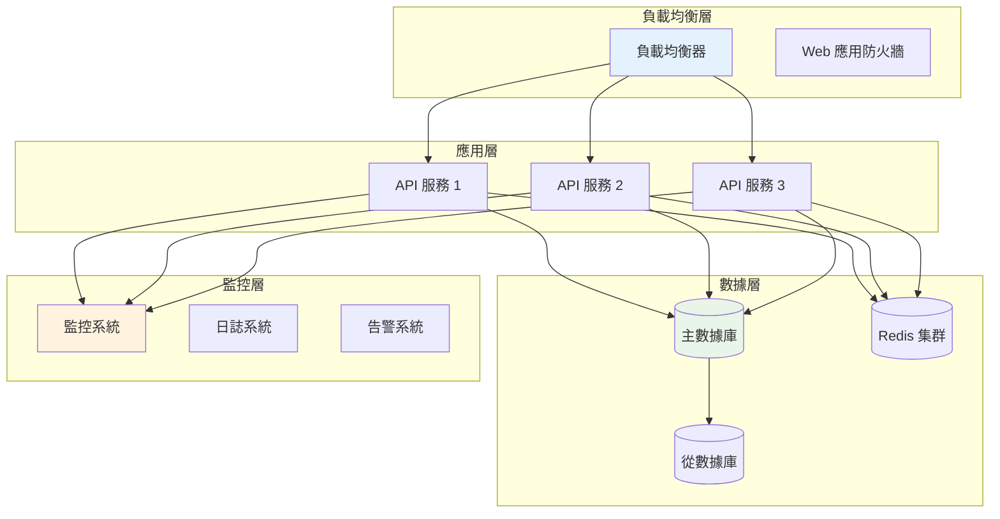

# 第七章：部署運維 (Deployment & Operations)

## 📚 章節概述

本章提供 Bee Swarm AI 角色協作系統的完整部署和運維指南，涵蓋環境準備、容器部署、自動化運維和生產環境管理等關鍵主題。

## 📖 章節目錄

### 7.1 [環境準備](./環境準備.md)
- **基礎設施規劃**: 硬件資源和網絡架構設計
- **系統環境**: 操作系統和依賴軟件安裝
- **安全配置**: 防火牆、SSL 證書和訪問控制
- **網絡配置**: 負載均衡和反向代理設置

### 7.2 [容器部署](./容器部署.md)
- **Docker 配置**: 容器鏡像構建和優化
- **Kubernetes 部署**: K8s 集群部署和管理
- **服務編排**: 微服務部署和服務發現
- **存儲管理**: 持久化存儲和數據備份

### 7.3 [自動化運維](./自動化運維.md)
- **CI/CD 流水線**: 自動化構建和部署
- **監控告警**: 全面的監控體系和告警機制
- **日誌管理**: 集中化日誌收集和分析
- **備份恢復**: 自動化備份和災難恢復

## 🎯 部署場景

### 🚀 快速體驗部署
適用於開發測試和功能演示：
```bash
# 單機 Docker Compose 部署
git clone https://github.com/your-org/bee-swarm.git
cd bee-swarm
docker-compose up -d
```

### 🏢 企業級部署
適用於生產環境和大規模使用：
- 高可用 Kubernetes 集群
- 負載均衡和服務網格
- 監控、日誌和告警體系
- 自動化 CI/CD 流水線

### ☁️ 雲原生部署
適用於雲平台和混合雲環境：
- AWS/Azure/GCP 雲服務
- Serverless 和容器服務
- 雲原生監控和安全
- 多地域部署和災備

## 📋 部署檢查清單

### 🔧 環境準備
- [ ] 服務器資源配置（CPU、內存、存儲）
- [ ] 網絡配置（防火牆、域名、SSL）
- [ ] 依賴軟件安裝（Docker、K8s、數據庫）
- [ ] 安全配置（用戶權限、密鑰管理）

### 📦 應用部署
- [ ] 容器鏡像構建和推送
- [ ] 配置文件和環境變量
- [ ] 數據庫初始化和遷移
- [ ] 服務啟動和健康檢查

### 📊 監控配置
- [ ] 監控系統部署（Prometheus、Grafana）
- [ ] 告警規則配置和通知設置
- [ ] 日誌收集系統（ELK Stack）
- [ ] 性能基準測試和調優

### 🔄 運維流程
- [ ] 自動化部署流水線
- [ ] 備份和恢復策略
- [ ] 故障應急預案
- [ ] 容量規劃和擴展策略

## 🛠 部署工具

### 容器化工具
```yaml
核心工具:
  - Docker: 容器運行時
  - Docker Compose: 單機編排
  - Kubernetes: 集群編排
  - Helm: K8s 包管理

鏡像倉庫:
  - Docker Hub: 公共鏡像倉庫
  - Harbor: 企業級私有倉庫
  - AWS ECR: AWS 託管倉庫
  - Azure ACR: Azure 容器倉庫
```

### 自動化工具
```yaml
CI/CD 工具:
  - GitHub Actions: GitHub 原生 CI/CD
  - GitLab CI: GitLab 集成 CI/CD
  - Jenkins: 開源自動化服務器
  - Tekton: 雲原生 CI/CD

基礎設施即代碼:
  - Terraform: 多雲基礎設施管理
  - Ansible: 配置管理和部署
  - Pulumi: 現代基礎設施即代碼
  - CloudFormation: AWS 基礎設施
```

### 監控工具
```yaml
監控系統:
  - Prometheus: 指標收集和存儲
  - Grafana: 可視化儀表板
  - Jaeger: 分佈式鏈路追蹤
  - AlertManager: 告警管理

日誌系統:
  - ELK Stack: Elasticsearch + Logstash + Kibana
  - Fluentd: 統一日誌收集
  - Loki: Grafana 日誌聚合
  - Splunk: 企業級日誌分析
```

## 🏗 架構設計

### 高可用架構


## 🔒 安全考慮

### 網絡安全
```yaml
防火牆配置:
  - 入站規則: 僅開放必要端口
  - 出站規則: 限制外部訪問
  - 內部通信: 服務間加密通信
  - DDoS 防護: 流量清洗和限流

SSL/TLS 配置:
  - 證書管理: 自動化證書更新
  - 加密強度: TLS 1.3 和強加密套件
  - HSTS: 強制 HTTPS 訪問
  - 證書透明度: CT 日誌監控
```

### 應用安全
```yaml
身份認證:
  - OAuth 2.0: 標準化身份認證
  - JWT Token: 無狀態認證
  - MFA: 多因子認證
  - RBAC: 基於角色的訪問控制

數據安全:
  - 數據加密: 靜態和傳輸加密
  - 密鑰管理: 統一密鑰管理服務
  - 數據脫敏: 敏感數據保護
  - 審計日誌: 完整的操作記錄
```

## 📊 運維指標

### 系統指標
```yaml
可用性指標:
  - 系統可用性: 99.9% SLA 目標
  - 服務響應時間: P95 < 200ms
  - 錯誤率: < 0.1%
  - 恢復時間: MTTR < 15分鐘

性能指標:
  - CPU 使用率: < 70%
  - 內存使用率: < 80%
  - 磁盤使用率: < 85%
  - 網絡延遲: < 10ms
```

### 業務指標
```yaml
協作效率:
  - 任務完成率: > 95%
  - 響應時間: < 30分鐘
  - 協作滿意度: > 4.5/5
  - 系統穩定性: > 99%

資源利用:
  - 成本優化: 月度成本控制
  - 資源效率: 利用率優化
  - 擴展能力: 自動伸縮
  - 容災能力: RTO < 1小時
```

## 🚀 快速開始

### 開發環境部署
```bash
# 1. 克隆項目
git clone https://github.com/your-org/bee-swarm.git
cd bee-swarm

# 2. 配置環境
cp .env.example .env
# 編輯 .env 文件設置必要參數

# 3. 啟動服務
docker-compose up -d

# 4. 驗證部署
curl http://localhost:8000/health
```

### 生產環境部署
```bash
# 1. 準備 Kubernetes 集群
kubectl create namespace bee-swarm

# 2. 部署應用
helm install bee-swarm ./charts/bee-swarm

# 3. 配置監控
helm install monitoring ./charts/monitoring

# 4. 設置備份
kubectl apply -f backup/cronjob.yaml
```

---

> **提示**: 部署運維是一個複雜的過程，建議根據實際環境和需求選擇合適的部署方案。對於生產環境，請務必遵循安全最佳實踐和運維規範。 