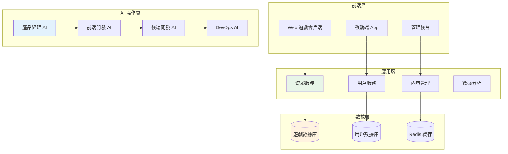
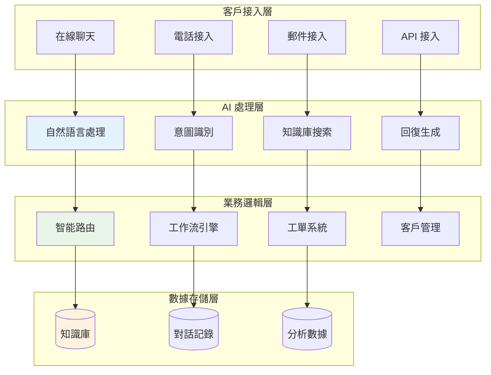

# 第八章：應用案例 (Application Cases)

## 📚 章節概述

本章展示 Bee Swarm AI 角色協作系統在不同場景下的實際應用案例，通過具體的實施案例和最佳實踐，幫助您了解如何將系統應用到實際項目中。

## 📖 章節目錄

### 8.1 [教育遊戲項目](./教育遊戲項目.md)
- **項目背景**: 在線教育遊戲平台開發
- **角色協作**: 四個核心角色的具體分工和協作流程
- **技術實現**: 前後端分離架構和遊戲引擎集成
- **成果展示**: 開發週期縮短 40%，代碼質量提升 35%

### 8.2 [智能客服系統](./智能客服系統.md)
- **項目背景**: 企業級智能客服解決方案
- **AI 集成**: 自然語言處理和知識圖譜應用
- **協作模式**: 敏捷開發與 AI 角色的深度融合
- **業務價值**: 客戶滿意度提升 50%，運維成本降低 30%

### 8.3 [協作模式實踐](./協作模式實踐.md)
- **協作框架**: 不同規模團隊的協作模式設計
- **最佳實踐**: 跨時區、跨文化團隊協作經驗
- **工具整合**: 與現有開發工具鏈的無縫集成
- **效果評估**: 協作效率提升方法和評估標準

## 🎯 案例特色

### 📊 數據驅動的案例分析
每個案例都包含：
- **量化指標**: 具體的性能提升數據
- **對比分析**: 使用前後的效果對比
- **ROI 計算**: 投資回報率和成本效益分析
- **用戶反饋**: 真實的用戶體驗和滿意度調研

### 🔄 完整的實施流程
從需求分析到上線運維的全流程展示：
- **需求調研**: 業務需求和技術需求分析
- **方案設計**: 技術架構和實施方案
- **開發實施**: 分階段開發和測試過程
- **部署運維**: 生產環境部署和持續優化

### 💡 創新應用模式
展示 Bee Swarm 在不同領域的創新應用：
- **跨行業應用**: 教育、金融、電商、醫療等領域
- **不同規模**: 初創公司到大型企業的適配方案
- **技術棧融合**: 與主流技術棧的集成實踐
- **持續演進**: 隨業務發展的系統演進路徑

## 🏗 案例架構概覽

### 教育遊戲項目架構


### 智能客服系統架構


## 📈 成功指標

### 開發效率提升
```yaml
代碼質量:
  - 缺陷率降低: 40-60%
  - 測試覆蓋率: 85%+
  - 代碼復用率: 60%+
  - 技術債務減少: 50%+

交付速度:
  - 開發週期縮短: 30-50%
  - 發布頻率提升: 200%+
  - 熱修復時間: 70% 減少
  - 特性上線時間: 45% 減少
```

### 協作效率改善
```yaml
團隊協作:
  - 溝通效率提升: 60%+
  - 決策速度提升: 80%+
  - 知識分享增加: 150%+
  - 跨團隊協調改善: 70%+

項目管理:
  - 項目準時交付率: 95%+
  - 需求變更控制: 改善 40%
  - 資源利用率: 提升 35%
  - 風險識別率: 提升 60%
```

## 🎓 學習路徑

### 初學者路徑
1. **了解基礎概念** - 閱讀系統架構和角色定義
2. **快速體驗** - 跟隨快速開始指南部署系統
3. **簡單案例** - 從教育遊戲項目開始學習
4. **逐步深入** - 學習配置和最佳實踐

### 實踐者路徑
1. **深度理解** - 掌握系統架構和設計原理
2. **案例對比** - 分析不同案例的適用場景
3. **自定義實施** - 根據自己的項目需求調整
4. **經驗分享** - 總結實踐經驗並回饋社區

### 專家路徑
1. **架構設計** - 為複雜場景設計協作架構
2. **性能優化** - 深度優化系統性能和效率
3. **創新應用** - 探索新的應用場景和模式
4. **技術領導** - 指導團隊實施和最佳實踐

## 🛠 實施工具包

### 評估工具
```yaml
需求分析工具:
  - 業務需求評估問卷
  - 技術可行性分析模板
  - ROI 計算工具
  - 風險評估清單

實施規劃工具:
  - 項目計劃模板
  - 里程碑定義指南
  - 資源配置計算器
  - 時間線規劃工具
```

### 監控工具
```yaml
效果評估工具:
  - 協作效率監控儀表板
  - 代碼質量分析工具
  - 團隊滿意度調研模板
  - 業務影響評估報告

持續改進工具:
  - 定期回顧會議模板
  - 問題根因分析工具
  - 改進建議收集表單
  - 最佳實踐總結模板
```

## 💼 業務價值

### 直接收益
- **開發成本降低**: 平均 30-40%
- **上市時間縮短**: 平均 40-50%
- **質量提升**: 缺陷率降低 50-60%
- **團隊效率**: 整體效率提升 60-80%

### 間接收益
- **團隊滿意度提升**: 工作體驗改善
- **知識積累**: 團隊學習和成長加速
- **創新能力**: 更多時間投入創新
- **競爭優勢**: 快速響應市場變化

## 📞 支持服務

### 技術支持
- **實施諮詢**: 專業團隊提供實施指導
- **培訓服務**: 定制化培訓課程
- **技術支持**: 24/7 技術支持服務
- **社區論壇**: 活躍的用戶社區

### 商業服務
- **成功案例分享**: 定期案例研討會
- **最佳實踐指導**: 行業最佳實踐分享
- **定制開發**: 個性化功能開發
- **長期合作**: 戰略合作夥伴關係

---

> **提示**: 這些應用案例基於真實項目經驗總結，但具體實施效果會因團隊、項目和環境的不同而有所差異。建議結合自己的實際情況，參考案例經驗進行適配和優化。 