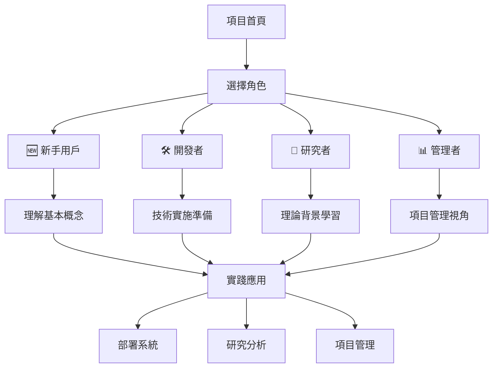

# 🚀 入門指南導航

## 📍 您現在的位置
[項目首頁](../../README.md) > [文檔索引](../../PROJECT_INDEX.md) > **入門指南** > 您在這裡

## 🎯 選擇您的角色

根據您的背景和需求，選擇最適合的入門路徑：

### 👤 角色導向的學習路徑

| 角色 | 適合人群 | 學習時間 | 入門指南 |
|------|----------|----------|----------|
| 🆕 **新手用戶** | 第一次接觸項目，想了解基本概念 | 15 分鐘 | [新手指南](for-beginners.md) |
| 🛠️ **開發者** | 想要實施和部署系統的技術人員 | 30 分鐘 | [開發者指南](for-developers.md) |
| 🔬 **研究者** | 對 AI 協作理論感興趣的學者 | 45 分鐘 | [研究者指南](for-researchers.md) |
| 📊 **管理者** | 負責項目管理和決策的管理人員 | 20 分鐘 | [管理者指南](for-managers.md) |

## 🚀 快速選擇

### ⚡ 我想要...

#### 🔍 快速了解項目
- **時間**：5 分鐘
- **路徑**：[CONTEXT.md](../../CONTEXT.md) → [核心理念](../01-項目背景/核心理念.md)
- **目標**：理解項目的核心價值和定位

#### 🛠️ 動手實踐
- **時間**：10 分鐘
- **路徑**：[QUICK_START.md](../../QUICK_START.md) → [技術實施路徑](../../QUICK_START.md#🛠️-路徑二技術實施10-分鐘)
- **目標**：運行第一個 AI Agent

#### 📚 深入學習
- **時間**：30 分鐘
- **路徑**：[混合架構設計](../混合架構設計.md) → [Gemini CLI 最佳實踐](../../Gemini-CLI-最佳實踐.md)
- **目標**：掌握完整的技術方案

#### 🔬 研究分析
- **時間**：45 分鐘
- **路徑**：[模擬工具](../05-模擬工具/) → [協作效果分析](../05-模擬工具/協作效果分析.md)
- **目標**：理解 AI 協作的科學原理

## 📖 學習建議

### 🎯 推薦學習順序

#### 第一階段：理解概念（所有角色適用）
1. **核心概念**：[CONTEXT.md](../../CONTEXT.md) （5 分鐘）
2. **項目價值**：[核心理念](../01-項目背景/核心理念.md) （10 分鐘）
3. **技術約束**：[設計約束](../01-項目背景/設計約束.md) （10 分鐘）

#### 第二階段：角色專屬深入（選擇您的角色）
- **新手**：[新手指南](for-beginners.md)
- **開發者**：[開發者指南](for-developers.md)
- **研究者**：[研究者指南](for-researchers.md)
- **管理者**：[管理者指南](for-managers.md)

#### 第三階段：實踐應用（根據需要）
- **技術實施**：[QUICK_START.md](../../QUICK_START.md)
- **案例研究**：[教育遊戲項目](../08-應用案例/教育遊戲項目.md)
- **模擬驗證**：[SimPy 模擬器](../05-模擬工具/SimPy模擬器.md)

## 🛣️ 學習路線圖

## 📚 核心文檔快速訪問

### 🎯 必讀文檔
- [CONTEXT.md](../../CONTEXT.md) - 核心思想指導
- [PROJECT_INDEX.md](../../PROJECT_INDEX.md) - 完整文檔索引
- [QUICK_START.md](../../QUICK_START.md) - 5 分鐘快速體驗

### 🏗️ 架構文檔
- [混合架構設計](../混合架構設計.md) - 完整技術方案
- [AI 角色設計](../02-系統架構/AI角色設計.md) - 角色定義
- [通信協調](../02-系統架構/通信協調.md) - 協作機制

### 🔧 實施文檔
- [Gemini CLI 最佳實踐](../../Gemini-CLI-最佳實踐.md) - 技術實踐
- [官方快速開始指南](../../官方快速開始指南.md) - 詳細部署
- [配置指南](../06-使用指南/配置指南.md) - 系統配置

## 🆘 需要幫助？

### 📞 獲取支持
- **快速問題**：查看 [FAQ 部分](../../QUICK_START.md#🆘-常見問題和故障排除)
- **技術問題**：參考 [故障排除](../06-使用指南/故障排除.md)
- **深入討論**：查看 [GitHub Issues](https://github.com/fallrising/bee_swarm/issues)

### 🎯 選擇困難？
如果您不確定從哪裡開始：

1. **完全新手**：從 [新手指南](for-beginners.md) 開始
2. **有技術背景**：從 [開發者指南](for-developers.md) 開始
3. **學術研究**：從 [研究者指南](for-researchers.md) 開始
4. **項目管理**：從 [管理者指南](for-managers.md) 開始

## 🎉 開始您的 Bee Swarm 之旅！

選擇您的角色，點擊對應的指南，讓我們開始這個令人興奮的 AI 協作探索之旅！

---

*最後更新：2025年1月 | 預計選擇時間：2 分鐘* 