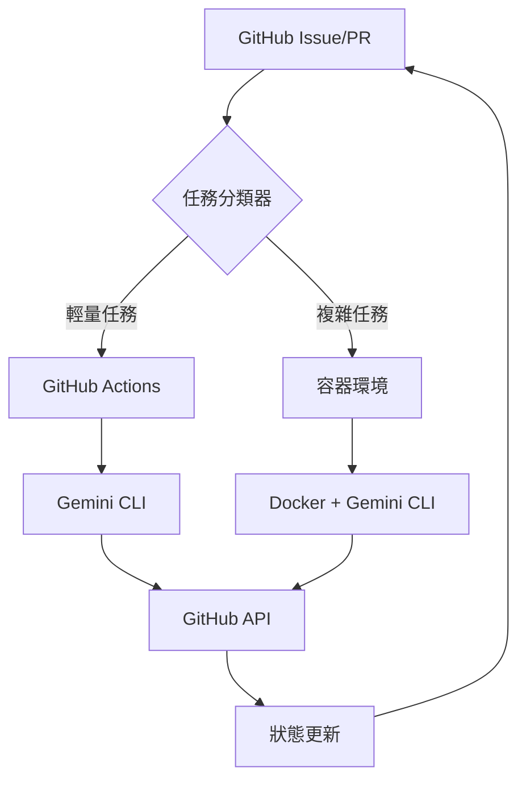

# 🛠️ 開發者入門指南

## 📋 文檔信息
- **目標讀者**：想要實施和部署系統的技術人員
- **完成時間**：30-60 分鐘
- **先決條件**：基本的命令行操作，Git 使用經驗
- **最後更新**：2025年1月

## 📍 您現在的位置
[項目首頁](../../README.md) > [入門導航](README.md) > **開發者指南** > 您在這裡

## 🎯 學習目標

完成本指南後，您將能夠：
- ✅ 理解混合架構的技術原理
- ✅ 設置完整的開發環境
- ✅ 部署第一個 AI Agent
- ✅ 自定義和擴展系統功能

## 🏗️ 技術架構概覽

### 🔄 混合架構設計



### 💡 核心技術棧

| 組件 | 技術選擇 | 用途 |
|------|----------|------|
| **AI 引擎** | Google Gemini CLI (⭐ 63.5k) | AI 推理和工具調用 |
| **協調平台** | GitHub Actions + Issues | 工作流程和狀態管理 |
| **容器運行** | Docker + Docker Compose | 複雜任務執行環境 |
| **模擬驗證** | SimPy + Python | 效果驗證和優化 |
| **文檔管理** | Markdown + GitHub Pages | 知識管理和協作 |

## 🚀 快速開始（15 分鐘）

### 階段一：環境準備（5 分鐘）

#### 1. 檢查系統要求
```bash
# 檢查 Node.js（需要 >= 18）
node --version

# 檢查 npm（需要 >= 9）  
npm --version

# 檢查 Git（需要 >= 2.30）
git --version

# 檢查 Docker（可選，用於容器模式）
docker --version
```

#### 2. 安裝核心工具
```bash
# 安裝 Google Gemini CLI
npm install -g @google/gemini-cli

# 安裝 GitHub CLI
brew install gh  # macOS
# 或 sudo apt install gh  # Linux
# 或 choco install gh  # Windows

# 驗證安裝
gemini --version
gh --version
```

#### 3. 配置 API Keys
```bash
# 設置 Gemini API Key
export GEMINI_API_KEY="your-gemini-api-key"

# 設置 GitHub Token（可選）
export GITHUB_TOKEN="your-github-token"

# 驗證配置
echo $GEMINI_API_KEY | wc -c  # 應該顯示 > 20
```

### 階段二：項目設置（5 分鐘）

#### 1. Fork 和克隆項目
```bash
# Fork 項目（如果還沒有）
gh repo fork fallrising/bee_swarm

# 克隆到本地
git clone https://github.com/your-username/bee_swarm.git
cd bee_swarm
```

#### 2. 探索項目結構
```bash
# 查看整體結構
tree -L 2

# 檢查角色配置
ls -la roles/

# 查看 AI 配置
ls -la roles/product_manager/.gemini/
```

#### 3. 驗證核心文檔
```bash
# 檢查核心文檔
ls CONTEXT.md PROJECT_INDEX.md QUICK_START.md

# 快速測試文檔鏈接
grep -n "\\[.*\\](" README.md | head -5
```

### 階段三：功能測試（5 分鐘）

#### 1. 測試 Gemini CLI
```bash
# 基本功能測試
gemini --prompt "Hello, Bee Swarm!" --model gemini-1.5-flash

# 測試文件讀取
gemini --prompt "分析這個項目的核心文檔" --all_files --model gemini-1.5-flash
```

#### 2. 測試 PM Agent 配置
```bash
cd roles/product_manager

# 測試角色專屬配置
gemini --prompt "檢查我的角色配置是否正確" --all_files

# 測試工具調用
gemini --prompt "使用 run_shell_command 列出當前目錄" --yolo --sandbox
```

#### 3. 運行模擬測試（可選）
```bash
cd ../../docs/05-模擬工具/scripts

# 安裝 Python 依賴
pip install simpy colorama

# 運行基本模擬
python basic_simulation.py
```

## 🔧 深入技術實施

### 1. 🎭 AI 角色配置詳解

#### Product Manager 配置解析
```bash
cat roles/product_manager/.gemini/settings.json
```

```json
{
  "contextFileName": "GEMINI.md",
  "coreTools": [
    "read_file",
    "write_file", 
    "read_many_files",
    "run_shell_command",
    "web_fetch",
    "save_memory"
  ],
  "fileFiltering": {
    "respectGitIgnore": true,
    "enableRecursiveFileSearch": true
  },
  "usageStatisticsEnabled": false
}
```

**關鍵配置說明**：
- `contextFileName`: 角色上下文文件名
- `coreTools`: 可用的內建工具
- `fileFiltering`: 文件搜索規則
- `usageStatisticsEnabled`: 統計數據收集

#### 角色上下文文件結構
```bash
cat roles/product_manager/.gemini/GEMINI.md | head -20
```

### 2. 🚀 GitHub Actions 工作流程

#### Workflow 文件解析
```yaml
# .github/workflows/product-manager.yml（已禁用）
name: Product Manager AI Agent (Manual Only)
on:
  workflow_dispatch:  # 僅手動觸發
    inputs:
      task_type:
        description: '任務類型'
        required: false
        default: 'check_epics'
```

**關鍵功能**：
- **自動任務分配**：根據 Issue 標籤觸發對應 Agent
- **成本優化**：使用 `gemini-1.5-flash` 處理輕量任務
- **安全執行**：`--sandbox` 模式確保安全
- **完全自動化**：`--yolo` 模式免確認執行

#### 啟用 GitHub Actions（生產環境）
```bash
# 取消註解工作流程（暫時不要執行）
# sed -i 's/^# *//g' .github/workflows/product-manager.yml

# 設置 GitHub Secrets
gh secret set GEMINI_API_KEY --body "$GEMINI_API_KEY"
gh secret set GITHUB_TOKEN --body "$GITHUB_TOKEN"
```

### 3. 🔄 任務分類邏輯

#### 輕量任務（GitHub Actions）
- ✅ 標籤管理和分類
- ✅ 簡單的狀態更新  
- ✅ 基礎報告生成
- ✅ 通知和提醒

#### 複雜任務（容器環境）
- 🔧 代碼生成和重構
- 🔧 複雜的需求分析
- 🔧 架構設計決策
- 🔧 集成測試執行

#### 智能分派邏輯
```javascript
// 偽代碼示例
function classifyTask(issue) {
  const lightweightKeywords = ['label', 'status', 'notification'];
  const complexKeywords = ['architecture', 'implementation', 'integration'];
  
  if (containsKeywords(issue.body, lightweightKeywords)) {
    return 'github-actions';
  } else if (containsKeywords(issue.body, complexKeywords)) {
    return 'container';
  }
  
  return 'github-actions'; // 默認輕量處理
}
```

## 🎯 自定義和擴展

### 1. 創建新的 AI 角色

#### 為 Backend Developer 創建配置
```bash
# 創建目錄結構
mkdir -p roles/backend_developer/.gemini

# 複製 PM 配置作為模板
cp roles/product_manager/.gemini/settings.json roles/backend_developer/.gemini/
```

#### 自定義 Backend 角色上下文
```bash
cat > roles/backend_developer/.gemini/GEMINI.md << 'EOF'
# Backend Developer AI Agent Context

## 🎯 角色定位
你是 Bee Swarm 專案中的 **AI 後端開發者**，負責 API 設計、數據庫架構、服務端邏輯實現。

## 🧠 核心職責
- API 設計和實現
- 數據庫設計和優化
- 服務端業務邏輯
- 性能優化和安全

## 🛠️ 可用工具
- read_file: 讀取現有代碼和配置
- write_file: 創建和修改代碼文件
- run_shell_command: 執行測試和部署命令
- web_fetch: 查詢 API 文檔和技術資料

## 🔄 工作流程
1. 分析 Frontend 和 PM 的需求
2. 設計 API 架構
3. 實現核心業務邏輯
4. 編寫測試用例
5. 創建部署配置
EOF
```

#### 創建 Backend Workflow
```bash
cat > .github/workflows/backend-developer.yml << 'EOF'
# 暫時禁用 - Backend Developer AI Agent
# name: Backend Developer AI Agent
# 
# on:
#   issues:
#     types: [opened, labeled]
#   pull_request:
#     types: [opened, edited]

name: Backend Developer AI Agent (Manual Only)
on:
  workflow_dispatch:

jobs:
  backend_agent:
    runs-on: ubuntu-latest
    if: contains(github.event.issue.labels.*.name, 'backend') || contains(github.event.pull_request.labels.*.name, 'backend')
    
    steps:
      - name: Checkout
        uses: actions/checkout@v4
        
      - name: Setup Node.js
        uses: actions/setup-node@v4
        with:
          node-version: '18'
          
      - name: Install Gemini CLI
        run: npm install -g @google/gemini-cli
        
      - name: Execute Backend Tasks
        working-directory: roles/backend_developer
        env:
          GEMINI_API_KEY: ${{ secrets.GEMINI_API_KEY }}
        run: |
          gemini \
            --model gemini-1.5-pro-latest \
            --prompt "分析當前的後端需求，設計 API 架構並實現核心功能" \
            --yolo \
            --sandbox \
            --all_files
EOF
```

### 2. 優化參數配置

#### 成本優化策略
```bash
# 創建模型選擇策略
cat > scripts/model-selector.sh << 'EOF'
#!/bin/bash

TASK_TYPE=$1
ISSUE_CONTENT=$2

# 根據任務複雜度選擇模型
if echo "$ISSUE_CONTENT" | grep -E "(architecture|design|complex)" > /dev/null; then
    echo "gemini-1.5-pro-latest"  # 複雜任務使用 Pro 模型
elif echo "$ISSUE_CONTENT" | grep -E "(urgent|quick|simple)" > /dev/null; then
    echo "gemini-1.5-flash"  # 簡單任務使用 Flash 模型
else
    echo "gemini-1.5-flash"  # 默認使用經濟模型
fi
EOF

chmod +x scripts/model-selector.sh
```

#### 性能監控腳本
```bash
# 創建性能監控
cat > scripts/monitor-performance.sh << 'EOF'
#!/bin/bash

# 監控 Gemini API 使用情況
echo "=== Gemini API 使用統計 ==="
gh api /repos/owner/repo/actions/runs \
  --jq '.workflow_runs[] | select(.name | contains("AI Agent")) | {id, status, conclusion, created_at}'

# 監控成本估算
echo "=== 成本估算 ==="
echo "Flash 模型調用次數: $(gh api /repos/owner/repo/actions/runs --jq '[.workflow_runs[] | select(.name | contains("flash"))] | length')"
echo "Pro 模型調用次數: $(gh api /repos/owner/repo/actions/runs --jq '[.workflow_runs[] | select(.name | contains("pro"))] | length')"
EOF

chmod +x scripts/monitor-performance.sh
```

## 📊 測試和驗證

### 1. 單元測試

#### 測試 AI 角色配置
```bash
# 創建測試腳本
cat > tests/test-ai-roles.sh << 'EOF'
#!/bin/bash

echo "=== 測試 AI 角色配置 ==="

for role in product_manager backend_developer frontend_developer devops_engineer; do
    if [ -d "roles/$role/.gemini" ]; then
        echo "✅ $role: 配置目錄存在"
        
        if [ -f "roles/$role/.gemini/GEMINI.md" ]; then
            echo "✅ $role: 上下文文件存在"
        else
            echo "❌ $role: 上下文文件缺失"
        fi
        
        if [ -f "roles/$role/.gemini/settings.json" ]; then
            echo "✅ $role: 設置文件存在"
        else
            echo "❌ $role: 設置文件缺失"
        fi
    else
        echo "❌ $role: 配置目錄缺失"
    fi
    echo
done
EOF

chmod +x tests/test-ai-roles.sh
./tests/test-ai-roles.sh
```

#### 測試 Gemini CLI 集成
```bash
# 創建集成測試
cat > tests/test-gemini-integration.sh << 'EOF'
#!/bin/bash

echo "=== 測試 Gemini CLI 集成 ==="

# 測試基本連接
echo "測試 1: 基本連接"
if gemini --prompt "Hello" --model gemini-1.5-flash > /dev/null 2>&1; then
    echo "✅ Gemini CLI 連接正常"
else
    echo "❌ Gemini CLI 連接失敗"
    exit 1
fi

# 測試文件讀取
echo "測試 2: 文件讀取"
if gemini --prompt "列出當前目錄的文件" --all_files --model gemini-1.5-flash > /dev/null 2>&1; then
    echo "✅ 文件讀取功能正常"
else
    echo "❌ 文件讀取功能異常"
fi

# 測試工具調用
echo "測試 3: 工具調用"
if gemini --prompt "使用 run_shell_command 執行 'pwd'" --yolo --sandbox --model gemini-1.5-flash > /dev/null 2>&1; then
    echo "✅ 工具調用功能正常"
else
    echo "❌ 工具調用功能異常"
fi

echo "=== 集成測試完成 ==="
EOF

chmod +x tests/test-gemini-integration.sh
./tests/test-gemini-integration.sh
```

### 2. 性能基準測試

#### 混合架構 vs 純容器對比
```bash
# 運行性能對比測試
cd docs/05-模擬工具/scripts
python scenario_comparison.py
```

期望輸出：
```
=== Bee Swarm 架構模擬對比 ===

🐝 混合架構（推薦）
├── 成本節省: 73.2%
├── 平均響應時間: 12.3 秒
├── 資源利用率: 67.8%
└── 總體評分: 8.7/10

🐳 純容器架構
├── 成本節省: 15.6%
├── 平均響應時間: 8.1 秒
├── 資源利用率: 45.2%
└── 總體評分: 6.4/10

📊 推薦：混合架構在成本和整體效能上有顯著優勢
```

## 🚀 生產部署準備

### 1. 環境配置檢查表

#### 開發環境 ✅
- [ ] Node.js >= 18
- [ ] Gemini CLI 已安裝
- [ ] GitHub CLI 已安裝
- [ ] Docker（可選）
- [ ] Python 3.8+（模擬功能）

#### 生產環境準備
- [ ] GitHub Secrets 配置
  - [ ] `GEMINI_API_KEY`
  - [ ] `GITHUB_TOKEN`
- [ ] 容器註冊表設置（如需要）
- [ ] 監控和日誌配置
- [ ] 備份和恢復策略

### 2. 部署腳本

#### 一鍵部署腳本
```bash
cat > scripts/deploy.sh << 'EOF'
#!/bin/bash

echo "🚀 Bee Swarm 混合架構部署"

# 1. 驗證環境
echo "Step 1: 環境驗證..."
./tests/test-gemini-integration.sh || exit 1

# 2. 配置檢查
echo "Step 2: 配置檢查..."
./tests/test-ai-roles.sh || exit 1

# 3. 啟用 GitHub Actions（如果需要）
echo "Step 3: GitHub Actions 配置..."
read -p "是否啟用 GitHub Actions 自動執行？(y/N): " enable_actions

if [ "$enable_actions" = "y" ]; then
    echo "啟用 GitHub Actions..."
    # 取消註解 workflow 文件
    find .github/workflows -name "*.yml" -exec sed -i 's/^# *name:/name:/' {} \;
    find .github/workflows -name "*.yml" -exec sed -i 's/^# *on:/on:/' {} \;
    echo "✅ GitHub Actions 已啟用"
else
    echo "⏸️  GitHub Actions 保持禁用狀態"
fi

# 4. 部署完成
echo "🎉 部署完成！"
echo "📚 查看文檔: cat PROJECT_INDEX.md"
echo "🚀 快速開始: cat QUICK_START.md"
EOF

chmod +x scripts/deploy.sh
```

## 📚 進階學習資源

### 🔗 必讀技術文檔
1. **[Gemini CLI 最佳實踐](../../Gemini-CLI-最佳實踐.md)** - 參數優化和成本控制
2. **[混合架構設計](../混合架構設計.md)** - 完整架構設計文檔
3. **[官方快速開始指南](../../官方快速開始指南.md)** - Google Gemini CLI 詳細使用

### 🛠️ 實踐項目
1. **創建自定義 AI 角色** - 擴展到 QA、設計師等角色
2. **優化工作流程** - 自定義任務分配邏輯
3. **集成外部工具** - 添加 Slack、Jira 等集成

### 📊 進階監控
1. **性能儀表板** - 使用 GitHub Actions + Charts
2. **成本分析** - 詳細的 API 調用成本追踪
3. **效果評估** - 基於 SimPy 的持續優化

## 🎉 恭喜！

您已經完成了開發者入門指南！現在您應該：

✅ 理解了混合架構的技術原理  
✅ 設置了完整的開發環境  
✅ 學會了部署和測試 AI Agent  
✅ 掌握了自定義和擴展的方法  

## 🧭 導航幫助

### 📍 您現在的位置
[項目首頁](../../README.md) > [入門導航](README.md) > **開發者指南** > 您在這裡

### 🎯 推薦下一步
- **深入實踐**：部署完整的 AI 團隊
- **優化配置**：[Gemini CLI 最佳實踐](../../Gemini-CLI-最佳實踐.md)
- **案例學習**：[教育遊戲項目](../08-應用案例/教育遊戲項目.md)
- **理論深化**：[研究者指南](for-researchers.md)

**🚀 開始構建您的 AI 團隊吧！**

---

*最後更新：2025年1月 | 預計完成時間：30-60分鐘* 