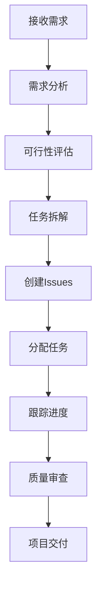
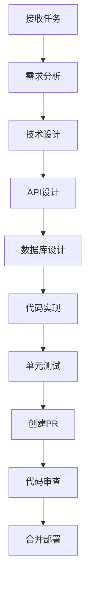
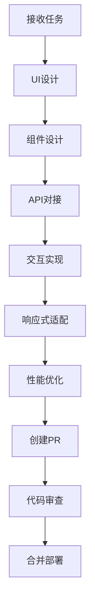
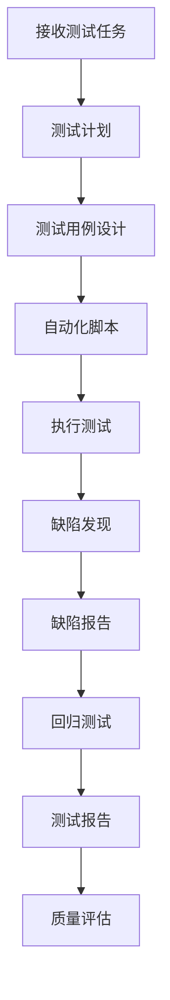
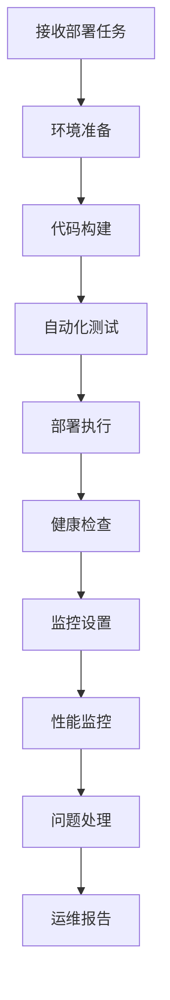

# Level 2: 角色系统

## 业务面：角色职责和协作模式

### 2.1 产品经理 (Product Manager)

#### 主要职责
- **需求管理**：接收、分析和整理用户需求
- **产品规划**：制定产品路线图和功能规划
- **任务拆解**：将大需求拆分为具体的开发任务
- **优先级管理**：根据业务价值和紧急程度排序任务
- **进度跟踪**：监控项目进度和里程碑完成情况
- **stakeholder沟通**：与业务方、用户等利益相关者沟通

#### 协作模式
- **需求传递**：将需求转化为GitHub Issues
- **任务分配**：将Issues分配给相应的开发角色
- **进度协调**：协调各角色的工作进度
- **质量把控**：审查PR和提供产品层面的反馈
- **风险管控**：识别和应对项目风险

#### 工作流程


### 2.2 后端开发 (Backend Developer)

#### 主要职责
- **API设计**：设计和实现RESTful API
- **数据库设计**：设计数据库结构和关系
- **业务逻辑**：实现核心业务逻辑
- **性能优化**：优化系统性能和响应时间
- **安全实现**：实现身份认证和授权
- **系统集成**：集成第三方服务和API

#### 协作模式
- **API文档**：为前端开发提供API文档
- **接口协调**：与前端开发协调接口设计
- **数据模型**：与数据工程师协调数据模型
- **部署配合**：与DevOps工程师配合部署
- **问题修复**：响应QA工程师发现的问题

#### 工作流程


### 2.3 前端开发 (Frontend Developer)

#### 主要职责
- **UI设计**：设计和实现用户界面
- **交互开发**：实现用户交互逻辑
- **响应式设计**：确保在不同设备上的适配
- **性能优化**：优化前端加载和运行性能
- **用户体验**：优化用户使用体验
- **前端测试**：编写前端测试用例

#### 协作模式
- **设计协调**：与UI/UX设计师协调设计
- **API对接**：基于后端API进行开发
- **接口调试**：与后端开发调试接口
- **测试配合**：配合QA工程师进行测试
- **部署协调**：与DevOps工程师协调部署

#### 工作流程


### 2.4 QA工程师 (QA Engineer)

#### 主要职责
- **测试计划**：制定测试计划和策略
- **测试用例**：设计和编写测试用例
- **自动化测试**：实现自动化测试脚本
- **缺陷管理**：发现、记录和跟踪缺陷
- **质量保证**：确保产品质量符合标准
- **测试报告**：生成测试报告和数据分析

#### 协作模式
- **需求理解**：与产品经理理解需求
- **测试协调**：与开发人员协调测试
- **缺陷反馈**：向开发人员反馈缺陷
- **质量评估**：评估产品质量和风险
- **发布验证**：验证发布版本的质量

#### 工作流程


### 2.5 DevOps工程师 (DevOps Engineer)

#### 主要职责
- **部署自动化**：实现自动化部署流程
- **基础设施**：管理和维护基础设施
- **监控告警**：设置系统监控和告警
- **性能优化**：优化系统性能和资源使用
- **安全运维**：确保系统安全和合规
- **灾难恢复**：制定和实施灾难恢复计划

#### 协作模式
- **部署协调**：与开发人员协调部署
- **环境管理**：为开发人员提供测试环境
- **问题处理**：处理生产环境问题
- **性能调优**：与开发人员协作性能优化
- **安全加固**：与安全团队协作安全加固

#### 工作流程


### 2.6 项目管理 (Project Manager)

#### 主要职责
- **项目规划**：制定项目计划和里程碑
- **资源协调**：协调项目资源和人员
- **进度管理**：跟踪项目进度和风险
- **沟通管理**：管理项目相关方沟通
- **质量管理**：确保项目质量符合要求
- **变更管理**：管理项目变更和影响

#### 协作模式
- **团队协调**：协调各角色之间的工作
- **进度跟踪**：跟踪各角色的工作进度
- **风险管控**：识别和应对项目风险
- **stakeholder管理**：管理与利益相关者的关系
- **质量把控**：确保项目交付质量

### 2.7 运营人员 (Operations)

#### 主要职责
- **用户反馈**：收集和分析用户反馈
- **数据分析**：分析产品使用数据和指标
- **用户支持**：提供用户支持和帮助
- **内容运营**：管理产品内容和文档
- **市场调研**：进行市场调研和竞品分析
- **产品优化**：基于数据优化产品功能

#### 协作模式
- **需求反馈**：向产品经理反馈用户需求
- **问题报告**：向开发团队报告用户问题
- **数据分析**：为产品决策提供数据支持
- **用户教育**：帮助用户更好地使用产品
- **市场洞察**：为产品规划提供市场洞察

## 技术面：容器镜像设计

### 2.1 基础镜像架构

基于VNC Lab的`novnc_llm_cli`，为每个角色定制：

```dockerfile
# 基础镜像：novnc_llm_cli
FROM vnc_lab/novnc_llm_cli:latest

# 角色特定配置
ENV ROLE_NAME=""
ENV GITHUB_USERNAME=""
ENV GITHUB_TOKEN=""
ENV AI_TOOLS=""

# 角色特定工具安装
COPY roles/${ROLE_NAME}/install_tools.sh /opt/scripts/
RUN /opt/scripts/install_tools.sh

# 角色特定脚本
COPY roles/${ROLE_NAME}/ /app/
WORKDIR /app

# 启动角色服务
CMD ["python", "role_service.py"]
```

### 2.2 角色容器配置

#### 产品经理容器配置
```yaml
# docker-compose.yml
services:
  product-manager:
    build: 
      context: ./roles/product_manager
      dockerfile: Dockerfile
    environment:
      - ROLE_NAME=product_manager
      - GITHUB_USERNAME=pm_ai_001
      - GITHUB_TOKEN=${GITHUB_TOKEN_PM}
      - AI_TOOLS=gemini-cli,notion-api,figma-api
      - VNC_PASSWORD=${VNC_PASSWORD_PM}
      - TTYD_PASSWORD=${TTYD_PASSWORD_PM}
    ports:
      - "6080:6080"  # noVNC
      - "7681:7681"  # ttyd
    volumes:
      - pm_data:/app/data
      - pm_logs:/app/logs
      - pm_config:/app/config
    restart: unless-stopped
    deploy:
      resources:
        limits:
          memory: 2G
          cpus: '1.0'
        reservations:
          memory: 1G
          cpus: '0.5'
```

#### 后端开发容器配置
```yaml
services:
  backend-developer:
    build: 
      context: ./roles/backend_developer
      dockerfile: Dockerfile
    environment:
      - ROLE_NAME=backend_developer
      - GITHUB_USERNAME=backend_ai_001
      - GITHUB_TOKEN=${GITHUB_TOKEN_BACKEND}
      - AI_TOOLS=claude-code,rovo-dev,cursor
      - VNC_PASSWORD=${VNC_PASSWORD_BACKEND}
      - TTYD_PASSWORD=${TTYD_PASSWORD_BACKEND}
    ports:
      - "6081:6080"  # noVNC
      - "7682:7681"  # ttyd
    volumes:
      - backend_data:/app/data
      - backend_logs:/app/logs
      - backend_config:/app/config
    restart: unless-stopped
    deploy:
      resources:
        limits:
          memory: 4G
          cpus: '2.0'
        reservations:
          memory: 2G
          cpus: '1.0'
```

#### 前端开发容器配置
```yaml
services:
  frontend-developer:
    build: 
      context: ./roles/frontend_developer
      dockerfile: Dockerfile
    environment:
      - ROLE_NAME=frontend_developer
      - GITHUB_USERNAME=frontend_ai_001
      - GITHUB_TOKEN=${GITHUB_TOKEN_FRONTEND}
      - AI_TOOLS=warp,cursor,figma-api
      - VNC_PASSWORD=${VNC_PASSWORD_FRONTEND}
      - TTYD_PASSWORD=${TTYD_PASSWORD_FRONTEND}
    ports:
      - "6082:6080"  # noVNC
      - "7683:7681"  # ttyd
    volumes:
      - frontend_data:/app/data
      - frontend_logs:/app/logs
      - frontend_config:/app/config
    restart: unless-stopped
    deploy:
      resources:
        limits:
          memory: 3G
          cpus: '1.5'
        reservations:
          memory: 1.5G
          cpus: '0.75'
```

#### QA工程师容器配置
```yaml
services:
  qa-engineer:
    build: 
      context: ./roles/qa_engineer
      dockerfile: Dockerfile
    environment:
      - ROLE_NAME=qa_engineer
      - GITHUB_USERNAME=qa_ai_001
      - GITHUB_TOKEN=${GITHUB_TOKEN_QA}
      - AI_TOOLS=playwright,jest,cypress
      - VNC_PASSWORD=${VNC_PASSWORD_QA}
      - TTYD_PASSWORD=${TTYD_PASSWORD_QA}
    ports:
      - "6083:6080"  # noVNC
      - "7684:7681"  # ttyd
    volumes:
      - qa_data:/app/data
      - qa_logs:/app/logs
      - qa_config:/app/config
    restart: unless-stopped
    deploy:
      resources:
        limits:
          memory: 2G
          cpus: '1.0'
        reservations:
          memory: 1G
          cpus: '0.5'
```

#### DevOps工程师容器配置
```yaml
services:
  devops-engineer:
    build: 
      context: ./roles/devops_engineer
      dockerfile: Dockerfile
    environment:
      - ROLE_NAME=devops_engineer
      - GITHUB_USERNAME=devops_ai_001
      - GITHUB_TOKEN=${GITHUB_TOKEN_DEVOPS}
      - AI_TOOLS=terraform,kubernetes,docker
      - VNC_PASSWORD=${VNC_PASSWORD_DEVOPS}
      - TTYD_PASSWORD=${TTYD_PASSWORD_DEVOPS}
    ports:
      - "6084:6080"  # noVNC
      - "7685:7681"  # ttyd
    volumes:
      - devops_data:/app/data
      - devops_logs:/app/logs
      - devops_config:/app/config
    restart: unless-stopped
    deploy:
      resources:
        limits:
          memory: 3G
          cpus: '1.5'
        reservations:
          memory: 1.5G
          cpus: '0.75'
```

### 2.3 角色服务实现

#### 基础角色服务类
```python
# role_service.py
import os
import time
import logging
from github_client import GitHubClient
from ai_tools import AITools
from role_communication import RoleCommunication
from monitoring import Monitoring

class RoleService:
    def __init__(self):
        self.role_name = os.getenv('ROLE_NAME')
        self.github_client = GitHubClient()
        self.ai_tools = AITools()
        self.communication = RoleCommunication(self.role_name, self.github_client)
        self.monitoring = Monitoring(self.role_name)
        
        # 设置日志
        logging.basicConfig(
            level=logging.INFO,
            format='%(asctime)s - %(name)s - %(levelname)s - %(message)s',
            handlers=[
                logging.FileHandler(f'/app/logs/{self.role_name}.log'),
                logging.StreamHandler()
            ]
        )
        self.logger = logging.getLogger(self.role_name)
    
    def process_assigned_issues(self):
        """处理分配给当前角色的issues"""
        try:
            issues = self.github_client.get_assigned_issues()
            self.logger.info(f"Found {len(issues)} assigned issues")
            
            for issue in issues:
                self.handle_issue(issue)
                
        except Exception as e:
            self.logger.error(f"Error processing issues: {e}")
            self.monitoring.alert_on_issues("issue_processing_error", str(e))
    
    def handle_issue(self, issue):
        """处理单个issue"""
        issue_number = issue['number']
        issue_title = issue['title']
        
        self.logger.info(f"Processing issue #{issue_number}: {issue_title}")
        self.monitoring.log_activity("issue_processing", {
            'issue_number': issue_number,
            'issue_title': issue_title,
            'status': issue['state']
        })
        
        try:
            if self.role_name == 'product_manager':
                self.handle_pm_issue(issue)
            elif self.role_name == 'backend_developer':
                self.handle_backend_issue(issue)
            elif self.role_name == 'frontend_developer':
                self.handle_frontend_issue(issue)
            elif self.role_name == 'qa_engineer':
                self.handle_qa_issue(issue)
            elif self.role_name == 'devops_engineer':
                self.handle_devops_issue(issue)
            else:
                self.logger.warning(f"Unknown role: {self.role_name}")
                
        except Exception as e:
            self.logger.error(f"Error handling issue #{issue_number}: {e}")
            self.monitoring.alert_on_issues("issue_handling_error", str(e))
    
    def handle_pm_issue(self, issue):
        """产品经理处理issue"""
        # 产品经理特定的处理逻辑
        pass
    
    def handle_backend_issue(self, issue):
        """后端开发处理issue"""
        # 后端开发特定的处理逻辑
        pass
    
    def handle_frontend_issue(self, issue):
        """前端开发处理issue"""
        # 前端开发特定的处理逻辑
        pass
    
    def handle_qa_issue(self, issue):
        """QA工程师处理issue"""
        # QA工程师特定的处理逻辑
        pass
    
    def handle_devops_issue(self, issue):
        """DevOps工程师处理issue"""
        # DevOps工程师特定的处理逻辑
        pass
    
    def run(self):
        """主运行循环"""
        self.logger.info(f"Starting {self.role_name} service")
        self.monitoring.log_activity("service_started", {})
        
        while True:
            try:
                # 处理分配的任务
                self.process_assigned_issues()
                
                # 处理协作请求
                self.process_collaboration_requests()
                
                # 更新状态
                self.update_status()
                
                # 性能监控
                self.monitoring.track_performance()
                
                # 等待下次检查
                time.sleep(300)  # 5分钟检查一次
                
            except Exception as e:
                self.logger.error(f"Error in main loop: {e}")
                self.monitoring.alert_on_issues("main_loop_error", str(e))
                time.sleep(60)  # 出错后等待1分钟再重试
    
    def process_collaboration_requests(self):
        """处理来自其他角色的协作请求"""
        # 处理协作请求的逻辑
        pass
    
    def update_status(self):
        """更新角色状态"""
        # 更新状态到GitHub或其他系统
        pass

if __name__ == "__main__":
    service = RoleService()
    service.run()
```

### 2.4 角色特定工具安装

#### 产品经理工具安装脚本
```bash
#!/bin/bash
# roles/product_manager/install_tools.sh

echo "Installing Product Manager tools..."

# 安装Gemini CLI
npm install -g @google/gemini-cli

# 安装Notion API工具
npm install -g notion-client

# 安装Figma API工具
npm install -g figma-api

# 安装项目管理工具
npm install -g jira-client
npm install -g trello-client

# 安装数据分析工具
pip install pandas numpy matplotlib seaborn

# 安装文档工具
pip install sphinx mkdocs

echo "Product Manager tools installed successfully!"
```

#### 后端开发工具安装脚本
```bash
#!/bin/bash
# roles/backend_developer/install_tools.sh

echo "Installing Backend Developer tools..."

# 安装Claude Code
npm install -g @anthropic-ai/claude-code

# 安装Rovo Dev
npm install -g rovo-dev

# 安装Cursor
# Cursor需要单独下载安装

# 安装后端开发工具
npm install -g nodemon
npm install -g pm2
npm install -g sequelize-cli

# 安装数据库工具
npm install -g mysql2
npm install -g pg
npm install -g mongodb

# 安装API测试工具
npm install -g postman-cli
npm install -g insomnia-inso

# 安装代码质量工具
npm install -g eslint
npm install -g prettier
npm install -g sonarqube-scanner

echo "Backend Developer tools installed successfully!"
```

#### 前端开发工具安装脚本
```bash
#!/bin/bash
# roles/frontend_developer/install_tools.sh

echo "Installing Frontend Developer tools..."

# 安装Warp
# Warp需要单独下载安装

# 安装Cursor
# Cursor需要单独下载安装

# 安装前端开发工具
npm install -g create-react-app
npm install -g vue-cli
npm install -g angular-cli
npm install -g svelte-cli

# 安装构建工具
npm install -g webpack
npm install -g vite
npm install -g rollup

# 安装CSS工具
npm install -g sass
npm install -g less
npm install -g postcss-cli

# 安装前端测试工具
npm install -g jest
npm install -g cypress
npm install -g playwright

echo "Frontend Developer tools installed successfully!"
```

#### QA工程师工具安装脚本
```bash
#!/bin/bash
# roles/qa_engineer/install_tools.sh

echo "Installing QA Engineer tools..."

# 安装Playwright
npm install -g playwright
npx playwright install

# 安装Jest
npm install -g jest

# 安装Cypress
npm install -g cypress

# 安装Selenium
pip install selenium

# 安装测试报告工具
npm install -g allure-commandline
npm install -g jest-html-reporter

# 安装性能测试工具
npm install -g artillery
npm install -g k6

# 安装安全测试工具
npm install -g owasp-zap-cli

echo "QA Engineer tools installed successfully!"
```

#### DevOps工程师工具安装脚本
```bash
#!/bin/bash
# roles/devops_engineer/install_tools.sh

echo "Installing DevOps Engineer tools..."

# 安装Terraform
curl -fsSL https://apt.releases.hashicorp.com/gpg | sudo apt-key add -
sudo apt-add-repository "deb [arch=amd64] https://apt.releases.hashicorp.com $(lsb_release -cs) main"
sudo apt-get update && sudo apt-get install terraform

# 安装Kubernetes工具
curl -LO "https://dl.k8s.io/release/$(curl -L -s https://dl.k8s.io/release/stable.txt)/bin/linux/amd64/kubectl"
sudo install -o root -g root -m 0755 kubectl /usr/local/bin/kubectl

# 安装Helm
curl https://raw.githubusercontent.com/helm/helm/main/scripts/get-helm-3 | bash

# 安装Docker Compose
sudo curl -L "https://github.com/docker/compose/releases/download/1.29.2/docker-compose-$(uname -s)-$(uname -m)" -o /usr/local/bin/docker-compose
sudo chmod +x /usr/local/bin/docker-compose

# 安装监控工具
npm install -g prometheus-client
npm install -g grafana-api

# 安装CI/CD工具
npm install -g jenkins-cli
npm install -g gitlab-cli

echo "DevOps Engineer tools installed successfully!"
```

### 2.5 角色身份管理

#### GitHub身份配置
```python
# identity_manager.py
import os
import json
from typing import Dict, Any

class IdentityManager:
    def __init__(self, role_name: str):
        self.role_name = role_name
        self.identities = self._load_identities()
    
    def _load_identities(self) -> Dict[str, Any]:
        """加载角色身份配置"""
        config_path = f"/app/config/identities.json"
        
        if os.path.exists(config_path):
            with open(config_path, 'r') as f:
                return json.load(f)
        else:
            return self._get_default_identities()
    
    def _get_default_identities(self) -> Dict[str, Any]:
        """获取默认身份配置"""
        return {
            'product_manager': {
                'github_username': 'pm_ai_001',
                'github_email': 'pm_ai_001@bee-swarm.com',
                'display_name': 'AI Product Manager',
                'avatar_url': 'https://example.com/avatars/pm.png'
            },
            'backend_developer': {
                'github_username': 'backend_ai_001',
                'github_email': 'backend_ai_001@bee-swarm.com',
                'display_name': 'AI Backend Developer',
                'avatar_url': 'https://example.com/avatars/backend.png'
            },
            'frontend_developer': {
                'github_username': 'frontend_ai_001',
                'github_email': 'frontend_ai_001@bee-swarm.com',
                'display_name': 'AI Frontend Developer',
                'avatar_url': 'https://example.com/avatars/frontend.png'
            },
            'qa_engineer': {
                'github_username': 'qa_ai_001',
                'github_email': 'qa_ai_001@bee-swarm.com',
                'display_name': 'AI QA Engineer',
                'avatar_url': 'https://example.com/avatars/qa.png'
            },
            'devops_engineer': {
                'github_username': 'devops_ai_001',
                'github_email': 'devops_ai_001@bee-swarm.com',
                'display_name': 'AI DevOps Engineer',
                'avatar_url': 'https://example.com/avatars/devops.png'
            }
        }
    
    def get_identity(self) -> Dict[str, Any]:
        """获取当前角色身份"""
        return self.identities.get(self.role_name, {})
    
    def get_github_config(self) -> Dict[str, str]:
        """获取GitHub配置"""
        identity = self.get_identity()
        return {
            'username': identity.get('github_username', ''),
            'email': identity.get('github_email', ''),
            'display_name': identity.get('display_name', ''),
            'token': os.getenv('GITHUB_TOKEN', '')
        }
    
    def setup_git_config(self):
        """设置Git配置"""
        github_config = self.get_github_config()
        
        # 设置Git用户名和邮箱
        os.system(f"git config --global user.name '{github_config['display_name']}'")
        os.system(f"git config --global user.email '{github_config['email']}'")
        
        # 设置GitHub token
        if github_config['token']:
            os.system(f"gh auth login --with-token < <(echo '{github_config['token']}')")
    
    def get_avatar_url(self) -> str:
        """获取头像URL"""
        identity = self.get_identity()
        return identity.get('avatar_url', '')
``` 