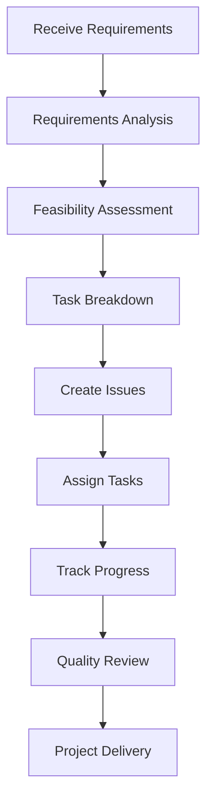
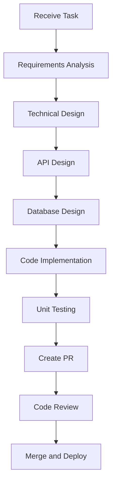
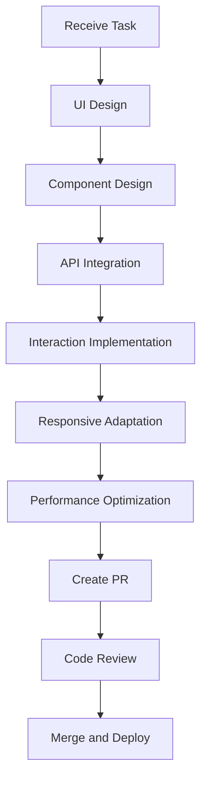
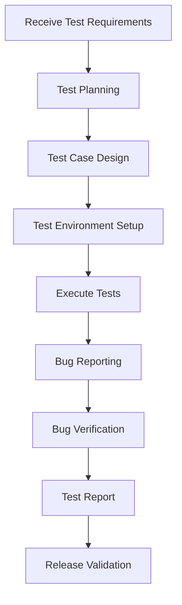
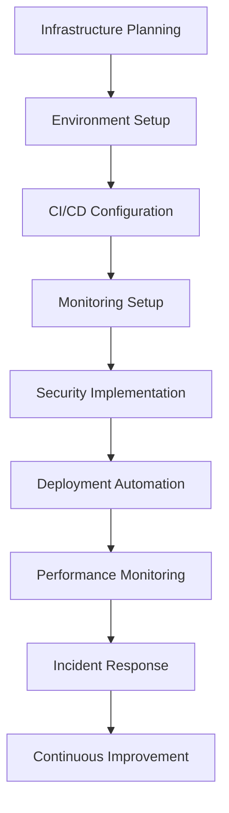

# Level 2: Role System

## Business Aspect: Role Responsibilities and Collaboration Patterns

### 2.1 Product Manager

#### Main Responsibilities
- **Requirements Management**: Receive, analyze, and organize user requirements
- **Product Planning**: Develop product roadmap and feature planning
- **Task Breakdown**: Break down large requirements into specific development tasks
- **Priority Management**: Sort tasks by business value and urgency
- **Progress Tracking**: Monitor project progress and milestone completion
- **Stakeholder Communication**: Communicate with business stakeholders and users

#### Collaboration Patterns
- **Requirements Transfer**: Convert requirements into GitHub Issues
- **Task Assignment**: Assign Issues to appropriate development roles
- **Progress Coordination**: Coordinate work progress across roles
- **Quality Control**: Review PRs and provide product-level feedback
- **Risk Management**: Identify and address project risks

#### Workflow


### 2.2 Backend Developer

#### Main Responsibilities
- **API Design**: Design and implement RESTful APIs
- **Database Design**: Design database structure and relationships
- **Business Logic**: Implement core business logic
- **Performance Optimization**: Optimize system performance and response time
- **Security Implementation**: Implement authentication and authorization
- **System Integration**: Integrate third-party services and APIs

#### Collaboration Patterns
- **API Documentation**: Provide API documentation for frontend development
- **Interface Coordination**: Coordinate interface design with frontend development
- **Data Models**: Coordinate data models with data engineers
- **Deployment Coordination**: Coordinate deployment with DevOps engineers
- **Issue Resolution**: Respond to issues found by QA engineers

#### Workflow


### 2.3 Frontend Developer

#### Main Responsibilities
- **UI Design**: Design and implement user interfaces
- **Interaction Development**: Implement user interaction logic
- **Responsive Design**: Ensure adaptation across different devices
- **Performance Optimization**: Optimize frontend loading and runtime performance
- **User Experience**: Optimize user experience
- **Frontend Testing**: Write frontend test cases

#### Collaboration Patterns
- **Design Coordination**: Coordinate design with UI/UX designers
- **API Integration**: Develop based on backend APIs
- **Interface Debugging**: Debug interfaces with backend developers
- **Testing Coordination**: Coordinate testing with QA engineers
- **Deployment Coordination**: Coordinate deployment with DevOps engineers

#### Workflow


### 2.4 QA Engineer

#### Main Responsibilities
- **Test Planning**: Develop test plans and strategies
- **Test Case Design**: Design comprehensive test cases
- **Automated Testing**: Implement automated testing frameworks
- **Manual Testing**: Perform manual testing for complex scenarios
- **Bug Reporting**: Report and track bugs
- **Quality Assurance**: Ensure overall product quality

#### Collaboration Patterns
- **Requirements Review**: Review requirements with product managers
- **Test Coordination**: Coordinate testing with development teams
- **Bug Communication**: Communicate bugs with developers
- **Release Validation**: Validate releases before deployment
- **Quality Metrics**: Track and report quality metrics

#### Workflow


### 2.5 DevOps Engineer

#### Main Responsibilities
- **Infrastructure Management**: Manage cloud infrastructure and servers
- **CI/CD Pipeline**: Build and maintain continuous integration/deployment pipelines
- **Monitoring and Logging**: Set up monitoring and logging systems
- **Security Management**: Implement security measures and compliance
- **Performance Optimization**: Optimize system performance and scalability
- **Disaster Recovery**: Plan and implement disaster recovery procedures

#### Collaboration Patterns
- **Deployment Coordination**: Coordinate deployments with development teams
- **Infrastructure Support**: Provide infrastructure support for development
- **Security Consultation**: Provide security consultation to development teams
- **Performance Analysis**: Analyze and optimize system performance
- **Incident Response**: Respond to system incidents and outages

#### Workflow


## Technical Aspect: Role Implementation

### 2.1 Role Container Architecture

#### Container Structure
```dockerfile
# Base role container structure
FROM vnc-llm-cli:latest

# Role-specific tools and dependencies
RUN apt-get update && apt-get install -y \
    role-specific-packages \
    && rm -rf /var/lib/apt/lists/*

# Python dependencies
RUN pip install \
    role-specific-python-packages

# Node.js dependencies (if needed)
RUN npm install -g \
    role-specific-node-packages

# Set up workspace
WORKDIR /workspace
RUN mkdir -p /workspace/projects /workspace/tools /workspace/config

# Copy role-specific scripts
COPY scripts/ /opt/scripts/
RUN chmod +x /opt/scripts/*.py

# Set environment variables
ENV ROLE_TYPE=role_type
ENV ROLE_ID=role_id
ENV GITHUB_TOKEN=github_token

# Start role service
CMD ["python", "/opt/scripts/role_service.py"]
```

#### Role Service Implementation
```python
# scripts/role_service.py
import os
import time
import logging
import requests
from typing import Dict, Any, List
from datetime import datetime

class RoleService:
    def __init__(self):
        self.role_id = os.getenv("ROLE_ID")
        self.role_type = os.getenv("ROLE_TYPE")
        self.github_token = os.getenv("GITHUB_TOKEN")
        self.coordinator_url = os.getenv("COORDINATOR_URL", "http://coordinator:8000")
        
        # Setup logging
        logging.basicConfig(level=logging.INFO)
        self.logger = logging.getLogger(f"role_service_{self.role_id}")
        
        # Initialize role state
        self.status = "available"
        self.current_task = None
        self.workload = 0
        
    def start(self):
        """Start the role service"""
        self.logger.info(f"Starting {self.role_type} service: {self.role_id}")
        
        # Register with coordinator
        self.register_with_coordinator()
        
        # Start main loop
        while True:
            try:
                # Check for new tasks
                self.check_for_tasks()
                
                # Update status
                self.update_status()
                
                # Process current task
                if self.current_task:
                    self.process_task()
                
                # Sleep before next iteration
                time.sleep(30)
                
            except Exception as e:
                self.logger.error(f"Error in main loop: {e}")
                time.sleep(60)  # Longer sleep on error
    
    def register_with_coordinator(self):
        """Register role with coordinator"""
        try:
            registration_data = {
                "role_id": self.role_id,
                "role_type": self.role_type,
                "status": self.status,
                "capabilities": self.get_capabilities()
            }
            
            response = requests.post(
                f"{self.coordinator_url}/roles",
                json=registration_data,
                timeout=10
            )
            
            if response.status_code == 200:
                self.logger.info("Successfully registered with coordinator")
            else:
                self.logger.error(f"Failed to register: {response.status_code}")
                
        except Exception as e:
            self.logger.error(f"Error registering with coordinator: {e}")
    
    def get_capabilities(self) -> Dict[str, Any]:
        """Get role capabilities"""
        capabilities = {
            "pm": {
                "requirements_analysis": True,
                "task_planning": True,
                "progress_tracking": True,
                "quality_review": True
            },
            "backend": {
                "api_development": True,
                "database_design": True,
                "system_integration": True,
                "performance_optimization": True
            },
            "frontend": {
                "ui_development": True,
                "api_integration": True,
                "responsive_design": True,
                "performance_optimization": True
            },
            "qa": {
                "test_planning": True,
                "automated_testing": True,
                "manual_testing": True,
                "bug_tracking": True
            },
            "devops": {
                "infrastructure_management": True,
                "ci_cd_pipeline": True,
                "monitoring": True,
                "security_management": True
            }
        }
        
        return capabilities.get(self.role_type, {})
    
    def check_for_tasks(self):
        """Check for new tasks from coordinator"""
        try:
            response = requests.get(
                f"{self.coordinator_url}/tasks",
                params={"role_id": self.role_id, "status": "assigned"},
                timeout=10
            )
            
            if response.status_code == 200:
                tasks = response.json()
                if tasks and not self.current_task:
                    # Accept first available task
                    self.current_task = tasks[0]
                    self.status = "busy"
                    self.logger.info(f"Accepted task: {self.current_task['id']}")
                    
        except Exception as e:
            self.logger.error(f"Error checking for tasks: {e}")
    
    def update_status(self):
        """Update status with coordinator"""
        try:
            status_data = {
                "role_id": self.role_id,
                "status": self.status,
                "workload": self.workload,
                "current_task": self.current_task["id"] if self.current_task else None,
                "last_activity": datetime.now().isoformat()
            }
            
            response = requests.put(
                f"{self.coordinator_url}/roles/{self.role_id}",
                json=status_data,
                timeout=10
            )
            
            if response.status_code != 200:
                self.logger.error(f"Failed to update status: {response.status_code}")
                
        except Exception as e:
            self.logger.error(f"Error updating status: {e}")
    
    def process_task(self):
        """Process current task"""
        if not self.current_task:
            return
        
        task_id = self.current_task["id"]
        task_type = self.current_task.get("type", "development")
        
        try:
            # Process based on role type
            if self.role_type == "pm":
                self.process_pm_task()
            elif self.role_type == "backend":
                self.process_backend_task()
            elif self.role_type == "frontend":
                self.process_frontend_task()
            elif self.role_type == "qa":
                self.process_qa_task()
            elif self.role_type == "devops":
                self.process_devops_task()
            
            # Update task progress
            self.update_task_progress()
            
        except Exception as e:
            self.logger.error(f"Error processing task {task_id}: {e}")
            # Mark task as failed
            self.mark_task_failed(task_id, str(e))
    
    def process_pm_task(self):
        """Process product manager task"""
        task = self.current_task
        
        if task["type"] == "requirements_analysis":
            # Analyze requirements
            analysis = self.analyze_requirements(task["description"])
            
            # Create detailed task breakdown
            breakdown = self.create_task_breakdown(analysis)
            
            # Update task with results
            self.update_task_result({
                "analysis": analysis,
                "breakdown": breakdown,
                "estimated_effort": self.calculate_effort(breakdown)
            })
            
        elif task["type"] == "progress_review":
            # Review project progress
            progress_report = self.generate_progress_report()
            
            # Update task with results
            self.update_task_result({
                "progress_report": progress_report,
                "recommendations": self.generate_recommendations(progress_report)
            })
    
    def process_backend_task(self):
        """Process backend developer task"""
        task = self.current_task
        
        if task["type"] == "api_development":
            # Design API
            api_design = self.design_api(task["requirements"])
            
            # Implement API
            implementation = self.implement_api(api_design)
            
            # Write tests
            tests = self.write_api_tests(implementation)
            
            # Update task with results
            self.update_task_result({
                "api_design": api_design,
                "implementation": implementation,
                "tests": tests,
                "documentation": self.generate_api_docs(api_design)
            })
    
    def process_frontend_task(self):
        """Process frontend developer task"""
        task = self.current_task
        
        if task["type"] == "ui_development":
            # Design UI
            ui_design = self.design_ui(task["requirements"])
            
            # Implement UI
            implementation = self.implement_ui(ui_design)
            
            # Write tests
            tests = self.write_ui_tests(implementation)
            
            # Update task with results
            self.update_task_result({
                "ui_design": ui_design,
                "implementation": implementation,
                "tests": tests
            })
    
    def process_qa_task(self):
        """Process QA engineer task"""
        task = self.current_task
        
        if task["type"] == "test_planning":
            # Create test plan
            test_plan = self.create_test_plan(task["requirements"])
            
            # Design test cases
            test_cases = self.design_test_cases(test_plan)
            
            # Update task with results
            self.update_task_result({
                "test_plan": test_plan,
                "test_cases": test_cases
            })
        
        elif task["type"] == "test_execution":
            # Execute tests
            test_results = self.execute_tests(task["test_cases"])
            
            # Generate test report
            test_report = self.generate_test_report(test_results)
            
            # Update task with results
            self.update_task_result({
                "test_results": test_results,
                "test_report": test_report
            })
    
    def process_devops_task(self):
        """Process DevOps engineer task"""
        task = self.current_task
        
        if task["type"] == "deployment":
            # Plan deployment
            deployment_plan = self.plan_deployment(task["requirements"])
            
            # Execute deployment
            deployment_result = self.execute_deployment(deployment_plan)
            
            # Monitor deployment
            monitoring_data = self.monitor_deployment(deployment_result)
            
            # Update task with results
            self.update_task_result({
                "deployment_plan": deployment_plan,
                "deployment_result": deployment_result,
                "monitoring_data": monitoring_data
            })
    
    def update_task_progress(self):
        """Update task progress"""
        if not self.current_task:
            return
        
        try:
            progress_data = {
                "task_id": self.current_task["id"],
                "progress": self.calculate_progress(),
                "status": "in_progress",
                "updated_at": datetime.now().isoformat()
            }
            
            response = requests.put(
                f"{self.coordinator_url}/tasks/{self.current_task['id']}",
                json=progress_data,
                timeout=10
            )
            
            if response.status_code != 200:
                self.logger.error(f"Failed to update task progress: {response.status_code}")
                
        except Exception as e:
            self.logger.error(f"Error updating task progress: {e}")
    
    def update_task_result(self, result: Dict[str, Any]):
        """Update task with results"""
        if not self.current_task:
            return
        
        try:
            result_data = {
                "task_id": self.current_task["id"],
                "result": result,
                "status": "completed",
                "completed_at": datetime.now().isoformat()
            }
            
            response = requests.put(
                f"{self.coordinator_url}/tasks/{self.current_task['id']}",
                json=result_data,
                timeout=10
            )
            
            if response.status_code == 200:
                self.logger.info(f"Task {self.current_task['id']} completed successfully")
                self.current_task = None
                self.status = "available"
            else:
                self.logger.error(f"Failed to update task result: {response.status_code}")
                
        except Exception as e:
            self.logger.error(f"Error updating task result: {e}")
    
    def mark_task_failed(self, task_id: str, error: str):
        """Mark task as failed"""
        try:
            result_data = {
                "task_id": task_id,
                "error": error,
                "status": "failed",
                "failed_at": datetime.now().isoformat()
            }
            
            response = requests.put(
                f"{self.coordinator_url}/tasks/{task_id}",
                json=result_data,
                timeout=10
            )
            
            if response.status_code == 200:
                self.logger.info(f"Task {task_id} marked as failed")
                self.current_task = None
                self.status = "available"
            else:
                self.logger.error(f"Failed to mark task as failed: {response.status_code}")
                
        except Exception as e:
            self.logger.error(f"Error marking task as failed: {e}")
    
    def calculate_progress(self) -> int:
        """Calculate current task progress percentage"""
        # This would be implemented based on actual task progress
        return 50  # Placeholder
    
    # Placeholder methods for task processing
    def analyze_requirements(self, description: str) -> Dict[str, Any]:
        """Analyze requirements"""
        return {"analysis": "placeholder"}
    
    def create_task_breakdown(self, analysis: Dict[str, Any]) -> List[Dict[str, Any]]:
        """Create task breakdown"""
        return [{"task": "placeholder"}]
    
    def calculate_effort(self, breakdown: List[Dict[str, Any]]) -> int:
        """Calculate effort estimate"""
        return 10
    
    def generate_progress_report(self) -> Dict[str, Any]:
        """Generate progress report"""
        return {"report": "placeholder"}
    
    def generate_recommendations(self, report: Dict[str, Any]) -> List[str]:
        """Generate recommendations"""
        return ["recommendation"]
    
    def design_api(self, requirements: Dict[str, Any]) -> Dict[str, Any]:
        """Design API"""
        return {"api": "design"}
    
    def implement_api(self, design: Dict[str, Any]) -> Dict[str, Any]:
        """Implement API"""
        return {"api": "implementation"}
    
    def write_api_tests(self, implementation: Dict[str, Any]) -> List[Dict[str, Any]]:
        """Write API tests"""
        return [{"test": "placeholder"}]
    
    def generate_api_docs(self, design: Dict[str, Any]) -> str:
        """Generate API documentation"""
        return "API documentation"
    
    def design_ui(self, requirements: Dict[str, Any]) -> Dict[str, Any]:
        """Design UI"""
        return {"ui": "design"}
    
    def implement_ui(self, design: Dict[str, Any]) -> Dict[str, Any]:
        """Implement UI"""
        return {"ui": "implementation"}
    
    def write_ui_tests(self, implementation: Dict[str, Any]) -> List[Dict[str, Any]]:
        """Write UI tests"""
        return [{"test": "placeholder"}]
    
    def create_test_plan(self, requirements: Dict[str, Any]) -> Dict[str, Any]:
        """Create test plan"""
        return {"plan": "placeholder"}
    
    def design_test_cases(self, plan: Dict[str, Any]) -> List[Dict[str, Any]]:
        """Design test cases"""
        return [{"case": "placeholder"}]
    
    def execute_tests(self, test_cases: List[Dict[str, Any]]) -> Dict[str, Any]:
        """Execute tests"""
        return {"results": "placeholder"}
    
    def generate_test_report(self, results: Dict[str, Any]) -> Dict[str, Any]:
        """Generate test report"""
        return {"report": "placeholder"}
    
    def plan_deployment(self, requirements: Dict[str, Any]) -> Dict[str, Any]:
        """Plan deployment"""
        return {"plan": "placeholder"}
    
    def execute_deployment(self, plan: Dict[str, Any]) -> Dict[str, Any]:
        """Execute deployment"""
        return {"result": "placeholder"}
    
    def monitor_deployment(self, result: Dict[str, Any]) -> Dict[str, Any]:
        """Monitor deployment"""
        return {"monitoring": "placeholder"}

if __name__ == "__main__":
    service = RoleService()
    service.start()
```

### 2.2 Role Communication

#### Inter-Role Communication
```python
class RoleCommunication:
    def __init__(self, role_id: str, coordinator_url: str):
        self.role_id = role_id
        self.coordinator_url = coordinator_url
    
    def send_message(self, recipient_id: str, message_type: str, content: Dict[str, Any]):
        """Send message to another role"""
        try:
            message_data = {
                "sender_id": self.role_id,
                "recipient_id": recipient_id,
                "type": message_type,
                "content": content,
                "timestamp": datetime.now().isoformat()
            }
            
            response = requests.post(
                f"{self.coordinator_url}/messages/send",
                json=message_data,
                timeout=10
            )
            
            if response.status_code == 200:
                return {"success": True, "message_id": response.json().get("message_id")}
            else:
                return {"success": False, "error": f"HTTP {response.status_code}"}
                
        except Exception as e:
            return {"success": False, "error": str(e)}
    
    def request_collaboration(self, target_role: str, request_type: str, details: Dict[str, Any]):
        """Request collaboration from another role"""
        return self.send_message(target_role, "collaboration_request", {
            "request_type": request_type,
            "details": details
        })
    
    def notify_completion(self, task_id: str, result: Dict[str, Any]):
        """Notify completion of task"""
        return self.send_message("coordinator", "task_completion", {
            "task_id": task_id,
            "result": result
        })
    
    def report_issue(self, issue_type: str, description: str, severity: str = "medium"):
        """Report issue to coordinator"""
        return self.send_message("coordinator", "issue_report", {
            "issue_type": issue_type,
            "description": description,
            "severity": severity
        })
```

### 2.3 Role Load Balancing

#### Load Balancer Implementation
```python
class RoleLoadBalancer:
    def __init__(self, coordinator_url: str):
        self.coordinator_url = coordinator_url
    
    def get_role_status(self) -> Dict[str, Dict[str, Any]]:
        """Get status of all roles"""
        try:
            response = requests.get(f"{self.coordinator_url}/roles", timeout=10)
            
            if response.status_code == 200:
                roles = response.json()
                return {role["id"]: role for role in roles}
            else:
                return {}
                
        except Exception as e:
            print(f"Error getting role status: {e}")
            return {}
    
    def assign_task(self, task: Dict[str, Any]) -> Optional[str]:
        """Assign task to best available role"""
        try:
            # Get available roles
            role_status = self.get_role_status()
            available_roles = [
                role_id for role_id, status in role_status.items()
                if status["status"] == "available"
            ]
            
            if not available_roles:
                return None
            
            # Find role with lowest workload
            best_role = min(
                available_roles,
                key=lambda role_id: role_status[role_id]["workload"]
            )
            
            # Assign task
            assignment_data = {
                "task_id": task["id"],
                "role_id": best_role
            }
            
            response = requests.post(
                f"{self.coordinator_url}/tasks/assign",
                json=assignment_data,
                timeout=10
            )
            
            if response.status_code == 200:
                return best_role
            else:
                return None
                
        except Exception as e:
            print(f"Error assigning task: {e}")
            return None
    
    def rebalance_workload(self):
        """Rebalance workload across roles"""
        try:
            # Get current workload distribution
            role_status = self.get_role_status()
            
            # Calculate optimal distribution
            total_workload = sum(status["workload"] for status in role_status.values())
            num_roles = len(role_status)
            target_workload = total_workload / num_roles if num_roles > 0 else 0
            
            # Identify overloaded and underloaded roles
            overloaded = []
            underloaded = []
            
            for role_id, status in role_status.items():
                if status["workload"] > target_workload * 1.2:  # 20% tolerance
                    overloaded.append(role_id)
                elif status["workload"] < target_workload * 0.8:  # 20% tolerance
                    underloaded.append(role_id)
            
            # Reassign tasks from overloaded to underloaded roles
            reassignments = []
            
            for overloaded_role in overloaded:
                if not underloaded:
                    break
                
                # Get tasks from overloaded role
                tasks = self.get_role_tasks(overloaded_role)
                
                for task in tasks:
                    if not underloaded:
                        break
                    
                    # Find best underloaded role
                    best_role = min(
                        underloaded,
                        key=lambda role_id: role_status[role_id]["workload"]
                    )
                    
                    # Reassign task
                    if self.reassign_task(task["id"], overloaded_role, best_role):
                        reassignments.append({
                            "task_id": task["id"],
                            "from_role": overloaded_role,
                            "to_role": best_role
                        })
                        
                        # Update workload estimates
                        role_status[overloaded_role]["workload"] -= 1
                        role_status[best_role]["workload"] += 1
                        
                        # Remove role from underloaded if it's no longer underloaded
                        if role_status[best_role]["workload"] >= target_workload * 0.8:
                            underloaded.remove(best_role)
            
            return reassignments
            
        except Exception as e:
            print(f"Error rebalancing workload: {e}")
            return []
    
    def get_role_tasks(self, role_id: str) -> List[Dict[str, Any]]:
        """Get tasks assigned to specific role"""
        try:
            response = requests.get(
                f"{self.coordinator_url}/tasks",
                params={"role_id": role_id, "status": "assigned"},
                timeout=10
            )
            
            if response.status_code == 200:
                return response.json()
            else:
                return []
                
        except Exception as e:
            print(f"Error getting role tasks: {e}")
            return []
    
    def reassign_task(self, task_id: str, from_role: str, to_role: str) -> bool:
        """Reassign task from one role to another"""
        try:
            reassignment_data = {
                "task_id": task_id,
                "from_role": from_role,
                "to_role": to_role
            }
            
            response = requests.post(
                f"{self.coordinator_url}/tasks/reassign",
                json=reassignment_data,
                timeout=10
            )
            
            return response.status_code == 200
            
        except Exception as e:
            print(f"Error reassigning task: {e}")
            return False
```

This role system provides comprehensive role definitions, implementations, and management for the AI development team. 