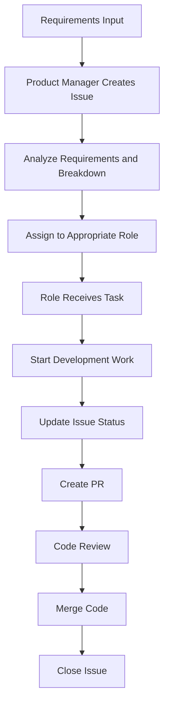
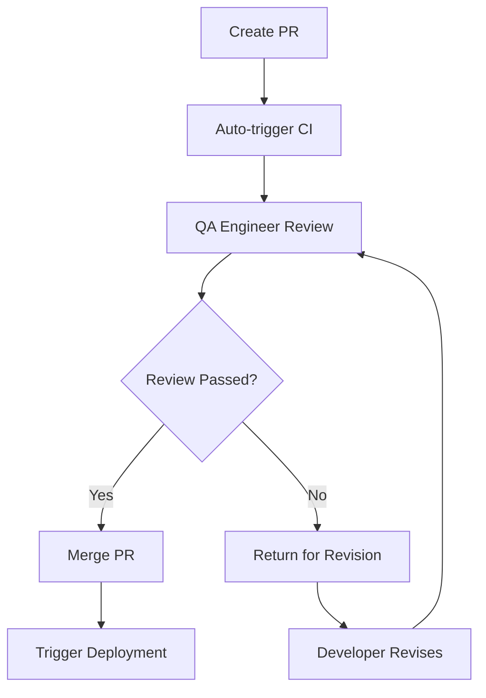
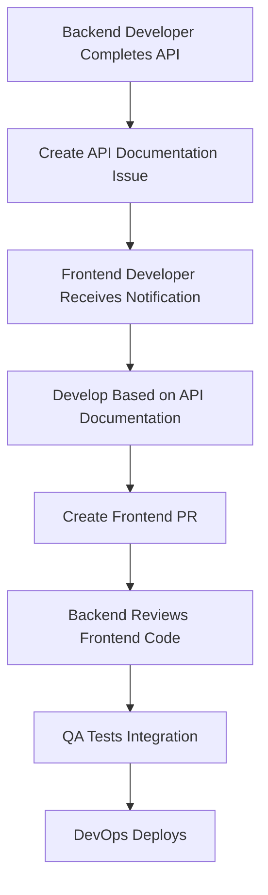
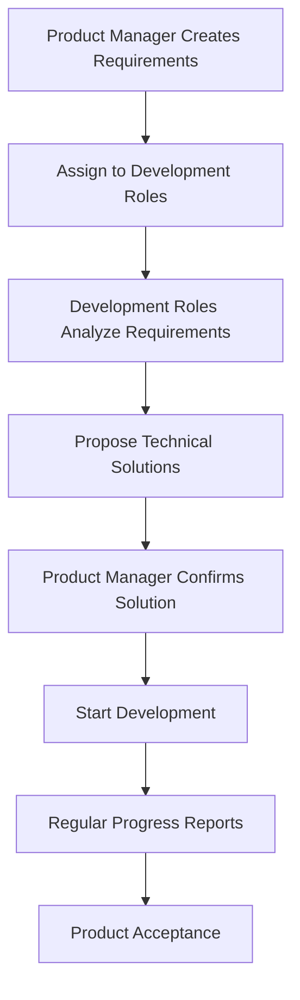

# Level 3: Workflow System

## Business Aspect: GitHub Workflow

### 3.1 Issue Management Process

#### Issue Lifecycle


#### Issue Status Flow
```
open → assigned → in_progress → review_requested → approved → merged → closed
```

#### Issue Label System
- **Priority**: `high`, `medium`, `low`
- **Type**: `feature`, `bug`, `enhancement`, `documentation`
- **Status**: `in_progress`, `review_requested`, `blocked`, `ready_for_test`
- **Role**: `pm`, `backend`, `frontend`, `qa`, `devops`

### 3.2 PR Review Process

#### PR Lifecycle


#### Review Standards
- **Code Quality**: Code standards, readability, performance
- **Functional Completeness**: Whether requirements are met
- **Test Coverage**: Unit tests, integration tests
- **Documentation Completeness**: API documentation, changelog
- **Security**: Security vulnerability checks

### 3.3 Role Collaboration Process

#### Backend and Frontend Collaboration


#### Product Manager and Development Collaboration


## Technical Aspect: GitHub Integration Implementation

### 3.1 GitHub Actions Workflow

#### Main Workflow Configuration
```yaml
# .github/workflows/ai-team-workflow.yml
name: AI Team Workflow

on:
  schedule:
    - cron: '*/30 * * * *'  # Trigger every 30 minutes
  issues:
    types: [opened, assigned, labeled, closed]
  pull_request:
    types: [opened, synchronize, review_requested, closed]
  workflow_dispatch:  # Manual trigger

env:
  CLOUDFLARE_TUNNEL_URL: ${{ secrets.CLOUDFLARE_TUNNEL_URL }}
```

#### Workflow Jobs
```yaml
jobs:
  # Task assignment job
  assign-tasks:
    runs-on: ubuntu-latest
    steps:
      - name: Checkout code
        uses: actions/checkout@v4
      
      - name: Setup Python
        uses: actions/setup-python@v4
        with:
          python-version: '3.11'
      
      - name: Install dependencies
        run: |
          pip install -r requirements.txt
      
      - name: Run task assignment
        run: |
          python scripts/assign_tasks.py
        env:
          GITHUB_TOKEN: ${{ secrets.GITHUB_TOKEN }}
          COORDINATOR_URL: ${{ secrets.COORDINATOR_URL }}

  # Status synchronization job
  sync-status:
    runs-on: ubuntu-latest
    steps:
      - name: Checkout code
        uses: actions/checkout@v4
      
      - name: Setup Python
        uses: actions/setup-python@v4
        with:
          python-version: '3.11'
      
      - name: Install dependencies
        run: |
          pip install -r requirements.txt
      
      - name: Sync status
        run: |
          python scripts/sync_status.py
        env:
          GITHUB_TOKEN: ${{ secrets.GITHUB_TOKEN }}
          COORDINATOR_URL: ${{ secrets.COORDINATOR_URL }}

  # Health check job
  health-check:
    runs-on: ubuntu-latest
    steps:
      - name: Checkout code
        uses: actions/checkout@v4
      
      - name: Setup Python
        uses: actions/setup-python@v4
        with:
          python-version: '3.11'
      
      - name: Install dependencies
        run: |
          pip install -r requirements.txt
      
      - name: Run health check
        run: |
          python scripts/health_check.py
        env:
          COORDINATOR_URL: ${{ secrets.COORDINATOR_URL }}
```

### 3.2 GitHub API Integration

#### Issue Management API
```python
class GitHubIssueManager:
    def __init__(self, token: str, repo: str):
        self.github = Github(token)
        self.repo = self.github.get_repo(repo)
    
    def create_issue(self, title: str, body: str, labels: list = None, assignees: list = None):
        """Create new issue"""
        try:
            issue = self.repo.create_issue(
                title=title,
                body=body,
                labels=labels or [],
                assignees=assignees or []
            )
            return {
                "success": True,
                "issue_number": issue.number,
                "issue_url": issue.html_url
            }
        except Exception as e:
            return {
                "success": False,
                "error": str(e)
            }
    
    def update_issue(self, issue_number: int, **kwargs):
        """Update existing issue"""
        try:
            issue = self.repo.get_issue(issue_number)
            
            if "title" in kwargs:
                issue.edit(title=kwargs["title"])
            
            if "body" in kwargs:
                issue.edit(body=kwargs["body"])
            
            if "labels" in kwargs:
                issue.edit(labels=kwargs["labels"])
            
            if "assignees" in kwargs:
                issue.edit(assignees=kwargs["assignees"])
            
            if "state" in kwargs:
                if kwargs["state"] == "closed":
                    issue.edit(state="closed")
                else:
                    issue.edit(state="open")
            
            return {"success": True}
        except Exception as e:
            return {
                "success": False,
                "error": str(e)
            }
    
    def get_issues(self, state: str = "open", labels: list = None, assignee: str = None):
        """Get issues with filters"""
        try:
            issues = self.repo.get_issues(
                state=state,
                labels=labels or [],
                assignee=assignee
            )
            
            return {
                "success": True,
                "issues": [
                    {
                        "number": issue.number,
                        "title": issue.title,
                        "body": issue.body,
                        "state": issue.state,
                        "labels": [label.name for label in issue.labels],
                        "assignees": [assignee.login for assignee in issue.assignees],
                        "created_at": issue.created_at.isoformat(),
                        "updated_at": issue.updated_at.isoformat(),
                        "html_url": issue.html_url
                    }
                    for issue in issues
                ]
            }
        except Exception as e:
            return {
                "success": False,
                "error": str(e)
            }
    
    def add_comment(self, issue_number: int, comment: str):
        """Add comment to issue"""
        try:
            issue = self.repo.get_issue(issue_number)
            comment_obj = issue.create_comment(comment)
            
            return {
                "success": True,
                "comment_id": comment_obj.id,
                "comment_url": comment_obj.html_url
            }
        except Exception as e:
            return {
                "success": False,
                "error": str(e)
            }
```

#### Pull Request Management API
```python
class GitHubPRManager:
    def __init__(self, token: str, repo: str):
        self.github = Github(token)
        self.repo = self.github.get_repo(repo)
    
    def create_pr(self, title: str, body: str, head: str, base: str = "main"):
        """Create new pull request"""
        try:
            pr = self.repo.create_pull(
                title=title,
                body=body,
                head=head,
                base=base
            )
            
            return {
                "success": True,
                "pr_number": pr.number,
                "pr_url": pr.html_url
            }
        except Exception as e:
            return {
                "success": False,
                "error": str(e)
            }
    
    def update_pr(self, pr_number: int, **kwargs):
        """Update existing pull request"""
        try:
            pr = self.repo.get_pull(pr_number)
            
            if "title" in kwargs:
                pr.edit(title=kwargs["title"])
            
            if "body" in kwargs:
                pr.edit(body=kwargs["body"])
            
            return {"success": True}
        except Exception as e:
            return {
                "success": False,
                "error": str(e)
            }
    
    def merge_pr(self, pr_number: int, merge_method: str = "squash"):
        """Merge pull request"""
        try:
            pr = self.repo.get_pull(pr_number)
            
            if pr.mergeable:
                pr.merge(merge_method=merge_method)
                return {"success": True}
            else:
                return {
                    "success": False,
                    "error": "PR is not mergeable"
                }
        except Exception as e:
            return {
                "success": False,
                "error": str(e)
            }
    
    def get_prs(self, state: str = "open", head: str = None, base: str = None):
        """Get pull requests with filters"""
        try:
            prs = self.repo.get_pulls(
                state=state,
                head=head,
                base=base
            )
            
            return {
                "success": True,
                "pull_requests": [
                    {
                        "number": pr.number,
                        "title": pr.title,
                        "body": pr.body,
                        "state": pr.state,
                        "head": pr.head.ref,
                        "base": pr.base.ref,
                        "mergeable": pr.mergeable,
                        "created_at": pr.created_at.isoformat(),
                        "updated_at": pr.updated_at.isoformat(),
                        "html_url": pr.html_url
                    }
                    for pr in prs
                ]
            }
        except Exception as e:
            return {
                "success": False,
                "error": str(e)
            }
    
    def add_review(self, pr_number: int, body: str, event: str = "COMMENT"):
        """Add review to pull request"""
        try:
            pr = self.repo.get_pull(pr_number)
            review = pr.create_review(body=body, event=event)
            
            return {
                "success": True,
                "review_id": review.id
            }
        except Exception as e:
            return {
                "success": False,
                "error": str(e)
            }
```

### 3.3 Project Management Integration

#### Project Board Management
```python
class GitHubProjectManager:
    def __init__(self, token: str, org: str, project_number: int):
        self.github = Github(token)
        self.org = self.github.get_organization(org)
        self.project = self.org.get_project(project_number)
    
    def get_columns(self):
        """Get project columns"""
        try:
            columns = self.project.get_columns()
            
            return {
                "success": True,
                "columns": [
                    {
                        "id": column.id,
                        "name": column.name,
                        "url": column.url
                    }
                    for column in columns
                ]
            }
        except Exception as e:
            return {
                "success": False,
                "error": str(e)
            }
    
    def get_cards(self, column_id: int):
        """Get cards in specific column"""
        try:
            column = self.project.get_column(column_id)
            cards = column.get_cards()
            
            return {
                "success": True,
                "cards": [
                    {
                        "id": card.id,
                        "note": card.note,
                        "content_url": card.content_url,
                        "archived": card.archived
                    }
                    for card in cards
                ]
            }
        except Exception as e:
            return {
                "success": False,
                "error": str(e)
            }
    
    def create_card(self, column_id: int, content_id: int, content_type: str = "Issue"):
        """Create card in column"""
        try:
            column = self.project.get_column(column_id)
            card = column.create_card(
                content_id=content_id,
                content_type=content_type
            )
            
            return {
                "success": True,
                "card_id": card.id
            }
        except Exception as e:
            return {
                "success": False,
                "error": str(e)
            }
    
    def move_card(self, card_id: int, column_id: int, position: str = "bottom"):
        """Move card to different column"""
        try:
            card = self.project.get_card(card_id)
            card.move(position, column_id)
            
            return {"success": True}
        except Exception as e:
            return {
                "success": False,
                "error": str(e)
            }
```

### 3.4 Label Management

#### Label System Implementation
```python
class GitHubLabelManager:
    def __init__(self, token: str, repo: str):
        self.github = Github(token)
        self.repo = self.github.get_repo(repo)
    
    def create_label(self, name: str, color: str, description: str = ""):
        """Create new label"""
        try:
            label = self.repo.create_label(
                name=name,
                color=color,
                description=description
            )
            
            return {
                "success": True,
                "label_name": label.name,
                "label_color": label.color
            }
        except Exception as e:
            return {
                "success": False,
                "error": str(e)
            }
    
    def get_labels(self):
        """Get all labels"""
        try:
            labels = self.repo.get_labels()
            
            return {
                "success": True,
                "labels": [
                    {
                        "name": label.name,
                        "color": label.color,
                        "description": label.description
                    }
                    for label in labels
                ]
            }
        except Exception as e:
            return {
                "success": False,
                "error": str(e)
            }
    
    def update_label(self, name: str, **kwargs):
        """Update existing label"""
        try:
            label = self.repo.get_label(name)
            
            if "color" in kwargs:
                label.edit(color=kwargs["color"])
            
            if "description" in kwargs:
                label.edit(description=kwargs["description"])
            
            return {"success": True}
        except Exception as e:
            return {
                "success": False,
                "error": str(e)
            }
    
    def delete_label(self, name: str):
        """Delete label"""
        try:
            label = self.repo.get_label(name)
            label.delete()
            
            return {"success": True}
        except Exception as e:
            return {
                "success": False,
                "error": str(e)
            }
```

### 3.5 Webhook Integration

#### Webhook Configuration
```python
class GitHubWebhookManager:
    def __init__(self, token: str, repo: str):
        self.github = Github(token)
        self.repo = self.github.get_repo(repo)
    
    def create_webhook(self, url: str, events: list = None, secret: str = None):
        """Create webhook"""
        try:
            webhook = self.repo.create_hook(
                name="web",
                config={
                    "url": url,
                    "content_type": "json",
                    "secret": secret
                },
                events=events or ["issues", "pull_request"],
                active=True
            )
            
            return {
                "success": True,
                "webhook_id": webhook.id,
                "webhook_url": webhook.config["url"]
            }
        except Exception as e:
            return {
                "success": False,
                "error": str(e)
            }
    
    def get_webhooks(self):
        """Get all webhooks"""
        try:
            webhooks = self.repo.get_hooks()
            
            return {
                "success": True,
                "webhooks": [
                    {
                        "id": webhook.id,
                        "name": webhook.name,
                        "url": webhook.config.get("url"),
                        "events": webhook.events,
                        "active": webhook.active
                    }
                    for webhook in webhooks
                ]
            }
        except Exception as e:
            return {
                "success": False,
                "error": str(e)
            }
    
    def update_webhook(self, webhook_id: int, **kwargs):
        """Update webhook"""
        try:
            webhook = self.repo.get_hook(webhook_id)
            
            if "url" in kwargs:
                webhook.edit(config={"url": kwargs["url"]})
            
            if "events" in kwargs:
                webhook.edit(events=kwargs["events"])
            
            if "active" in kwargs:
                webhook.edit(active=kwargs["active"])
            
            return {"success": True}
        except Exception as e:
            return {
                "success": False,
                "error": str(e)
            }
    
    def delete_webhook(self, webhook_id: int):
        """Delete webhook"""
        try:
            webhook = self.repo.get_hook(webhook_id)
            webhook.delete()
            
            return {"success": True}
        except Exception as e:
            return {
                "success": False,
                "error": str(e)
            }
```

### 3.6 Workflow Orchestration

#### Task Assignment Workflow
```python
class TaskAssignmentWorkflow:
    def __init__(self, coordinator_url: str, github_token: str, repo: str):
        self.coordinator_url = coordinator_url
        self.github_manager = GitHubIssueManager(github_token, repo)
        self.load_balancer = LoadBalancer()
    
    def process_new_issues(self):
        """Process new issues and assign to roles"""
        try:
            # Get new issues
            result = self.github_manager.get_issues(state="open", labels=["unassigned"])
            
            if not result["success"]:
                return result
            
            assigned_count = 0
            
            for issue in result["issues"]:
                # Analyze issue requirements
                requirements = self._analyze_issue_requirements(issue)
                
                # Find best available role
                best_role = self.load_balancer.assign_task({
                    "id": issue["number"],
                    "required_skills": requirements["skills"],
                    "estimated_effort": requirements["effort"],
                    "priority": requirements["priority"]
                })
                
                if best_role:
                    # Assign issue to role
                    assign_result = self.github_manager.update_issue(
                        issue["number"],
                        assignees=[best_role],
                        labels=["assigned", requirements["type"]]
                    )
                    
                    if assign_result["success"]:
                        assigned_count += 1
                        
                        # Notify role about new task
                        self._notify_role(best_role, issue)
            
            return {
                "success": True,
                "assigned_count": assigned_count
            }
        except Exception as e:
            return {
                "success": False,
                "error": str(e)
            }
    
    def _analyze_issue_requirements(self, issue: dict) -> dict:
        """Analyze issue to extract requirements"""
        # Use AI to analyze issue content
        analysis = self._ai_analyze_issue(issue["title"], issue["body"])
        
        return {
            "skills": analysis.get("required_skills", []),
            "effort": analysis.get("estimated_effort", 10),
            "priority": analysis.get("priority", "medium"),
            "type": analysis.get("type", "feature")
        }
    
    def _ai_analyze_issue(self, title: str, body: str) -> dict:
        """Use AI to analyze issue content"""
        # This would integrate with AI service
        # For now, return basic analysis
        return {
            "required_skills": ["general"],
            "estimated_effort": 10,
            "priority": "medium",
            "type": "feature"
        }
    
    def _notify_role(self, role_id: str, issue: dict):
        """Notify role about new task assignment"""
        # Send notification to role container
        notification = {
            "type": "task_assignment",
            "role_id": role_id,
            "issue": issue,
            "timestamp": datetime.now().isoformat()
        }
        
        # Send to coordinator
        requests.post(f"{self.coordinator_url}/notify", json=notification)
```

#### Status Synchronization Workflow
```python
class StatusSynchronizationWorkflow:
    def __init__(self, coordinator_url: str, github_token: str, repo: str):
        self.coordinator_url = coordinator_url
        self.github_manager = GitHubIssueManager(github_token, repo)
        self.pr_manager = GitHubPRManager(github_token, repo)
    
    def sync_role_status(self):
        """Synchronize role status with GitHub"""
        try:
            # Get role status from coordinator
            role_status = self._get_role_status()
            
            # Update GitHub issues based on role status
            for role_id, status in role_status.items():
                if status["current_task"]:
                    self._update_task_status(status["current_task"], status)
            
            # Update GitHub PRs based on role status
            self._sync_pr_status()
            
            return {"success": True}
        except Exception as e:
            return {
                "success": False,
                "error": str(e)
            }
    
    def _get_role_status(self) -> dict:
        """Get current role status from coordinator"""
        response = requests.get(f"{self.coordinator_url}/roles/status")
        
        if response.status_code == 200:
            return response.json()
        else:
            return {}
    
    def _update_task_status(self, task_id: int, role_status: dict):
        """Update task status in GitHub"""
        # Map role status to GitHub labels
        labels = self._map_status_to_labels(role_status["status"])
        
        # Update issue
        self.github_manager.update_issue(
            task_id,
            labels=labels
        )
        
        # Add status comment
        comment = self._generate_status_comment(role_status)
        self.github_manager.add_comment(task_id, comment)
    
    def _map_status_to_labels(self, status: str) -> list:
        """Map role status to GitHub labels"""
        status_mapping = {
            "available": ["ready"],
            "busy": ["in_progress"],
            "offline": ["blocked"]
        }
        
        return status_mapping.get(status, [])
    
    def _generate_status_comment(self, role_status: dict) -> str:
        """Generate status comment for GitHub"""
        return f"""
**Role Status Update**
- Role: {role_status['role_id']}
- Status: {role_status['status']}
- Workload: {role_status['workload']}%
- Last Activity: {role_status['last_activity']}
        """.strip()
    
    def _sync_pr_status(self):
        """Synchronize PR status"""
        # Get open PRs
        prs_result = self.pr_manager.get_prs(state="open")
        
        if not prs_result["success"]:
            return
        
        for pr in prs_result["pull_requests"]:
            # Check if PR is ready for review
            if self._is_pr_ready_for_review(pr):
                # Add review requested label
                self._add_review_requested_label(pr["number"])
    
    def _is_pr_ready_for_review(self, pr: dict) -> bool:
        """Check if PR is ready for review"""
        # Check if CI passed
        # Check if all required checks passed
        # Check if code coverage is sufficient
        return True  # Simplified for now
    
    def _add_review_requested_label(self, pr_number: int):
        """Add review requested label to PR"""
        # This would update the PR with appropriate labels
        pass
```

### 3.7 Error Handling and Recovery

#### Workflow Error Handling
```python
class WorkflowErrorHandler:
    def __init__(self, coordinator_url: str):
        self.coordinator_url = coordinator_url
        self.error_log = []
    
    def handle_workflow_error(self, error: Exception, context: dict):
        """Handle workflow errors"""
        error_info = {
            "timestamp": datetime.now().isoformat(),
            "error_type": type(error).__name__,
            "error_message": str(error),
            "context": context
        }
        
        # Log error
        self.error_log.append(error_info)
        
        # Send error notification
        self._send_error_notification(error_info)
        
        # Attempt recovery
        recovery_result = self._attempt_recovery(error_info)
        
        return {
            "error_handled": True,
            "recovery_attempted": recovery_result["success"],
            "recovery_message": recovery_result.get("message", "")
        }
    
    def _send_error_notification(self, error_info: dict):
        """Send error notification to coordinator"""
        notification = {
            "type": "workflow_error",
            "error": error_info,
            "timestamp": datetime.now().isoformat()
        }
        
        try:
            requests.post(f"{self.coordinator_url}/errors", json=notification)
        except Exception as e:
            # Log notification failure
            print(f"Failed to send error notification: {e}")
    
    def _attempt_recovery(self, error_info: dict) -> dict:
        """Attempt to recover from error"""
        error_type = error_info["error_type"]
        
        if "GitHubAPIError" in error_type:
            return self._recover_from_github_error(error_info)
        elif "NetworkError" in error_type:
            return self._recover_from_network_error(error_info)
        elif "TimeoutError" in error_type:
            return self._recover_from_timeout_error(error_info)
        else:
            return {
                "success": False,
                "message": "No recovery strategy for this error type"
            }
    
    def _recover_from_github_error(self, error_info: dict) -> dict:
        """Recover from GitHub API errors"""
        # Retry with exponential backoff
        # Check rate limits
        # Validate tokens
        return {
            "success": True,
            "message": "GitHub error recovery attempted"
        }
    
    def _recover_from_network_error(self, error_info: dict) -> dict:
        """Recover from network errors"""
        # Retry connection
        # Check network status
        # Switch to backup endpoints
        return {
            "success": True,
            "message": "Network error recovery attempted"
        }
    
    def _recover_from_timeout_error(self, error_info: dict) -> dict:
        """Recover from timeout errors"""
        # Increase timeout
        # Retry with longer timeout
        # Break down large operations
        return {
            "success": True,
            "message": "Timeout error recovery attempted"
        }
```

This workflow system provides comprehensive GitHub integration for the AI development team, including issue management, PR review processes, role collaboration, and error handling mechanisms. 