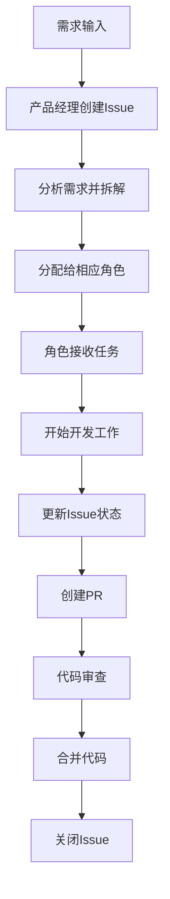
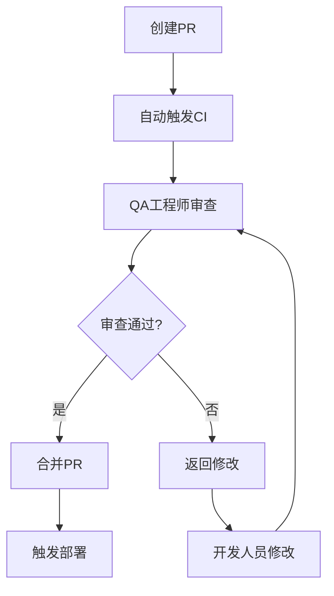
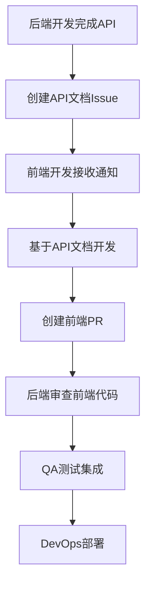
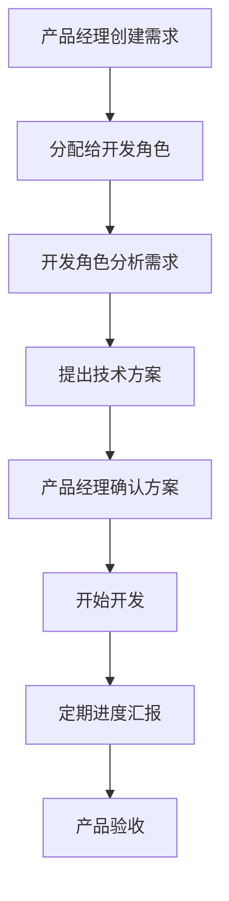

# Level 3: 工作流程

## 业务面：GitHub工作流程

### 3.1 Issue管理流程

#### Issue生命周期


#### Issue状态流转
```
open → assigned → in_progress → review_requested → approved → merged → closed
```

#### Issue标签系统
- **优先级**：`high`, `medium`, `low`
- **类型**：`feature`, `bug`, `enhancement`, `documentation`
- **状态**：`in_progress`, `review_requested`, `blocked`, `ready_for_test`
- **角色**：`pm`, `backend`, `frontend`, `qa`, `devops`

### 3.2 PR审查流程

#### PR生命周期


#### 审查标准
- **代码质量**：代码规范、可读性、性能
- **功能完整性**：是否满足需求
- **测试覆盖**：单元测试、集成测试
- **文档完整性**：API文档、更新日志
- **安全性**：安全漏洞检查

### 3.3 角色协作流程

#### 后端与前端协作


#### 产品经理与开发协作


## 技术面：GitHub集成实现

### 3.1 GitHub Actions工作流

#### 主工作流配置
```yaml
# .github/workflows/ai-team-workflow.yml
name: AI Team Workflow

on:
  schedule:
    - cron: '*/30 * * * *'  # 每30分钟触发
  issues:
    types: [opened, assigned, labeled, closed]
  pull_request:
    types: [opened, synchronize, review_requested, closed]
  workflow_dispatch:  # 手动触发

env:
  CLOUDFLARE_TUNNEL_URL: ${{ secrets.CLOUDFLARE_TUNNEL_URL }}

jobs:
  check-pending-tasks:
    runs-on: ubuntu-latest
    steps:
      - name: Checkout code
        uses: actions/checkout@v4
      
      - name: Setup Python
        uses: actions/setup-python@v4
        with:
          python-version: '3.11'
      
      - name: Install dependencies
        run: |
          pip install requests pyyaml
      
      - name: Check for pending tasks
        run: |
          python scripts/check_pending_tasks.py
        env:
          GITHUB_TOKEN: ${{ secrets.GITHUB_TOKEN }}
      
      - name: Trigger AI containers
        run: |
          python scripts/trigger_ai_containers.py
        env:
          CLOUDFLARE_TUNNEL_URL: ${{ secrets.CLOUDFLARE_TUNNEL_URL }}
          GITHUB_TOKEN: ${{ secrets.GITHUB_TOKEN }}

  notify-role-assignment:
    runs-on: ubuntu-latest
    if: github.event_name == 'issues' && github.event.action == 'assigned'
    steps:
      - name: Notify assigned role
        run: |
          python scripts/notify_role_assignment.py
        env:
          CLOUDFLARE_TUNNEL_URL: ${{ secrets.CLOUDFLARE_TUNNEL_URL }}
          GITHUB_TOKEN: ${{ secrets.GITHUB_TOKEN }}

  handle-pr-events:
    runs-on: ubuntu-latest
    if: github.event_name == 'pull_request'
    steps:
      - name: Handle PR events
        run: |
          python scripts/handle_pr_events.py
        env:
          CLOUDFLARE_TUNNEL_URL: ${{ secrets.CLOUDFLARE_TUNNEL_URL }}
          GITHUB_TOKEN: ${{ secrets.GITHUB_TOKEN }}
```

#### 任务检查脚本
```python
# scripts/check_pending_tasks.py
import requests
import json
import os
from typing import List, Dict, Any

class TaskChecker:
    def __init__(self):
        self.github_token = os.getenv('GITHUB_TOKEN')
        self.repo = os.getenv('GITHUB_REPOSITORY')
        self.headers = {
            'Authorization': f'token {self.github_token}',
            'Accept': 'application/vnd.github.v3+json'
        }
    
    def get_pending_issues(self) -> List[Dict[str, Any]]:
        """获取待处理的issues"""
        url = f"https://api.github.com/repos/{self.repo}/issues"
        params = {
            'state': 'open',
            'sort': 'updated',
            'direction': 'desc',
            'per_page': 100
        }
        
        response = requests.get(url, headers=self.headers, params=params)
        response.raise_for_status()
        
        issues = response.json()
        pending_issues = []
        
        for issue in issues:
            if self._is_pending(issue):
                pending_issues.append(issue)
        
        return pending_issues
    
    def _is_pending(self, issue: Dict[str, Any]) -> bool:
        """判断issue是否待处理"""
        # 检查是否有分配的角色
        if not issue.get('assignee'):
            return False
        
        # 检查状态标签
        labels = [label['name'] for label in issue.get('labels', [])]
        
        # 如果状态是in_progress或review_requested，说明正在处理
        if 'in_progress' in labels or 'review_requested' in labels:
            return False
        
        # 如果状态是blocked，说明被阻塞
        if 'blocked' in labels:
            return False
        
        return True
    
    def get_role_workload(self) -> Dict[str, int]:
        """获取各角色的工作量"""
        url = f"https://api.github.com/repos/{self.repo}/issues"
        params = {
            'state': 'open',
            'per_page': 100
        }
        
        response = requests.get(url, headers=self.headers, params=params)
        response.raise_for_status()
        
        issues = response.json()
        workload = {
            'product_manager': 0,
            'backend_developer': 0,
            'frontend_developer': 0,
            'qa_engineer': 0,
            'devops_engineer': 0
        }
        
        for issue in issues:
            assignee = issue.get('assignee')
            if assignee:
                username = assignee['login']
                role = self._get_role_by_username(username)
                if role in workload:
                    workload[role] += 1
        
        return workload
    
    def _get_role_by_username(self, username: str) -> str:
        """根据用户名获取角色"""
        role_mapping = {
            'pm_ai_001': 'product_manager',
            'backend_ai_001': 'backend_developer',
            'frontend_ai_001': 'frontend_developer',
            'qa_ai_001': 'qa_engineer',
            'devops_ai_001': 'devops_engineer'
        }
        return role_mapping.get(username, 'unknown')
    
    def run(self):
        """运行任务检查"""
        print("Checking pending tasks...")
        
        # 获取待处理任务
        pending_issues = self.get_pending_issues()
        print(f"Found {len(pending_issues)} pending issues")
        
        # 获取角色工作量
        workload = self.get_role_workload()
        print("Current workload:")
        for role, count in workload.items():
            print(f"  {role}: {count} issues")
        
        # 生成报告
        report = {
            'pending_issues': len(pending_issues),
            'workload': workload,
            'timestamp': __import__('datetime').datetime.now().isoformat()
        }
        
        # 保存报告
        with open('/tmp/task_report.json', 'w') as f:
            json.dump(report, f, indent=2)
        
        print("Task check completed!")

if __name__ == "__main__":
    checker = TaskChecker()
    checker.run()
```

#### 容器触发脚本
```python
# scripts/trigger_ai_containers.py
import requests
import json
import os
from typing import Dict, Any

class ContainerTrigger:
    def __init__(self):
        self.tunnel_url = os.getenv('CLOUDFLARE_TUNNEL_URL')
        self.github_token = os.getenv('GITHUB_TOKEN')
    
    def trigger_role_container(self, role: str, action: str, data: Dict[str, Any] = None):
        """触发角色容器"""
        if not self.tunnel_url:
            print("CLOUDFLARE_TUNNEL_URL not set")
            return False
        
        payload = {
            'role': role,
            'action': action,
            'data': data or {}
        }
        
        try:
            response = requests.post(
                f"{self.tunnel_url}/trigger",
                json=payload,
                headers={'Content-Type': 'application/json'},
                timeout=30
            )
            
            if response.status_code == 200:
                print(f"Successfully triggered {role} container for {action}")
                return True
            else:
                print(f"Failed to trigger {role} container: {response.status_code}")
                return False
                
        except Exception as e:
            print(f"Error triggering {role} container: {e}")
            return False
    
    def trigger_all_containers(self, action: str, data: Dict[str, Any] = None):
        """触发所有容器"""
        roles = [
            'product_manager',
            'backend_developer',
            'frontend_developer',
            'qa_engineer',
            'devops_engineer'
        ]
        
        results = {}
        for role in roles:
            results[role] = self.trigger_role_container(role, action, data)
        
        return results
    
    def run(self):
        """运行容器触发"""
        print("Triggering AI containers...")
        
        # 读取任务报告
        try:
            with open('/tmp/task_report.json', 'r') as f:
                report = json.load(f)
        except FileNotFoundError:
            print("Task report not found")
            return
        
        # 根据工作量触发容器
        workload = report.get('workload', {})
        
        for role, count in workload.items():
            if count > 0:
                print(f"Triggering {role} container (workload: {count})")
                self.trigger_role_container(role, 'process_tasks', {
                    'workload': count,
                    'pending_issues': report.get('pending_issues', 0)
                })
        
        print("Container triggering completed!")

if __name__ == "__main__":
    trigger = ContainerTrigger()
    trigger.run()
```

### 3.2 Webhook处理

#### Webhook处理器
```python
# webhook_handler.py
from flask import Flask, request, jsonify
import hmac
import hashlib
import json
import os
import logging
from typing import Dict, Any

app = Flask(__name__)

class WebhookHandler:
    def __init__(self, secret_token: str):
        self.secret_token = secret_token
        self.logger = logging.getLogger(__name__)
    
    def verify_signature(self, payload: bytes, signature: str) -> bool:
        """验证GitHub Webhook签名"""
        expected_signature = 'sha256=' + hmac.new(
            self.secret_token.encode('utf-8'),
            payload,
            hashlib.sha256
        ).hexdigest()
        return hmac.compare_digest(expected_signature, signature)
    
    def handle_issue_event(self, event_data: Dict[str, Any]):
        """处理Issue事件"""
        action = event_data.get('action')
        issue = event_data.get('issue', {})
        assignee = issue.get('assignee')
        
        self.logger.info(f"Handling issue event: {action}")
        
        if action == 'assigned' and assignee:
            # 通知对应角色容器
            self.notify_role_container(assignee['login'], 'issue_assigned', issue)
        elif action == 'labeled':
            # 处理标签变更
            self.handle_label_change(issue)
        elif action == 'closed':
            # 处理issue关闭
            self.handle_issue_closed(issue)
    
    def handle_pr_event(self, event_data: Dict[str, Any]):
        """处理PR事件"""
        action = event_data.get('action')
        pr = event_data.get('pull_request', {})
        
        self.logger.info(f"Handling PR event: {action}")
        
        if action == 'opened':
            # 通知QA工程师审查
            self.notify_role_container('qa_ai_001', 'pr_review_requested', pr)
        elif action == 'synchronize':
            # 处理PR更新
            self.handle_pr_updated(pr)
        elif action == 'review_requested':
            # 处理审查请求
            self.handle_review_request(pr, event_data.get('requested_reviewer'))
        elif action == 'closed' and pr.get('merged'):
            # 通知DevOps工程师部署
            self.notify_role_container('devops_ai_001', 'pr_merged', pr)
    
    def handle_label_change(self, issue: Dict[str, Any]):
        """处理标签变更"""
        labels = [label['name'] for label in issue.get('labels', [])]
        
        if 'in_progress' in labels:
            # 通知相关角色开始工作
            assignee = issue.get('assignee')
            if assignee:
                self.notify_role_container(assignee['login'], 'start_work', issue)
        
        elif 'review_requested' in labels:
            # 通知QA工程师进行审查
            self.notify_role_container('qa_ai_001', 'review_requested', issue)
        
        elif 'blocked' in labels:
            # 通知项目管理处理阻塞
            self.notify_role_container('pm_ai_001', 'issue_blocked', issue)
    
    def handle_issue_closed(self, issue: Dict[str, Any]):
        """处理issue关闭"""
        # 通知相关角色issue已完成
        assignee = issue.get('assignee')
        if assignee:
            self.notify_role_container(assignee['login'], 'issue_completed', issue)
    
    def handle_pr_updated(self, pr: Dict[str, Any]):
        """处理PR更新"""
        # 通知QA工程师重新审查
        self.notify_role_container('qa_ai_001', 'pr_updated', pr)
    
    def handle_review_request(self, pr: Dict[str, Any], reviewer: Dict[str, Any]):
        """处理审查请求"""
        if reviewer:
            self.notify_role_container(reviewer['login'], 'review_requested', pr)
    
    def notify_role_container(self, username: str, action: str, data: Dict[str, Any]):
        """通知角色容器"""
        # 这里可以集成消息队列或HTTP请求
        self.logger.info(f"Notifying {username} for {action}")
        
        # 示例：发送HTTP请求到容器
        try:
            import requests
            container_url = f"http://{username}-container:5000/notify"
            payload = {
                'action': action,
                'data': data
            }
            
            response = requests.post(container_url, json=payload, timeout=10)
            if response.status_code == 200:
                self.logger.info(f"Successfully notified {username}")
            else:
                self.logger.error(f"Failed to notify {username}: {response.status_code}")
                
        except Exception as e:
            self.logger.error(f"Error notifying {username}: {e}")

# 创建Webhook处理器实例
handler = WebhookHandler(os.getenv('GITHUB_WEBHOOK_SECRET', ''))

@app.route('/webhook', methods=['POST'])
def webhook():
    """处理GitHub Webhook请求"""
    # 验证签名
    if not handler.verify_signature(
        request.data,
        request.headers.get('X-Hub-Signature-256', '')
    ):
        return jsonify({'error': 'Invalid signature'}), 401
    
    # 处理事件
    event_type = request.headers.get('X-GitHub-Event')
    event_data = request.json
    
    try:
        if event_type == 'issues':
            handler.handle_issue_event(event_data)
        elif event_type == 'pull_request':
            handler.handle_pr_event(event_data)
        elif event_type == 'push':
            # 处理代码推送事件
            pass
        else:
            app.logger.info(f"Unhandled event type: {event_type}")
        
        return jsonify({'status': 'success'})
        
    except Exception as e:
        app.logger.error(f"Error handling webhook: {e}")
        return jsonify({'error': str(e)}), 500

@app.route('/health', methods=['GET'])
def health():
    """健康检查端点"""
    return jsonify({'status': 'healthy'})

if __name__ == '__main__':
    app.run(host='0.0.0.0', port=5000, debug=False)
```

### 3.3 GitHub客户端

#### GitHub API客户端
```python
# github_client.py
import requests
import os
import time
from typing import List, Dict, Any, Optional
from datetime import datetime

class GitHubClient:
    def __init__(self):
        self.token = os.getenv('GITHUB_TOKEN')
        self.username = os.getenv('GITHUB_USERNAME')
        self.base_url = 'https://api.github.com'
        self.headers = {
            'Authorization': f'token {self.token}',
            'Accept': 'application/vnd.github.v3+json'
        }
        
        # 速率限制处理
        self.rate_limit_remaining = 5000
        self.rate_limit_reset = 0
    
    def _check_rate_limit(self):
        """检查速率限制"""
        if self.rate_limit_remaining <= 0:
            reset_time = self.rate_limit_reset
            current_time = time.time()
            
            if current_time < reset_time:
                sleep_time = reset_time - current_time + 1
                print(f"Rate limit exceeded. Sleeping for {sleep_time} seconds...")
                time.sleep(sleep_time)
    
    def _update_rate_limit(self, response):
        """更新速率限制信息"""
        self.rate_limit_remaining = int(response.headers.get('X-RateLimit-Remaining', 5000))
        self.rate_limit_reset = int(response.headers.get('X-RateLimit-Reset', 0))
    
    def get_assigned_issues(self, repo: Optional[str] = None) -> List[Dict[str, Any]]:
        """获取分配给当前用户的issues"""
        self._check_rate_limit()
        
        if repo:
            url = f"{self.base_url}/repos/{repo}/issues"
        else:
            url = f"{self.base_url}/issues"
        
        params = {
            'assignee': self.username,
            'state': 'open',
            'sort': 'updated',
            'direction': 'desc',
            'per_page': 100
        }
        
        response = requests.get(url, headers=self.headers, params=params)
        self._update_rate_limit(response)
        response.raise_for_status()
        
        return response.json()
    
    def get_issue(self, repo: str, issue_number: int) -> Dict[str, Any]:
        """获取特定issue"""
        self._check_rate_limit()
        
        url = f"{self.base_url}/repos/{repo}/issues/{issue_number}"
        response = requests.get(url, headers=self.headers)
        self._update_rate_limit(response)
        response.raise_for_status()
        
        return response.json()
    
    def create_issue(self, repo: str, title: str, body: str, 
                    assignees: Optional[List[str]] = None,
                    labels: Optional[List[str]] = None) -> Dict[str, Any]:
        """创建Issue"""
        self._check_rate_limit()
        
        url = f"{self.base_url}/repos/{repo}/issues"
        data = {
            'title': title,
            'body': body
        }
        
        if assignees:
            data['assignees'] = assignees
        
        if labels:
            data['labels'] = labels
        
        response = requests.post(url, headers=self.headers, json=data)
        self._update_rate_limit(response)
        response.raise_for_status()
        
        return response.json()
    
    def update_issue(self, repo: str, issue_number: int, 
                    **kwargs) -> Dict[str, Any]:
        """更新Issue"""
        self._check_rate_limit()
        
        url = f"{self.base_url}/repos/{repo}/issues/{issue_number}"
        response = requests.patch(url, headers=self.headers, json=kwargs)
        self._update_rate_limit(response)
        response.raise_for_status()
        
        return response.json()
    
    def add_issue_comment(self, repo: str, issue_number: int, 
                         comment: str) -> Dict[str, Any]:
        """添加Issue评论"""
        self._check_rate_limit()
        
        url = f"{self.base_url}/repos/{repo}/issues/{issue_number}/comments"
        data = {'body': comment}
        
        response = requests.post(url, headers=self.headers, json=data)
        self._update_rate_limit(response)
        response.raise_for_status()
        
        return response.json()
    
    def create_pull_request(self, repo: str, title: str, body: str, 
                          head: str, base: str = 'main') -> Dict[str, Any]:
        """创建Pull Request"""
        self._check_rate_limit()
        
        url = f"{self.base_url}/repos/{repo}/pulls"
        data = {
            'title': title,
            'body': body,
            'head': head,
            'base': base
        }
        
        response = requests.post(url, headers=self.headers, json=data)
        self._update_rate_limit(response)
        response.raise_for_status()
        
        return response.json()
    
    def get_pull_request(self, repo: str, pr_number: int) -> Dict[str, Any]:
        """获取Pull Request"""
        self._check_rate_limit()
        
        url = f"{self.base_url}/repos/{repo}/pulls/{pr_number}"
        response = requests.get(url, headers=self.headers)
        self._update_rate_limit(response)
        response.raise_for_status()
        
        return response.json()
    
    def add_pr_review(self, repo: str, pr_number: int, 
                     body: str, event: str = 'COMMENT') -> Dict[str, Any]:
        """添加PR审查"""
        self._check_rate_limit()
        
        url = f"{self.base_url}/repos/{repo}/pulls/{pr_number}/reviews"
        data = {
            'body': body,
            'event': event
        }
        
        response = requests.post(url, headers=self.headers, json=data)
        self._update_rate_limit(response)
        response.raise_for_status()
        
        return response.json()
    
    def merge_pull_request(self, repo: str, pr_number: int, 
                          merge_method: str = 'squash') -> Dict[str, Any]:
        """合并Pull Request"""
        self._check_rate_limit()
        
        url = f"{self.base_url}/repos/{repo}/pulls/{pr_number}/merge"
        data = {
            'merge_method': merge_method
        }
        
        response = requests.put(url, headers=self.headers, json=data)
        self._update_rate_limit(response)
        response.raise_for_status()
        
        return response.json()
    
    def get_repository_status(self, repo: str) -> Dict[str, Any]:
        """获取仓库状态"""
        self._check_rate_limit()
        
        url = f"{self.base_url}/repos/{repo}"
        response = requests.get(url, headers=self.headers)
        self._update_rate_limit(response)
        response.raise_for_status()
        
        return response.json()
    
    def create_branch(self, repo: str, branch_name: str, 
                     base_branch: str = 'main') -> bool:
        """创建分支"""
        self._check_rate_limit()
        
        # 获取基础分支的SHA
        url = f"{self.base_url}/repos/{repo}/git/refs/heads/{base_branch}"
        response = requests.get(url, headers=self.headers)
        self._update_rate_limit(response)
        response.raise_for_status()
        
        base_sha = response.json()['object']['sha']
        
        # 创建新分支
        url = f"{self.base_url}/repos/{repo}/git/refs"
        data = {
            'ref': f'refs/heads/{branch_name}',
            'sha': base_sha
        }
        
        response = requests.post(url, headers=self.headers, json=data)
        self._update_rate_limit(response)
        
        return response.status_code == 201
    
    def get_file_content(self, repo: str, path: str, 
                        ref: str = 'main') -> Optional[str]:
        """获取文件内容"""
        self._check_rate_limit()
        
        url = f"{self.base_url}/repos/{repo}/contents/{path}"
        params = {'ref': ref}
        
        response = requests.get(url, headers=self.headers, params=params)
        self._update_rate_limit(response)
        
        if response.status_code == 200:
            import base64
            content = response.json()['content']
            return base64.b64decode(content).decode('utf-8')
        else:
            return None
    
    def update_file(self, repo: str, path: str, message: str, 
                   content: str, sha: str, branch: str = 'main') -> Dict[str, Any]:
        """更新文件"""
        self._check_rate_limit()
        
        url = f"{self.base_url}/repos/{repo}/contents/{path}"
        data = {
            'message': message,
            'content': content,
            'sha': sha,
            'branch': branch
        }
        
        response = requests.put(url, headers=self.headers, json=data)
        self._update_rate_limit(response)
        response.raise_for_status()
        
        return response.json()
``` 