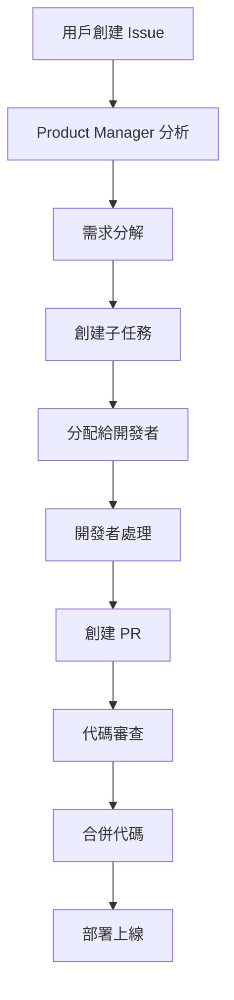

# 工作流程

## 概述

Bee Swarm 採用 GitHub-Centric 的工作流程，所有協調和通信都通過 GitHub 平台進行。

## 核心工作流程

### 1. 需求管理流程



**詳細步驟**：
1. **需求輸入**：用戶在 GitHub Issues 中描述需求
2. **需求分析**：Product Manager 分析需求可行性和複雜度
3. **任務分解**：將大需求分解為具體的開發任務
4. **任務分配**：根據技能要求分配給合適的開發者
5. **開發實現**：開發者實現功能並創建 Pull Request
6. **代碼審查**：通過 PR 進行代碼審查
7. **合併部署**：合併代碼並自動部署

### 2. 開發協作流程

#### 並行開發模式
```
Backend Developer ←→ Frontend Developer
       ↓                    ↓
   API 設計              UI 設計
       ↓                    ↓
   接口文檔             組件開發
       ↓                    ↓
   單元測試             集成測試
```

#### 串行協作模式
```
Product Manager → Backend Developer → Frontend Developer → QA Engineer → DevOps Engineer
```

### 3. 代碼審查流程

1. **PR 創建**：開發者完成功能後創建 Pull Request
2. **自動檢查**：GitHub Actions 執行自動化檢查
3. **代碼審查**：其他開發者進行代碼審查
4. **修改完善**：根據反饋修改代碼
5. **合併代碼**：審查通過後合併到主分支

### 4. 測試驗證流程

1. **測試計劃**：QA Engineer 制定測試計劃
2. **自動化測試**：執行自動化測試套件
3. **手動測試**：進行關鍵功能的手動測試
4. **缺陷報告**：發現缺陷並創建 Issues
5. **缺陷修復**：開發者修復缺陷
6. **回歸測試**：驗證修復結果

### 5. 部署流程

1. **環境準備**：DevOps Engineer 準備部署環境
2. **自動化部署**：GitHub Actions 觸發自動化部署
3. **健康檢查**：檢查部署後的服務狀態
4. **監控告警**：設置監控和告警機制
5. **回滾準備**：準備回滾方案

## GitHub 功能使用

### Issues 管理
- **任務分配**：使用 assignees 分配任務
- **優先級管理**：使用 labels 標識優先級
- **狀態追蹤**：使用 issue 狀態追蹤進度
- **依賴管理**：使用 issue dependencies 管理依賴

### Projects 看板
- **工作流可視化**：使用 Projects 可視化工作流程
- **進度追蹤**：追蹤各階段的任務進度
- **負載管理**：管理各角色的工作負載

### Pull Requests
- **代碼審查**：通過 PR 進行代碼審查
- **自動化檢查**：集成 CI/CD 檢查
- **討論協作**：通過 comments 進行討論

### GitHub Actions
- **定時觸發**：定期掃描和處理任務
- **事件觸發**：響應 GitHub 事件
- **自動化部署**：自動化部署流程

## 通信機制

### 異步通信
- **Comments**：在 Issues 和 PR 中使用 comments 進行討論
- **Mentions**：使用 @ 提及相關人員
- **Labels**：使用 labels 標識任務類型和狀態

### 狀態同步
- **定期掃描**：GitHub Actions 定期掃描狀態變化
- **事件驅動**：響應 GitHub 事件進行狀態更新
- **API 更新**：通過 GitHub API 更新任務狀態

## 錯誤處理

### 任務失敗處理
1. **自動重試**：對於臨時性錯誤進行自動重試
2. **人工干預**：對於複雜問題進行人工干預
3. **任務重新分配**：將失敗的任務重新分配給其他角色

### 系統故障處理
1. **健康檢查**：定期檢查系統健康狀態
2. **故障恢復**：自動恢復故障的服務
3. **備份恢復**：使用備份數據進行恢復

## 監控和日誌

### 系統監控
- **服務狀態**：監控各服務的運行狀態
- **性能指標**：監控系統性能指標
- **錯誤率**：監控錯誤率和異常情況

### 日誌管理
- **集中日誌**：集中收集各服務的日誌
- **日誌分析**：分析日誌中的問題和趨勢
- **告警機制**：設置日誌告警機制 