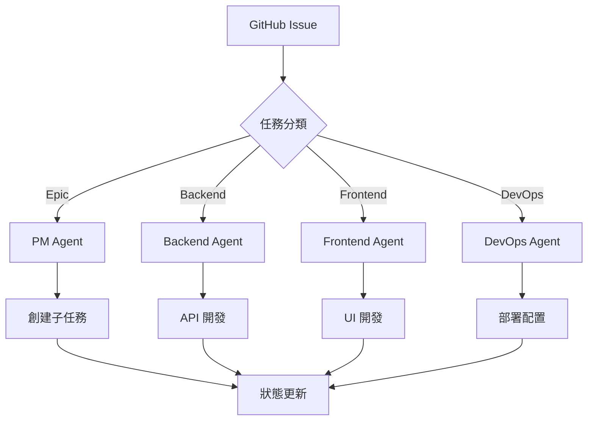

# 📋 工作流程

## 📍 您現在的位置
[項目首頁](../../README.md) > [文檔索引](../../PROJECT_INDEX.md) > **工作流程** > 您在這裡

## 🎯 工作流程概覽

本目錄定義了 Bee Swarm 項目中 AI 團隊的完整工作流程，包括異步協作、任務管理和狀態同步。

## 🔄 核心工作流程

### 📊 異步協作流程
- **[異步協作](async-collaboration.md)** - AI 智能體異步協作機制
- **[任務管理](task-management.md)** - 任務分配和追蹤
- **[狀態同步](state-synchronization.md)** - 狀態管理和同步

### 🔧 GitHub 整合
- **[GitHub 整合](github-integration.md)** - GitHub-Centric 工作流程
- **[Issue 管理](issue-management.md)** - Issue 標準化和自動化
- **[PR 流程](pr-workflow.md)** - Pull Request 自動化處理

## 📚 工作流程文檔

### 🔄 核心流程（需更新）
| 文檔 | 狀態 | 說明 |
|------|------|------|
| [異步協作流程](../03-工作流程/異步協作流程.md) | 📋 需更新 | 融入混合架構 |
| [任務管理](../03-工作流程/任務管理.md) | 📋 需更新 | 更新任務分類 |
| [狀態同步](../03-工作流程/狀態同步.md) | 📋 需更新 | GitHub 狀態機制 |

### 🆕 新增流程
- **[混合架構工作流程](hybrid-workflow.md)** - 混合架構特定流程
- **[AI Agent 協調](agent-coordination.md)** - AI 智能體協調機制
- **[監控和報告](monitoring.md)** - 自動化監控流程

## 🎭 AI 角色工作流程

### 角色協作模式

### 📊 工作流程指標

| 指標 | 目標值 | 測量方式 |
|------|--------|----------|
| **任務處理時間** | < 30 分鐘 | GitHub API |
| **自動化率** | > 80% | 工作流程統計 |
| **錯誤率** | < 5% | 質量檢查 |
| **協作效率** | > 2x | 對比傳統流程 |

## 🔧 工作流程配置

### GitHub Actions 工作流程
- **[Product Manager](./.github/workflows/product-manager.yml)** - PM 自動化
- **[Backend Developer](./.github/workflows/backend-developer.yml)** - 後端自動化
- **[Frontend Developer](./.github/workflows/frontend-developer.yml)** - 前端自動化
- **[DevOps Engineer](./.github/workflows/devops-engineer.yml)** - DevOps 自動化

### 配置範本
- **[Issue 模板](../templates/issue-templates/)** - 標準化 Issue 格式
- **[PR 模板](../templates/pr-templates/)** - Pull Request 規範
- **[標籤系統](../templates/labels.md)** - 標籤分類和使用

## 🚀 最佳實踐

### 📋 工作流程優化
1. **標準化輸入**：使用 Issue 模板確保信息完整
2. **自動化分類**：基於標籤自動觸發相應 Agent
3. **狀態透明**：所有進度在 GitHub 上可見
4. **錯誤處理**：自動重試和人工介入機制

### 🔍 監控和改進
- **性能監控**：定期檢查工作流程效率
- **錯誤分析**：追蹤和分析失敗案例
- **持續優化**：基於數據調整工作流程

---

*理解和優化 AI 團隊協作工作流程* 