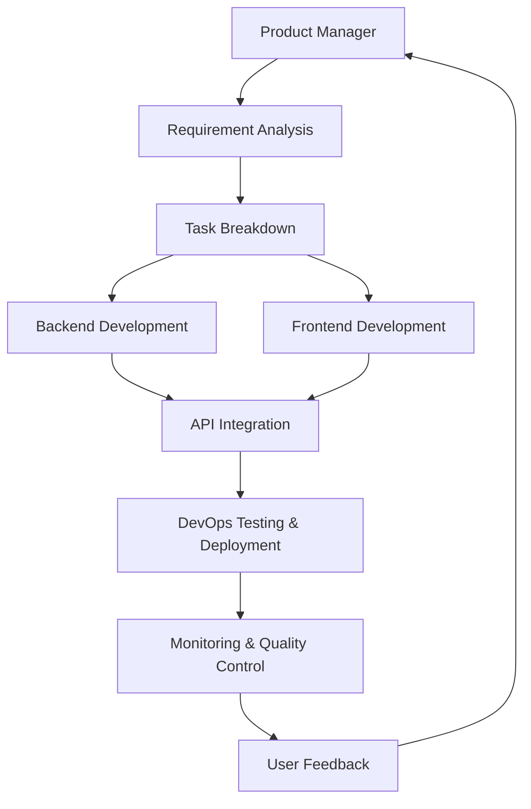

# Bee Swarm AI Role System

## Overview

Bee Swarm AI is an AI team collaboration automated workflow system. This directory contains the definitions, configurations, and implementations of all AI roles in the system.

## Role Architecture

### Core Role List (4 Roles)

| Role | Folder | Primary Responsibilities | Tech Stack |
|------|--------|------------------------|------------|
| **Product Manager** | `product_manager/` | Requirement management, product planning, project coordination, quality control | Project management tools, AI tools |
| **Backend Developer** | `backend_developer/` | API design, database design, business logic, unit testing | Python/Node.js/Go, databases, cloud services |
| **Frontend Developer** | `frontend_developer/` | UI development, user experience, frontend architecture, frontend testing | React/Vue/Angular, CSS, build tools |
| **DevOps Engineer** | `devops_engineer/` | Infrastructure, CI/CD, monitoring, testing, security, deployment | Containerization, cloud platforms, monitoring tools |

### Extended Role List (Optional)

| Role | Folder | Primary Responsibilities | Tech Stack |
|------|--------|------------------------|------------|
| **Android Developer** | `android_developer/` | Android app development, mobile development | Kotlin/Java, Android SDK, AI tools |
| **iOS Developer** | `ios_developer/` | iOS app development, mobile development | Swift/Objective-C, iOS SDK, AI tools |
| **Unity Developer** | `unity_developer/` | Game development, 3D applications, interactive experiences | C#, Unity Engine, AI tools |
| **Visual Designer** | `visual_designer/` | UI/UX design, brand design, design systems | Design tools, frontend technologies, AI tools |
| **Data Engineer** | `data_engineer/` | Data infrastructure, data pipelines, data quality | Big data technologies, Python/SQL, data platforms |

### Directory Structure

```
roles/
├── product_manager/
│   ├── Dockerfile          # Product manager container configuration
│   └── prompt.md           # Product manager role specification
├── backend_developer/
│   ├── Dockerfile          # Backend developer container configuration
│   └── prompt.md           # Backend developer role specification
├── frontend_developer/
│   ├── Dockerfile          # Frontend developer container configuration
│   └── prompt.md           # Frontend developer role specification
├── devops_engineer/
│   ├── Dockerfile          # DevOps engineer container configuration
│   └── prompt.md           # DevOps engineer role specification
├── android_developer/
│   ├── Dockerfile          # Android developer container configuration
│   └── prompt.md           # Android developer role specification
├── ios_developer/
│   ├── Dockerfile          # iOS developer container configuration
│   └── prompt.md           # iOS developer role specification
├── unity_developer/
│   ├── Dockerfile          # Unity developer container configuration
│   └── prompt.md           # Unity developer role specification
├── visual_designer/
│   ├── Dockerfile          # Visual designer container configuration
│   └── prompt.md           # Visual designer role specification
├── data_engineer/
│   ├── Dockerfile          # Data engineer container configuration
│   └── prompt.md           # Data engineer role specification
└── README.md               # This file
```

## Role Specification Format

Each role's `prompt.md` file follows a unified format containing the following sections:

### 1. Role Identity and Background
- Role positioning and core values
- Professional background and skill requirements

### 2. Primary Responsibilities and Scope
- Detailed responsibility descriptions
- Work scope and boundaries

### 3. Work Methods and Processes
- Workflow diagrams (Mermaid)
- Daily work and development principles

### 4. Collaboration Patterns with Other Roles
- Collaboration methods with various roles
- Communication and coordination mechanisms

### 5. Input and Output Definitions
- Received input content
- Produced output content

### 6. Tool Usage Standards
- Essential tools and AI tools
- Tool usage principles

### 7. Code and Documentation Standards
- Code standards and documentation requirements
- Quality requirements

### 8. Technology Stack and Frameworks
- Primary technology stack
- Related frameworks and tools

### 9. Performance and Standards
- Performance metrics
- Quality standards

### 10. Communication and Reporting Mechanisms
- Daily communication methods
- Reporting and feedback mechanisms

### 11. Continuous Learning and Improvement
- Skill enhancement plans
- Process improvement methods

## Dockerfile Configuration

Each role's Dockerfile is based on the `vnc-llm-cli:latest` image and includes:

### Basic Configuration
- Working directory setup
- User creation and permission settings
- Environment variable configuration

### Tool Installation
- System tools and development tools
- Role-specific professional tools
- AI tool integration

### Dependency Management
- Python dependency packages
- Node.js package management
- Other language tools

### Workspace
- Role-specific directory structure
- Scripts and configuration files
- Data and log directories

## Role Collaboration Model

### Core Workflow


### Communication Mechanisms
- **Real-time Communication**: Use GitHub Comments for real-time collaboration
- **Document Collaboration**: Use GitHub Wiki for document management
- **Code Collaboration**: Use GitHub for code management and review
- **Project Management**: Use GitHub Projects for task management

## Deployment Configuration

### Environment Variables
Each role requires configuration of the following environment variables:

```bash
# Role Identity
ROLE_NAME=role_name
ROLE_ID=role_id
ROLE_TYPE=role_type

# GitHub Configuration
GITHUB_USERNAME=github_username
GITHUB_TOKEN=github_token

# System Configuration
GITHUB_REPOSITORY=your-org/your-repo
GITHUB_OWNER=your-org

# VNC Configuration
VNC_PASSWORD=vnc_password
TTYD_PASSWORD=ttyd_password

# AI Tools
AI_TOOLS=gemini-cli,claude-code,rovo-dev,cursor
```

### Port Configuration
- **VNC Port**: 6080 (noVNC)
- **Terminal Port**: 7681 (ttyd)

### Resource Limits
- **Memory Limit**: 1-2GB (depending on role)
- **CPU Limit**: 0.5-1.0 cores (depending on role)
- **Storage Space**: 10-20GB

## Monitoring and Maintenance

### Health Checks
- Regularly check role container status
- Monitor resource usage
- Check service availability

### Log Management
- Centralized log collection
- Log rotation and cleanup
- Error monitoring and alerting

## Role Responsibilities Summary

### Product Manager
- **Primary**: Requirement analysis, product planning, project coordination
- **Secondary**: Quality control, user feedback analysis, team coordination
- **Tools**: Gemini CLI, Claude Code, GitHub Projects

### Backend Developer
- **Primary**: API design, database design, business logic implementation
- **Secondary**: Unit testing, performance optimization, code review
- **Tools**: Claude Code, Rovo Dev, Cursor

### Frontend Developer
- **Primary**: UI development, user experience, frontend architecture
- **Secondary**: Frontend testing, responsive design, API integration
- **Tools**: Claude Code, Rovo Dev, Cursor, Warp

### DevOps Engineer
- **Primary**: Infrastructure, CI/CD, monitoring, deployment
- **Secondary**: Testing automation, security, performance optimization
- **Tools**: GitHub Actions, Docker, Kubernetes, Gemini CLI, Claude Code

## Notes

- **Core Roles**: The 4 core roles (Product Manager, Backend Developer, Frontend Developer, DevOps Engineer) are sufficient for most projects
- **Extended Roles**: Additional roles can be added based on project requirements
- **Role Merging**: QA Engineer responsibilities have been merged into DevOps Engineer
- **Project Manager**: Project management responsibilities have been merged into Product Manager 