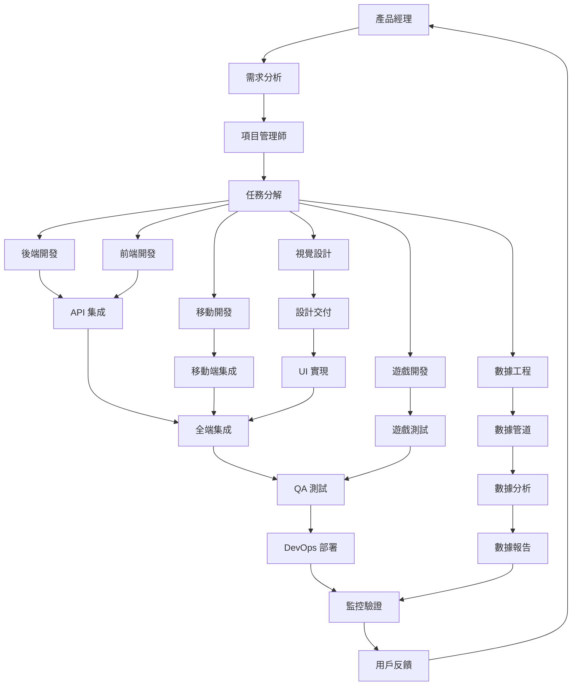

# Bee Swarm AI 角色系統

## 概述

Bee Swarm AI 是一個基於 AI 團隊協作的自動化工作流程系統。本目錄包含了系統中所有 AI 角色的定義、配置和實現。

## 角色架構

### 角色列表

| 角色 | 資料夾 | 主要職責 | 技術棧 |
|------|--------|----------|--------|
| **產品經理** | `product_manager/` | 需求管理、產品規劃、項目協調 | 項目管理工具、AI 工具 |
| **項目管理師** | `project_manager/` | 項目規劃、進度管理、資源協調 | 項目管理工具、協作工具、AI 工具 |
| **後端開發者** | `backend_developer/` | API 設計、數據庫設計、業務邏輯 | Python/Node.js/Go、數據庫、雲服務 |
| **前端開發者** | `frontend_developer/` | UI 開發、用戶體驗、前端架構 | React/Vue/Angular、CSS、構建工具 |
| **QA 工程師** | `qa_engineer/` | 測試計劃、自動化測試、質量保證 | 測試框架、自動化工具、監控工具 |
| **DevOps 工程師** | `devops_engineer/` | 基礎設施、CI/CD、監控運維 | 容器化、雲平台、監控工具 |
| **安卓開發者** | `android_developer/` | Android 應用開發、移動端開發 | Kotlin/Java、Android SDK、AI 工具 |
| **iOS 開發者** | `ios_developer/` | iOS 應用開發、移動端開發 | Swift/Objective-C、iOS SDK、AI 工具 |
| **Unity 開發者** | `unity_developer/` | 遊戲開發、3D 應用、互動體驗 | C#、Unity Engine、AI 工具 |
| **視覺設計師** | `visual_designer/` | UI/UX 設計、品牌設計、設計系統 | 設計工具、前端技術、AI 工具 |
| **數據工程師** | `data_engineer/` | 數據基礎設施、數據管道、數據質量 | 大數據技術、Python/SQL、數據平台 |

### 目錄結構

```
roles/
├── product_manager/
│   ├── Dockerfile          # 產品經理容器配置
│   └── prompt.md           # 產品經理角色說明書
├── project_manager/
│   ├── Dockerfile          # 項目管理師容器配置
│   └── prompt.md           # 項目管理師角色說明書
├── backend_developer/
│   ├── Dockerfile          # 後端開發者容器配置
│   └── prompt.md           # 後端開發者角色說明書
├── frontend_developer/
│   ├── Dockerfile          # 前端開發者容器配置
│   └── prompt.md           # 前端開發者角色說明書
├── qa_engineer/
│   ├── Dockerfile          # QA 工程師容器配置
│   └── prompt.md           # QA 工程師角色說明書
├── devops_engineer/
│   ├── Dockerfile          # DevOps 工程師容器配置
│   └── prompt.md           # DevOps 工程師角色說明書
├── android_developer/
│   ├── Dockerfile          # 安卓開發者容器配置
│   └── prompt.md           # 安卓開發者角色說明書
├── ios_developer/
│   ├── Dockerfile          # iOS 開發者容器配置
│   └── prompt.md           # iOS 開發者角色說明書
├── unity_developer/
│   ├── Dockerfile          # Unity 開發者容器配置
│   └── prompt.md           # Unity 開發者角色說明書
├── visual_designer/
│   ├── Dockerfile          # 視覺設計師容器配置
│   └── prompt.md           # 視覺設計師角色說明書
├── data_engineer/
│   ├── Dockerfile          # 數據工程師容器配置
│   └── prompt.md           # 數據工程師角色說明書
└── README.md               # 本文件
```

## 角色說明書格式

每個角色的 `prompt.md` 文件都遵循統一的格式，包含以下章節：

### 1. 角色身份與背景
- 角色定位和核心價值觀
- 專業背景和技能要求

### 2. 主要職責與工作範圍
- 詳細的職責描述
- 工作範圍和邊界

### 3. 工作方法與流程
- 工作流程圖（Mermaid）
- 日常工作和開發原則

### 4. 與其他角色的合作模式
- 與各角色的協作方式
- 溝通和協調機制

### 5. 輸入與輸出定義
- 接收的輸入內容
- 產出的輸出內容

### 6. 工具使用規範
- 必備工具和 AI 工具
- 工具使用原則

### 7. 代碼與文檔規範
- 代碼規範和文檔標準
- 質量要求

### 8. 技術棧與框架
- 主要技術棧
- 相關框架和工具

### 9. 性能與標準
- 性能指標
- 質量標準

### 10. 溝通與報告機制
- 日常溝通方式
- 報告和反饋機制

### 11. 持續學習與改進
- 技能提升計劃
- 流程改進方法

## Dockerfile 配置

每個角色的 Dockerfile 都基於 `vnc-llm-cli:latest` 鏡像，包含：

### 基礎配置
- 工作目錄設置
- 用戶創建和權限設置
- 環境變量配置

### 工具安裝
- 系統工具和開發工具
- 特定角色的專業工具
- AI 工具集成

### 依賴管理
- Python 依賴包
- Node.js 包管理
- 其他語言工具

### 工作空間
- 角色專用目錄結構
- 腳本和配置文件
- 數據和日誌目錄

## 角色協作模式

### 工作流程


### 溝通機制
- **即時溝通**：使用 Slack/Teams 進行即時協作
- **文檔協作**：使用 Notion/Confluence 進行文檔管理
- **代碼協作**：使用 GitHub 進行代碼管理和審查
- **項目管理**：使用 Jira/Trello 進行任務管理

## 部署配置

### 環境變量
每個角色都需要配置以下環境變量：

```bash
# 角色身份
ROLE_NAME=role_name
ROLE_ID=role_id
ROLE_TYPE=role_type

# GitHub 配置
GITHUB_USERNAME=github_username
GITHUB_TOKEN=github_token

# 系統配置
COORDINATOR_URL=coordinator_url
REDIS_URL=redis_url

# VNC 配置
VNC_PASSWORD=vnc_password
TTYD_PASSWORD=ttyd_password

# AI 工具
AI_TOOLS=gemini-cli,claude-code,rovo-dev,cursor
```

### 端口配置
- **VNC 端口**：6080 (noVNC)
- **終端端口**：7681 (ttyd)
- **API 端口**：8000 (FastAPI)

### 資源限制
- **內存限制**：2-4GB
- **CPU 限制**：1-2 核心
- **存儲空間**：10-20GB

## 監控與維護

### 健康檢查
- 定期檢查角色容器狀態
- 監控資源使用情況
- 檢查服務可用性

### 日誌管理
- 集中收集各角色日誌
- 設置日誌輪轉和清理
- 配置日誌監控和告警

### 備份策略
- 定期備份角色配置
- 備份重要數據和文檔
- 測試恢復流程

## 擴展與自定義

### 添加新角色
1. 創建角色資料夾
2. 編寫 Dockerfile
3. 創建角色說明書
4. 更新 docker-compose.yml
5. 配置環境變量

### 自定義配置
- 修改 Dockerfile 添加特定工具
- 更新 prompt.md 調整角色職責
- 配置自定義環境變量
- 添加角色專用腳本

## 最佳實踐

### 角色設計
- 明確角色邊界和職責
- 保持角色間的平衡
- 考慮角色間的依賴關係
- 設計清晰的溝通機制

### 技術實現
- 使用容器化部署
- 實現自動化配置
- 建立監控和告警
- 保持代碼和文檔同步

### 運維管理
- 定期更新和維護
- 監控系統性能
- 及時處理問題
- 持續改進流程

---

*此文檔是 Bee Swarm AI 角色系統的總覽，詳細的角色說明請參考各角色的 prompt.md 文件。* 